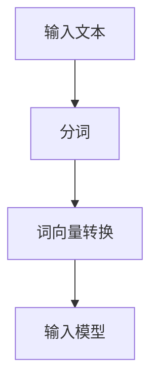
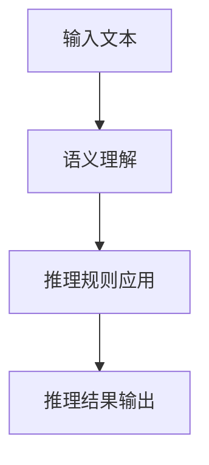
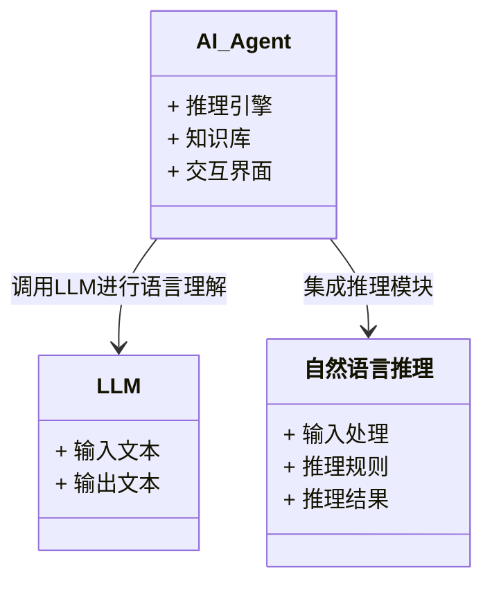
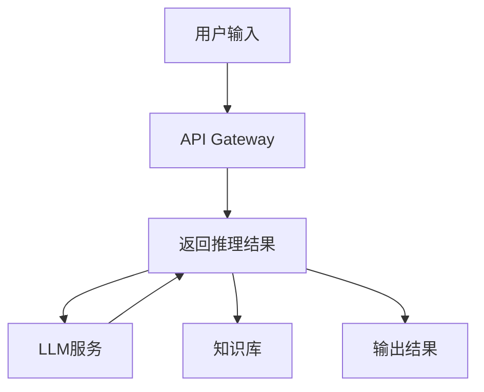
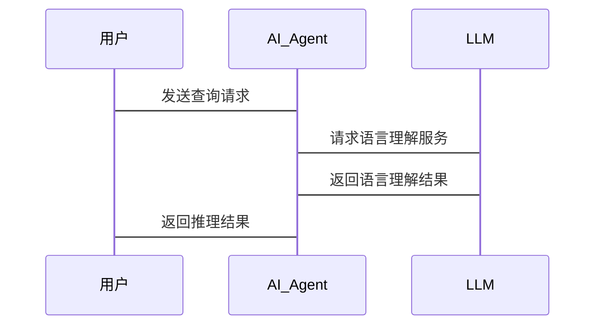

                 


# 《构建LLM支持的AI Agent自然语言推理系统》

## 关键词：LLM, AI Agent, 自然语言推理, 系统架构, 项目实战

## 摘要：  
本文将详细探讨如何构建一个基于大型语言模型（LLM）支持的AI Agent自然语言推理系统。通过分析系统的背景、核心概念、算法原理、系统架构，并结合实际项目案例，为读者提供从理论到实践的全面指导。文章还将深入探讨系统的数学模型、设计方法和最佳实践，帮助读者更好地理解和应用相关技术。

---

## 目录大纲

### 第一部分：背景介绍

#### 第1章：问题背景与问题描述

##### 1.1 问题背景
- 1.1.1 当前AI技术的发展现状
  - 1.1.1.1 大型语言模型（LLM）的崛起与应用
  - 1.1.1.2 自然语言处理（NLP）技术的突破与挑战
  - 1.1.1.3 AI Agent在智能交互中的重要性
- 1.1.2 自然语言处理（NLP）的核心任务与挑战
  - 文本理解、生成与推理的现状
  - 当前NLP技术在实际应用中的局限性
- 1.1.3 AI Agent在实际场景中的应用需求
  - 智能客服、智能助手、智能决策支持等场景
  - LLM如何赋能AI Agent的自然语言处理能力

##### 1.2 问题描述
- 1.2.1 LLM支持的AI Agent的核心问题
  - 如何高效地进行自然语言推理
  - 如何处理复杂语义理解任务
- 1.2.2 自然语言推理在AI Agent中的作用
  - 推理引擎的设计与实现
  - 推理结果的准确性与实时性
- 1.2.3 当前技术的局限性与改进方向
  - LLM推理能力的不足
  - 现有系统的性能瓶颈与优化方向

##### 1.3 问题解决
- 1.3.1 LLM如何支持AI Agent的自然语言推理
  - 结合LLM与推理引擎的协同工作
  - 利用LLM的知识库进行上下文推理
- 1.3.2 自然语言推理技术的优化策略
  - 增量学习与微调
  - 多模态数据的融合
- 1.3.3 结合LLM与AI Agent的具体实现方法
  - 整合推理引擎与LLM的接口设计
  - 系统架构的优化与调整

##### 1.4 边界与外延
- 1.4.1 LLM支持的AI Agent的边界条件
  - 系统适用的场景与限制
  - LLM能力的边界与适用范围
- 1.4.2 自然语言推理的适用范围与限制
  - 逻辑推理的深度与广度
  - 上下文理解的局限性
- 1.4.3 相关技术的对比与区别
  - 与传统NLP系统的区别
  - 与基于规则的推理系统对比

##### 1.5 概念结构与核心要素
- 1.5.1 LLM支持的AI Agent的构成要素
  - 推理引擎、LLM、交互界面、知识库等
  - 各模块之间的关系与协作机制
- 1.5.2 自然语言推理的核心要素
  - 输入处理、推理过程、结果输出
  - 推理规则与知识库的构建
- 1.5.3 系统整体架构的逻辑关系
  - 各模块之间的数据流与控制流
  - 系统的可扩展性与可维护性

---

## 第二部分：核心概念与联系

### 第2章：核心概念与原理

#### 2.1 自然语言处理（NLP）的基本原理
- 2.1.1 NLP的核心任务与技术
  - 分词、词性标注、句法分析、语义理解等
  - LLM在NLP任务中的应用
- 2.1.2 LLM在NLP中的应用
  - 生成式AI的应用场景
  - 基于LLM的问答系统
- 2.1.3 自然语言推理的定义与目标
  - 推理的定义与分类
  - 推理的目标与应用场景

#### 2.2 AI Agent的定义与工作流程
- 2.2.1 AI Agent的基本概念
  - 定义、分类与应用场景
  - AI Agent的核心功能与能力
- 2.2.2 AI Agent的典型工作流程
  - 输入处理、推理、决策、输出
  - 各阶段的具体实现与协作
- 2.2.3 LLM在AI Agent中的角色
  - 作为推理引擎的驱动
  - 与外部系统的交互接口

#### 2.3 核心概念对比与ER实体关系图

##### 2.3.1 核心概念对比表
| 概念       | 描述                              |
|------------|-----------------------------------|
| LLM        | 基于深度学习的大型语言模型，用于生成和理解自然语言文本。 |
| NLP        | 自然语言处理，涉及文本的分析、理解与生成。 |
| AI Agent   | 具有人工智能的代理，能够感知环境并执行任务。 |
| 自然语言推理 | 基于文本进行逻辑推理，推断隐含信息。 |

##### 2.3.2 ER实体关系图
```mermaid
erd
  Entity: LLM
    - 属性: 模型参数、训练数据、推理能力
  Entity: AI Agent
    - 属性: 交互能力、推理引擎、知识库
  Entity: 自然语言推理
    - 属性: 推理规则、知识库、推理结果
  LLM --> 自然语言推理: 提供语言理解和生成能力
  AI Agent --> 自然语言推理: 集成推理模块
  自然语言推理 --> 知识库: 依赖知识库进行推理
```

---

## 第三部分：算法原理讲解

### 第3章：算法原理与实现

#### 3.1 算法原理
- 3.1.1 LLM的算法流程
  - 文本预处理、模型训练、推理过程
  - 基于Transformer的LLM架构
- 3.1.2 自然语言推理的算法流程
  - 输入处理、特征提取、推理过程、结果生成
  - 基于规则的推理与基于模型的推理

#### 3.2 算法实现
##### 3.2.1 LLM的文本预处理


##### 3.2.2 推理引擎的实现


##### 3.2.3 代码示例
```python
import torch
from transformers import AutoTokenizer, AutoModelForMaskedLM

tokenizer = AutoTokenizer.from_pretrained("bert-base-uncased")
model = AutoModelForMaskedLM.from_pretrained("bert-base-uncased")

def preprocess(text):
    tokens = tokenizer.encode_plus(text, return_tensors="pt", padding=True, truncation=True)
    return tokens

def inference(text):
    tokens = preprocess(text)
    outputs = model(**tokens)
    return outputs.last_hidden_state

# 示例推理
text = "The cat sat on the mat."
result = inference(text)
print(result)
```

#### 3.3 数学模型与公式
- 3.3.1 LLM的数学模型
  - 基于Transformer的编码器-解码器结构
  - 注意力机制的公式表示
    $$\text{Attention}(Q, K, V) = \text{softmax}\left(\frac{QK^T}{\sqrt{d_k}}\right)V$$

- 3.3.2 自然语言推理的损失函数
  - 基于交叉熵的损失函数
    $$\text{Loss} = -\sum_{i=1}^{n} \text{log}(P(y_i|X_i))$$

---

## 第四部分：系统分析与架构设计

### 第4章：系统分析与架构设计

#### 4.1 系统问题场景介绍
- 4.1.1 系统目标
  - 实现一个基于LLM的AI Agent自然语言推理系统
  - 提供高效的推理能力与良好的用户体验
- 4.1.2 系统特点
  - 高可扩展性与灵活性
  - 高效的推理性能
  - 良好的可维护性

#### 4.2 系统功能设计
##### 4.2.1 领域模型设计


##### 4.2.2 系统架构设计


##### 4.2.3 系统接口设计
- API接口定义
  - 输入接口：自然语言文本
  - 输出接口：推理结果
- 接口协议与通信机制
  - RESTful API，JSON格式数据交换

##### 4.2.4 系统交互设计


---

## 第五部分：项目实战

### 第5章：项目实战与实现

#### 5.1 环境安装与配置
- 安装Python、虚拟环境、依赖库
  - transformers、torch、numpy等

#### 5.2 核心代码实现
##### 5.2.1 推理引擎实现
```python
from transformers import pipeline

# 初始化推理引擎
nlp = pipeline("text-classification", model="bert-base")

# 推理函数
def infer(text):
    return nlp(text)
```

##### 5.2.2 LLM集成与调用
```python
from transformers import AutoTokenizer, AutoModelForCausalLM

tokenizer = AutoTokenizer.from_pretrained("gpt2")
model = AutoModelForCausalLM.from_pretrained("gpt2")

def generate_response(text):
    inputs = tokenizer.encode_plus(text, return_tensors="pt")
    outputs = model.generate(inputs.input_ids, max_length=100)
    return tokenizer.decode(outputs[0])
```

##### 5.2.3 系统功能实现
```python
class AIAgent:
    def __init__(self, llm_model, inference_model):
        self.llm = llm_model
        self.inference = inference_model

    def process_query(self, query):
        # 调用LLM进行语言理解
        response = self.llm(query)
        # 调用推理引擎进行推理
        result = self.inference(response)
        return result
```

#### 5.3 代码应用解读与分析
- 代码结构分析
  - 初始化与配置
  - 推理引擎的调用
  - LLM的集成与使用
- 代码功能分析
  - 输入处理
  - 推理过程
  - 输出结果

#### 5.4 实际案例分析
- 案例1：简单文本推理
  - 输入文本：The cat sat on the mat.
  - 推理结果：The cat is on the mat.

- 案例2：复杂文本推理
  - 输入文本：If it rains, the ground gets wet. It is raining.
  - 推理结果：The ground is wet.

#### 5.5 项目总结
- 项目实现的关键点
  - LLM与推理引擎的协同工作
  - 系统架构的设计与优化
- 项目实现的难点
  - 推理结果的准确性
  - 系统性能的优化

---

## 第六部分：最佳实践

### 第6章：最佳实践与总结

#### 6.1 最佳实践
- 6.1.1 系统设计与优化
  - 模块化设计
  - 高可用性与可扩展性
- 6.1.2 代码实现与维护
  - 代码规范与可读性
  - 单元测试与集成测试
- 6.1.3 系统部署与监控
  - 部署策略与环境配置
  - 性能监控与日志管理

#### 6.2 小结
- 本文总结了构建LLM支持的AI Agent自然语言推理系统的各个方面
  - 从背景介绍到系统实现
  - 从算法原理到项目实战
  - 提供了全面的技术指导与实践建议

#### 6.3 注意事项
- 系统设计中的注意事项
  - 边界条件的处理
  - 知识库的更新与维护
- 代码实现中的注意事项
  - 性能优化
  - 错误处理与容错设计

#### 6.4 拓展阅读
- 推荐的书籍与资料
  - 《深度学习入门：基于Python和TensorFlow》
  - 《自然语言处理入门》
  - 论文推荐：《Attention Is All You Need》

---

## 作者：AI天才研究院/AI Genius Institute & 禅与计算机程序设计艺术 /Zen And The Art of Computer Programming

