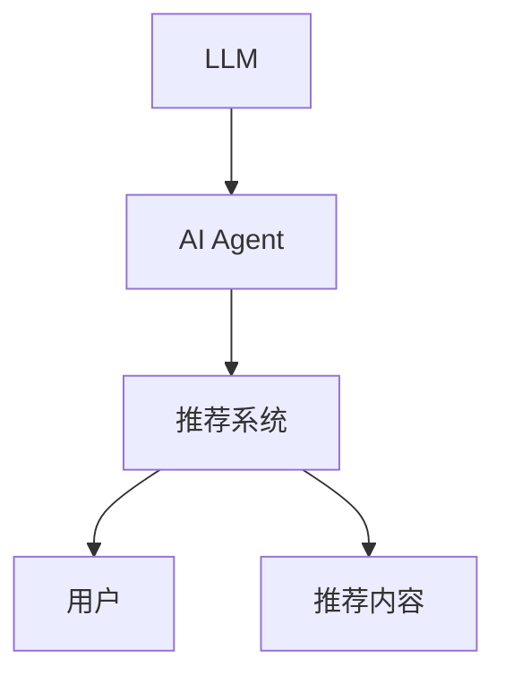
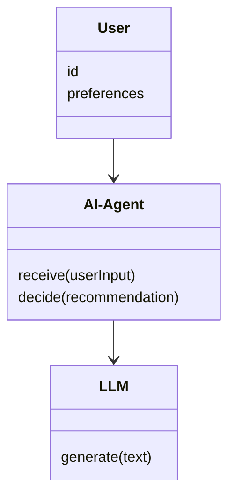
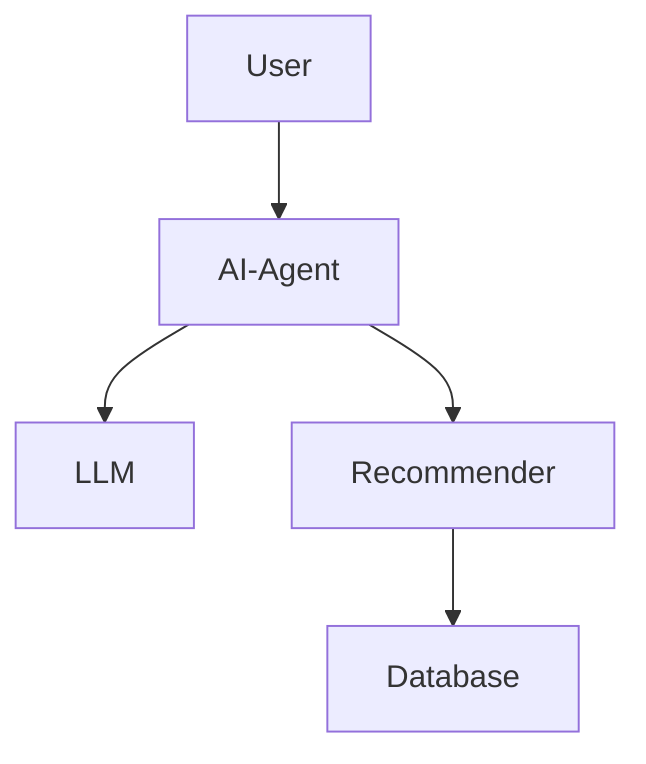

                 


# 《构建LLM驱动的AI Agent可解释推荐系统》

## 关键词

- 大语言模型（LLM）
- AI Agent
- 可解释推荐系统
- 生成式推荐
- 系统架构设计

## 摘要

本文详细探讨了如何利用大语言模型（LLM）构建可解释的AI Agent推荐系统。从背景介绍到核心概念，再到算法原理、系统设计、项目实战和最佳实践，本文全面解析了构建这一系统的各个方面，旨在为读者提供深入的技术指导。

---

# 第一部分: 背景介绍

## 第1章: 问题背景与目标

### 1.1 问题背景

随着互联网的快速发展，用户每天面临海量信息的选择，推荐系统成为提升用户体验的重要工具。然而，传统的推荐系统存在以下问题：

- **不可解释性**：基于协同过滤或矩阵分解的推荐系统难以解释推荐的原因。
- **缺乏语义理解**：传统推荐系统难以处理复杂的语义信息。
- **静态推荐**：推荐结果缺乏动态调整能力。

### 1.2 问题描述

本文的目标是构建一个基于LLM的AI Agent可解释推荐系统，能够理解用户的深层需求，并动态调整推荐策略。

### 1.3 问题解决思路

- **利用LLM进行语义理解**：通过LLM解析用户输入的语义信息。
- **AI Agent进行智能决策**：基于LLM的语义理解，AI Agent动态调整推荐策略。
- **可解释性推荐**：通过LLM生成可解释的推荐理由。

### 1.4 边界与外延

- **系统边界**：仅关注基于LLM的推荐系统，不涉及后端数据存储。
- **外延领域**：不包括传统的推荐算法。

### 1.5 核心要素与概念结构

核心要素包括：LLM、AI Agent、推荐系统、可解释性。

---

# 第二部分: 核心概念与联系

## 第2章: 核心概念原理

### 2.1 LLM驱动的AI Agent

- **LLM的基本原理**：基于Transformer的生成模型。
- **AI Agent的功能**：理解用户需求，生成推荐。

### 2.2 可解释性推荐系统

- **定义**：推荐系统能够解释推荐的原因。
- **重要性**：提升用户信任度。

### 2.3 实体关系图



---

# 第三部分: 算法原理讲解

## 第3章: 算法原理与实现

### 3.1 LLM驱动的推荐算法

#### 3.1.1 语义理解

使用LLM对用户输入进行语义分析，生成语义向量。

#### 3.1.2 生成式推荐

基于语义向量生成推荐内容。

### 3.2 AI Agent的决策算法

#### 3.2.1 多轮对话

AI Agent通过多轮对话理解用户需求。

---

# 第四部分: 系统分析与架构设计

## 第4章: 系统分析与架构设计方案

### 4.1 问题场景介绍

构建一个基于LLM的推荐系统，用于电商场景。

### 4.2 系统功能设计

#### 4.2.1 领域模型



### 4.3 系统架构设计



---

# 第五部分: 项目实战

## 第5章: 项目实战

### 5.1 环境安装

安装必要的Python库，如HuggingFace Transformers。

### 5.2 核心实现

```python
from transformers import GPT2LMHeadModel, GPT2Tokenizer

tokenizer = GPT2Tokenizer.from_pretrained('gpt2')
model = GPT2LMHeadModel.from_pretrained('gpt2')

def generate_recommendation(prompt):
    inputs = tokenizer.encode(prompt, return_tensors='pt')
    outputs = model.generate(inputs, max_length=50)
    return tokenizer.decode(outputs[0], skip_special_tokens=True)
```

### 5.3 实际案例分析

分析电商场景中的实际案例，展示推荐结果和可解释性。

---

## 第六部分: 最佳实践

### 6.1 小结

本文详细介绍了构建LLM驱动的AI Agent可解释推荐系统的各个方面。

### 6.2 注意事项

- 确保数据安全。
- 定期更新模型。

### 6.3 拓展阅读

推荐阅读相关领域的书籍和论文。

---

作者：AI天才研究院/AI Genius Institute & 禅与计算机程序设计艺术 /Zen And The Art of Computer Programming

