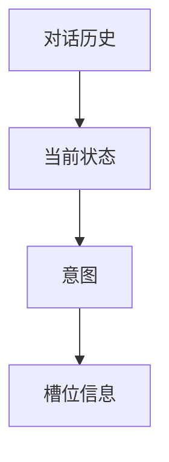
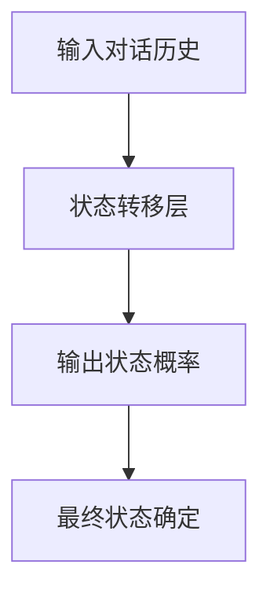
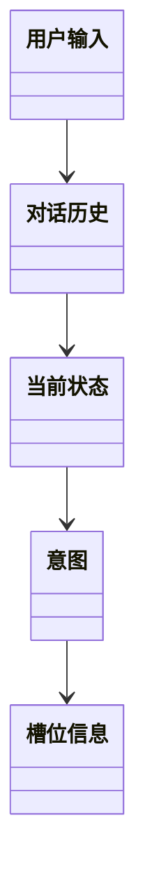
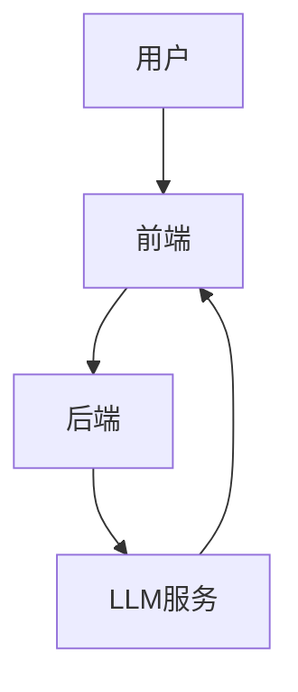
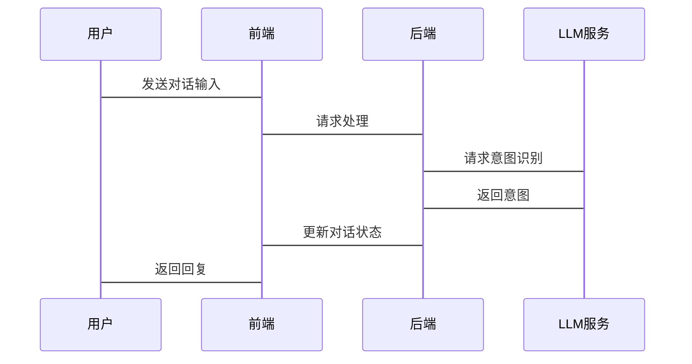

                 


# 构建LLM驱动的AI Agent多轮对话状态追踪

> 关键词：大语言模型（LLM），AI Agent，多轮对话，状态追踪，对话系统，意图识别

> 摘要：本文深入探讨了构建基于大语言模型（LLM）的AI Agent多轮对话状态追踪系统的各个方面，从理论基础到实践实现，系统性地分析了该领域的关键技术和实现细节。文章首先介绍了多轮对话状态追踪的背景与核心概念，随后详细讲解了相关的算法原理，接着从系统架构设计、项目实战、最佳实践等多个维度进行了全面分析，最后通过实际案例展示了如何将这些技术应用于实际场景中。本文旨在为读者提供一个全面而深入的技术指南，帮助他们在构建LLM驱动的AI Agent多轮对话系统时，能够更好地理解和实现状态追踪功能。

---

# 第1章: 背景介绍与核心概念

## 1.1 多轮对话状态追踪的背景

### 1.1.1 对话系统的发展历程
对话系统是人工智能领域的重要研究方向，经历了从基于规则的简单对话系统到基于深度学习的复杂对话系统的演变。早期的对话系统依赖于手动编写规则，能够处理的对话场景有限。随着自然语言处理（NLP）技术的进步，尤其是大语言模型（LLM）的崛起，对话系统的能力得到了显著提升，能够支持多轮、复杂的对话交互。

### 1.1.2 多轮对话的定义与特点
多轮对话是指用户与系统之间进行多轮次的交互，每一轮对话都需要基于前一轮的上下文进行理解和生成。其特点包括：
1. **上下文依赖性**：每一轮对话都依赖于之前的对话历史。
2. **动态性**：对话的状态会随着每一轮的交互而动态变化。
3. **复杂性**：需要处理用户的意图、槽位信息、情感等多种因素。

### 1.1.3 状态追踪的重要性
在多轮对话中，状态追踪是理解用户需求、保持对话连贯性、提供准确反馈的关键。状态追踪能够帮助系统记住当前的对话上下文，从而在后续的交互中提供更精准的服务。

## 1.2 LLM驱动的AI Agent概述

### 1.2.1 大语言模型（LLM）的定义与特点
大语言模型（LLM）是基于深度学习的NLP模型，具有以下特点：
1. **大规模训练数据**：通常基于海量的文本数据进行训练。
2. **强大的上下文理解能力**：能够理解长文本的语义关系。
3. **生成能力强**：能够生成自然流畅的文本。

### 1.2.2 AI Agent的基本概念与功能
AI Agent（智能体）是指能够感知环境、执行任务并做出决策的智能实体。在对话系统中，AI Agent通常负责处理用户的输入、理解用户需求、生成回复，并维护对话状态。

### 1.2.3 LLM与AI Agent的结合
将LLM集成到AI Agent中，能够显著提升对话系统的自然语言理解和生成能力。通过LLM的强大能力，AI Agent可以更准确地理解用户意图、生成更自然的回复，并在多轮对话中保持状态的一致性。

## 1.3 问题背景与目标

### 1.3.1 多轮对话中的状态追踪问题
在多轮对话中，用户的需求可能涉及多个步骤或多个槽位信息。系统需要在每一轮对话中准确地跟踪当前的状态，以便在后续对话中提供正确的服务。

### 1.3.2 状态追踪的目标与意义
状态追踪的目标是准确地记录和更新对话中的状态信息，包括用户的意图、槽位信息等。其意义在于：
1. 提供连贯的对话体验。
2. 支持复杂的多轮对话场景。
3. 提高对话系统的准确性和效率。

### 1.3.3 问题的边界与外延
多轮对话状态追踪的边界包括：
1. 对话的起始与结束。
2. 状态的初始化与清除。
3. 状态的更新与恢复。

其外延包括：
1. 情感分析。
2. 对话历史的记忆。
3. 多模态对话的扩展。

## 1.4 核心概念与联系

### 1.4.1 状态表示与对话历史
状态表示是对话系统中的关键部分，通常包括用户的意图、槽位信息等。对话历史是状态表示的重要来源，通过记录每一轮对话的内容，系统可以更好地理解当前的状态。

### 1.4.2 上下文管理与意图识别
上下文管理是指对对话中的上下文信息进行存储、更新和删除的过程。意图识别是通过分析对话内容，确定用户的意图。

### 1.4.3 对话树与状态转移关系
对话树是一种树状结构，用于描述对话的可能路径。状态转移关系描述了对话状态从一个状态到另一个状态的转换过程。

---

# 第2章: 核心概念与联系

## 2.1 核心概念原理

### 2.1.1 对话状态表示方法
对话状态表示通常包括以下内容：
1. 用户的意图。
2. 槽位信息。
3. 对话历史。

### 2.1.2 意图识别与槽位填充
意图识别是通过分析对话内容，确定用户的意图。槽位填充是通过提取对话中的具体信息，填充到槽位中。

### 2.1.3 上下文管理机制
上下文管理机制包括：
1. 上下文的存储。
2. 上下文的更新。
3. 上下文的清除。

## 2.2 核心概念对比表格

| 对比项       | 基于规则的方法 | 基于模型的方法 |
|--------------|----------------|----------------|
| 实现复杂度   | 低             | 高             |
| 灵活性       | 低             | 高             |
| 对话自然度   | 低             | 高             |

## 2.3 ER实体关系图



---

# 第3章: 算法原理讲解

## 3.1 常见算法介绍

### 3.1.1 隐马尔可夫模型（HMM）
隐马尔可夫模型是一种统计模型，常用于序列数据的建模。其核心思想是通过观察数据推断隐藏的状态。

### 3.1.2 基于Transformer的序列模型
基于Transformer的序列模型（如BERT、GPT）在自然语言处理领域表现出色，能够处理长文本的语义关系。

## 3.2 算法原理流程图



## 3.3 数学模型与公式

### 3.3.1 HMM的状态转移概率
$$ P(s_t | s_{t-1}) $$

### 3.3.2 观察概率计算
$$ P(o_t | s_t) $$

---

# 第4章: 系统分析与架构设计

## 4.1 问题场景介绍

### 4.1.1 用户需求分析
用户希望与系统进行多轮对话，并希望系统能够准确理解其意图。

### 4.1.2 系统目标设定
系统的目标是准确地跟踪对话状态，提供连贯的对话体验。

## 4.2 系统功能设计

### 4.2.1 领域模型设计



---

# 第5章: 系统架构设计

## 5.1 系统架构设计

### 5.1.1 系统架构图



### 5.1.2 系统接口设计
系统接口包括：
1. 用户输入接口。
2. 状态更新接口。
3. 意图识别接口。

### 5.1.3 系统交互流程



---

# 第6章: 项目实战

## 6.1 环境搭建

### 6.1.1 环境安装
安装Python和相关库（如TensorFlow、Keras）。

### 6.1.2 代码实现

```python
class DialogStateTracker:
    def __init__(self):
        self.dialog_history = []
        self.current_state = None
        self.intent = None
        self.slots = {}

    def update_state(self, input_text):
        # 更新对话历史
        self.dialog_history.append(input_text)
        # 更新当前状态
        self.current_state = self.dialog_history[-1]
        # 更新意图
        self.intent = self._identify_intent(self.current_state)
        # 更新槽位信息
        self.slots = self._extract_slots(self.current_state)
```

### 6.1.3 代码解读
1. `DialogStateTracker`类用于跟踪对话状态。
2. `update_state`方法用于更新对话历史、当前状态、意图和槽位信息。
3. `_identify_intent`和`_extract_slots`方法用于意图识别和槽位提取。

## 6.2 实际案例分析

### 6.2.1 案例描述
用户与系统进行多轮对话，系统需要准确跟踪对话状态。

### 6.2.2 案例分析
通过代码实现对话状态的更新和跟踪，确保每一轮对话都能准确反映当前的状态。

---

# 第7章: 最佳实践与小结

## 7.1 最佳实践

### 7.1.1 模型选择
选择适合的模型（如HMM或Transformer）进行对话状态追踪。

### 7.1.2 数据处理
确保数据的多样性和代表性，提高模型的泛化能力。

### 7.1.3 性能优化
通过优化算法和参数调优，提高对话系统的效率和准确性。

## 7.2 小结
本文系统性地介绍了构建基于LLM的AI Agent多轮对话状态追踪系统的各个方面，从理论到实践，为读者提供了全面的技术指南。

---

# 作者信息

作者：AI天才研究院/AI Genius Institute & 禅与计算机程序设计艺术 /Zen And The Art of Computer Programming

