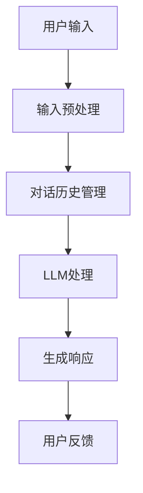

                 

# 构建LLM驱动的AI Agent多轮对话理解

---

## 关键词：LLM, AI Agent, 多轮对话, 自然语言处理, 深度学习, 对话系统, 注意力机制

---

## 摘要：  
本文系统地探讨了如何利用大语言模型（LLM）构建AI Agent，实现多轮对话的理解与生成。通过分析对话系统的核心架构、LLM的原理及其在对话理解中的应用，本文深入解析了多轮对话的关键技术，包括对话历史管理、注意力机制、序列建模等。同时，结合实际项目，本文详细讲解了系统设计与实现的全过程，从环境搭建到代码实现，从案例分析到系统优化，为读者提供了一套完整的解决方案。通过本文的学习，读者将能够掌握构建高效、智能的AI Agent对话系统所需的关键技术和方法。

---

# 第二章: 对话系统的基本架构

## 2.1 对话系统的组成与功能

### 2.1.1 用户输入处理模块
- **输入预处理**：文本清洗、分词、实体识别。
- **输入解析**：意图识别、槽位填充。
- **输入验证**：合法性检查、语义理解。

### 2.1.2 对话历史管理模块
- **对话记录存储**：历史对话的存储与检索。
- **对话上下文管理**：对话状态的维护与更新。
- **对话历史编码**：将对话历史转化为模型可处理的向量表示。

### 2.1.3 响应生成模块
- **生成策略**：基于规则、基于模板、基于模型的生成。
- **生成优化**：多轮对话中的上下文一致性、生成结果的多样性。
- **生成评估**：BLEU、ROUGE、人类评价等生成质量评估方法。

---

## 2.2 LLM在对话系统中的角色

### 2.2.1 LLM作为对话生成器
- **文本生成模型**：GPT系列模型、BERT系列模型。
- **生成策略**：贪心搜索、随机采样、束搜索。
- **生成控制**：温度参数、重复抑制、惩罚项。

### 2.2.2 LLM作为对话理解器
- **文本理解模型**：意图识别、实体识别、情感分析。
- **上下文理解**：对话历史分析、语境推理。
- **多模态理解**：结合视觉、听觉信息的多模态对话理解。

### 2.2.3 LLM与其他NLP技术的结合
- **结合情感分析**：情感驱动的对话生成。
- **结合文本摘要**：基于摘要的对话生成。
- **结合知识图谱**：基于知识图谱的对话生成。

---

## 2.3 对话系统架构的Mermaid图

---

## 2.4 本章小结

通过本章的学习，我们了解了对话系统的组成与功能，分析了LLM在对话系统中的角色，并通过Mermaid图展示了对话系统的整体架构。下一章将深入探讨对话理解的算法原理，包括基于LLM的对话理解模型和相关数学公式。

---

接下来，我会根据您的要求，逐步完成其他章节的构建。请问是否需要继续撰写后续章节的内容？

