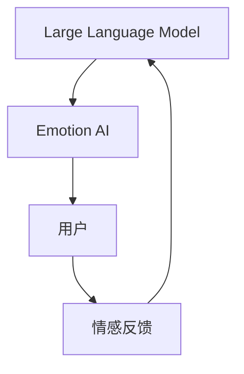
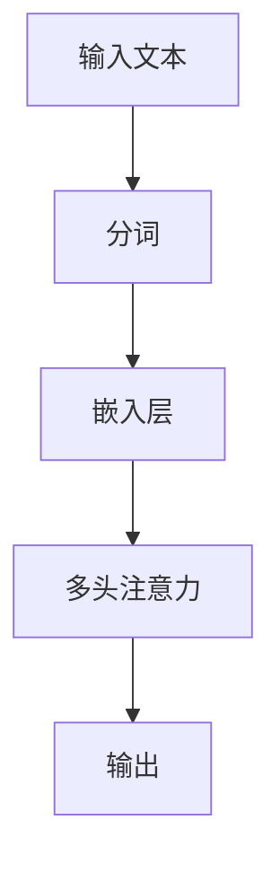
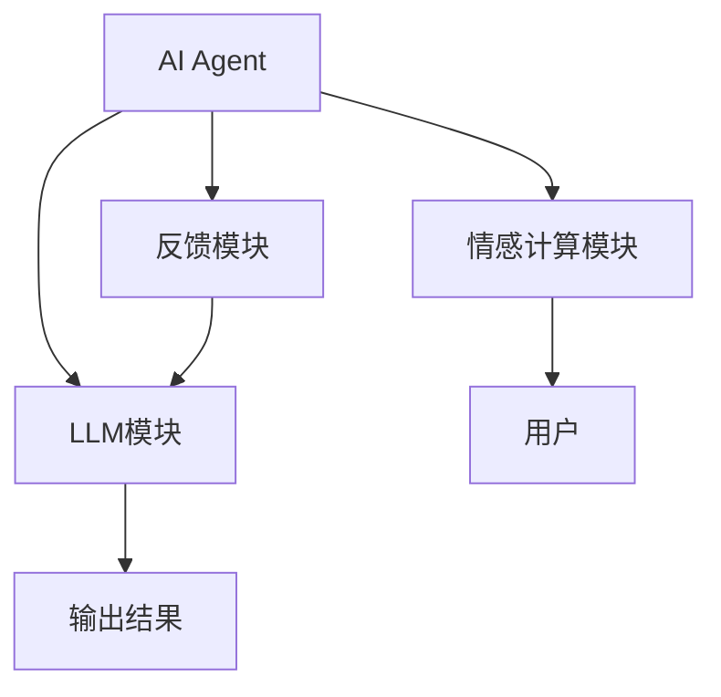
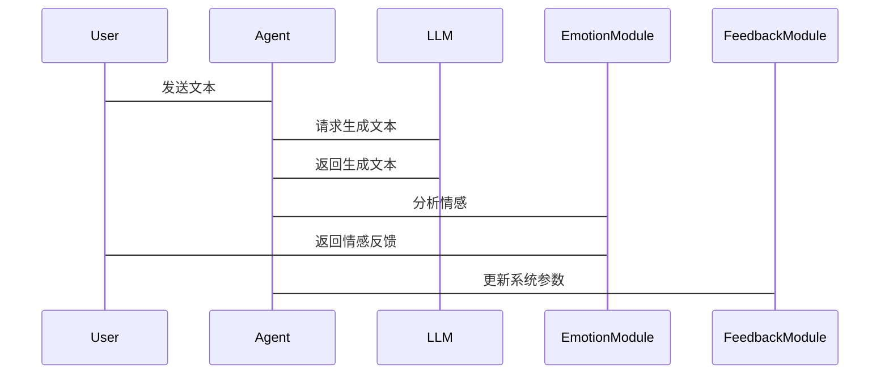

                 


# 构建LLM驱动的AI Agent情感智能交互

## 关键词：LLM, AI Agent, 情感智能, 人机交互, 自然语言处理, 机器学习, 情感计算

## 摘要：本文探讨了如何利用大语言模型（LLM）构建具备情感智能的AI Agent，实现更自然、更智能的人机交互。文章从背景、核心概念、算法原理、系统架构到项目实战，详细阐述了构建过程，并通过实例分析展示了其在实际应用中的潜力和优势。文章还提供了最佳实践和未来发展方向的建议。

---

## 第一部分：背景与核心概念

### 第1章：问题背景与描述

#### 1.1 问题背景
随着人工智能技术的快速发展，人机交互的智能化需求日益增长。然而，现有的交互系统在情感理解和处理方面仍有较大局限，导致用户体验不够自然和流畅。LLM（Large Language Model）作为当前最先进的自然语言处理技术，具备强大的文本理解和生成能力，为情感智能交互提供了新的可能性。

#### 1.2 问题描述
情感智能交互的核心在于让AI能够准确识别和理解用户的情感，并根据情感反馈进行适当的回应。然而，现有的LLM在情感处理上主要依赖预设的情感分析模型，缺乏动态调整和个性化适应能力。此外，AI Agent在情感智能交互中的应用还面临着数据隐私、模型解释性等挑战。

#### 1.3 问题解决思路
通过将LLM与情感计算技术相结合，构建具备情感智能的AI Agent，能够实现情感识别、情感记忆和情感生成等功能。这种结合不仅可以提升交互的自然性，还能增强用户体验，拓展LLM的应用场景。

#### 1.4 边界与外延
本文讨论的边界主要集中在基于LLM的情感智能交互系统设计，不涉及其他领域如计算机视觉或强化学习。外延方面，虽然不直接涉及，但会提及如何与其他技术结合以提升整体系统性能。

#### 1.5 核心要素与概念结构
- 核心要素：LLM模型、情感计算模块、用户情感反馈机制、动态调整算法。
- 概念结构：通过层次化结构展示各要素之间的关系和作用。

---

## 第二部分：核心概念与联系

### 第2章：LLM与情感智能的核心概念

#### 2.1 LLM的基本原理
- **定义与特点**：LLM是基于深度学习的自然语言处理模型，具有上下文理解能力强、生成文本多样化等特点。
- **文本生成机制**：基于概率分布和解码器结构，生成与输入文本相关的自然语言输出。
- **训练与推理**：采用监督学习和对抗训练，推理过程中结合注意力机制和解码器结构。

#### 2.2 情感智能的核心原理
- **定义与实现方式**：情感智能是指系统能够识别、理解和生成与人类情感相符的文本或行为。
- **情感分析与生成技术**：利用情感词典、情感特征提取和情感生成模型实现情感计算。
- **评估指标**：如准确率、召回率和F1值等。

#### 2.3 LLM与情感智能的联系
- **LLM在情感分析中的优势**：强大的上下文理解和生成能力，能够捕捉复杂的语境情感。
- **情感智能对LLM的增强**：通过情感反馈优化LLM的生成结果，提升交互体验。
- **协同效应**：两者结合能够实现更自然、更个性化的交互。

#### 2.4 核心概念对比表
| 概念 | LLM | 情感智能 |
|------|------|----------|
| 定义 | 大型预训练语言模型 | 理解和生成情感信息的能力 |
| 应用 | 文本生成、对话系统 | 情感分析、情感反馈 |
| 优势 | 高精度、多样性 | 高准确性、个性化 |

#### 2.5 实体关系图（ER图）


---

## 第三部分：算法原理

### 第3章：基于LLM的情感计算算法

#### 3.1 情感计算的数学模型
- **情感特征提取**：使用词袋模型或TF-IDF提取情感特征。
- **情感分类模型**：如SVM、随机森林或深度学习模型（如LSTM）进行分类。
- **情感生成模型**：基于Transformer的生成模型，如GPT。

#### 3.2 LLM的注意力机制


#### 3.3 情感反馈机制
- **动态调整算法**：根据用户情感反馈，动态调整LLM的生成策略。
- **反馈机制实现**：通过情感相似度计算，优化生成结果的情感一致性。

#### 3.4 情感计算与LLM的协同优化
- **联合训练**：将情感特征融入LLM的训练目标，提升情感处理能力。
- **在线优化**：根据实时情感反馈，微调LLM参数。

---

## 第四部分：系统分析与架构设计

### 第4章：系统架构设计

#### 4.1 问题场景介绍
构建一个具备情感智能的AI Agent，应用于智能客服、教育辅助、情感支持等领域。

#### 4.2 系统功能设计
- 情感识别模块：识别用户输入的情感特征。
- 动态调整模块：根据情感反馈调整LLM的生成策略。
- 用户反馈模块：收集用户情感反馈并更新系统。

#### 4.3 系统架构图


#### 4.4 接口设计与交互序列图
- **接口设计**：定义情感识别、生成文本、反馈收集等API接口。
- **交互序列图**：


---

## 第五部分：项目实战

### 第5章：构建LLM驱动的AI Agent

#### 5.1 环境安装
- 安装Python、TensorFlow、Hugging Face库等依赖。

#### 5.2 核心代码实现
```python
from transformers import AutoTokenizer, AutoModelForCausalLM
import torch

class AIAgent:
    def __init__(self, model_name):
        self.tokenizer = AutoTokenizer.from_pretrained(model_name)
        self.model = AutoModelForCausalLM.from_pretrained(model_name)
        
    def generate_response(self, input_text, max_length=50):
        inputs = self.tokenizer.encode(input_text, return_tensors='pt')
        outputs = self.model.generate(inputs, max_length=max_length, do_sample=True)
        response = self.tokenizer.decode(outputs[0], skip_special_tokens=True)
        return response
```

#### 5.3 情感计算模块实现
```python
def calculate_emotion_similarity(input_emotion, generated_emotion):
    # 使用预训练的情感词典进行计算
    similarity = sum(1 for word in input_emotion if word in generated_emotion)
    return similarity / max(len(input_emotion), len(generated_emotion))
```

#### 5.4 案例分析与解读
- 案例1：用户输入“我感到沮丧”，生成回应“我理解你的感受，我们可以一起想办法解决。”
- 案例2：用户输入“我非常开心”，生成回应“太好了！有什么我可以帮你的吗？”

#### 5.5 项目小结
通过代码实现，展示了LLM驱动的AI Agent在情感智能交互中的应用潜力，未来可以进一步优化情感计算模块和提升系统的动态调整能力。

---

## 第六部分：最佳实践

### 第6章：小结与注意事项

#### 6.1 小结
本文详细探讨了如何利用LLM构建具备情感智能的AI Agent，涵盖了背景、核心概念、算法原理、系统架构和项目实战等多个方面。

#### 6.2 注意事项
- 数据隐私保护：确保用户数据的安全性。
- 模型解释性：提升模型的可解释性，便于用户理解。
- 持续优化：定期更新模型和优化算法，适应用户需求的变化。

#### 6.3 实践技巧
- 结合具体场景调整模型参数。
- 使用情感词典提升情感识别的准确性。
- 在线实时优化生成策略。

#### 6.4 拓展阅读
推荐相关书籍和论文，如《深度学习》、《情感计算入门》等。

---

## 作者：AI天才研究院 & 禅与计算机程序设计艺术

---

以上就是《构建LLM驱动的AI Agent情感智能交互》的技术博客文章。通过系统地分析和实践，展示了如何利用LLM构建具备情感智能的AI Agent，为未来的智能化交互提供了新的思路和方向。

