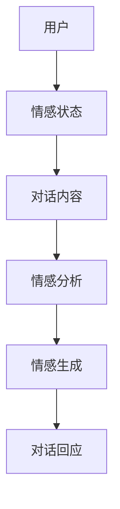
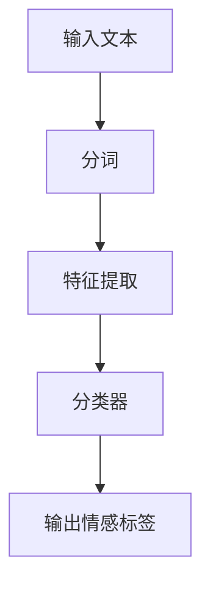
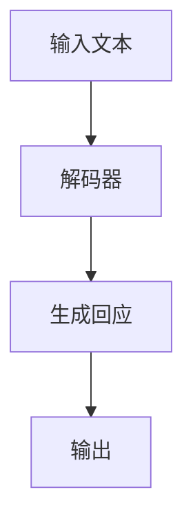
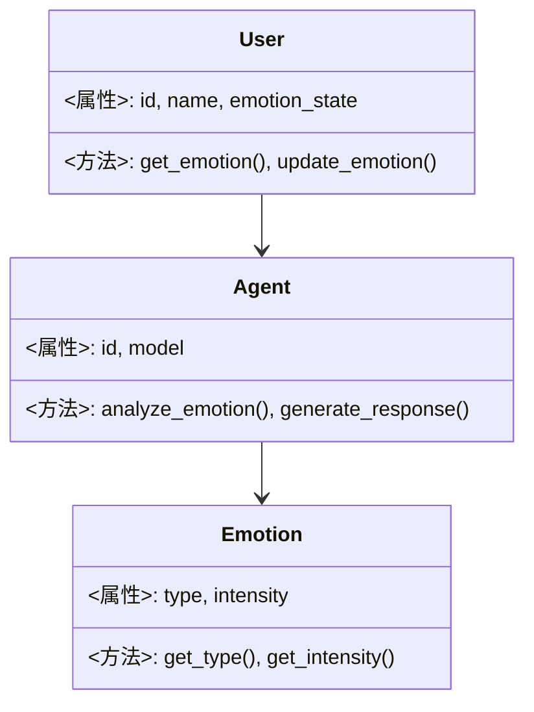

                 


# 《构建LLM驱动的AI Agent情感智能对话》

## 关键词：LLM, AI Agent, 情感智能, 对话系统, 自然语言处理

## 摘要：  
本文详细探讨了如何利用大语言模型（LLM）构建具备情感智能的AI代理对话系统。文章首先从情感智能和LLM的基本概念出发，分析了情感对话的核心问题与挑战。接着，深入讲解了LLM驱动AI Agent的背景与需求，并通过具体案例展示了情感智能对话在实际应用中的重要性。随后，从算法原理、系统架构到项目实战，逐步剖析了构建情感智能对话系统的关键技术与实现细节。最后，总结了当前技术的发展现状，并展望了未来的研究方向。

---

# 第一部分: 情感智能与LLM驱动AI Agent的背景介绍

## 第1章: 情感智能的基础与应用

### 1.1 情感智能的定义与技术发展  
情感智能（Emotional Intelligence, EI）是指个体在识别、理解、管理和运用自身及他人情感方面的能力。在人机交互领域，情感智能的核心目标是使计算机能够理解并模拟人类的情感状态，从而实现更自然、更贴近人类的对话体验。  

#### 1.1.1 情感智能的定义  
情感智能不仅仅关注事实性的信息，而是注重情感的表达与理解。例如，当用户在与AI代理对话时，AI代理需要能够识别用户的情绪状态（如快乐、愤怒、悲伤等），并根据这些情绪调整其回答的语气和内容。  

#### 1.1.2 情感智能的技术发展史  
情感智能的技术发展可以追溯到20世纪60年代，但真正的发展始于深度学习技术的兴起。近年来，随着自然语言处理（NLP）技术的进步，情感智能在人机对话中的应用取得了显著进展。  

#### 1.1.3 情感智能在人机交互中的应用案例  
例如，智能客服系统可以根据用户的情绪状态调整服务策略，从而提高客户满意度。另一个案例是情感陪伴机器人，这类机器人可以与用户进行情感交流，帮助用户缓解压力。  

---

### 1.2 LLM与AI Agent的基本概念  

#### 1.2.1 LLM的定义  
大语言模型（Large Language Model, LLM）是指基于深度学习技术训练的大型神经网络模型，具有强大的文本理解和生成能力。例如，GPT-3、GPT-4和PaLM等都是典型的LLM。  

#### 1.2.2 LLM的核心特点  
1. **规模大**：LLM通常包含 billions（十亿级）甚至 trillions（万亿级）的参数。  
2. **多任务能力**：LLM可以在多种任务（如文本生成、情感分析、问答系统等）上表现优异。  
3. **自适应性**：LLM可以根据上下文动态调整输出内容。  

#### 1.2.3 LLM与传统NLP模型的区别  
传统NLP模型通常针对特定任务进行训练，而LLM是通用性的模型，可以在多种任务上进行微调或直接使用。  

---

### 1.3 情感对话的核心问题与挑战  

#### 1.3.1 情感理解与生成的挑战  
情感对话的核心是理解用户的情感状态并生成合适的回应。然而，情感的理解具有主观性和模糊性，不同的人可能对同一句话的情感解读不同。  

#### 1.3.2 多模态情感对话的需求  
现代情感对话系统需要结合文本、语音、图像等多种模态信息来更准确地理解用户的情感状态。例如，结合语音的语调和文本内容，可以更准确地判断用户的情绪。  

#### 1.3.3 情感对话的边界与外延  
情感对话的边界在于如何在不越界的情况下与用户进行交流。例如，AI代理需要避免涉及敏感话题或超出其能力范围的内容。  

---

## 第2章: LLM驱动AI Agent的背景与需求  

### 2.1 LLM驱动AI Agent的背景  
AI Agent是一种能够自主感知环境并采取行动以实现目标的智能体。通过结合LLM的强大语言处理能力，AI Agent可以实现更复杂、更自然的对话交互。  

#### 2.1.1 AI Agent的基本概念  
AI Agent可以是软件程序、机器人或其他智能设备。它们通常具有感知、决策和执行的能力。  

#### 2.1.2 LLM在AI Agent中的作用  
LLM为AI Agent提供了强大的语言理解和生成能力，使其能够与人类进行更自然的对话。  

#### 2.1.3 情感智能对话的需求分析  
在实际应用中，情感智能对话的需求主要集中在用户体验优化、情感支持和个性化服务等方面。  

---

# 第二部分: 情感智能与LLM的核心概念与联系

## 第5章: 情感智能与LLM的关系分析  

### 5.1 情感智能的核心要素  

#### 5.1.1 情感智能的实体关系图  
以下是情感智能的核心实体及其关系：  


---

## 第6章: 情感对话的算法原理与实现  

### 6.1 情感分析的算法原理  

#### 6.1.1 情感分析的分类模型  
以下是情感分析的分类模型流程图：  


#### 6.1.2 情感生成的算法模型  
以下是情感生成的算法流程图：  


---

## 第7章: 情感对话系统的架构设计  

### 7.1 系统功能设计  

#### 7.1.1 领域模型设计  
以下是领域模型的类图：  


---

## 第8章: 项目实战与实现细节  

### 8.1 环境安装与配置  

#### 8.1.1 安装Python环境  
```bash
python --version
pip install --upgrade pip
pip install torch
pip install transformers
```

#### 8.1.2 下载LLM模型  
```bash
pip install transformers
from transformers import AutoTokenizer, AutoModelForCausalLM
tokenizer = AutoTokenizer.from_pretrained("gpt2")
model = AutoModelForCausalLM.from_pretrained("gpt2")
```

---

## 第9章: 总结与展望  

### 9.1 总结  
本文详细探讨了如何利用LLM构建具备情感智能的AI Agent对话系统。通过分析情感智能的核心问题、LLM的技术特点以及情感对话的算法实现，我们为读者提供了一个全面的技术框架。  

### 9.2 未来展望  
未来，情感对话系统将更加注重多模态信息的融合，同时需要解决情感理解的主观性和个性化需求的问题。此外，随着LLM的不断进化，情感对话的智能化和自然化将得到进一步提升。  

---

**作者：AI天才研究院/AI Genius Institute & 禅与计算机程序设计艺术 /Zen And The Art of Computer Programming**

