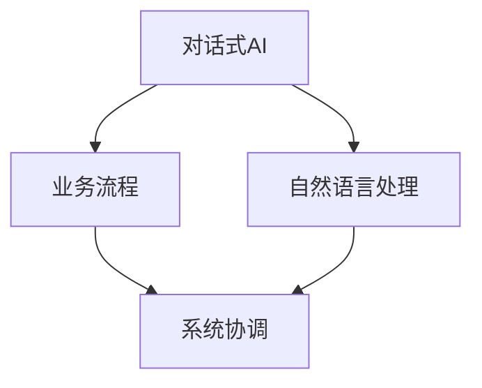
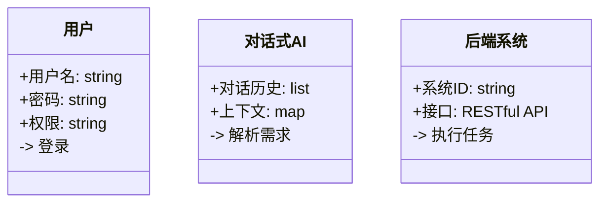
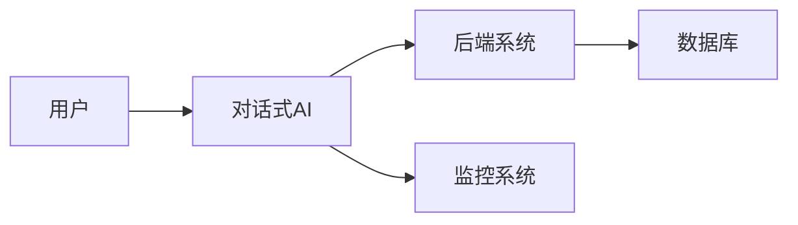
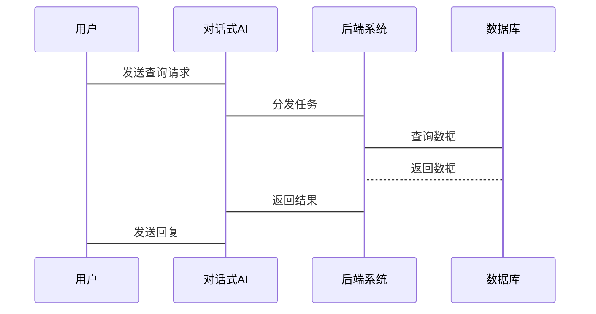

                 


# 构建企业级对话式AI助手：跨系统业务流程自动化与协调

> 关键词：企业级AI助手、对话式AI、业务流程自动化、跨系统协调、自然语言处理

> 摘要：本文详细探讨了构建企业级对话式AI助手的全过程，涵盖从背景分析到系统实现的核心技术。文章从对话式AI的核心概念出发，深入分析其算法原理，结合实际案例，详细阐述了跨系统业务流程自动化与协调的关键技术，为读者提供了一套完整的构建方案。

---

# 第一部分: 企业级对话式AI助手的背景与核心概念

## 第1章: 问题背景与问题描述

### 1.1 问题背景
#### 1.1.1 企业级AI助手的定义与目标
企业级对话式AI助手是一种基于自然语言处理（NLP）技术的智能系统，旨在通过对话形式为企业用户提供高效、个性化的业务支持。其目标是将复杂的业务流程转化为自然的对话交互，从而提升用户体验和业务效率。

#### 1.1.2 对话式AI在企业中的应用现状
目前，对话式AI在企业中的应用主要集中在客服、销售、技术支持等领域。通过对话式AI，企业可以实现24/7的用户支持，降低人工成本，同时提升用户满意度。

#### 1.1.3 业务流程自动化与协调的必要性
传统的业务流程往往依赖人工操作，效率低下且容易出错。通过对话式AI实现业务流程自动化与协调，可以显著提升流程效率，降低错误率，并为企业创造更大的价值。

### 1.2 问题描述
#### 1.2.1 传统业务流程中的痛点
传统业务流程通常存在以下痛点：
- **低效**：人工操作导致流程耗时长。
- **错误率高**：人为因素可能导致数据输入错误。
- **用户体验差**：用户需要通过多个渠道与企业互动，体验不佳。

#### 1.2.2 对话式AI在流程自动化中的作用
对话式AI可以通过自然语言理解（NLU）和自然语言生成（NLG）技术，将用户的需求转化为具体的业务操作，从而实现流程自动化。

#### 1.2.3 企业级AI助手的核心价值
- 提升用户体验。
- 提高业务流程效率。
- 降低企业运营成本。

---

## 第2章: 核心概念与联系

### 2.1 对话式AI的核心原理
#### 2.1.1 自然语言处理（NLP）基础
NLP是对话式AI的核心技术，主要包括文本分词、实体识别、情感分析等任务。

#### 2.1.2 对话生成模型（如GPT系列）
对话生成模型通过预训练和微调，能够生成与上下文相关的对话回复。

#### 2.1.3 多轮对话的上下文管理
上下文管理是对话式AI的关键，通过维护对话历史来确保生成的回复与当前对话内容一致。

### 2.2 业务流程自动化与协调
#### 2.2.1 流程自动化的基本概念
流程自动化是指通过技术手段将业务流程中的重复性任务自动化执行。

#### 2.2.2 跨系统协调的核心挑战
跨系统协调需要解决不同系统之间的数据格式、接口协议等问题，确保各系统协同工作。

#### 2.2.3 对话式AI在流程协调中的角色
对话式AI作为协调者，负责理解用户需求，并将其转化为具体的业务操作，同时与各系统进行交互。

### 2.3 核心概念对比与ER图



---

# 第二部分: 对话式AI助手的算法原理

## 第3章: 对话生成模型的算法原理

### 3.1 模型训练基础
#### 3.1.1 预训练语言模型的概述
预训练语言模型（如GPT）通过在大规模文本数据上进行无监督学习，获得通用的语言表示能力。

#### 3.1.2 对话数据的准备与预处理
对话数据需要进行清洗、分词、标注等预处理步骤，以确保模型输入的质量。

#### 3.1.3 损失函数与优化目标
常用的损失函数包括交叉熵损失函数，优化目标是通过梯度下降算法最小化损失函数。

```latex
$$\text{损失函数} = -\sum_{i=1}^{n} \log p(y_i|x_{<i})$$
$$\text{优化目标} = \min \text{损失函数}$$
```

### 3.2 对话生成的算法实现
#### 3.2.1 基于Transformer的对话生成模型
Transformer模型通过自注意力机制，能够捕捉到对话中的长距离依赖关系。

#### 3.2.2 解码策略（贪心搜索与随机采样）
贪心搜索适用于实时对话生成，而随机采样可以生成更多样化的回复。

#### 3.2.3 模型训练的数学公式
对话生成模型的训练过程可以通过以下公式表示：

$$P(y|x) = \prod_{i=1}^{n} P(y_i|x_{<i})$$

### 3.3 对话生成的优化算法
#### 3.3.1 增量式训练方法
增量式训练可以在已有模型基础上逐步更新，适用于数据量大的场景。

#### 3.3.2 知识蒸馏与模型压缩
知识蒸馏通过教师模型指导学生模型学习，可以有效压缩模型体积，提升推理效率。

#### 3.3.3 对话质量的评估指标
常用的评估指标包括BLEU、ROUGE等，用于衡量生成对话的质量。

---

# 第三部分: 跨系统业务流程自动化与协调

## 第4章: 业务流程自动化的核心技术

### 4.1 系统分析与架构设计
#### 4.1.1 问题场景介绍
以企业客服系统为例，用户通过对话式AI提出问题，系统需要协调多个后端系统完成任务。

#### 4.1.2 系统功能设计
系统功能包括用户身份验证、需求解析、任务分配、结果反馈等。

#### 4.1.3 领域模型类图



#### 4.1.4 系统架构设计



#### 4.1.5 系统接口设计
系统接口主要采用RESTful API，定义了请求参数和返回格式。

#### 4.1.6 系统交互序列图



### 4.2 项目实战

#### 4.2.1 环境安装
需要安装Python、TensorFlow、Keras等工具。

#### 4.2.2 核心代码实现

```python
def initialize_model():
    # 初始化模型
    model = Transformer(...)
    return model

def process_request(user_input):
    # 解析用户输入
    response = generate_response(model, user_input)
    return response

def generate_response(model, input_text):
    # 生成回复
    response = model.predict(input_text)
    return response
```

#### 4.2.3 代码应用解读与分析
代码实现包括模型初始化、用户输入处理和回复生成三个部分，分别对应对话式AI的核心功能。

#### 4.2.4 实际案例分析
以用户查询订单状态为例，对话式AI需要解析用户输入，调用后端系统查询数据库，并返回结果。

#### 4.2.5 项目小结
通过实际案例分析，可以验证对话式AI在业务流程自动化中的有效性。

---

## 第5章: 跨系统协调的最佳实践

### 5.1 对話式AI的部署与优化
#### 5.1.1 模型部署
对话式AI可以通过API网关部署在云端或本地服务器。

#### 5.1.2 性能优化
通过缓存、负载均衡等技术优化系统性能。

### 5.2 业务流程优化
#### 5.2.1 流程简化
通过分析业务流程，去除冗余步骤，提升效率。

#### 5.2.2 系统集成
通过API Gateway实现多个后端系统的统一接入。

### 5.3 监控与维护
#### 5.3.1 系统监控
通过日志和监控工具实时监控系统运行状态。

#### 5.3.2 模型维护
定期更新模型，确保其准确性和实用性。

---

# 第四部分: 总结与展望

## 第6章: 总结与最佳实践

### 6.1 核心要点回顾
对话式AI的核心技术包括自然语言处理、对话生成模型和业务流程自动化。

### 6.2 最佳实践
- 采用增量式训练提升模型性能。
- 使用RESTful API实现系统集成。
- 定期更新模型保持其准确性。

### 6.3 小结
通过本文的介绍，读者可以全面了解构建企业级对话式AI助手的核心技术，并能够将其应用于实际场景。

### 6.4 注意事项
- 对话式AI的模型需要定期更新，以适应用户需求的变化。
- 系统集成时需要注意接口兼容性问题。

### 6.5 未来展望
未来，对话式AI将在更多领域得到应用，同时模型的实时性和准确性也将进一步提升。

---

# 作者

作者：AI天才研究院（AI Genius Institute） & 禅与计算机程序设计艺术（Zen And The Art of Computer Programming）

