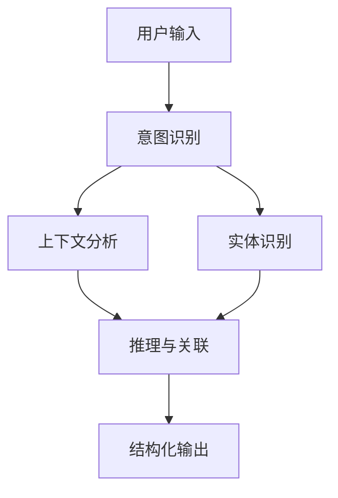
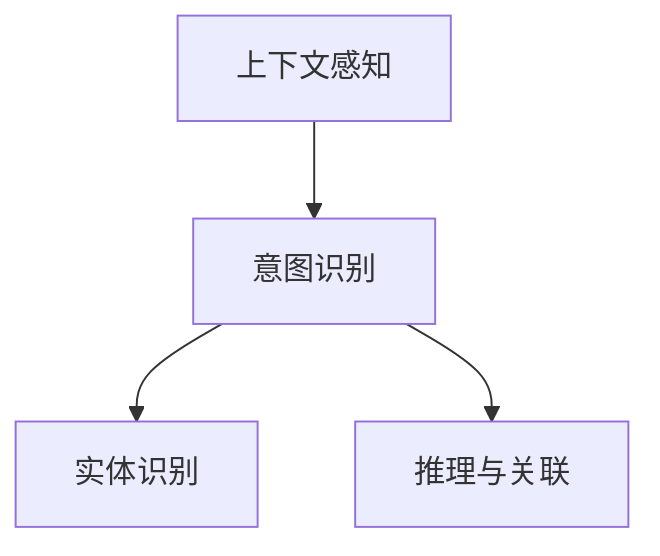
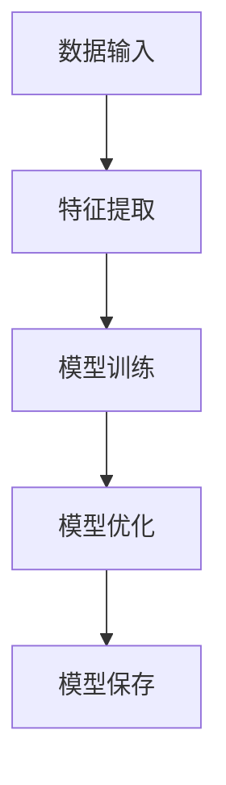
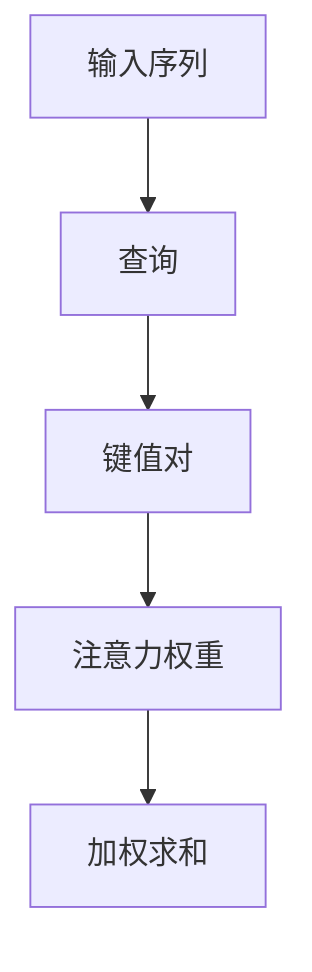
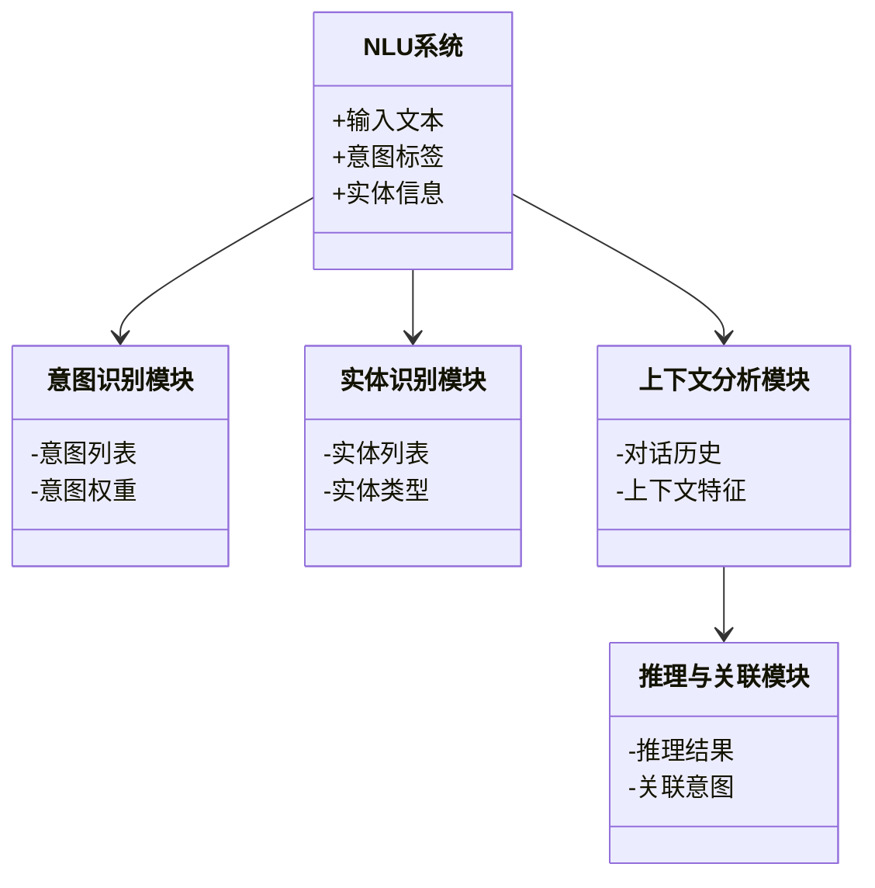

                 


# 构建企业级自然语言理解系统：上下文感知与多意图识别

> 关键词：自然语言理解（NLU）、上下文感知、多意图识别、企业级系统、深度学习、NLP、自然语言处理

> 摘要：本文将深入探讨如何构建一个企业级的自然语言理解系统，重点分析上下文感知与多意图识别的核心原理、算法实现及系统架构设计。通过详细的技术分析和实际案例，我们将揭示如何在复杂的企业环境中实现高效的自然语言理解，满足多样化的业务需求。

---

# 第一部分: 背景与核心概念

## # 第1章: 企业级自然语言理解系统概述

### ## 1.1 问题背景与挑战

#### ### 1.1.1 自然语言理解的定义与重要性
自然语言理解（NLU）是人工智能领域的重要分支，旨在让计算机能够理解和解析人类的自然语言输入。随着企业数字化转型的加速，NLU在客服、销售、医疗等领域的应用需求日益增长。企业级NLU系统需要处理大量复杂场景，包括上下文感知和多意图识别，以提高用户体验和业务效率。

#### ### 1.1.2 企业级NLU系统的独特需求
企业级NLU系统需要满足以下需求：
1. 高准确性：在复杂场景下准确识别用户意图。
2. 高可靠性：支持大规模数据处理和实时响应。
3. 上下文感知：理解对话历史和上下文关系。
4. 多意图识别：识别用户在单次输入中的多个意图。

#### ### 1.1.3 上下文感知与多意图识别的必要性
上下文感知和多意图识别是企业级NLU系统的核心能力：
- **上下文感知**：理解对话的背景和历史，提供更精准的服务。
- **多意图识别**：识别用户在一次输入中的多个意图，提升系统响应效率。

### ## 1.2 核心概念与问题描述

#### ### 1.2.1 上下文感知的基本原理
上下文感知通过分析对话历史、用户行为和环境信息，理解当前输入的背景。例如，在客服系统中，用户提到“订单问题”后，系统需要结合之前的对话内容，判断具体是订单查询、退款请求还是投诉处理。

#### ### 1.2.2 多意图识别的定义与实现
多意图识别是指从用户的输入中识别出多个相关意图。例如，用户说“我需要预约明天的会议并发送提醒”，系统需要识别出“预约会议”和“设置提醒”两个意图。

#### ### 1.2.3 问题边界与外延
- **问题边界**：专注于上下文感知和多意图识别，不涉及语音识别或图像处理。
- **外延**：与自然语言生成（NLG）和对话管理（DM）密切相关。

### ## 1.3 核心要素与系统架构

#### ### 1.3.1 输入输出结构化分析
输入：用户自然语言文本。
输出：结构化的意图和实体信息。

#### ### 1.3.2 系统功能模块划分
1. **意图识别模块**：识别用户的主意图和相关意图。
2. **实体识别模块**：提取文本中的关键实体信息。
3. **上下文理解模块**：分析对话历史和上下文关系。
4. **推理与关联模块**：结合意图和实体进行推理。

#### ### 1.3.3 系统核心流程图（Mermaid）


---

## # 第2章: 上下文感知与多意图识别的核心原理

### ## 2.1 上下文感知的实现机制

#### ### 2.1.1 基于上下文的语义分析
通过分析对话历史，使用记忆网络模型（MCN）来捕捉上下文信息。

#### ### 2.1.2 上下文记忆网络模型（MCN）
记忆网络通过外部存储器记录对话历史，提升上下文理解能力。

#### ### 2.1.3 上下文特征提取方法
使用注意力机制（Attention）提取上下文中的关键特征。

### ## 2.2 多意图识别的实现原理

#### ### 2.2.1 多意图识别的定义与分类
多意图识别可以分为基于规则的方法和基于模型的方法。

#### ### 2.2.2 基于注意力机制的意图识别
使用Transformer模型中的注意力机制，识别文本中的多意图。

#### ### 2.2.3 多意图生成模型（MGEN）
MGEN模型通过生成多个意图标签，实现多意图识别。

### ## 2.3 核心概念对比分析

#### ### 2.3.1 上下文感知与意图识别的对比（表格）
| 对比维度 | 上下文感知 | 多意图识别 |
|----------|------------|------------|
| 目标 | 理解对话背景 | 识别多个意图 |
| 方法 | 分析对话历史 | 生成多个意图标签 |
| 应用场景 | 客服对话 | 电商咨询 |

#### ### 2.3.2 实体关系图（Mermaid）


---

## # 第3章: 上下文感知模型的算法原理

### ## 3.1 上下文感知模型的训练流程

#### ### 3.1.1 数据预处理与特征提取
1. **数据清洗**：去除噪声数据。
2. **特征提取**：提取文本特征和上下文特征。

#### ### 3.1.2 模型训练流程（Mermaid）


#### ### 3.1.3 模型评估与优化
使用准确率、召回率和F1值评估模型性能。

### ## 3.2 数学模型与公式推导

#### ### 3.2.1 上下文表示的向量空间模型
文本表示为向量空间中的点：
$$
v = [v_1, v_2, ..., v_n]
$$

#### ### 3.2.2 注意力机制的数学公式（Mermaid）


#### ### 3.2.3 上下文感知的损失函数（交叉熵损失）
交叉熵损失函数：
$$
L = -\sum_{i=1}^{n} y_i \log(p_i) + (1 - y_i) \log(1 - p_i)
$$

---

## # 第4章: 多意图识别模型的算法原理

### ## 4.1 多意图识别模型的训练流程

#### ### 4.1.1 数据标注与特征提取
1. **数据标注**：标注每个文本的意图标签。
2. **特征提取**：提取文本和上下文特征。

#### ### 4.1.2 模型训练流程（Mermaid）


#### ### 4.1.3 模型评估与优化
使用准确率、召回率和F1值评估模型性能。

### ## 4.2 数学模型与公式推导

#### ### 4.2.1 多意图生成的生成对抗网络模型（GAN）
生成对抗网络由生成器和判别器组成：
$$
G(z) = \text{生成意图标签}
$$
$$
D(x) = \text{判别真实标签与生成标签}
$$

#### ### 4.2.2 意图识别的条件随机场模型（CRF）
条件随机场用于序列标注：
$$
P(y|x) = \frac{1}{Z} \exp(\sum_{i=1}^{n} \sum_{j=1}^{m} w_{i,j} y_i y_j)
$$

#### ### 4.2.3 意图生成的损失函数（KL散度）
KL散度：
$$
KL(P||Q) = \sum_i P(i) \log\frac{P(i)}{Q(i)}
$$

---

## # 第5章: 系统分析与架构设计

### ## 5.1 系统功能模型（Mermaid类图）


### ## 5.2 系统架构设计（Mermaid架构图）


---

## # 第6章: 项目实战

### ## 6.1 项目背景与需求分析
案例：企业客服对话系统。

### ## 6.2 环境安装与配置
1. **安装Python**：3.8+
2. **安装依赖库**：
   ```bash
   pip install numpy matplotlib tensorflow
   ```

### ## 6.3 核心代码实现

#### ### 6.3.1 意图识别模块代码
```python
import tensorflow as tf
from tensorflow.keras import layers

model = tf.keras.Sequential([
    layers.Embedding(input_dim=10000, output_dim=16),
    layers.LSTM(32, return_sequences=True),
    layers.Dense(2, activation='softmax')
])
```

#### ### 6.3.2 上下文分析模块代码
```python
def context_attention(input_seq):
    attention = layers.Attention()([input_seq, input_seq])
    return layers.GlobalAveragePooling1D()(attention)
```

### ## 6.4 实际案例分析与解读
案例分析：用户输入“我需要预约明天的会议并发送提醒”，系统识别出两个意图：“预约会议”和“设置提醒”。

### ## 6.5 项目小结
通过实际案例，验证了系统在上下文感知和多意图识别方面的有效性。

---

## # 第7章: 最佳实践与总结

### ## 7.1 小结
本文详细介绍了企业级自然语言理解系统的构建过程，重点分析了上下文感知和多意图识别的核心原理和实现方法。

### ## 7.2 注意事项
1. 数据质量对模型性能至关重要。
2. 上下文感知需要结合对话历史和用户行为。

### ## 7.3 拓展阅读
推荐阅读《深度学习》和《自然语言处理实战》。

---

作者：AI天才研究院/AI Genius Institute & 禅与计算机程序设计艺术 /Zen And The Art of Computer Programming

