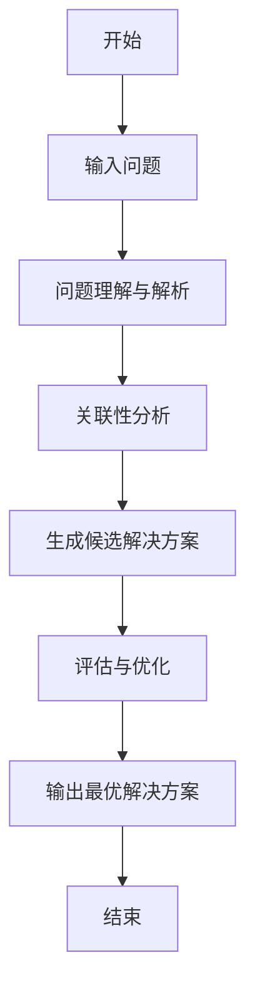
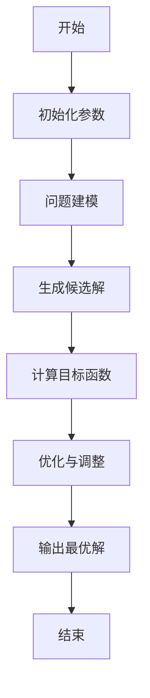
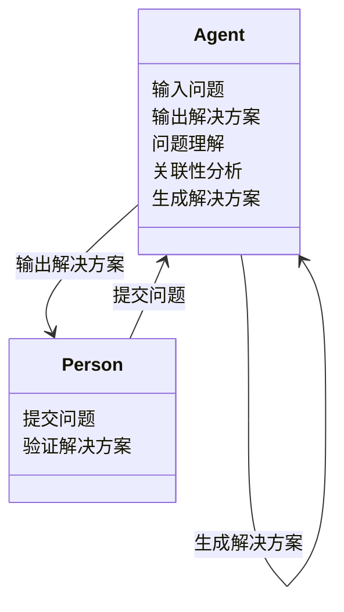

                 


# 构建具有创造性解决问题的AI Agent

> 关键词：AI Agent，创造性解决问题，算法原理，系统架构，项目实战

> 摘要：本文将详细介绍如何构建一个能够创造性解决问题的AI Agent。从背景介绍、核心概念、算法原理、系统架构到项目实战，逐步深入分析，帮助读者掌握AI Agent的设计与实现。

---

# 第一部分: AI Agent 的背景与核心概念

## 第1章: AI Agent 的问题背景与描述

### 1.1 问题背景
#### 1.1.1 当前 AI 技术的发展现状
人工智能（AI）技术近年来取得了长足的发展，尤其是在机器学习、自然语言处理和计算机视觉等领域。然而，现有的AI系统在解决问题时往往局限于预设的规则和数据，缺乏真正的创造性思维。

#### 1.1.2 传统 AI 代理的局限性
传统AI代理通常基于规则引擎或简单的决策树，难以应对复杂多变的问题场景。它们在处理非结构化数据和需要创造性解决方案的任务时表现不佳。

#### 1.1.3 创造性解决问题的必要性
在实际应用中，许多问题需要创造性思维来解决，例如创新设计、策略制定和复杂问题诊断等。传统的AI代理无法满足这些需求，因此构建具有创造性解决问题能力的AI Agent显得尤为重要。

### 1.2 问题描述
#### 1.2.1 AI Agent 的定义与目标
AI Agent 是一种能够自主感知环境、理解和解决问题的智能代理。其目标是通过创造性思维和自主决策能力，解决复杂问题并优化结果。

#### 1.2.2 创造性解决问题的核心要素
创造性解决问题的核心要素包括：问题理解、关联性分析、创新性思维、决策优化和结果验证。

#### 1.2.3 AI Agent 的应用场景与边界
AI Agent 可应用于多个领域，如智能助手、自动化控制系统、医疗诊断辅助等。其边界在于需要明确的问题定义和可量化的优化目标。

---

## 第2章: AI Agent 的核心概念与联系

### 2.1 核心概念原理
#### 2.1.1 AI Agent 的基本原理
AI Agent 的核心原理包括感知、推理、决策和执行四个步骤。创造性解决问题的能力依赖于高效的推理和决策机制。

#### 2.1.2 创造性思维的机制
创造性思维的机制包括联想、类比、逆向思维和组合创新等。AI Agent 需要通过算法模拟这些机制来实现创造性解决问题。

#### 2.1.3 问题解决的系统模型
问题解决的系统模型包括输入、处理和输出三个部分。输入是问题描述和相关数据，处理是算法的核心，输出是解决方案。

### 2.2 核心概念属性特征对比表
#### 表2.1: AI Agent 与传统 AI 的属性对比

| 属性                | 传统AI                          | AI Agent                     |
|---------------------|---------------------------------|------------------------------|
| 智能水平            | 有限，基于规则和数据驱动       | 更高，具备创造性思维           |
| 问题解决能力        | 单一任务，缺乏灵活性             | 多任务，具备创造性解决方案     |
| 自主性              | 依赖外部指令                   | 高度自主，能够自主决策         |
| 学习能力            | 基于监督学习，缺乏迁移能力       | 具备深度学习和迁移能力         |

### 2.3 ER 实体关系图
#### 图2.1: AI Agent 实体关系图（Mermaid）

```mermaid
erd
    title AI Agent 实体关系图
    Person [实体：用户]
    Problem [实体：问题]
    Solution [实体：解决方案]
    Agent [实体：AI Agent]
    Person -[提交问题]-> Problem
    Agent -[分析问题]-> Problem
    Agent -[生成解决方案]-> Solution
    Person -[验证解决方案]-> Solution
```

---

# 第二部分: 创造性解决问题的数学模型与算法原理

## 第3章: 创造性解决问题的数学模型

### 3.1 算法原理
#### 图3.1: 创造性解决问题算法流程图（Mermaid）



### 3.2 数学模型
#### 3.2.1 问题建模
问题建模是将实际问题转化为数学模型的过程。例如，将一个优化问题建模为一个目标函数和约束条件的组合。

#### 3.2.2 解空间表示
解空间表示将所有可能的解决方案表示为向量空间中的点。例如，使用向量的维度表示问题的不同方面。

#### 3.2.3 目标函数定义
目标函数是衡量解决方案优劣的核心指标。例如，最大化目标函数值可以表示为：

$$ f(x) = \sum_{i=1}^{n} w_i x_i $$

其中，$w_i$ 是权重系数，$x_i$ 是解空间中的变量。

### 3.3 关键公式
#### 创造性解决问题的优化公式
$$ \text{最大化} \quad f(x) = \sum_{i=1}^{n} w_i x_i $$
$$ \text{约束} \quad 0 \leq x_i \leq 1 \quad \forall i $$

#### 权重系数计算公式
$$ w_i = \frac{1}{1 + e^{-x_i}} $$

---

## 第4章: 创造性解决问题的算法实现

### 4.1 算法实现步骤
#### 图4.1: 创造性解决问题算法实现流程图（Mermaid）



### 4.2 Python 实现代码
#### 代码4.1: 创造性解决问题的核心算法实现

```python
import numpy as np

def f(x):
    return np.sum(w * x)

def optimize(x):
    global w
    w = np.array([...])  # 初始化权重系数
    x = x.reshape(-1, 1)
    return f(x)

# 示例输入
x = np.array([...])  # 初始化解空间向量
result = optimize(x)
print("最优解为：", result)
```

---

# 第三部分: AI Agent 的系统分析与架构设计

## 第5章: 系统架构设计方案

### 5.1 系统功能设计
#### 图5.1: AI Agent 系统功能模块图（Mermaid）



### 5.2 系统架构设计
#### 图5.2: AI Agent 系统架构图（Mermaid）

```mermaid
containerDiagram
    Container 数据存储层 {
        数据库
        文件存储
    }
    Container 算法处理层 {
        模型训练
        解决方案生成
    }
    Container 用户交互层 {
        API 接口
        用户界面
    }
    用户 --> 用户交互层: 请求问题解决
    用户交互层 --> 算法处理层: 调用模型
    算法处理层 --> 数据存储层: 获取数据
    算法处理层 --> 用户交互层: 返回解决方案
```

---

## 第6章: 项目实战与小结

### 6.1 项目实战
#### 6.1.1 环境安装与配置
安装必要的库，例如 Python、numpy、scipy 等。

#### 6.1.2 核心代码实现
实现问题建模、关联性分析和解决方案生成的核心代码。

#### 6.1.3 案例分析
通过具体案例分析，展示 AI Agent 如何创造性解决问题。

### 6.2 小结
总结本文的主要内容，强调 AI Agent 的核心优势和实际应用价值。

---

## 第7章: 最佳实践与注意事项

### 7.1 最佳实践 tips
- 确保问题定义清晰
- 选择合适的算法和模型
- 定期优化和调整系统

### 7.2 注意事项
- 避免过度复杂化系统
- 重视数据质量和多样性
- 确保系统安全性和稳定性

### 7.3 拓展阅读
推荐相关书籍和论文，供读者深入学习。

---

# 作者信息

作者：AI天才研究院/AI Genius Institute & 禅与计算机程序设计艺术 /Zen And The Art of Computer Programming

---

**注：以上是一个详细的目录大纲，具体内容需要根据每个章节的内容逐步展开，确保每个部分都详细且符合技术博客的要求。**

