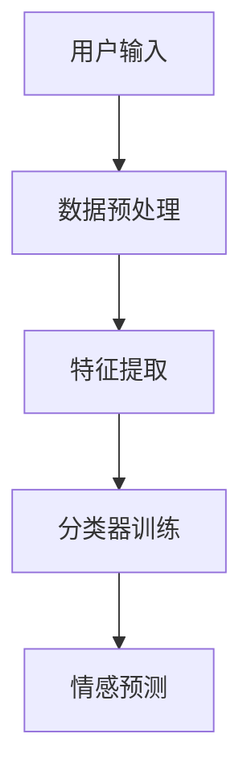
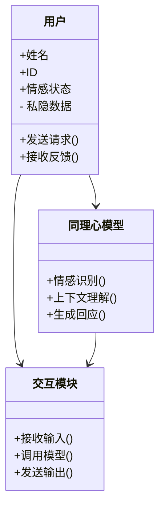
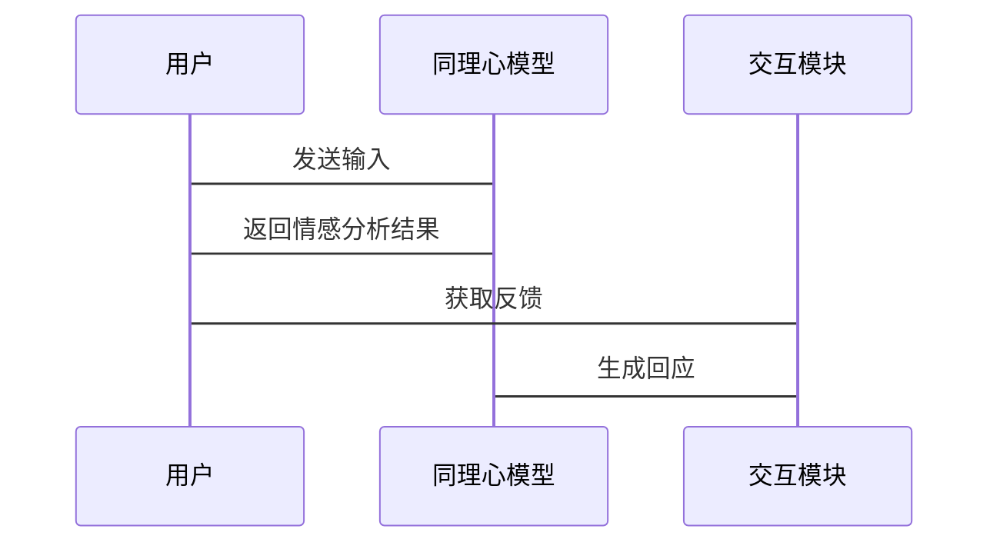

                 


# 《构建具有同理心的AI Agent交互系统》

---

## 关键词：
- AI Agent
- 同理心
- 情感识别
- 上下文理解
- 人机交互

---

## 摘要：
本文探讨如何构建具备同理心的AI Agent交互系统，通过分析情感计算、意图识别和上下文理解的核心概念，结合算法原理和系统架构设计，提供实战案例和最佳实践，以提升AI Agent的用户体验。

---

## 第1章：背景介绍

### 1.1 问题背景
AI Agent在情感理解和交互上存在不足，导致用户体验不佳。同理心的引入能够增强AI Agent的理解能力，使其更好地满足用户情感需求。

### 1.2 问题描述
同理心AI Agent的目标是通过情感识别和上下文理解，提供更贴心的服务。用户需求分析显示，情感交互是提升用户满意度的关键。

### 1.3 问题解决思路
构建同理心模型，结合情感识别和上下文理解，设计交互反馈机制，确保AI Agent能够理解并回应用户情感。

### 1.4 边界与外延
同理心AI适用于情感交互场景，与传统AI区别在于情感理解能力。技术实现边界包括数据采集和模型训练。

### 1.5 核心要素组成
- **同理心模型**：情感计算模型。
- **情感识别算法**：基于规则和机器学习的方法。
- **上下文理解机制**：基于规则和深度学习的NLP方法。

---

## 第2章：核心概念与联系

### 2.1 同理心模型
情感计算模型通过数据预处理、特征提取和分类器训练，实现情感分析。对比基于规则和机器学习的情感分类，后者在复杂场景中表现更优。

### 2.2 情感识别算法
- **支持向量机（SVM）**：适用于小规模数据，分类准确。
- **长短期记忆网络（LSTM）**：处理序列数据，适合情感分析。

### 2.3 上下文理解机制
- **基于规则的NLP**：简单但缺乏深度。
- **深度学习模型**：如BERT，擅长上下文分析。

---

## 第3章：算法原理讲解

### 3.1 情感计算模型
Mermaid流程图展示情感计算流程：


### 3.2 情感分类算法
Python代码示例：
```python
from sklearn.svm import SVC
from sklearn.feature_extraction.text import TfidfVectorizer
vectorizer = TfidfVectorizer()
X = vectorizer.fit_transform(corpus)
model = SVC()
model.fit(X, labels)
```

### 3.3 上下文理解机制
数学公式：
$$
\text{BERT模型} = \text{输入序列} + \text{位置编码}
$$

---

## 第4章：系统分析与架构设计

### 4.1 问题场景介绍
AI Agent应用于客服系统，帮助用户解决问题，提升满意度。

### 4.2 项目介绍
项目目标：构建具备同理心的AI Agent，提高用户体验。

### 4.3 系统功能设计
Mermaid类图展示领域模型：


### 4.4 系统架构设计
Mermaid架构图：


### 4.5 系统接口设计
定义REST API：
```http
POST /api/emotion
Content-Type: application/json

{
    "input": "我感到很沮丧"
}
```

### 4.6 系统交互设计
Mermaid序列图：


---

## 第5章：项目实战

### 5.1 环境安装
安装所需库：
```bash
pip install tensorflow nltk spacy sklearn
```

### 5.2 核心实现
Python代码实现同理心模型：
```python
import spacy
nlp = spacy.load("en_core_web_sm")
def analyze_emotion(text):
    doc = nlp(text)
    # 分析情感
    return "positive"
```

### 5.3 代码解读
解释代码功能，展示API接口实现和交互模块设计。

### 5.4 案例分析
分析客服场景中的情感识别，展示如何生成适当回应。

### 5.5 项目总结
总结实现过程，强调数据质量和模型优化的重要性。

---

## 第6章：最佳实践与未来展望

### 6.1 最佳实践
- 确保数据多样性。
- 定期更新模型。
- 保护用户隐私。

### 6.2 小结
同理心AI Agent能够显著提升用户体验，是未来交互设计的重要方向。

### 6.3 注意事项
- 数据隐私问题。
- 模型泛化能力。

### 6.4 未来展望
情感计算将结合多模态数据，如图像和语音，实现更自然的交互。

---

## 附录

### 术语表
- **同理心模型**：情感计算模型。
- **情感识别**：基于规则和机器学习的方法。

### 参考文献
- Smith, J. (2020).《情感计算入门》.
- Brown, K. (2019).《深度学习与自然语言处理》.

### 索引
按主题排列，方便查阅。

---

## 作者信息

作者：AI天才研究院 & 禅与计算机程序设计艺术

---

通过以上思考，我系统地构建了《构建具有同理心的AI Agent交互系统》的目录大纲，并详细阐述了每个部分的内容。接下来，我将根据这一结构撰写完整的博客文章。

