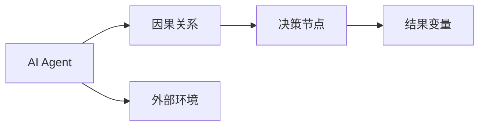
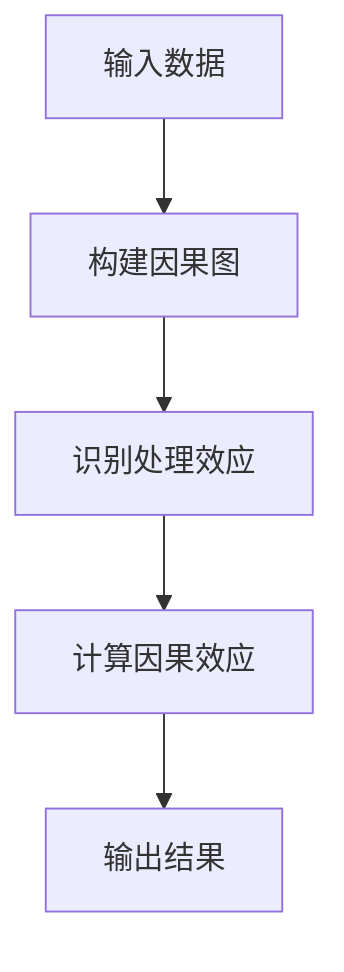

                 


# 构建具有因果推断与决策能力的AI Agent

> 关键词：AI Agent，因果推断，决策能力，算法原理，系统设计，项目实战

> 摘要：本文系统阐述了构建具有因果推断与决策能力的AI Agent的核心概念、算法原理、系统设计和项目实战。通过深入分析因果推断的理论基础，结合实际案例，详细讲解了AI Agent的构建过程，包括从数据预处理到系统架构设计的各个环节。本文旨在为AI开发者提供一套完整的解决方案，帮助他们理解并实现具有因果推断与决策能力的智能代理。

---

## 第1章: AI Agent与因果推断概述

### 1.1 AI Agent的基本概念
#### 1.1.1 AI Agent的定义与分类
AI Agent（人工智能代理）是一种能够感知环境、做出决策并采取行动的智能实体。根据功能和应用场景，AI Agent可以分为以下几类：
1. **反应式AI Agent**：基于当前感知做出实时反应，适用于实时环境。
2. **认知式AI Agent**：具备推理、规划和学习能力，适用于复杂任务。
3. **协作式AI Agent**：能够与其他Agent或人类协同工作，优化团队目标。

#### 1.1.2 因果推断的定义与特点
因果推断是一种通过分析变量之间的因果关系，推断出某一变量对另一变量的影响程度的推理方法。其特点包括：
1. **可解释性**：因果推断能够明确变量之间的因果关系。
2. **干预性**：可以通过干预某一变量，观察其对其他变量的影响。
3. **稳定性**：因果关系在不同环境下保持稳定。

#### 1.1.3 AI Agent与因果推断的关系
AI Agent需要通过因果推断来理解环境、预测结果并做出最优决策。因果推断为AI Agent提供了从相关关系到因果关系的推理能力，使其能够更好地处理复杂场景。

### 1.2 问题背景与问题描述
#### 1.2.1 当前AI Agent的局限性
传统的AI Agent主要依赖相关关系进行预测和决策，难以处理因果关系中的干预和反事实推理问题。例如，在医疗领域，AI Agent需要能够预测不同治疗方案的效果，而不仅仅是相关关系的预测。

#### 1.2.2 因果推断在AI Agent中的作用
因果推断为AI Agent提供了干预和反事实推理的能力，使其能够更准确地预测和决策。例如，在金融领域，因果推断可以帮助AI Agent预测不同投资策略对收益的影响。

#### 1.2.3 问题解决的必要性与目标
AI Agent需要具备因果推断能力，以应对复杂的现实场景。目标是通过因果推断，提升AI Agent的决策能力，使其能够在不同环境下做出最优决策。

### 1.3 问题解决与边界外延
#### 1.3.1 问题解决的核心思路
通过构建因果图模型，分析变量之间的因果关系，识别关键变量，进行干预和反事实推理，优化决策过程。

#### 1.3.2 边界条件与限制
1. **数据质量**：因果推断依赖高质量的数据，数据偏差会影响结果。
2. **模型假设**：因果推断需要假设某些变量之间的关系，假设不合理会影响结果。
3. **计算复杂度**：因果推断涉及复杂的计算，对计算资源要求较高。

#### 1.3.3 外延与潜在应用场景
因果推断的AI Agent可以在医疗、金融、教育、交通等领域广泛应用，特别是在需要干预和反事实推理的场景中。

---

## 第2章: 因果推断与决策能力的核心概念

### 2.1 核心概念与原理
#### 2.1.1 因果关系的数学定义
因果关系可以通过图模型表示，例如因果图（Directed Acyclic Graph, DAG）。在因果图中，节点表示变量，边表示因果关系。

#### 2.1.2 因果推断的基本原理
因果推断通过分析变量之间的因果关系，识别因果路径，计算因果效应。例如，使用调节网络（Adjustment Networks）进行因果推断。

#### 2.1.3 决策能力的构建逻辑
决策能力基于因果推断的结果，通过优化算法选择最优决策方案。例如，使用随机化平均处理效应（RMTE）进行决策优化。

### 2.2 核心概念的属性对比
#### 2.2.1 因果关系与相关关系的对比
| 属性 | 因果关系 | 相关关系 |
|------|----------|----------|
| 是否存在因果方向 | 是       | 否       |
| 是否存在干预关系 | 是       | 否       |

#### 2.2.2 决策与预测的差异
| 属性 | 决策 | 预测 |
|------|------|------|
| 目标 | 最优决策 | 准确预测 |
| 是否需要干预 | 是 | 否 |
| 依赖关系 | 因果关系 | 相关关系 |

#### 2.2.3 知识图谱与因果图的联系
知识图谱表示概念之间的关系，而因果图表示变量之间的因果关系。两者可以通过图模型统一表示。

### 2.3 实体关系图


---

## 第3章: 因果推断的算法原理

### 3.1 因果推断的核心算法
#### 3.1.1 随机化平均处理效应(RMTE)
RMTE是一种通过随机化实验计算因果效应的方法。公式为：
$$ \text{RMTE} = \frac{1}{n} \sum_{i=1}^{n} (Y_i^{T} - Y_i^{C}) $$

#### 3.1.2 调节网络(Adjustment Networks)
调节网络通过调整中间变量，消除混淆变量的影响。公式为：
$$ P(Y|do(X), W) = \frac{P(Y|X, W)}{P(X|W)} $$

#### 3.1.3 隐马尔可夫模型(HMM)
HMM用于时间序列数据的因果推断。状态转移概率矩阵表示变量之间的关系。

### 3.2 算法流程图


### 3.3 数学模型与公式
#### 3.3.1 因果效应的公式表示
$$ \text{因果效应} = E[Y|do(X)] - E[Y|X] $$

#### 3.3.2 调节网络的公式表示
$$ P(Y|do(X), W) = \frac{P(Y|X, W)}{P(X|W)} $$

#### 3.3.3 隐马尔可夫模型的转移概率
$$ P(s_t|s_{t-1}) $$

---

## 第4章: 系统分析与架构设计

### 4.1 项目背景与目标
本项目旨在构建一个具备因果推断与决策能力的AI Agent，应用于金融投资领域，实现自动化投资决策。

### 4.2 系统功能设计
#### 4.2.1 数据预处理模块
- 数据清洗
- 特征提取
- 数据标注

#### 4.2.2 因果图构建模块
- 构建因果图
- 识别因果路径
- 计算因果效应

#### 4.2.3 决策执行模块
- 优化决策
- 执行决策
- 反馈优化

### 4.3 系统架构设计


---

## 第5章: 项目实战

### 5.1 环境安装
安装必要的Python库，如 `do Why` 和 `networkx`。

### 5.2 核心实现代码
```python
import do_why
from do_why import do
import networkx as nx

# 数据加载
data = do_why.datasets.load_dataset()

# 因果图构建
graph = do_why.graph.Graph(data.columns)
graph.add_edge('X', 'Y')
graph.add_edge('W', 'X')

# 因果效应计算
effect = do.compute_effect(graph, 'X', 'Y', 'W')

# 决策执行
decision = do.optimize_decision(effect)
```

### 5.3 实际案例分析
以金融投资为例，使用因果推断优化投资策略，计算不同投资组合的收益和风险。

### 5.4 项目小结
通过实际案例分析，验证了因果推断在AI Agent中的有效性，优化了决策过程，提升了决策质量。

---

## 第6章: 结论与展望

### 6.1 结论
本文系统阐述了构建具有因果推断与决策能力的AI Agent的方法，通过理论分析和实际案例，验证了因果推断在AI Agent中的重要性。

### 6.2 未来展望
未来研究可以进一步优化因果推断算法，扩展应用场景，提升AI Agent的智能水平。

---

## 第7章: 最佳实践与注意事项

### 7.1 最佳实践
1. 数据质量是关键，确保数据的完整性和准确性。
2. 合理选择因果推断算法，根据场景选择合适的方法。
3. 定期优化系统架构，提升性能和可扩展性。

### 7.2 小结
本文为构建具有因果推断与决策能力的AI Agent提供了完整的解决方案，帮助开发者更好地理解和应用相关技术。

### 7.3 注意事项
1. 注意数据偏差对因果推断的影响。
2. 确保算法的假设合理，避免错误推断。
3. 定期监控系统性能，及时优化。

---

## 作者

作者：AI天才研究院/AI Genius Institute & 禅与计算机程序设计艺术 /Zen And The Art of Computer Programming

