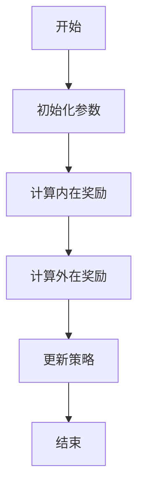
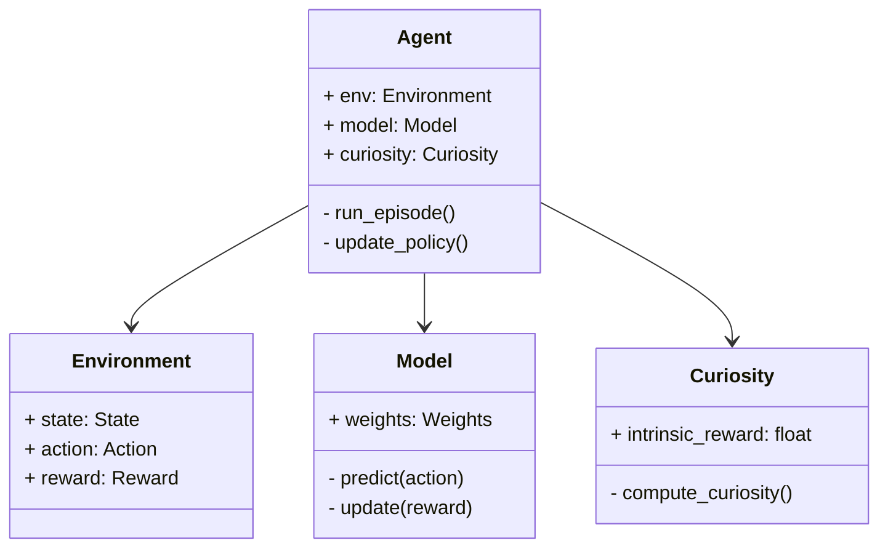

                 


# 《构建具有好奇心的AI Agent：探索与学习》

## 关键词：
- AI Agent
- 好奇心驱动
- 探索与学习
- 强化学习
- 系统架构设计
- 项目实战

## 摘要：
本书旨在探讨如何构建具有好奇心的AI Agent，通过结合强化学习、系统架构设计和实际项目案例，深入分析好奇心驱动的探索与学习机制。书中不仅介绍了AI Agent的核心概念，还详细讲解了算法原理、系统设计和项目实现，为读者提供了从理论到实践的完整指南。

---

# 第一部分：引言

# 第1章：AI Agent与好奇心概述

## 1.1 AI Agent的基本概念
### 1.1.1 AI Agent的定义
AI Agent是一种能够感知环境、做出决策并采取行动的智能实体，旨在通过自主学习和适应来完成特定任务。

### 1.1.2 AI Agent的核心特征
- **自主性**：能够在没有外部干预的情况下运行。
- **反应性**：能够实时感知环境并做出反应。
- **学习能力**：能够通过经验改进性能。

### 1.1.3 好奇心在AI Agent中的作用
好奇心是驱动AI Agent探索未知领域、学习新知识的核心动力。

## 1.2 好奇心驱动的AI Agent背景
### 1.2.1 当前AI Agent的发展现状
AI Agent在各个领域（如自动驾驶、机器人、推荐系统）得到了广泛应用，但仍面临探索与学习的挑战。

### 1.2.2 好奇心驱动的探索与学习的必要性
通过好奇心驱动的探索，AI Agent可以主动发现新知识，提升适应性和智能性。

### 1.2.3 好奇心驱动的AI Agent的应用场景
- 教育领域：自适应学习系统
- 机器人领域：智能交互与服务
- 游戏领域：智能NPC设计

## 1.3 本书的目标与结构
### 1.3.1 本书的核心目标
通过理论与实践结合，帮助读者理解并掌握如何构建具有好奇心的AI Agent。

### 1.3.2 本书的章节安排
- 第一部分：引言与核心概念
- 第二部分：算法原理
- 第三部分：系统架构设计
- 第四部分：项目实战
- 第五部分：总结与展望

### 1.3.3 本书的阅读方法
建议读者按章节顺序阅读，结合理论与代码实践，逐步掌握核心内容。

---

# 第二部分：算法原理

# 第2章：好奇心驱动的AI Agent模型

## 2.1 好奇心驱动的强化学习模型
### 2.1.1 强化学习的基本原理
通过奖励机制，AI Agent学习如何在环境中采取最优行动。

### 2.1.2 好奇心驱动的强化学习模型
结合好奇心驱动的探索机制，AI Agent能够主动探索未知领域，提高学习效率。

### 2.1.3 好奇心驱动的奖励机制
设计奖励函数，激励AI Agent进行有益的探索与学习。

## 2.2 好奇心驱动的数学模型与公式
### 2.2.1 探索与学习的数学模型
$$ R = r_{\text{intrinsic}} + r_{\text{extrinsic}} $$
其中，$r_{\text{intrinsic}}$ 表示内在奖励，$r_{\text{extrinsic}}$ 表示外在奖励。

### 2.2.2 好奇心驱动的算法流程图


## 2.3 好奇心驱动的Python代码实现
```python
class CuriosityDrivenAgent:
    def __init__(self, env):
        self.env = env
        self.model = self.build_model()
        
    def build_model(self):
        # 构建神经网络模型
        pass
    
    def compute_intrinsic_reward(self, state):
        # 计算内在奖励
        pass
    
    def compute_extrinsic_reward(self, action, reward):
        # 计算外在奖励
        pass
    
    def update_policy(self, reward):
        # 更新策略
        pass
    
    def run_episode(self):
        # 运行一个 episod
        pass
```

---

# 第三部分：系统架构设计

# 第3章：系统架构与功能设计

## 3.1 系统架构设计概述
### 3.1.1 系统架构的目标
设计一个高效、可扩展的系统架构，支持好奇心驱动的探索与学习。

### 3.1.2 系统架构的核心模块
- 感知模块：接收环境输入
- 决策模块：基于好奇心驱动进行决策
- 学习模块：更新模型参数
- 管理模块：协调各模块运行

### 3.1.3 系统架构的实现方式
使用模块化设计，通过接口进行模块间通信。

## 3.2 系统功能设计
### 3.2.1 系统功能模块划分
- 状态感知模块
- 决策控制模块
- 学习优化模块

### 3.2.2 系统功能的类图设计


---

# 第四部分：项目实战

# 第4章：项目实战与案例分析

## 4.1 项目实战环境安装
### 4.1.1 环境需求
- Python 3.8+
- TensorFlow 2.0+
- Gym库

## 4.2 项目核心代码实现
```python
import gym
import numpy as np

class CuriosityDrivenAgent:
    def __init__(self, env_name):
        self.env = gym.make(env_name)
        self.observation_space = self.env.observation_space.shape[0]
        self.action_space = self.env.action_space.n
        
    def build_model(self):
        # 简单的神经网络模型
        pass
    
    def run_episode(self):
        state = self.env.reset()
        total_reward = 0
        while True:
            action = self.predict(state)
            state, reward, done, info = self.env.step(action)
            total_reward += reward
            self.update_policy(reward)
            if done:
                break
        return total_reward
    
    def predict(self, state):
        # 预测动作
        return np.random.randint(0, self.action_space)
    
    def update_policy(self, reward):
        # 更新策略
        pass
```

## 4.3 项目实战案例分析
### 4.3.1 简单迷宫导航任务
通过好奇心驱动的AI Agent在迷宫中导航，展示其探索与学习能力。

### 4.3.2 实际应用案例
结合实际应用场景，如教育机器人，展示AI Agent的好奇心驱动能力。

---

# 第五部分：总结与展望

# 第5章：总结与未来展望

## 5.1 本书的核心内容回顾
- AI Agent的基本概念与好奇心驱动的探索与学习机制
- 好奇心驱动的强化学习算法
- 系统架构设计与项目实战

## 5.2 未来展望
- 更复杂的环境与任务挑战
- 更高效的好奇心驱动算法研究
- 多领域应用的扩展

## 5.3 最佳实践与注意事项
- 理论与实践相结合
- 系统设计的模块化与可扩展性
- 持续优化与改进

---

# 作者：AI天才研究院 & 禅与计算机程序设计艺术

