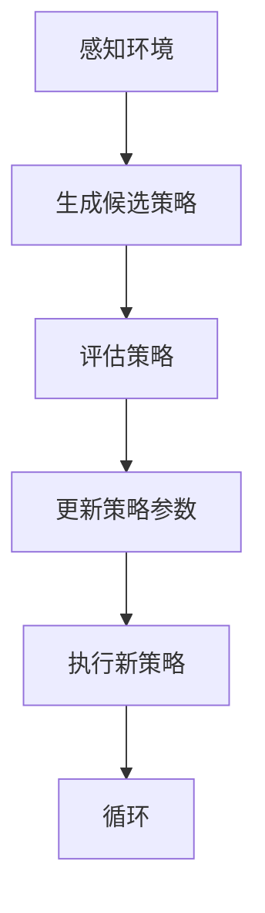
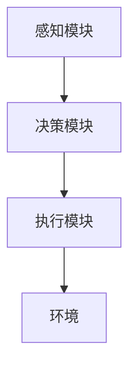

                 


# 构建具有自我进化能力的AI Agent

## 关键词：AI Agent，自我进化，强化学习，自适应推理，系统架构，项目实战

## 摘要：  
本文将详细探讨如何构建具有自我进化能力的AI Agent。首先，我们介绍AI Agent的基本概念和其自我进化能力的重要性。接着，从核心概念与理论、算法原理、系统架构设计、项目实战等方面进行深入分析。通过实际案例和数学模型的讲解，展示如何实现一个能够自我进化的AI Agent，并探讨其在未来的发展潜力。

---

# 第一部分：构建具有自我进化能力的AI Agent基础

## 第1章：AI Agent的背景与概念

### 1.1 AI Agent的基本概念

#### 1.1.1 什么是AI Agent  
AI Agent（人工智能代理）是指在计算机系统中，能够感知环境并采取行动以实现特定目标的智能实体。它可以是一个软件程序，也可以是一个机器人，通过与环境交互，自主地解决问题、完成任务或提供服务。

#### 1.1.2 AI Agent的分类与特点  
AI Agent可以根据其智能水平和应用场景分为以下几类：  
1. **反应式AI Agent**：根据当前感知做出反应，不依赖历史信息，适用于实时任务。  
2. **认知式AI Agent**：具备推理、规划和学习能力，能够处理复杂问题。  
3. **自主式AI Agent**：能够自主决策，适应环境变化，具备自我进化能力。  

#### 1.1.3 自我进化能力的定义  
自我进化能力是指AI Agent在运行过程中，能够根据环境反馈和经验不断优化自身算法、改进决策策略的能力。这种能力使AI Agent能够适应动态变化的环境，持续提升性能。

### 1.2 AI Agent的发展背景

#### 1.2.1 人工智能的演进历程  
人工智能从早期的专家系统到现在的深度学习和强化学习，经历了多次技术革新。近年来，随着计算能力的提升和大数据的普及，AI Agent逐渐具备了更强的自主性和适应性。

#### 1.2.2 当前AI Agent的应用场景  
AI Agent广泛应用于自动驾驶、智能助手、机器人控制、游戏AI等领域。特别是在自动驾驶中，AI Agent需要实时感知环境并做出决策，具备高度的自我进化能力。

#### 1.2.3 自我进化能力的重要性  
在动态和不确定的环境中，传统的静态算法难以应对复杂任务。具备自我进化能力的AI Agent能够根据环境反馈不断优化自身，提高任务成功率。

---

## 第2章：自我进化能力的机制

### 2.1 自适应学习

#### 2.1.1 自适应学习的原理  
自适应学习是一种动态调整学习策略的方法，能够根据环境反馈优化模型参数。与传统机器学习不同，自适应学习强调实时更新和适应性。

#### 2.1.2 自适应学习与传统机器学习的区别  
| 属性             | 自适应学习                     | 传统机器学习                 |
|------------------|-------------------------------|-----------------------------|
| 数据处理方式     | 动态更新，实时调整             | 批次处理，固定模型             |
| 环境适应性       | 强，能够适应动态变化           | 弱，适用于静态数据             |
| 应用场景         | 实时决策、动态优化             | 分类、回归等静态任务           |

### 2.2 自监督学习

#### 2.2.1 自监督学习的定义  
自监督学习是一种通过利用未标记数据中的内在结构来学习表示的方法。AI Agent可以通过自监督学习不断优化其对环境的理解能力。

#### 2.2.2 自监督学习在自我进化中的作用  
自监督学习能够帮助AI Agent在无监督环境中发现规律，提升其自主学习和适应能力。

### 2.3 自适应推理

#### 2.3.1 自适应推理的定义  
自适应推理是指AI Agent能够根据环境变化动态调整推理策略，以应对不确定性。

#### 2.3.2 自适应推理与传统推理的对比  
| 属性             | 自适应推理                     | 传统推理                     |
|------------------|-------------------------------|-----------------------------|
| 环境适应性       | 强，能够应对动态变化           | 弱，适用于静态环境             |
| 决策灵活性       | 高，能够快速调整策略           | 低，策略固定                   |
| 应用场景         | 动态环境、实时决策             | 静态环境、规则明确的任务       |

### 2.4 自我进化机制的数学模型

#### 2.4.1 自我进化机制的公式表示  
自我进化算法可以通过策略梯度（Policy Gradient）来优化策略。策略函数为：  
$$ \theta_{t+1} = \theta_t + \alpha \nabla_{\theta} J(\theta_t) $$  
其中，$\alpha$是学习率，$J(\theta_t)$是目标函数。

#### 2.4.2 自我进化机制的流程图  


---

## 第3章：基于强化学习的自我进化算法

### 3.1 强化学习的基本原理

#### 3.1.1 强化学习的定义  
强化学习是一种通过试错机制来优化决策策略的算法。智能体通过与环境交互，获得奖励或惩罚，逐步学习最优策略。

#### 3.1.2 强化学习的核心要素  
1. **状态（State）**：环境中的当前情况。  
2. **动作（Action）**：智能体采取的行为。  
3. **奖励（Reward）**：智能体行为的结果反馈。  

### 3.2 基于强化学习的自我进化算法

#### 3.2.1 算法流程  
1. 智能体感知当前状态。  
2. 根据当前策略生成候选动作。  
3. 执行动作并获得奖励。  
4. 根据奖励更新策略参数。  

#### 3.2.2 算法的数学模型  
Q-learning算法的目标函数为：  
$$ Q(s, a) = Q(s, a) + \alpha [r + \gamma Q(s', a') - Q(s, a)] $$  
其中，$\alpha$是学习率，$\gamma$是折扣因子。

### 3.3 强化学习的Python实现

#### 3.3.1 环境搭建  
安装必要的库：  
```bash
pip install gym matplotlib numpy
```

#### 3.3.2 核心代码实现  
```python
import gym
import numpy as np

env = gym.make('CartPole-v0')
env.seed(1)
np.random.seed(1)

# 初始化参数
theta = np.random.rand(4, 1)
alpha = 0.1

# 策略函数
def policy(x):
    return np.tanh(np.dot(theta.T, x))

# 算法循环
for episode in range(1000):
    state = env.reset()
    total_reward = 0
    for step in range(100):
        action = np.argmax(policy(state))
        state, reward, done, _ = env.step(action)
        total_reward += reward
        if done:
            break
    print(f"Episode {episode}: Reward = {total_reward}")
```

---

## 第4章：系统架构与功能设计

### 4.1 系统模块划分

#### 4.1.1 感知模块  
负责接收环境输入，提取特征。  

#### 4.1.2 决策模块  
基于感知结果，生成候选策略并进行优化。  

#### 4.1.3 执行模块  
根据决策结果执行动作，返回反馈。  

### 4.2 系统功能设计

#### 4.2.1 感知模块设计  
使用深度神经网络提取环境特征。  

#### 4.2.2 决策模块设计  
采用强化学习算法优化策略。  

#### 4.2.3 执行模块设计  
根据优化后的策略执行动作。  

### 4.3 系统架构设计

#### 4.3.1 系统架构图  


---

## 第五部分：项目实战

## 第5章：项目实战与案例分析

### 5.1 环境搭建

#### 5.1.1 安装依赖  
```bash
pip install gym matplotlib numpy
```

### 5.2 核心代码实现

#### 5.2.1 策略函数  
```python
def policy(x):
    return np.tanh(np.dot(theta.T, x))
```

#### 5.2.2 算法循环  
```python
for episode in range(1000):
    state = env.reset()
    total_reward = 0
    for step in range(100):
        action = np.argmax(policy(state))
        state, reward, done, _ = env.step(action)
        total_reward += reward
        if done:
            break
    print(f"Episode {episode}: Reward = {total_reward}")
```

### 5.3 案例分析

#### 5.3.1 案例：CartPole-v0  
通过上述代码，AI Agent能够在CartPole环境中逐步掌握平衡技巧，最终获得高奖励。

### 5.4 项目总结

#### 5.4.1 成功经验  
通过强化学习算法实现了自我进化能力。  

#### 5.4.2 经验教训  
模型参数调优和环境选择对最终效果影响较大。  

---

## 第六部分：扩展内容

## 第6章：未来趋势与伦理问题

### 6.1 伦理与安全

#### 6.1.1 数据隐私  
AI Agent可能收集大量用户数据，需注意数据隐私保护。  

#### 6.1.2 责任归属  
当AI Agent出现问题时，需明确责任归属。  

### 6.2 未来趋势

#### 6.2.1 多智能体协作  
未来的AI Agent将具备更强的协作能力，提升整体智能水平。  

#### 6.2.2 边缘计算结合  
AI Agent将与边缘计算结合，实现更高效的实时处理。  

---

## 结语

构建具有自我进化能力的AI Agent是一项具有挑战性的任务，但也充满潜力。通过不断优化算法和系统架构，我们可以让AI Agent在更多领域发挥重要作用。希望本文能够为读者提供有价值的参考和启发。

---

## 作者

作者：AI天才研究院/AI Genius Institute & 禅与计算机程序设计艺术 /Zen And The Art of Computer Programming

