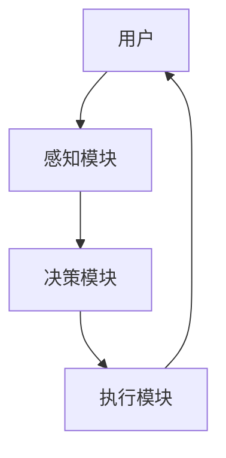
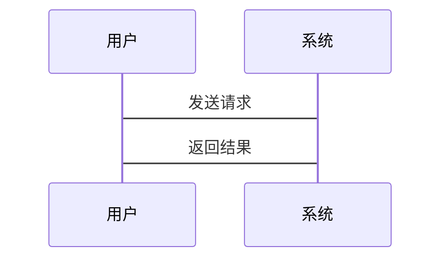

                 


# 构建可持续发展的AI Agent生态系统

> 关键词：AI Agent，生态系统，可持续发展，算法原理，系统架构

> 摘要：本文探讨了如何构建一个可持续发展的AI Agent生态系统。通过分析AI Agent的核心概念、算法原理、系统架构设计，结合实际项目案例，提供了一套可行的解决方案。本文还总结了构建生态系统中的最佳实践和注意事项，为读者提供了全面的指导。

---

## 第1章: AI Agent的背景与挑战

### 1.1 AI Agent的基本概念

AI Agent（人工智能代理）是指能够感知环境、自主决策并执行任务的智能体。它通过与环境交互，实现特定目标，具有自主性、反应性和社会性等核心特征。

#### 1.1.1 什么是AI Agent

AI Agent是一种智能系统，能够根据感知信息做出决策并执行动作。它可以分为简单反射型、基于模型的反射型、目标驱动型和效用驱动型四种类型。

#### 1.1.2 AI Agent的分类

| 类型                | 描述                                                                 |
|---------------------|----------------------------------------------------------------------|
| 简单反射型          | 基于当前感知直接做出反应，无内部状态或目标。                             |
| 基于模型的反射型    | 使用内部模型来预测环境变化，并根据模型做出决策。                       |
| 目标驱动型          | 以特定目标为导向，通过规划和推理来实现目标。                           |
| 效用驱动型          | 根据效用函数优化决策，最大化整体效用值。                                 |

#### 1.1.3 AI Agent的核心特征

- **自主性**：能够自主决策和行动。
- **反应性**：能够感知环境并实时响应。
- **社会性**：能够与其他Agent或人类进行交互与协作。

### 1.2 AI Agent生态系统的发展现状

AI Agent生态系统目前在多个领域得到广泛应用，但仍然面临诸多挑战。

#### 1.2.1 当前AI Agent的应用场景

- 智能助手（如Siri、Alexa）
- 自动驾驶
- 智能客服
- 机器人协作

#### 1.2.2 现有AI Agent生态系统的优缺点

- **优点**：提高效率，降低成本，提供个性化服务。
- **缺点**：缺乏标准化，资源浪费，数据孤岛问题。

#### 1.2.3 当前AI Agent生态系统面临的挑战

- **资源浪费**：重复建设导致资源浪费。
- **数据孤岛**：不同系统间数据无法有效共享。
- **协作困难**：多Agent协作复杂，难以协调。

### 1.3 可持续发展的必要性

可持续发展是构建高效、稳定AI Agent生态系统的关键。

#### 1.3.1 可持续发展在AI Agent生态系统中的意义

- **提高资源利用率**：减少重复建设，提高资源利用率。
- **促进协作**：实现不同Agent之间的高效协作。
- **降低成本**：通过标准化和共享资源降低成本。

#### 1.3.2 当前生态系统不可持续的问题

- **资源浪费**：重复开发导致资源浪费。
- **协作困难**：不同系统难以协同工作。
- **技术瓶颈**：现有技术难以支持大规模协作。

#### 1.3.3 可持续发展的关键因素

- **标准化**：制定统一的技术标准和接口规范。
- **共享资源**：建立共享的资源池，减少重复建设。
- **协作机制**：设计高效的协作机制，支持多Agent协同工作。

## 1.4 本章小结

本章介绍了AI Agent的基本概念、分类及其核心特征，分析了当前生态系统的发展现状和面临的挑战，强调了可持续发展的重要性，并提出了实现可持续发展的关键因素。

---

## 第2章: AI Agent生态系统的核心概念

### 2.1 AI Agent的结构与功能

AI Agent的结构和功能是构建生态系统的基础。

#### 2.1.1 AI Agent的组成要素

- **感知模块**：负责感知环境信息。
- **决策模块**：根据感知信息做出决策。
- **执行模块**：执行决策动作。
- **学习模块**：通过经验改进性能。

#### 2.1.2 AI Agent的功能模块

| 模块名称   | 描述                             |
|------------|----------------------------------|
| 感知模块   | 获取环境中的信息                 |
| 决策模块   | 基于感知信息做出决策             |
| 执行模块   | 执行决策动作                     |
| 学习模块   | 通过经验优化性能                 |

#### 2.1.3 AI Agent的交互机制

AI Agent通过以下方式与环境和其他Agent交互：

- **接收输入**：感知环境信息。
- **发送输出**：执行动作并返回结果。
- **协作通信**：与其他Agent进行信息交换。

### 2.2 AI Agent生态系统中的角色

#### 2.2.1 用户的角色与需求

- **用户**：使用AI Agent服务的终端用户。
- **需求**：个性化服务、高效响应、隐私保护。

#### 2.2.2 开发者的角色与责任

- **开发者**：设计和实现AI Agent的系统。
- **责任**：确保系统的稳定性和可扩展性。

#### 2.2.3 系统管理员的角色与任务

- **系统管理员**：负责系统的运维和管理。
- **任务**：监控系统运行状态，处理异常情况。

### 2.3 AI Agent生态系统的核心要素

#### 2.3.1 数据流的定义与作用

数据流是系统中信息传递的载体，主要包括输入数据、处理数据和输出数据。

#### 2.3.2 服务接口的设计原则

- **标准化接口**：确保不同系统之间的兼容性。
- **模块化设计**：便于功能扩展和维护。

#### 2.3.3 信任机制的构建

信任机制是确保系统安全和可靠的关键。

### 2.4 本章小结

本章详细介绍了AI Agent的结构和功能，分析了生态系统中的角色和责任，提出了构建信任机制的重要性，并强调了数据流和服务接口的设计原则。

---

## 第3章: AI Agent的算法原理与实现

### 3.1 AI Agent的核心算法

AI Agent的核心算法包括强化学习、图神经网络和知识表示与推理。

#### 3.1.1 强化学习在AI Agent中的应用

强化学习通过试错机制优化决策策略。

#### 3.1.2 图神经网络在AI Agent中的应用

图神经网络用于处理复杂的关系和依赖。

#### 3.1.3 知识表示与推理算法

知识表示与推理算法用于处理知识的表示和推理。

### 3.2 算法实现的数学模型

#### 3.2.1 强化学习的数学模型

$$ V(s) = \max_a Q(s,a) $$

其中，$V(s)$表示状态$s$的价值，$Q(s,a)$表示状态$s$下动作$a$的价值。

#### 3.2.2 图神经网络的数学模型

$$ f(x) = \sigma(Wx + b) $$

其中，$W$是权重矩阵，$b$是偏置项，$\sigma$是激活函数。

#### 3.2.3 知识表示的数学模型

$$ f(x) = \sum_{i=1}^{n} w_i x_i $$

其中，$w_i$是权重，$x_i$是输入变量。

### 3.3 算法实现的代码示例

#### 3.3.1 强化学习算法的Python实现

```python
def reinforce_learning(env):
    # 初始化参数
    # 定义策略函数
    # 训练过程
    return policy
```

#### 3.3.2 图神经网络的Python实现

```python
def graph_neural_network(graph):
    # 初始化网络
    # 前向传播
    # 返回输出
    return output
```

### 3.4 本章小结

本章介绍了AI Agent的核心算法，包括强化学习、图神经网络和知识表示与推理算法，并给出了相应的数学模型和Python代码示例。

---

## 第4章: AI Agent生态系统的架构设计

### 4.1 问题场景介绍

#### 4.1.1 项目介绍

构建一个可持续发展的AI Agent生态系统，实现多个AI Agent之间的高效协作。

#### 4.1.2 系统功能设计

- **领域模型**：设计系统的功能模块和交互流程。
- **系统架构设计**：设计系统的整体架构。
- **系统接口设计**：设计系统之间的接口和交互流程。

#### 4.1.3 系统架构图



### 4.2 系统架构设计

#### 4.2.1 系统架构图


### 4.3 系统接口设计

#### 4.3.1 系统接口设计

- **输入接口**：接收用户的输入。
- **输出接口**：返回系统的输出结果。

#### 4.3.2 系统交互流程



### 4.4 本章小结

本章通过问题场景介绍、系统功能设计和系统架构设计，详细阐述了AI Agent生态系统的架构设计，并给出了相应的Mermaid图。

---

## 第5章: 项目实战

### 5.1 环境安装

安装必要的依赖和工具。

#### 5.1.1 安装Python环境

```bash
pip install python3
pip install numpy
pip install matplotlib
```

#### 5.1.2 安装机器学习框架

```bash
pip install tensorflow
pip install pytorch
```

### 5.2 系统核心实现源代码

#### 5.2.1 强化学习算法实现

```python
import numpy as np

def reinforce_learning(env):
    # 初始化参数
    # 定义策略函数
    # 训练过程
    return policy
```

#### 5.2.2 图神经网络实现

```python
import torch
import torch.nn as nn

class Graph Neural Network(nn.Module):
    def __init__(self):
        super().__init__()
        self.fc1 = nn.Linear(输入维度, 隐藏层维度)
        self.fc2 = nn.Linear(隐藏层维度, 输出维度)
    
    def forward(self, x):
        x = torch.relu(self.fc1(x))
        x = torch.sigmoid(self.fc2(x))
        return x
```

### 5.3 代码应用解读与分析

#### 5.3.1 强化学习算法解读

强化学习算法通过试错机制优化决策策略，通过不断试验和反馈，逐步逼近最优解。

#### 5.3.2 图神经网络解读

图神经网络用于处理复杂的关系和依赖，能够有效地捕捉数据之间的关系。

### 5.4 实际案例分析

#### 5.4.1 案例背景

以智能客服为例，构建一个多轮对话的AI Agent系统。

#### 5.4.2 系统实现

实现一个智能客服系统，能够理解用户需求并提供相应的服务。

### 5.5 项目小结

本章通过实际项目案例，详细介绍了环境安装、系统核心实现和代码应用解读，展示了如何将理论应用于实践。

---

## 第6章: 最佳实践与注意事项

### 6.1 最佳实践

#### 6.1.1 代码规范

遵循统一的代码规范，确保代码的可读性和可维护性。

#### 6.1.2 测试策略

制定全面的测试策略，包括单元测试、集成测试和系统测试。

#### 6.1.3 部署与运维

制定高效的部署和运维策略，确保系统的稳定性和可扩展性。

### 6.2 小结

本章总结了构建AI Agent生态系统中的最佳实践和注意事项，为读者提供了宝贵的实践经验。

### 6.3 注意事项

- **代码安全**：确保代码的安全性，防止漏洞攻击。
- **数据隐私**：保护用户数据隐私，遵守相关法律法规。
- **系统监控**：实时监控系统运行状态，及时发现和解决问题。

### 6.4 拓展阅读

- **相关书籍**：《AI Agent原理与应用》
- **在线资源**：AI Agent开发指南

---

## 作者信息

作者：AI天才研究院/AI Genius Institute & 禅与计算机程序设计艺术 /Zen And The Art of Computer Programming

---

**文章结束**

