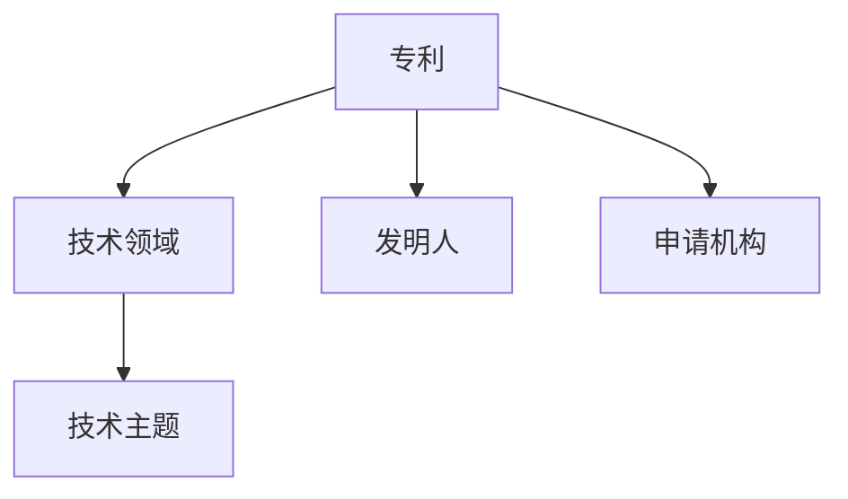
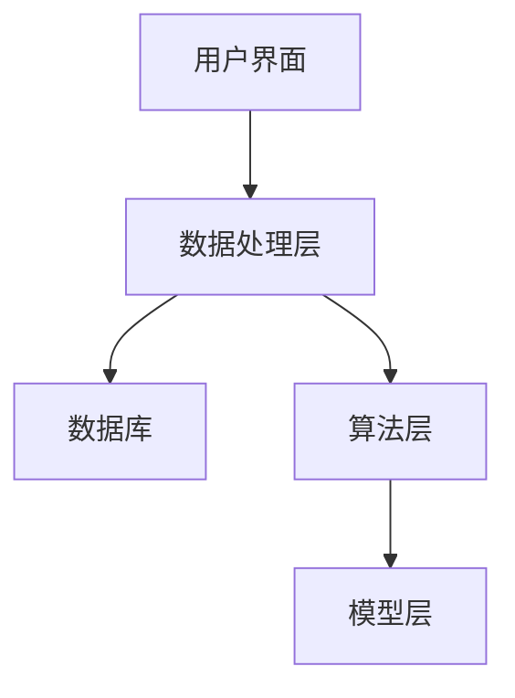
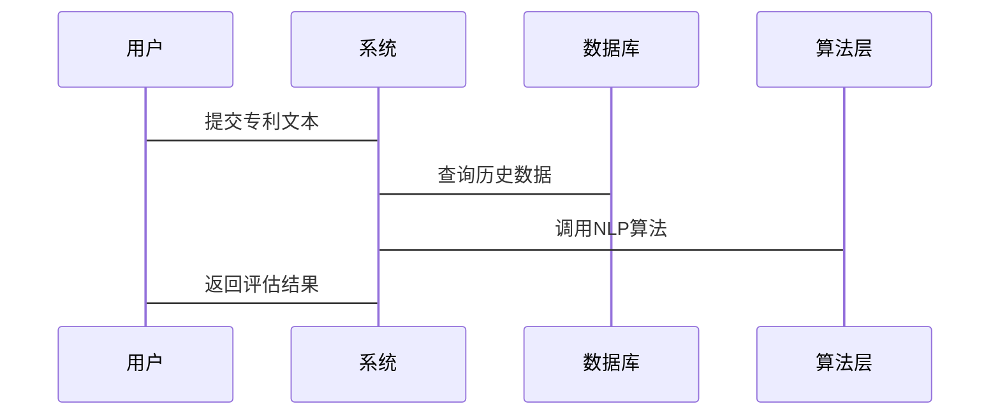

                 


# 《构建基于NLP的金融专利价值动态评估系统》

> **关键词**：自然语言处理（NLP）、金融专利、价值评估、动态评估、文本挖掘、机器学习、系统架构

> **摘要**：本文详细探讨了基于NLP技术构建金融专利价值动态评估系统的方法。通过分析专利文本中的技术信息和市场潜力，结合先进的NLP算法，提出了一种动态评估模型，为金融机构提供精准的专利价值评估服务。文章从背景、技术原理、系统架构到项目实战，全面解析了系统的构建过程。

---

# 第1章: 金融专利价值评估的背景与需求

## 1.1 问题背景

### 1.1.1 传统金融专利评估方法的局限性
传统专利评估方法主要依赖于人工分析，存在以下问题：
- 数据量大，人工分析效率低。
- 主观性较强，难以量化评估。
- 静态评估为主，缺乏动态调整。

### 1.1.2 专利价值评估的核心要素
专利价值评估的关键要素包括：
- 技术领域的重要性。
- 发明的创新程度。
- 专利的法律状态。
- 市场应用潜力。

### 1.1.3 动态评估的需求与挑战
随着技术发展，专利价值需要动态调整。动态评估的挑战包括：
- 数据实时更新的难度。
- 多因素综合评估的复杂性。
- 系统的实时性与准确性平衡。

## 1.2 基于NLP的专利分析潜力

### 1.2.1 NLP技术在金融领域的应用前景
NLP技术在金融领域的应用包括：
- 金融新闻分析。
- 风险评估。
- 专利文本挖掘。

### 1.2.2 专利文本分析的关键技术
- 实体识别。
- 关系抽取。
- 文本相似度计算。

### 1.2.3 动态评估系统的建设目标
- 提供实时动态评估。
- 实现自动化、智能化评估。
- 支持多维度分析。

## 1.3 本章小结

---

# 第2章: 基于NLP的金融专利价值评估系统核心概念

## 2.1 专利文本分析的关键技术

### 2.1.1 信息抽取技术
- 实体识别：从专利文本中提取技术领域、发明人等信息。
- 关系抽取：识别专利之间的引用关系。

### 2.1.2 情感分析与文本相似度计算
- 情感分析：评估专利文本的情感倾向。
- 文本相似度：计算专利之间的相似性。

### 2.1.3 主题建模与文本聚类
- 主题建模：识别专利文本的主题。
- 文本聚类：将相似的专利分组。

## 2.2 NLP技术在金融专利分析中的应用

### 2.2.1 专利分类与主题建模
- 使用LDA进行主题建模，将专利分类到不同技术领域。

### 2.2.2 专利引用网络分析
- 构建专利引用网络，分析技术发展的趋势。

### 2.2.3 专利技术成熟度评估
- 基于文本相似度和引用次数，评估技术成熟度。

## 2.3 系统核心概念与联系

### 2.3.1 实体关系图（ER图）


### 2.3.2 核心概念对比分析
```markdown
| 技术领域 | 技术主题 | 发明人 | 申请机构 |
|----------|----------|--------|----------|
| 专利分类的上层 | 专利分类的下层 | 创新主体 | 申请主体 |
```

## 2.4 本章小结

---

# 第3章: 专利价值评估的算法原理

## 3.1 信息抽取算法

### 3.1.1 基于规则的实体识别
- 示例规则：识别技术领域的关键词。

### 3.1.2 基于深度学习的实体识别
- 使用BERT进行实体识别，准确率高。

### 3.1.3 实体关系抽取
- 使用关系抽取模型，识别专利间的引用关系。

## 3.2 文本相似度计算

### 3.2.1 TF-IDF模型
- 通过TF-IDF计算关键词权重，实现文本表示。

### 3.2.2 余弦相似度
- 计算两个文本的向量夹角，衡量相似性。

### 3.2.3 基于深度学习的相似度计算
- 使用预训练语言模型计算文本相似度。

## 3.3 专利技术成熟度评估

### 3.3.1 基于LDA的主题建模
- 使用LDA将专利文本聚类到不同主题。

### 3.3.2 基于聚类的技术成熟度评估
- 将专利按主题聚类，评估其成熟度。

### 3.3.3 基于时间序列的动态评估
- 使用时间序列分析，动态调整评估结果。

## 3.4 本章小结

---

# 第4章: 系统架构与设计

## 4.1 系统功能模块设计

### 4.1.1 专利信息抽取模块
- 功能：从专利文本中提取实体信息。

### 4.1.2 文本分析模块
- 功能：进行主题建模和相似度计算。

### 4.1.3 价值评估模块
- 功能：综合评估专利价值。

## 4.2 系统架构设计

### 4.2.1 系统架构图


### 4.2.2 系统交互流程


## 4.3 本章小结

---

# 第5章: 项目实战

## 5.1 环境安装

### 5.1.1 安装Python环境
- 使用Anaconda安装Python 3.8及以上版本。

### 5.1.2 安装NLP库
- 使用pip安装spaCy、Gensim、BERT等库。

## 5.2 系统核心实现

### 5.2.1 实体识别代码
```python
import spacy
nlp = spacy.load("en_core_web_sm")
doc = nlp("This is a sample patent text.")
for ent in doc.ents:
    print(ent.text, ent.label_)
```

### 5.2.2 价值评估模型
```python
from sklearn.feature_extraction.text import TfidfVectorizer
from sklearn.metrics.pairwise import cosine_similarity
vectorizer = TfidfVectorizer()
tfidf_matrix = vectorizer.fit_transform(documents)
similarity_matrix = cosine_similarity(tfidf_matrix)
```

## 5.3 案例分析

### 5.3.1 数据准备
- 数据集：收集1000份金融专利文本。

### 5.3.2 模型训练
- 使用训练好的模型进行评估。

### 5.3.3 结果分析
- 输出专利价值评估结果和分析报告。

## 5.4 项目总结

---

# 第6章: 最佳实践与小结

## 6.1 小结

## 6.2 注意事项
- 数据质量影响评估结果。
- 算法选择需结合实际场景。
- 系统性能需优化。

## 6.3 拓展阅读
- 推荐阅读相关领域的最新论文和书籍。

---

# 作者：AI天才研究院 & 禅与计算机程序设计艺术

---

**本文是关于构建基于NLP的金融专利价值动态评估系统的详细指南，从背景、技术原理到系统实现，为读者提供了全面的知识和实践指导。**

