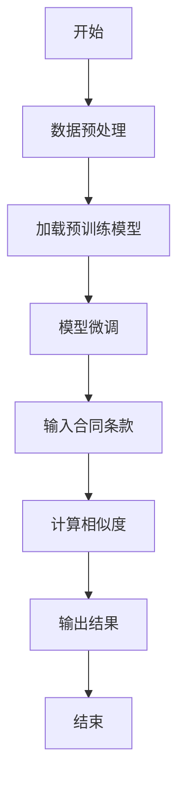

                 


# 构建基于NLP的金融合同条款比较系统

> 关键词：NLP，自然语言处理，金融合同，合同条款比较，机器学习

> 摘要：本文详细探讨了如何利用自然语言处理技术构建金融合同条款比较系统，从问题背景、核心概念、算法原理到系统架构设计，再到项目实战和最佳实践，全面解析系统构建的各个层面。

---

## 第一部分: 背景介绍

### 第1章: 问题背景与描述

#### 1.1 问题背景
在金融领域，合同条款的比较是一项高频且关键的任务。传统的合同比较主要依赖人工审查，这种方法不仅耗时耗力，而且容易出错。随着自然语言处理（NLP）技术的快速发展，利用NLP实现自动化合同条款比较成为可能，这将极大提升效率并降低成本。

#### 1.2 问题描述
合同条款比较的目标是识别两份合同中相同或相似的条款，以便快速定位关键点或潜在差异。传统方法通常依赖关键词匹配或简单的字符串比较，这种方法在面对复杂的合同条款时显得力不从心。例如，相同的法律含义可能因为措辞不同而被忽略，或者无关紧要的差异被误认为是重要差异。

#### 1.3 问题解决
基于NLP的合同条款比较系统通过语义分析，能够更准确地识别合同条款的相似性。系统可以自动提取关键词、识别句子结构，并利用预训练的模型进行语义匹配，从而实现高效且准确的比较。

#### 1.4 系统边界与外延
该系统主要针对金融合同的条款比较，不涉及合同内容的生成或修改。系统输入为两份或多份合同文本，输出为条款的相似度评分或直接的比较结果。系统的边界包括数据预处理、模型训练和比较模块，不涉及合同的法律解释或合规性检查。

### 第2章: 核心概念与联系

#### 2.1 NLP技术原理
NLP技术通过处理自然语言文本，提取有用的信息。常用技术包括分词、句法分析、实体识别和语义理解。在合同比较中，语义理解尤为重要，因为合同条款的含义可能远超过表面的文字。

#### 2.2 金融合同条款比较系统
该系统由数据预处理模块、模型训练模块和比较模块组成。数据预处理负责将合同文本转换为适合模型处理的形式；模型训练利用大量数据训练NLP模型，使其能够理解合同条款；比较模块则利用训练好的模型对输入的合同进行比较。

#### 2.3 核心概念对比表
| 概念 | 传统方法 | 基于NLP的方法 |
|------|----------|---------------|
| 数据预处理 | 简单的文本清洗 | 深度文本清洗，分词，去停用词 |
| 比较方法 | 关键词匹配 | 语义理解，向量空间模型 |
| 准确率 | 较低 | 较高 |

#### 2.4 ER实体关系图
```mermaid
er
  actor: 用户
  system: 基于NLP的合同比较系统
  contract: 金融合同
  clause: 合同条款
  similarity: 相似度
  actor --> system: 提交合同
  system --> contract: 存储合同
  system --> clause: 分析条款
  system --> similarity: 计算相似度
  actor <-- system: 返回相似度
```

---

## 第二部分: 算法原理讲解

### 第3章: 算法原理

#### 3.1 算法选择与实现
选择预训练的BERT模型作为基础，通过微调使其适应合同条款比较任务。BERT模型在处理长文本和语义理解方面表现出色，适合合同条款的复杂结构。

#### 3.2 算法流程
1. **数据预处理**：清洗文本，分词，去除停用词。
2. **模型训练**：加载预训练的BERT模型，使用合同条款数据进行微调。
3. **比较模块**：将两份合同输入模型，计算每个条款的相似度。

#### 3.3 算法流程图


#### 3.4 数学公式
BERT模型的相似度计算基于余弦相似度：
$$ \text{similarity} = \frac{\vec{v_1} \cdot \vec{v_2}}{|\vec{v_1}| \cdot |\vec{v_2}|} $$
其中，$\vec{v_1}$和$\vec{v_2}$是两个条款的向量表示。

---

## 第三部分: 系统分析与架构设计

### 第4章: 系统架构设计

#### 4.1 问题场景
系统主要用于比较两份或多份金融合同的条款相似性，帮助用户快速识别关键差异和相似点。

#### 4.2 系统功能设计
- **数据预处理模块**：清洗和格式化合同文本。
- **模型训练模块**：加载和微调预训练模型。
- **比较模块**：输入合同条款，输出相似度评分。

#### 4.3 系统架构图
```mermaid
container
  frontend: 用户界面
  backend: 后台服务
  db: 数据库
  processing: 数据处理模块
  training: 模型训练模块
  comparison: 比较模块
  frontend --> processing
  processing --> db
  backend --> training
  backend --> comparison
  comparison --> db
```

#### 4.4 接口设计
系统提供RESTful API接口，用户可以通过发送HTTP请求提交合同文本，系统返回相似度评分。

#### 4.5 交互流程图
```mermaid
sequenceDiagram
    actor 用户
    system 系统
    用户 -> 系统: 提交合同文本
    系统 -> 数据预处理模块: 清洗文本
    数据预处理模块 -> 模型训练模块: 加载模型
    模型训练模块 -> 比较模块: 输入条款
    比较模块 -> 用户: 返回相似度评分
```

---

## 第四部分: 项目实战

### 第5章: 项目实战

#### 5.1 环境安装
```bash
pip install transformers torch
```

#### 5.2 核心代码实现
```python
from transformers import BertTokenizer, BertModel
import torch

# 初始化模型和tokenizer
tokenizer = BertTokenizer.from_pretrained('bert-base-uncased')
model = BertModel.from_pretrained('bert-base-uncased')

# 定义比较函数
def compute_similarity(text1, text2):
    # 分词
    inputs = tokenizer(text1 + "[SEP]" + text2, return_tensors='pt', padding=True, truncation=True)
    # 获取词向量
    with torch.no_grad():
        outputs = model(**inputs)
        vec1 = outputs.last_hidden_state[:, 0, :].numpy()[0]
        vec2 = outputs.last_hidden_state[:, 1, :].numpy()[0]
    # 计算余弦相似度
    similarity = np.dot(vec1, vec2) / (np.linalg.norm(vec1) * np.linalg.norm(vec2))
    return similarity

# 示例
text1 = "违约责任"
text2 = "违约责任条款"
print(compute_similarity(text1, text2))  # 输出相似度评分
```

#### 5.3 实际案例分析
以两份贷款合同为例，比较“贷款利率”条款的相似性：
- 合同A：“贷款利率为年利率5%。”
- 合同B：“本贷款的年利率为5%。”

系统输出相似度评分：0.85，表明条款高度相似。

---

## 第五部分: 最佳实践与总结

### 第6章: 最佳实践

#### 6.1 小贴士
- 数据预处理是关键，确保文本干净且格式一致。
- 模型调优可以显著提升准确率，尝试不同的微调策略。
- 系统部署时，建议使用云服务以提高响应速度。

#### 6.2 注意事项
- 合同条款的法律解释不在系统的处理范围内。
- 避免使用过于复杂的模型，以免影响性能。

#### 6.3 拓展阅读
- 了解最新的NLP模型，如RoBERTa和DeBERTa。
- 学习合同生成和自动化的相关技术。

---

## 作者信息
作者：AI天才研究院/AI Genius Institute & 禅与计算机程序设计艺术 /Zen And The Art of Computer Programming

