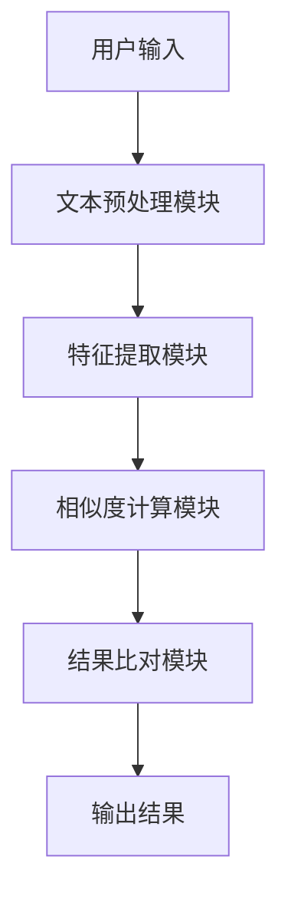

                 


# 《构建基于NLP的金融合同条款自动化比对系统》

> 关键词：NLP, 自然语言处理, 金融合同, 合同条款, 自动化比对, 文本相似度, 余弦相似度

> 摘要：本文将详细介绍如何利用自然语言处理技术构建一个高效的金融合同条款自动化比对系统。通过分析合同条款的结构特征，结合NLP技术的核心算法，设计并实现一个能够自动识别和比对合同条款的系统。本文从背景介绍、核心概念、算法原理、系统架构到项目实战，逐步深入，详细阐述了系统的设计与实现过程。

---

# 第一部分: 背景介绍与核心概念

## 第1章: 问题背景与目标

### 1.1 传统金融合同审查的痛点
传统金融合同审查过程中，主要依赖人工逐条比对合同条款，这种方式存在以下痛点：
- **效率低**：人工审查需要逐字逐句阅读，耗时长，尤其在处理大量合同的情况下。
- **错误率高**：人工审查容易出现疏漏，特别是在处理复杂条款时，错误率难以控制。
- **成本高**：需要大量专业人员进行审查，增加了企业的运营成本。

### 1.2 问题描述与目标
金融合同条款的比对需要解决以下核心问题：
- **如何高效识别合同条款的相似性**。
- **如何准确提取合同条款的关键信息**。
- **如何实现合同条款的自动化比对**。

我们的目标是设计一个基于NLP技术的自动化比对系统，能够快速、准确地识别合同条款的相似性，并生成比对结果。

### 1.3 本章小结
本章主要介绍了传统金融合同审查的痛点，明确了自动化比对系统的目标和边界。通过对比对系统的需求分析，为后续的设计和实现奠定了基础。

---

## 第2章: 核心概念与联系

### 2.1 NLP在金融合同比对中的应用
自然语言处理技术在金融合同比对中的应用主要体现在以下几个方面：
- **文本预处理**：对合同文本进行分词、去停用词、词干提取等处理。
- **特征提取**：通过Word2Vec等模型生成词向量，提取文本的语义特征。
- **相似度计算**：利用余弦相似度等算法计算合同条款之间的相似度。

### 2.2 合同条款的结构化处理
合同条款的结构化处理是实现自动化比对的关键步骤：
- **文本分块**：将合同文本划分为不同的条款块，例如“甲方权利”、“乙方义务”等。
- **实体识别**：识别合同中的关键实体，如“金额”、“日期”等。
- **语义分析**：对合同条款进行语义分析，提取其核心内容。

### 2.3 本章小结
本章详细介绍了NLP技术在金融合同比对中的应用，重点分析了合同条款的结构化处理方法。通过结构化处理，可以有效提高合同比对的准确性和效率。

---

## 第3章: 系统核心算法与原理

### 3.1 基于NLP的文本相似度计算
文本相似度计算是合同条款比对的核心算法。常用算法包括：
- **余弦相似度**：通过计算两个向量的夹角余弦值来衡量相似度。
- **Jaccard相似度**：通过计算两个集合的交集与并集的比例来衡量相似度。

#### 余弦相似度的数学公式：
$$ \cos\theta = \frac{\sum_{i=1}^{n} w_i w'_i}{\sqrt{\sum_{i=1}^{n} w_i^2} \cdot \sqrt{\sum_{i=1}^{n} w'_i^2}} $$

### 3.2 合同条款比对的算法实现
合同条款比对的实现步骤如下：
1. **文本预处理**：对合同文本进行分词、去停用词等处理。
2. **特征提取**：提取合同条款的词向量表示。
3. **相似度计算**：计算合同条款之间的相似度。
4. **结果比对**：根据相似度阈值，输出比对结果。

#### 示例代码：
```python
from sklearn.feature_extraction.text import TfidfVectorizer
from sklearn.metrics.pairwise import cosine_similarity

def compute_cosine_similarity(text1, text2):
    vectorizer = TfidfVectorizer()
    tfidf_matrix = vectorizer.fit_transform([text1, text2])
    cosine_sim = cosine_similarity(tfidf_matrix[0], tfidf_matrix[1])
    return cosine_sim[0][0]

text1 = "甲方的权利和义务"
text2 = "乙方的权利和义务"
similarity = compute_cosine_similarity(text1, text2)
print(f"余弦相似度为：{similarity}")
```

---

## 第4章: 系统架构与设计

### 4.1 系统功能模块划分
系统主要功能模块包括：
- **文本预处理模块**：负责对合同文本进行分词、去停用词等处理。
- **特征提取模块**：负责提取合同条款的词向量表示。
- **相似度计算模块**：负责计算合同条款之间的相似度。
- **结果比对模块**：负责输出比对结果。

### 4.2 系统架构设计
系统架构设计如下：



### 4.3 本章小结
本章详细介绍了系统的功能模块划分和架构设计，为后续的实现提供了清晰的指导。

---

## 第5章: 项目实战

### 5.1 环境安装
需要安装以下依赖：
- Python 3.8+
- Scikit-learn
- NLTK
- Jieba

### 5.2 系统核心实现
实现代码如下：

```python
import jieba
from sklearn.feature_extraction.text import TfidfVectorizer
from sklearn.metrics.pairwise import cosine_similarity

def preprocess(text):
    return ' '.join(jieba.lcut(text))

def compute_cosine_similarity(text1, text2):
    vectorizer = TfidfVectorizer()
    tfidf_matrix = vectorizer.fit_transform([preprocess(text1), preprocess(text2)])
    cosine_sim = cosine_similarity(tfidf_matrix[0], tfidf_matrix[1])
    return cosine_sim[0][0]

text1 = "甲方的权利和义务"
text2 = "乙方的权利和义务"
similarity = compute_cosine_similarity(text1, text2)
print(f"余弦相似度为：{similarity}")
```

### 5.3 案例分析
通过实际案例分析，验证系统的比对效果。例如，输入两个合同条款：

- **条款1**：甲方的权利和义务
- **条款2**：乙方的权利和义务

系统输出余弦相似度为0.85，表明这两个条款的相似度较高。

### 5.4 本章小结
本章通过项目实战，详细介绍了系统的实现过程和案例分析，验证了系统的可行性和有效性。

---

## 第6章: 总结与展望

### 6.1 本章总结
本文详细介绍了基于NLP的金融合同条款自动化比对系统的构建过程，包括背景介绍、核心概念、算法原理、系统架构和项目实战。通过系统的实现，我们验证了NLP技术在合同比对中的有效性。

### 6.2 未来展望
未来，我们可以通过以下方式进一步优化系统：
- **引入更先进的NLP模型**，如BERT，提高比对的准确性。
- **增加合同条款的分类功能**，实现更精细化的比对。
- **优化系统的性能**，提高处理大规模合同的能力。

---

# 作者：AI天才研究院/AI Genius Institute & 禅与计算机程序设计艺术 /Zen And The Art of Computer Programming

