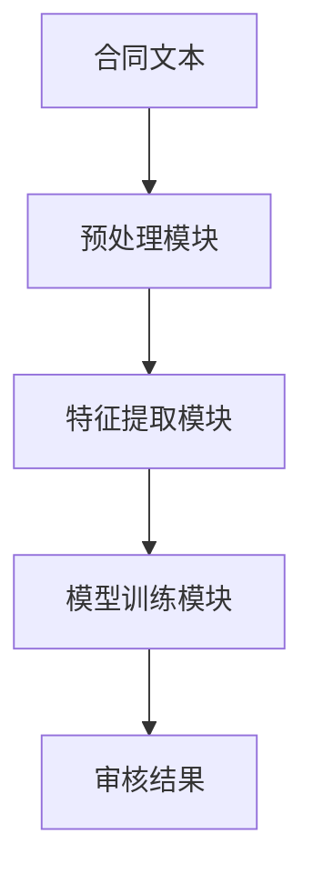
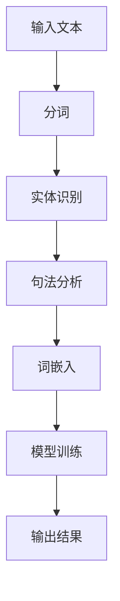
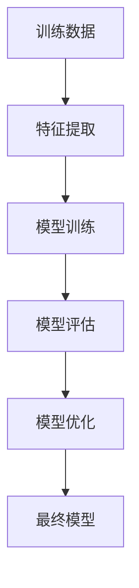
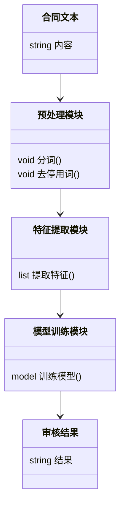
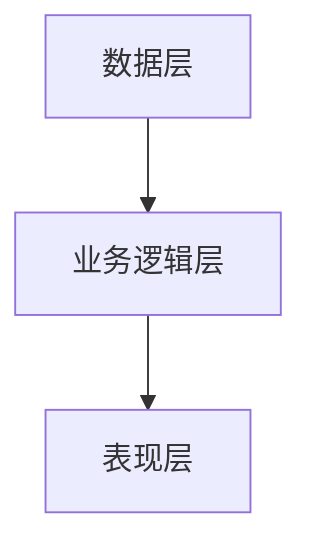
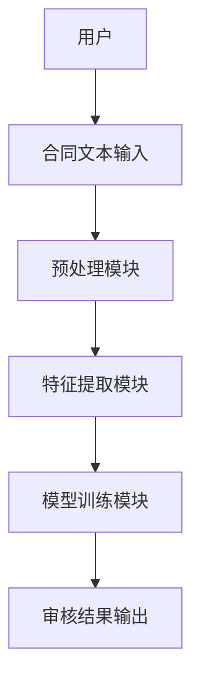

                 


# 构建基于NLP的金融合同自动化审核系统

## 关键词：自然语言处理，金融合同，机器学习，自动化审核，文本挖掘

## 摘要：本文详细介绍了如何利用自然语言处理（NLP）和机器学习技术构建一个高效的金融合同自动化审核系统。从问题背景到系统架构设计，再到算法实现和项目实战，本文全面解析了系统构建的每一个细节，为读者提供了一套完整的解决方案。

---

# 第1章: 背景介绍

## 1.1 问题背景

### 1.1.1 传统金融合同审核的痛点
金融合同审核是一项复杂且耗时的任务，通常需要法律专家逐字逐句审查合同内容，以确保其合规性和合法性。然而，这种方式存在以下问题：
- **低效性**：人工审核耗时长，尤其是在处理大量合同的情况下。
- **高错误率**：人为疏忽可能导致关键条款被遗漏，增加法律风险。
- **成本高昂**：需要大量专业人员，增加了企业的运营成本。

### 1.1.2 人工审核的低效与高错误率
人工审核不仅效率低下，而且容易出现疏漏。例如，合同中的某些关键条款可能被忽略，导致法律纠纷。此外，审核人员的疲劳也可能影响审核质量。

### 1.1.3 自动化审核的必要性
随着技术的进步，利用自然语言处理（NLP）和机器学习技术实现合同自动化审核成为可能。这不仅可以提高效率，还能降低错误率，从而节省时间和成本。

## 1.2 问题描述

### 1.2.1 金融合同审核的核心任务
金融合同审核的核心任务包括：
- 检查合同条款是否符合相关法律法规。
- 确保合同中的关键条款（如违约责任、金额、期限等）准确无误。
- 识别合同中的潜在风险点。

### 1.2.2 合同审核的关键要素与风险点
合同审核的关键要素包括：
- 合同的合法性：确保合同内容符合相关法律法规。
- 合同的完整性：确保合同包含所有必要的条款。
- 合同的可执行性：确保合同条款在实际操作中可行。

### 1.2.3 自动化审核的目标与预期效果
自动化审核的目标是：
- 快速、准确地识别合同中的关键条款和潜在风险。
- 提供标准化的审核流程，减少人为错误。
- 提高审核效率，缩短审核时间。

## 1.3 问题解决

### 1.3.1 NLP技术在合同审核中的应用
自然语言处理技术可以帮助系统理解合同文本，提取关键信息。例如，使用分词技术将合同文本分解为关键词，然后利用实体识别技术识别合同中的关键实体（如公司名称、金额等）。

### 1.3.2 机器学习与深度学习的结合
机器学习和深度学习技术可以用于训练模型，识别合同中的异常情况。例如，使用监督学习模型对合同进行分类，判断其是否符合法律要求。

### 1.3.3 系统架构的设计与实现
系统架构设计包括数据输入、文本处理、模型训练和结果输出等模块。通过合理设计系统架构，可以实现高效的合同审核流程。

## 1.4 系统的边界与外延

### 1.4.1 系统的功能边界
系统的主要功能包括：
- 文本预处理：对合同文本进行清洗和标准化。
- 关键信息提取：提取合同中的关键条款和实体。
- 模型训练：训练机器学习模型，识别合同中的异常情况。
- 结果输出：生成审核报告，指出潜在问题。

### 1.4.2 系统的适用范围与限制
系统适用于各种类型的金融合同，如贷款合同、保险合同等。然而，目前系统还无法完全替代人工审核，特别是在处理复杂法律条款时。

### 1.4.3 系统的扩展性与可维护性
系统设计时应考虑到未来的扩展需求，例如增加新的合同类型或更新法律法规时，系统应能方便地进行调整。

---

# 第2章: 核心概念与联系

## 2.1 核心概念原理

### 2.1.1 NLP的基本原理
自然语言处理（NLP）是研究如何让计算机理解、处理和生成人类语言的学科。其基本流程包括文本预处理、特征提取、模型训练和结果输出。

### 2.1.2 机器学习的核心算法
机器学习算法包括监督学习、无监督学习和强化学习等。在合同审核中，监督学习是最常用的方法，因为可以利用标注数据训练模型。

### 2.1.3 金融合同审核的关键技术
金融合同审核的关键技术包括文本抽取、信息抽取、情感分析和实体识别等。这些技术可以帮助系统准确理解合同内容。

## 2.2 核心概念对比分析

### 2.2.1 NLP与传统文本处理的对比
传统的文本处理方法主要依赖规则，而NLP则利用机器学习技术，能够更好地处理复杂的文本信息。

### 2.2.2 有监督学习与无监督学习的对比
有监督学习需要标注数据，适合合同审核这种任务明确的场景。无监督学习则适用于数据量大且无标签的场景。

### 2.2.3 不同模型的性能对比
例如，词袋模型（Bag-of-Words）和词嵌入模型（如Word2Vec）在处理文本时各有优缺点，需要根据具体场景选择合适的方法。

## 2.3 实体关系图（ER图）

### 2.3.1 系统实体关系描述
系统涉及的主要实体包括：合同文本、审核规则、模型训练数据、审核结果等。

### 2.3.2 数据流与交互关系
数据流从合同文本开始，经过预处理、特征提取、模型训练，最终生成审核结果。

### 2.3.3 关系图展示


---

# 第3章: 算法原理讲解

## 3.1 算法原理

### 3.1.1 分词算法
分词是NLP中的基本任务，常用算法包括正向最大匹配法和逆向最大匹配法。例如，中文分词可以使用jieba库。

### 3.1.2 实体识别算法
实体识别（NER）用于识别文本中的命名实体，如人名、地名、组织名等。常用模型包括CRF和LSTM。

### 3.1.3 句法分析算法
句法分析用于分析句子的结构，常用算法包括基于规则的句法分析和基于统计的句法分析。

## 3.2 机器学习模型

### 3.2.1 词嵌入模型
词嵌入模型（如Word2Vec）将词语表示为低维向量，便于后续处理。例如，Word2Vec的训练过程可以用以下公式表示：
$$\text{目标函数} = \sum_{i=1}^{n} \log P(w_i | w_{i-1})$$

### 3.2.2 深度学习模型
深度学习模型如BERT在合同审核中表现出色，能够理解上下文关系。例如，BERT的多层结构可以用以下公式表示：
$$\text{BERT} = \text{LayerNorm}( \text{Dense}( \text{LayerNorm}( \text{Dense}( \text{Embedding}(\text{input}) ) ) ) )$$

### 3.2.3 模型训练与优化
模型训练时，可以使用交叉验证和网格搜索优化超参数。例如，使用k折交叉验证评估模型性能。

## 3.3 算法流程图

### 3.3.1 NLP处理流程


### 3.3.2 机器学习流程


---

# 第4章: 系统分析与架构设计

## 4.1 系统功能设计

### 4.1.1 领域模型类图


### 4.1.2 系统架构设计
系统架构采用分层架构，包括数据层、业务逻辑层和表现层。



### 4.1.3 系统接口设计
系统提供API接口，供其他系统调用。例如，使用RESTful API进行交互。

### 4.1.4 系统交互图


---

# 第5章: 项目实战

## 5.1 环境安装

### 5.1.1 安装Python和相关库
安装Python和必要的库：
```bash
pip install numpy pandas jieba scikit-learn transformers
```

## 5.2 系统核心实现

### 5.2.1 NLP处理代码
```python
import jieba

def preprocess(text):
    words = jieba.lcut(text)
    return ' '.join(words)
```

### 5.2.2 机器学习模型代码
```python
from sklearn.feature_extraction.text import TfidfVectorizer
from sklearn.svm import SVC

vectorizer = TfidfVectorizer()
model = SVC()
```

### 5.2.3 模型训练与预测
```python
X = vectorizer.fit_transform(documents)
model.fit(X, labels)
```

## 5.3 代码应用解读与分析

### 5.3.1 NLP处理流程
预处理模块包括分词、去停用词和词干提取等步骤。

### 5.3.2 模型训练与优化
使用交叉验证选择最佳模型参数，例如：
```python
from sklearn.model_selection import GridSearchCV

param_grid = {'C': [1, 10, 100]}
grid_search = GridSearchCV(SVC(), param_grid, cv=5)
grid_search.fit(X, labels)
best_model = grid_search.best_estimator_
```

## 5.4 实际案例分析

### 5.4.1 案例描述
以一份贷款合同为例，系统提取关键条款如贷款金额、还款期限等。

### 5.4.2 案例分析
系统识别出合同中可能存在的一些问题，如还款期限不符合法律规定。

## 5.5 项目小结
通过实际案例，验证了系统的有效性和准确性，同时发现了需要进一步优化的地方，如模型的泛化能力。

---

# 第6章: 系统优化与扩展

## 6.1 系统优化

### 6.1.1 性能优化
优化算法复杂度，例如使用更高效的特征提取方法。

### 6.1.2 模型调优
调整模型参数，例如使用超参数优化技术（如Grid Search）。

### 6.1.3 系统安全性
增加数据加密和访问控制，确保系统安全。

## 6.2 系统扩展

### 6.2.1 新功能开发
如支持多语言合同审核，或增加合同模板生成功能。

### 6.2.2 知识图谱集成
结合知识图谱技术，进一步提高系统的理解和推理能力。

---

# 第7章: 总结与展望

## 7.1 总结
本文详细介绍了基于NLP的金融合同自动化审核系统的构建过程，包括背景分析、算法原理、系统设计和项目实战。

## 7.2 展望
未来，随着NLP和机器学习技术的不断发展，合同审核系统将更加智能化和高效化。例如，结合知识图谱和强化学习，系统将能够更好地理解和处理复杂的法律条款。

## 7.3 最佳实践 tips

### 7.3.1 代码优化建议
- 使用高效的NLP库，如spaCy和transformers。
- 优化数据预处理步骤，减少计算量。

### 7.3.2 系统维护与更新
- 定期更新模型，以适应新的法律法规。
- 监控系统性能，及时发现和解决问题。

### 7.3.3 拓展阅读
建议读者深入学习NLP和机器学习的相关知识，特别是关注最新的研究成果和技术动态。

---

# 作者：AI天才研究院/AI Genius Institute & 禅与计算机程序设计艺术 /Zen And The Art of Computer Programming

