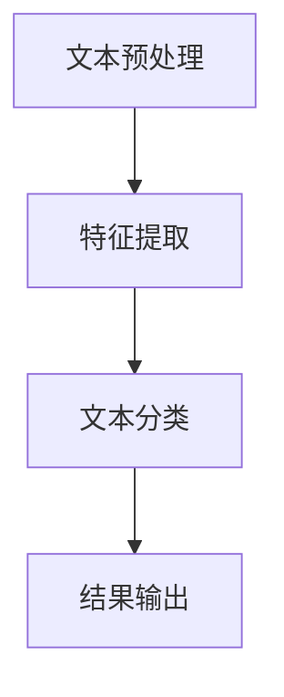
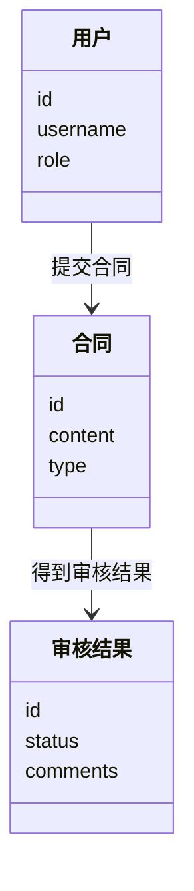
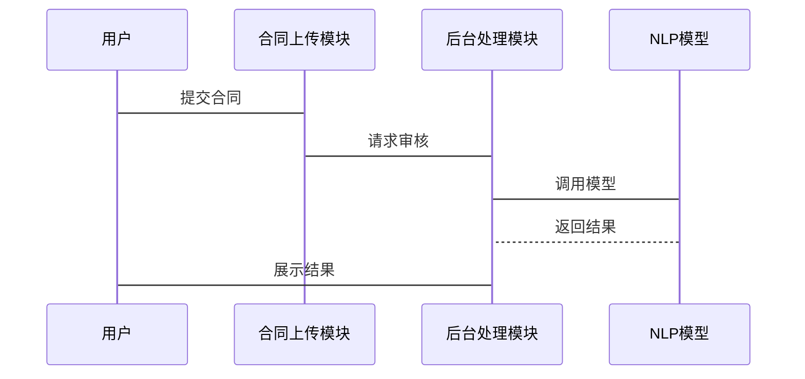

                 


# 构建基于NLP的金融合同自动化审核系统

> 关键词：NLP，金融合同审核，自然语言处理，自动化审核系统，文本挖掘，机器学习

> 摘要：本文详细介绍了构建基于NLP的金融合同自动化审核系统的全过程，从问题背景到系统设计，从算法实现到项目实战，全面解析了系统的核心技术和实现细节。本文不仅探讨了NLP技术在合同审核中的应用潜力，还通过实际案例分析展示了系统的实际应用场景和效果。

---

## 第一部分: 基础概念与背景介绍

### 第1章: 问题背景与需求分析

#### 1.1 问题背景
##### 1.1.1 金融合同审核的现状与挑战
- 传统合同审核依赖人工操作，效率低、成本高。
- 合同文本复杂，涉及法律术语和专业条款，人工审核容易出错。
- 金融行业对合同审核的准确性要求极高，任何疏漏都可能导致重大损失。

##### 1.1.2 问题描述
- 合同审核的核心目标是快速、准确地识别合同中的关键条款和潜在风险。
- 需要解决的主要问题包括：文本理解、关键信息提取、条款分类等。

##### 1.1.3 NLP技术在合同审核中的应用潜力
- NLP技术可以自动提取合同中的关键信息，如日期、金额、条款等。
- 通过自然语言理解技术，能够识别合同中的潜在风险和法律问题。

#### 1.2 问题解决思路
##### 1.2.1 基于NLP的合同审核方法
- 使用分词、实体识别、文本分类等NLP技术处理合同文本。
- 结合规则引擎和机器学习模型进行合同审核。

##### 1.2.2 自动化审核的实现路径
- 数据收集与预处理：收集大量金融合同文本，进行清洗和标注。
- 模型训练：基于标注数据训练NLP模型。
- 系统开发：开发用户友好的审核界面，集成模型进行自动化审核。

#### 1.3 系统边界与外延
##### 1.3.1 系统功能边界
- 系统主要功能包括合同上传、自动审核、结果输出等。
- 不包括合同生成和法律咨询功能。

##### 1.3.2 系统应用范围
- 适用于银行、保险、证券等金融行业。
- 支持多种语言和格式的合同文本。

##### 1.3.3 系统与外部系统的交互
- 与企业现有的业务系统（如ERP、CRM）进行数据对接。
- 支持第三方API调用。

---

### 第2章: 核心概念与系统架构

#### 2.1 核心概念原理
##### 2.1.1 NLP技术在合同审核中的应用
- 分词：将合同文本分割成词语。
- 实体识别：识别合同中的关键实体，如公司名称、金额等。
- 文本分类：将合同分类为不同类别，如贷款合同、保险合同等。

##### 2.1.2 自然语言处理的基本原理
- 词嵌入：将词语表示为向量，如Word2Vec、GloVe。
- 句子表示：将整个句子表示为向量，如BERT、GPT。
- 文本相似度计算：通过余弦相似度等方法计算文本相似度。

##### 2.1.3 金融合同的文本特征分析
- 合同中的法律术语和专业术语。
- 合同中的关键条款，如违约责任、履行期限等。
- 合同的结构特征，如分节、分段等。

#### 2.2 核心概念对比
##### 2.2.1 合同审核与传统文本处理的对比
| 对比维度 | 合同审核 | 传统文本处理 |
|----------|----------|--------------|
| 处理目标 | 风险识别 | 信息提取     |
| 处理难度 | 高       | 中           |
| 对准确性要求 | 极高     | 较低         |

##### 2.2.2 不同NLP技术的优劣势对比
| 技术         | 优势               | 劣势               |
|--------------|--------------------|--------------------|
| 词袋模型     | 实现简单           | 特征维度高         |
| 词嵌入模型   | 特征表示能力强     | 对上下文理解有限   |
| 深度学习模型 | 高精度             | 训练时间长         |

##### 2.2.3 系统功能模块的对比分析
- 模块1：合同上传模块。
- 模块2：文本预处理模块。
- 模块3：NLP模型处理模块。
- 模块4：结果展示模块。

#### 2.3 系统架构设计
##### 2.3.1 系统功能模块的划分
- 用户界面模块：提供合同上传和结果查看功能。
- 后台处理模块：负责合同文本的预处理和模型调用。
- 数据存储模块：存储合同文本和审核结果。

##### 2.3.2 系统功能模块的交互流程
1. 用户上传合同文本。
2. 系统对文本进行预处理（分词、实体识别）。
3. 调用NLP模型进行文本分类和风险识别。
4. 系统生成审核结果并展示给用户。

##### 2.3.3 系统架构的ER实体关系图

```mermaid
erDiagram
    user [用户] {
        id
        username
        role
    }
    contract [合同] {
        id
        content
        type
    }
    result [审核结果] {
        id
        status
        comments
    }
    user --> contract : 提交合同
    contract --> result : 得到审核结果
```

---

## 第二部分: 算法原理与数学模型

### 第3章: 合同审核的NLP算法实现

#### 3.1 合同审核的流程与算法
##### 3.1.1 合同文本的预处理
- 分词：使用jieba进行中文分词。
- 去停用词：去除无意义的词语，如“的、是”等。
- 词干提取：将词语转化为其基本形式。

##### 3.1.2 文本特征提取
- 词袋模型：统计每个词的出现频率。
- 词嵌入模型：使用Word2Vec生成词向量。
- 位置编码：为每个词添加位置信息。

##### 3.1.3 文本分类与实体识别
- 文本分类：使用SVM或随机森林进行分类。
- 实体识别：使用CRF或LSTM进行命名实体识别。

#### 3.2 算法原理
##### 3.2.1 基于条件概率的文本分类
- 使用Naive Bayes算法。
- 概率公式：P(y|x) = P(x|y) * P(y) / P(x)

##### 3.2.2 基于深度学习的文本处理
- 使用双向LSTM进行文本理解。
- 模型结构：编码层、注意力层、解码层。

##### 3.2.3 文本相似度计算
- 使用余弦相似度计算文本相似度。
- 公式：cosθ = (向量A·向量B) / (|向量A| * |向量B|)

#### 3.3 算法实现
##### 3.3.1 Python代码实现
```python
from sklearn.feature_extraction.text import TfidfVectorizer
from sklearn.svm import SVC

# 数据预处理
vectorizer = TfidfVectorizer()
X = vectorizer.fit_transform(documents)

# 模型训练
model = SVC()
model.fit(X, labels)

# 预测
test_document = ["贷款合同"]
X_test = vectorizer.transform([test_document])
print(model.predict(X_test))
```

##### 3.3.2 算法流程图



---

## 第三部分: 系统分析与架构设计

### 第4章: 系统分析与架构设计

#### 4.1 系统场景介绍
- 用户场景：银行风控部门员工需要快速审核贷款合同。
- 场景描述：系统自动提取合同中的关键信息，识别潜在风险。

#### 4.2 系统功能设计
##### 4.2.1 领域模型图


##### 4.2.2 系统架构设计
- 前端架构：React.js实现用户界面。
- 后端架构：Flask框架实现API接口。
- 数据存储：MySQL数据库存储合同和结果。

##### 4.2.3 系统接口设计
- 接口1：上传合同。
- 接口2：获取审核结果。
- 接口3：查询历史记录。

##### 4.2.4 系统交互流程图


---

## 第四部分: 项目实战与应用案例

### 第5章: 项目实战

#### 5.1 环境安装与配置
- 安装Python和相关库：`pip install jieba、scikit-learn、flask`
- 安装数据库：`mysql -u root -p`

#### 5.2 系统核心实现
##### 5.2.1 数据预处理代码
```python
import jieba

def preprocess(text):
    words = jieba.lcut(text)
    return ' '.join(words)
```

##### 5.2.2 模型训练代码
```python
from sklearn.svm import SVC
from sklearn.feature_extraction.text import TfidfVectorizer

vectorizer = TfidfVectorizer()
model = SVC()
model.fit(vectorizer.fit_transform(train_texts), train_labels)
```

##### 5.2.3 系统架构代码
```python
from flask import Flask, request, jsonify

app = Flask(__name__)

@app.route('/upload', methods=['POST'])
def upload_contract():
    data = request.json
    # 处理合同文本
    return jsonify({'status': 'success', 'message': '合同已上传'})
```

#### 5.3 案例分析与优化
##### 5.3.1 案例分析
- 案例背景：某银行贷款合同的审核。
- 案例分析：系统自动识别合同中的违约条款，发现潜在风险。

##### 5.3.2 系统优化
- 优化1：引入规则引擎，提高模型准确率。
- 优化2：增加用户反馈机制，持续优化模型。

#### 5.4 项目小结与未来展望
- 项目小结：系统实现了合同的自动化审核，提高了审核效率和准确性。
- 未来展望：探索更先进的NLP技术，如大语言模型，进一步提升系统的智能化水平。

---

## 第五部分: 最佳实践与总结

### 第6章: 最佳实践

#### 6.1 实践总结
- 数据是关键：高质量的标注数据是模型准确性的保障。
- 模型选择：根据实际需求选择合适的NLP模型。
- 系统设计：注重系统的可扩展性和可维护性。

#### 6.2 小结
- 通过NLP技术实现金融合同的自动化审核，能够显著提高审核效率和准确性。
- 系统的设计需要综合考虑技术实现和实际应用场景。

#### 6.3 注意事项
- 数据隐私：确保合同文本的安全性和隐私性。
- 模型调优：持续优化模型，提高准确率。
- 用户体验：设计友好的用户界面，提升用户体验。

#### 6.4 拓展阅读
- 推荐书籍：《自然语言处理实战：基于Python的深度学习方法》
- 推荐论文：《预训练语言模型在法律文本处理中的应用》

---

## 作者信息

作者：AI天才研究院/AI Genius Institute & 禅与计算机程序设计艺术/Zen And The Art of Computer Programming

---

**本文内容到此结束，感谢您的阅读！**

