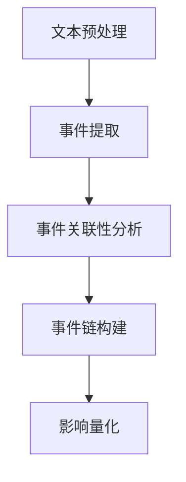
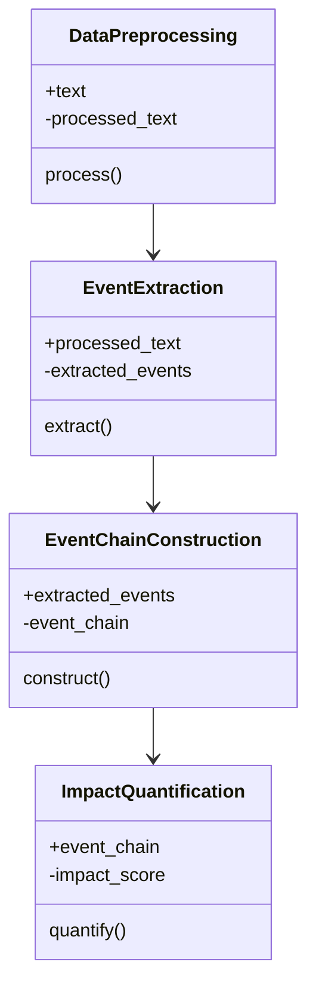
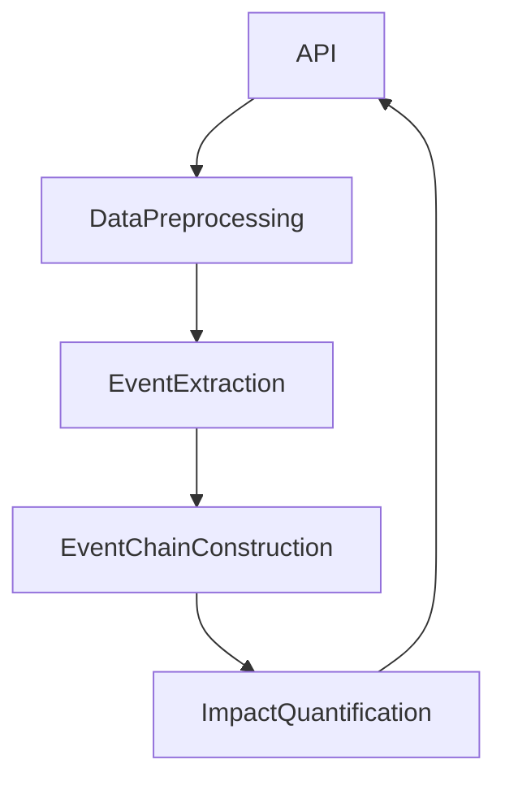
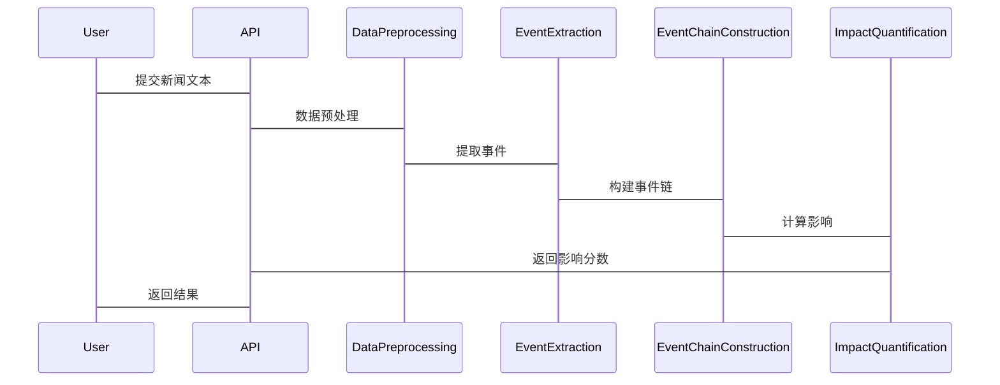

                 


# 《构建基于NLP的金融新闻事件链影响量化评估系统》

---

## 关键词：NLP, 金融新闻, 事件链, 影响量化, 系统架构

---

## 摘要：本文详细介绍了如何利用自然语言处理技术构建金融新闻事件链，并量化其对市场的影响。通过分析事件链的构建方法、影响量化模型的设计以及系统的整体架构，本文为金融领域的新闻分析和市场预测提供了新的思路和方法。

---

## 正文

### 第1章: 背景介绍

#### 1.1 问题背景
- **1.1.1 金融新闻分析的现状与挑战**  
  金融市场的波动性极强，新闻事件对市场的影响日益显著。传统的金融分析方法难以捕捉新闻中的隐含信息，而自然语言处理（NLP）技术的引入为金融新闻分析提供了新的可能性。

- **1.1.2 事件链分析的必要性**  
  金融新闻中，事件之间往往存在关联性。例如，一次并购事件可能引发股价波动，进而影响市场整体走势。通过构建事件链，可以更好地理解事件之间的传播和影响。

- **1.1.3 NLP技术在金融领域的应用前景**  
  NLP技术在金融领域的应用已逐渐成熟，从新闻分类到情感分析，再到事件提取，NLP正在改变金融分析的方式。

#### 1.2 问题描述
- **1.2.1 金融新闻事件链的定义**  
  金融新闻事件链是指一系列相关联的金融新闻事件，这些事件之间存在因果或相关关系。

- **1.2.2 事件链影响量化的目标**  
  量化事件链对市场的影响，帮助投资者更好地理解市场波动的原因。

- **1.2.3 系统构建的核心问题**  
  如何利用NLP技术提取事件信息，并构建事件链模型，最终量化其影响。

#### 1.3 问题解决思路
- **1.3.1 NLP技术在事件链构建中的应用**  
  利用NLP技术提取事件信息，构建事件之间的关联关系。

- **1.3.2 影响量化的方法论**  
  通过概率模型和传播模型量化事件的影响范围和程度。

- **1.3.3 系统整体架构设计**  
  设计一个模块化的系统架构，包括数据采集、事件提取、事件链构建和影响量化等模块。

#### 1.4 系统边界与外延
- **1.4.1 系统功能边界**  
  本系统仅专注于金融新闻事件的分析，不涉及实时数据的采集和市场预测。

- **1.4.2 系统外延与扩展性**  
  系统可以通过引入更多的数据源和模型来提升其性能。

- **1.4.3 系统与外部系统的交互**  
  系统可以通过API接口与外部系统（如数据库和可视化工具）进行交互。

#### 1.5 核心概念结构与组成
- **1.5.1 事件链的核心要素**  
  包括事件主体、事件类型、事件时间、事件关联关系等。

- **1.5.2 影响量化模型的组成**  
  包括影响指标设计、影响传播模型和综合评估方法。

- **1.5.3 系统架构的核心模块**  
  包括数据预处理模块、事件提取模块、事件链构建模块和影响量化模块。

---

### 第2章: 核心概念与联系

#### 2.1 NLP技术在金融新闻分析中的应用
- **2.1.1 文本预处理与特征提取**  
  文本预处理包括分词、停用词去除、词干提取等。特征提取包括关键词提取和主题建模。

- **2.1.2 情感分析与主题建模**  
  情感分析用于判断新闻的总体情绪，主题建模用于识别新闻的主题。

- **2.1.3 事件实体识别与关系抽取**  
  识别新闻中的实体（如公司、人物）以及它们之间的关系。

#### 2.2 事件链构建原理
- **2.2.1 事件链的定义与分类**  
  根据事件的类型和关联性，将事件分为不同的类别。

- **2.2.2 事件链的构建方法**  
  通过事件之间的关联性分析，构建事件链。

- **2.2.3 事件链的关联性分析**  
  分析事件之间的因果关系和传播路径。

#### 2.3 影响量化模型
- **2.3.1 影响量化指标的设计**  
  包括事件的影响范围、影响程度和影响时间。

- **2.3.2 影响传播模型**  
  通过概率模型和网络模型量化事件的影响。

- **2.3.3 综合影响评估方法**  
  综合考虑事件的多方面因素，评估其综合影响。

#### 2.4 核心概念对比分析
- **2.4.1 不同NLP模型的性能对比**  
  对比分析BERT、LSTM等模型在金融新闻分析中的表现。

- **2.4.2 事件链构建方法的优缺点**  
  对比分析基于规则的构建方法和基于机器学习的构建方法。

- **2.4.3 影响量化模型的适用场景**  
  根据不同的金融场景选择合适的影响量化模型。

---

### 第3章: 算法原理

#### 3.1 算法流程图


#### 3.2 核心算法实现
```python
def preprocess(text):
    # 分词和去停用词
    words = tokenizer(text)
    filtered_words = [word for word in words if word not in stop_words]
    return filtered_words

def extract_events(text):
    # 事件实体识别
    entities = entityRecognizer(text)
    # 事件类型分类
    event_type = classifier(entities)
    return event_type

def build_event_chain(events):
    # 事件关联性分析
    relations = compute_relations(events)
    # 事件链构建
    event_chain = build_chain(relations)
    return event_chain

def quantify_impact(event_chain):
    # 影响传播模型
    impact_score = compute_impact(event_chain)
    return impact_score
```

#### 3.3 数学模型与公式
- **影响传播模型**：
  $$ impact\_score = \sum_{i=1}^{n} weight_i \times event\_score_i $$
- **综合影响评估公式**：
  $$ overall\_impact = \frac{1}{N} \sum_{j=1}^{N} impact\_score_j $$

---

### 第4章: 系统分析与架构设计

#### 4.1 系统功能设计


#### 4.2 系统架构设计


#### 4.3 系统接口设计
- **API接口**：
  ```python
  def process_news(text):
      preprocess(text)
      extract_events(text)
      construct_chain(events)
      quantify_impact(chain)
      return impact_score
  ```

#### 4.4 系统交互流程


---

### 第5章: 项目实战

#### 5.1 环境安装
```bash
pip install numpy
pip install scikit-learn
pip install spacy
pip install bert
```

#### 5.2 核心代码实现
```python
import numpy as np
from sklearn.feature_extraction.text import TfidfVectorizer
from spacy.lang.zh import Chinese

# 数据预处理
def preprocess(text):
    nlp = Chinese()
    doc = nlp(text)
    words = [token.text for token in doc if not token.is_stop]
    return ' '.join(words)

# 事件提取
def extract_events(text):
    vectorizer = TfidfVectorizer()
    tfidf = vectorizer.fit_transform([text])
    events = vectorizer.inverse_transform(tfidf[0])
    return events

# 事件链构建
def build_event_chain(events):
    relations = compute_relations(events)
    event_chain = []
    for event in events:
        event_chain.append({'event': event, 'relation': relations[event]})
    return event_chain

# 影响量化
def quantify_impact(event_chain):
    impact_scores = []
    for event in event_chain:
        impact = compute_impact(event['relation'])
        impact_scores.append(impact)
    return np.mean(impact_scores)
```

#### 5.3 案例分析
假设我们有一条新闻：“某公司宣布并购另一家公司，预计此举将对公司股价产生积极影响。”
- **步骤1**：数据预处理，提取关键词。
- **步骤2**：事件提取，识别“并购”事件。
- **步骤3**：构建事件链，分析事件之间的关系。
- **步骤4**：量化影响，计算事件对股价的影响。

---

### 第6章: 总结与展望

#### 6.1 最佳实践 tips
- 确保数据质量，选择合适的NLP模型。
- 定期更新模型，适应市场变化。
- 结合其他数据分析方法，提升系统性能。

#### 6.2 小结
本文详细介绍了如何利用NLP技术构建金融新闻事件链，并量化其对市场的影响。通过系统的构建和算法的实现，我们能够更好地理解和预测金融市场的波动。

#### 6.3 注意事项
- 数据隐私和安全问题需要特别注意。
- 系统的实时性和稳定性需要进一步优化。

#### 6.4 拓展阅读
- 推荐阅读《自然语言处理实战》和《金融时间序列分析》。

---

## 作者：AI天才研究院/AI Genius Institute & 禅与计算机程序设计艺术 /Zen And The Art of Computer Programming

