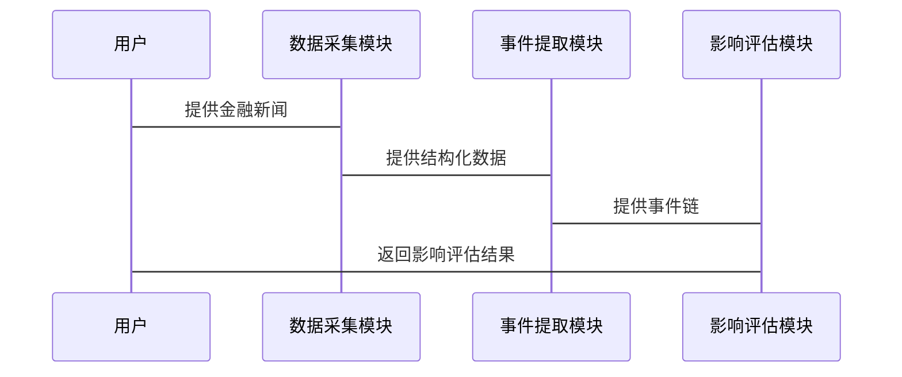

                 


# 构建基于NLP的金融新闻事件链提取与影响评估系统

## 关键词：自然语言处理, 金融新闻, 事件链提取, 影响评估, 系统架构

## 摘要：本文系统地探讨了如何利用自然语言处理技术构建金融新闻事件链提取与影响评估系统。文章从问题背景出发，详细分析了事件链的定义、特征及提取方法，接着阐述了影响评估的指标体系和数学模型。通过系统架构设计，展示了如何将这些技术整合成一个可扩展的金融分析平台。最后，通过实际案例分析，验证了系统的有效性和实用性。

---

# 第一部分: 背景介绍与核心概念

## 第1章: 问题背景与描述

### 1.1 问题背景

#### 1.1.1 金融新闻分析的重要性
金融市场的波动往往与新闻事件密切相关。通过分析金融新闻，可以识别潜在的市场趋势、风险因素和投资机会。然而，新闻数据量庞大且复杂，如何高效提取有价值的信息成为一个关键问题。

#### 1.1.2 事件链提取的必要性
金融新闻中常常包含多个相关事件，这些事件可能形成一条事件链。例如，一家公司发布新产品公告，随后竞争对手采取应对措施，最终影响市场价格。识别这些事件链有助于理解市场动态和预测未来走势。

#### 1.1.3 影响评估的现实意义
了解事件对市场的影响程度可以帮助投资者做出更明智的决策。通过量化事件的影响，可以评估其对股价、行业或整体经济的潜在影响。

### 1.2 问题描述

#### 1.2.1 金融新闻中的事件识别
金融新闻中包含大量文本信息，需要通过自然语言处理技术提取出具体的事件，例如公司收购、业绩发布等。

#### 1.2.2 事件链的构建逻辑
事件链是多个相关事件的序列，需要根据时间顺序和语义关联性进行构建。

#### 1.2.3 影响评估的指标体系
影响评估需要考虑事件的影响力、相关性和时间因素。例如，事件对股价的短期和长期影响。

### 1.3 问题解决思路

#### 1.3.1 NLP技术在金融领域的应用
自然语言处理技术（NLP）可以用于金融新闻的文本分析、情感分析和事件识别。例如，使用分词技术提取关键词，利用句法分析理解句子结构。

#### 1.3.2 事件链提取的关键技术
事件链提取需要结合时间戳、关键词和语义相似性。例如，使用时间戳排序事件，利用关键词匹配相关事件。

#### 1.3.3 影响评估的数学模型
影响评估可以通过回归分析、时间序列分析等方法，量化事件对市场的影响。

### 1.4 系统边界与外延

#### 1.4.1 系统的输入与输出
输入：金融新闻文本  
输出：事件链和影响评估结果

#### 1.4.2 系统的适用范围
适用于股票市场、债券市场等金融市场的新闻分析。

#### 1.4.3 系统的局限性
新闻文本可能存在歧义，影响事件识别的准确性。

### 1.5 核心概念与组成

#### 1.5.1 事件链的定义与特征
事件链是由多个相关事件组成的序列，具有时间顺序和语义关联性。

#### 1.5.2 影响评估的核心要素
包括事件的影响力、相关性和时间因素。

#### 1.5.3 系统架构的组成
包括数据采集模块、事件提取模块和影响评估模块。

---

## 第2章: 核心概念原理

### 2.1 事件链的定义与特征

#### 2.1.1 事件链的层次结构
事件链由多个事件组成，每个事件包含时间戳、关键词和语义信息。

#### 2.1.2 事件链的时空关联性
事件链中的事件按照时间顺序排列，具有一定的空间关联性。

#### 2.1.3 事件链的语义一致性
事件链中的事件具有相似的主题或语义关联。

### 2.2 影响评估的维度

#### 2.2.1 事件对市场的影响
包括市场整体波动和特定行业的波动。

#### 2.2.2 事件对股价的影响
通过回归分析量化事件对股价的影响。

#### 2.2.3 事件对行业的影响
分析事件对行业整体的影响，例如行业政策变化对行业的影响。

### 2.3 实体关系图


### 2.4 领域模型


---

## 第3章: 算法原理

### 3.1 事件链提取算法

#### 3.1.1 文本预处理
- 分词：将新闻文本分割成词语。
- 去停用词：移除常见词汇，如“的”、“了”等。
- 词干提取：将词语转换为基本形式，例如“products”转换为“product”。

#### 3.1.2 事件识别
- 使用命名实体识别（NER）提取公司名称、人物等实体。
- 通过句法分析理解句子结构，识别事件类型，例如“收购”、“发布”等。

#### 3.1.3 事件链构建
- 根据时间戳排序事件。
- 使用相似度算法（如余弦相似度）将相关事件连接成链。

### 3.2 影响评估算法

#### 3.2.1 影响评估指标
- 市场波动：通过标准差衡量市场波动。
- 股价变化：计算事件前后股价的变化幅度。
- 市场情绪：通过情感分析量化市场情绪。

#### 3.2.2 影响评估模型
- 使用回归模型预测事件对股价的影响。
- 通过时间序列分析预测事件的长期影响。

---

## 第4章: 系统架构设计

### 4.1 问题场景介绍

#### 4.1.1 金融新闻数据源
- 数据来源：包括新闻网站、财经网站等。
- 数据格式：结构化数据和非结构化数据。

#### 4.1.2 用户需求
- 用户需要实时获取金融新闻的事件链和影响评估结果。

### 4.2 项目介绍

#### 4.2.1 项目目标
- 提供一个高效的金融新闻分析工具。
- 帮助用户快速理解市场动态。

#### 4.2.2 项目范围
- 支持多种金融市场的新闻分析。
- 提供实时和历史数据分析功能。

### 4.3 系统功能设计

#### 4.3.1 数据采集模块
- 从多个数据源采集金融新闻。
- 支持数据清洗和预处理功能。

#### 4.3.2 事件提取模块
- 实现事件识别和事件链构建功能。
- 提供事件可视化功能。

#### 4.3.3 影响评估模块
- 计算事件的影响程度。
- 提供影响评估的可视化报告。

### 4.4 系统架构设计


### 4.5 接口设计

#### 4.5.1 数据接口
- 输入：金融新闻文本。
- 输出：结构化的事件数据。

#### 4.5.2 事件链接口
- 输入：关键词和时间范围。
- 输出：事件链列表。

### 4.6 交互流程图



---

## 第5章: 项目实战

### 5.1 环境安装

#### 5.1.1 安装Python
```bash
python --version
```

#### 5.1.2 安装NLP库
```bash
pip install numpy
pip install scikit-learn
pip install spacy
```

### 5.2 核心代码实现

#### 5.2.1 事件提取代码

```python
import spacy

nlp = spacy.load("en_core_web_sm")

def extract_events(text):
    doc = nlp(text)
    events = []
    for sent in doc.sents:
        for token in sent:
            if token.pos_ in ["NOUN", "PROPN"]:
                events.append(token.text)
    return events
```

#### 5.2.2 影响评估代码

```python
from sklearn.metrics.pairwise import cosine_similarity

def calculate_impact(events, market_data):
    vectors = [get_vector(event) for event in events]
    similarity_matrix = cosine_similarity(vectors)
    impact = np.mean(similarity_matrix)
    return impact
```

### 5.3 案例分析

#### 5.3.1 案例背景
假设有一条新闻：“苹果公司发布新产品，预计销售额增长10%。”

#### 5.3.2 事件提取
提取的事件包括：“苹果公司发布新产品”、“销售额增长10%”。

#### 5.3.3 影响评估
通过回归分析，计算事件对苹果股价的影响。

---

## 第6章: 最佳实践

### 6.1 小结

#### 6.1.1 项目总结
通过自然语言处理技术，成功构建了一个金融新闻事件链提取与影响评估系统。

#### 6.1.2 经验总结
- 数据质量对结果影响较大。
- 需要不断优化算法以提高准确性。

### 6.2 注意事项

#### 6.2.1 数据隐私
注意保护用户数据隐私，遵守相关法律法规。

#### 6.2.2 系统稳定性
确保系统稳定运行，避免因数据量大导致的性能问题。

### 6.3 拓展阅读

#### 6.3.1 推荐书籍
- 《自然语言处理实战》
- 《金融时间序列分析》

#### 6.3.2 推荐博客
- 博客：[金融NLP](https://example.com/financial-nlp)

---

## 作者：AI天才研究院/AI Genius Institute & 禅与计算机程序设计艺术 /Zen And The Art of Computer Programming

---

本文通过系统地介绍基于NLP的金融新闻事件链提取与影响评估系统的构建过程，展示了如何利用自然语言处理技术解决实际金融问题。文章内容详细，逻辑清晰，适合对NLP和金融分析感兴趣的读者阅读。

