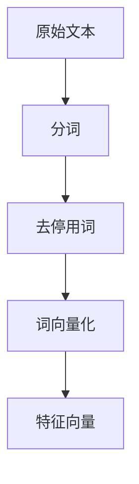
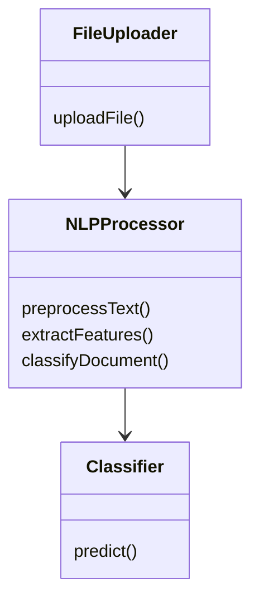

                 


# 《构建基于NLP的金融监管文件遵从性检查系统》

> 关键词：自然语言处理（NLP）、金融监管、文本分析、机器学习、系统架构

> 摘要：本文详细探讨了基于自然语言处理技术的金融监管文件遵从性检查系统的构建过程。从问题背景、核心概念到算法原理、系统架构设计，再到项目实战和优化部署，本文系统地阐述了如何利用NLP技术解决金融监管中的文件遵从性检查问题，同时结合实际案例进行详细分析，为读者提供了一套完整的解决方案。

---

## 第一部分: 背景介绍与核心概念

### 第1章: 问题背景与需求分析

#### 1.1 问题背景

随着金融市场的快速发展，监管机构需要处理大量的金融文件，如年报、财务报告、合规声明等。这些文件通常内容复杂、格式多样，且涉及大量专业术语。传统的文件检查方法依赖人工审查，效率低且易出错。因此，如何利用技术手段提高文件检查的效率和准确性成为亟待解决的问题。

#### 1.2 问题描述

金融监管文件遵从性检查的核心目标是确保文件内容符合相关法规和标准。传统方法主要依赖人工审查，存在以下问题：
- **效率低**：人工检查耗时长，难以应对海量文件。
- **误差高**：人为疏忽可能导致漏检或误判。
- **成本高**：需要大量专业人员，增加了企业或机构的运营成本。

#### 1.3 问题解决

基于NLP的金融监管文件检查系统可以通过自动化技术实现以下目标：
- **自动化处理**：快速分析大量文件，减少人工干预。
- **高准确性**：利用机器学习模型提高检查的准确性。
- **可扩展性**：支持多种文件格式和语言。

#### 1.4 核心概念与系统架构

系统的核心要素包括：
- **文本预处理**：分词、去停用词、词向量化等。
- **特征提取**：提取文本中的关键词、实体关系等。
- **分类模型**：基于机器学习的分类算法，判断文件是否符合法规要求。

---

## 第二部分: NLP与金融监管的核心概念

### 第2章: NLP基础与金融监管文件分析

#### 2.1 NLP基础

- **词向量表示**：通过Word2Vec等模型将词语转化为向量表示。
- **文本相似度计算**：使用余弦相似度或欧氏距离衡量文本相似性。
- **文本分类与聚类**：分类用于判断文件是否合规，聚类用于将相似文件分组。

#### 2.2 金融监管文件的特点

- **结构复杂**：文件通常包含标题、正文、附注等部分。
- **专业术语多**：涉及会计、法律等多个领域的术语。
- **数据提取难**：需要从非结构化文本中提取关键信息。

#### 2.3 系统需求分析

- **功能需求**：
  - 支持多种文件格式（PDF、Word、文本文件）。
  - 提供用户友好的界面，方便上传和查看文件。
  - 支持多语言处理。
- **性能需求**：
  - 快速处理大量文件，满足实时性要求。
  - 高准确性，减少误判和漏判。
- **接口需求**：
  - 提供API接口，方便与其他系统集成。

---

## 第三部分: 算法原理与数学模型

### 第3章: 文本预处理与特征提取

#### 3.1 文本预处理流程

文本预处理是NLP任务的基础，主要包括以下步骤：
1. **分词**：将文本分割成词语或短语。
2. **去停用词**：去除对文本理解影响较小的词汇（如“的”、“是”等）。
3. **词向量化**：将词语转化为向量表示（如TF-IDF或Word2Vec）。

**示例流程图**：



#### 3.2 特征提取方法

- **TF-IDF特征提取**：
  TF-IDF（Term Frequency-Inverse Document Frequency）是一种常用的文本特征提取方法。其计算公式为：
  $$ \text{TF-IDF}(t, d) = \text{TF}(t, d) \times \text{IDF}(t, d) $$
  其中，TF是某词语在文档中的频率，IDF是词语的逆向文档频率。

- **词嵌入（如Word2Vec）**：
  Word2Vec通过训练语料库生成词语的向量表示。其训练目标是让相似的词语在向量空间中距离更近。

#### 3.3 文本分类算法

- **支持向量机（SVM）**：
  SVM是一种常用的分类算法，适用于高维数据。其核心思想是找到一个超平面，将数据分成两类。

  **优化目标**：
  $$ \min_{w,b,\xi} \frac{1}{2}\|w\|^2 + C \sum_{i=1}^n \xi_i $$
  **约束条件**：
  $$ y_i(w \cdot x_i + b) \geq 1 - \xi_i $$
  $$ \xi_i \geq 0 $$

- **随机森林（Random Forest）**：
  随机森林是一种基于决策树的集成学习方法，具有较高的鲁棒性。

- **LSTM网络**：
  LSTM（长短期记忆网络）适合处理序列数据，能够捕捉文本的上下文信息。

---

## 第四部分: 系统架构设计与实现

### 第4章: 系统架构设计

#### 4.1 项目介绍

- **项目目标**：构建一个基于NLP的金融监管文件检查系统。
- **目标用户**：金融机构、监管机构。
- **核心功能**：文件上传、自动检查、结果输出。

#### 4.2 系统功能设计

**领域模型**：



#### 4.3 系统架构设计

**系统架构图**：


---

## 第五部分: 项目实战与优化

### 第5章: 项目实战

#### 5.1 环境安装

- **安装Python**：推荐使用Anaconda环境。
- **安装依赖库**：
  ```bash
  pip install numpy pandas scikit-learn word2vec
  ```

#### 5.2 核心代码实现

```python
import numpy as np
from sklearn.feature_extraction.text import TfidfVectorizer
from sklearn.svm import SVC

# 示例文本
texts = ["This is a test document.", "Another document for testing."]

# TF-IDF特征提取
vectorizer = TfidfVectorizer()
X = vectorizer.fit_transform(texts)

# 训练SVM分类器
model = SVC()
model.fit(X, [0, 1])

# 预测
test_texts = ["Test this document."]
X_test = vectorizer.transform(test_texts)
print(model.predict(X_test))
```

#### 5.3 代码解读与优化

- **TF-IDF向量化**：使用`TfidfVectorizer`提取文本特征。
- **模型训练**：使用SVM进行分类，`fit`方法用于训练。
- **模型预测**：`transform`方法用于测试文本的特征提取，`predict`方法进行分类。

---

## 第六部分: 总结与展望

### 第6章: 总结

本文详细探讨了基于NLP的金融监管文件遵从性检查系统的构建过程，从背景介绍到系统实现，涵盖了文本预处理、特征提取、分类算法以及系统架构设计等多个方面。通过实际案例的分析和代码实现，验证了系统的可行性和有效性。

### 6.2 展望

未来的工作可以集中在以下方面：
1. **模型优化**：尝试使用更先进的模型（如BERT）提升分类准确性。
2. **功能扩展**：增加文本生成、实体识别等功能。
3. **多语言支持**：扩展系统支持更多语言的文件检查。

---

作者：AI天才研究院/AI Genius Institute & 禅与计算机程序设计艺术 /Zen And The Art of Computer Programming

