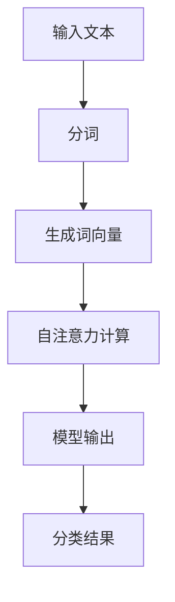
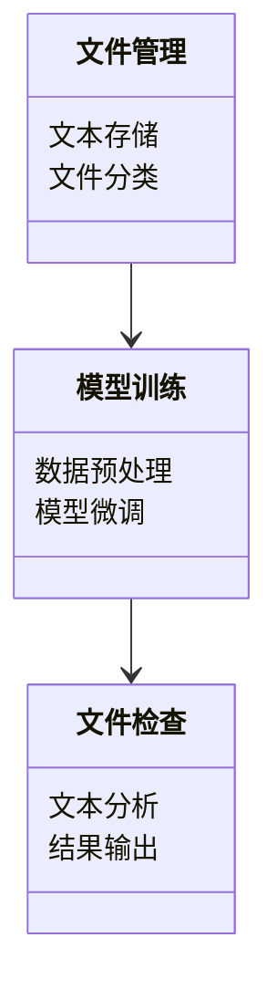

                 


# 构建基于NLP的金融监管文件遵从性自动检查系统

## 关键词：NLP，金融监管，文本分析，遵从性检查，机器学习

## 摘要：  
本文详细介绍了如何利用自然语言处理（NLP）技术构建一个自动化的金融监管文件遵从性检查系统。文章从背景和问题背景出发，分析了传统金融监管的痛点，探讨了NLP技术在金融监管中的应用潜力。随后，深入讲解了NLP与金融监管的核心概念，包括文本分析、实体识别和分类等技术。接着，详细阐述了基于BERT的NLP模型的算法原理，从模型选择、训练到优化，再到系统架构设计，包括系统功能设计、架构设计和接口设计。最后，通过一个具体的项目实战，展示了如何将理论应用于实际，提供了代码实现和案例分析。本文还总结了最佳实践、注意事项和未来的研究方向，为读者提供了全面的指导。

---

## 第一部分: 背景介绍与核心概念

### 第1章: 问题背景与需求分析

#### 1.1 问题背景
金融监管是保障金融市场健康运行的重要环节，涉及上市公司年报、财务报告、合规文件等的审查。然而，传统的监管方式依赖人工审查，存在效率低、成本高、易出错等问题。随着金融市场的复杂化和监管要求的不断提高，传统的监管手段已经难以应对日益增长的监管需求。

#### 1.2 问题描述
- **文件复杂性**：金融监管文件通常包含大量法律术语和专业条款，人工审查耗时且容易出错。
- **规则多样性**：监管规则繁多且不断更新，人工审查难以覆盖所有情况。
- **合规性要求**：金融机构需要确保其文件严格遵守监管规定，否则可能导致罚款或声誉损失。

#### 1.3 问题解决与边界
- **核心目标**：通过NLP技术实现金融监管文件的自动审查，提高效率和准确性。
- **系统边界**：仅针对文本内容的分析，不涉及其他数据源（如财务数据）的整合。
- **核心要素**：文本预处理、模型训练、规则匹配、结果输出。

#### 1.4 核心概念与联系
- **NLP与金融监管的结合**：NLP技术可以提取文本中的关键信息，识别潜在风险。
- **实体关系图（ER图）**：展示了监管文件、规则、实体之间的关系。

### 第2章: NLP与金融监管的核心概念

#### 2.1 NLP基础
- **定义与原理**：NLP通过计算机处理自然语言文本，实现文本理解、生成和分析。
- **常用技术**：包括分词、句法分析、情感分析、文本分类等。

#### 2.2 金融监管的特点
- **文件类型**：包括年报、财务报告、合规文件等。
- **监管规则**：涉及会计准则、税法、反洗钱法规等。

#### 2.3 NLP在金融监管中的应用
- **文本相似性**：用于识别不同文件中的相似条款。
- **分类与聚类**：用于自动分类文件类型，识别潜在风险。

---

## 第二部分: 算法原理与数学模型

### 第3章: 基于NLP的金融监管算法原理

#### 3.1 算法选择与原理
- **预训练模型**：选择BERT作为基础模型，通过微调适应金融监管任务。
- **模型训练**：使用金融监管相关的文本数据进行微调，提升模型的领域适应性。

#### 3.2 NLP模型的数学基础
- **词嵌入**：通过Word2Vec或BERT模型生成词向量。
- **注意力机制**：利用自注意力机制捕捉文本中的关键信息。

#### 3.3 算法流程图


### 第4章: 数学模型与公式解析

#### 4.1 词嵌入模型
- **Word2Vec公式**：
  $$\text{score}(w_i, w_j) = \log P(w_j | w_i) + \log P(w_i | w_j)$$

#### 4.2 注意力机制
- **自注意力公式**：
  $$\text{Attention}(Q, K, V) = \text{softmax}\left(\frac{QK^T}{\sqrt{d_k}}\right)V$$

---

## 第三部分: 系统分析与架构设计

### 第5章: 系统功能设计

#### 5.1 领域模型


### 第6章: 系统架构设计

#### 6.1 系统架构


---

## 第四部分: 项目实战

### 第7章: 项目实现

#### 7.1 环境安装
- **Python**：安装`transformers`库：
  ```bash
  pip install transformers
  ```

#### 7.2 核心代码实现
```python
from transformers import BertTokenizer, BertModel
import torch

class FinancialRegulator:
    def __init__(self):
        self.tokenizer = BertTokenizer.from_pretrained('bert-base-uncased')
        self.model = BertModel.from_pretrained('bert-base-uncased')

    def analyze_text(self, text):
        inputs = self.tokenizer.encode_plus(text, return_tensors='pt', padding=True, truncation=True)
        with torch.no_grad():
            outputs = self.model(**inputs)
        # 处理输出
        return outputs
```

#### 7.3 代码解读与案例分析
- **案例分析**：分析某公司年报，识别潜在的财务风险。

---

## 第五部分: 总结与展望

### 第8章: 总结

- **最佳实践**：选择合适的模型，确保数据质量，定期更新模型。
- **小结**：本文详细介绍了如何利用NLP技术构建金融监管系统，提供了从理论到实践的全面指导。

### 第9章: 注意事项

- **数据隐私**：确保处理的金融数据符合隐私保护法规。
- **模型可解释性**：确保模型输出结果可解释，便于审计和调整。

### 第10章: 拓展阅读

- 推荐阅读相关领域的书籍和论文，深入理解NLP和金融监管的结合。

---

## 作者：AI天才研究院 & 禅与计算机程序设计艺术

