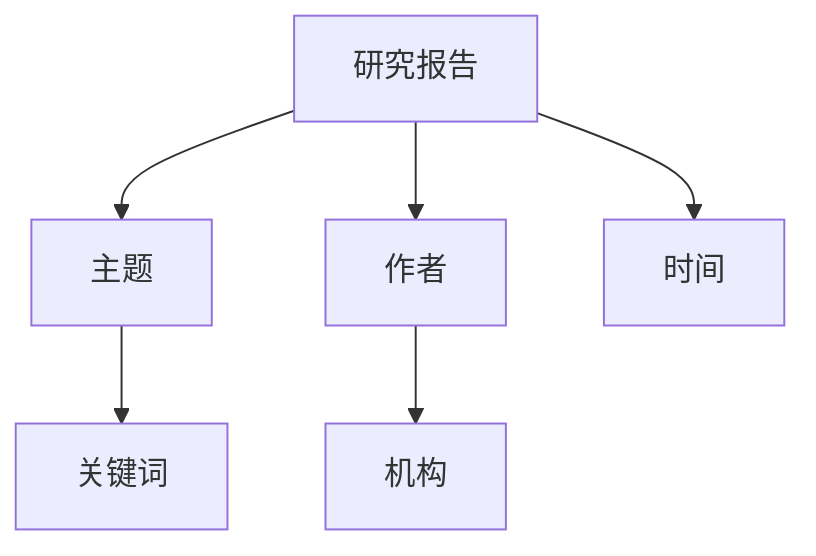
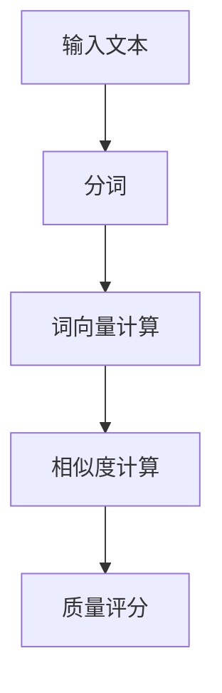
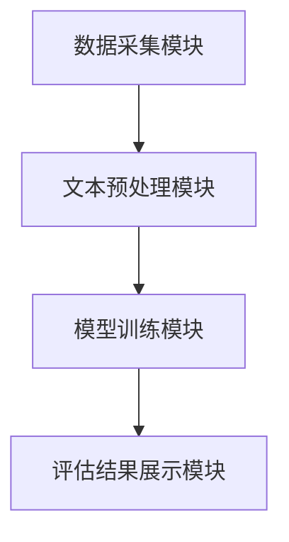
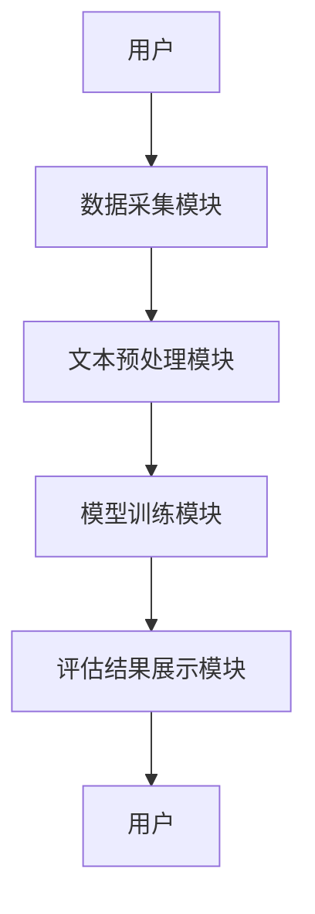

                 


# 构建基于NLP的金融研究报告质量评估系统

## 关键词：自然语言处理，金融报告，文本挖掘，质量评估，深度学习

## 摘要：本文介绍了一种基于NLP技术的金融研究报告质量评估系统，详细探讨了系统构建的背景、核心概念、算法原理、系统架构设计、项目实战及最佳实践。通过自然语言处理技术，该系统能够自动评估金融研究报告的质量，提高金融分析的效率和准确性。

---

# 第一部分: 背景介绍与核心概念

---

# 第1章: 问题背景与需求分析

## 1.1 问题背景介绍

### 1.1.1 金融研究报告的重要性

金融研究报告是金融领域的重要工具，广泛应用于投资决策、市场分析和风险评估。高质量的报告能够帮助金融机构做出准确的决策，而低质量的报告可能导致重大损失。

### 1.1.2 现有金融研究报告评估的痛点

目前，金融研究报告的质量评估主要依赖人工审核，存在以下问题：
- **效率低下**：人工审核耗时长，难以满足大量报告的需求。
- **主观性**：不同审核人员的标准可能不一致，导致评估结果不准确。
- **成本高昂**：需要大量专业人员进行评估，增加了企业的运营成本。

### 1.1.3 基于NLP的评估系统的优势

通过自然语言处理技术，可以实现对金融研究报告的自动化评估，提高效率、降低成本，并且能够提供客观、一致的评估结果。

## 1.2 问题描述与目标

### 1.2.1 金融研究报告质量评估的核心问题

评估报告的质量需要考虑以下几个方面：
- **内容相关性**：报告是否与目标主题相关。
- **文本结构与逻辑性**：报告的结构是否清晰，逻辑是否严密。
- **专业术语使用**：报告是否使用了正确的专业术语。

### 1.2.2 系统需要解决的具体问题

- 如何准确提取报告中的关键词和主题。
- 如何评估报告的文本结构和逻辑性。
- 如何量化报告的专业性和深度。

### 1.2.3 系统目标与预期效果

系统的目标是实现对金融研究报告的自动化质量评估，具体目标包括：
- 提供客观的质量评分。
- 自动识别报告中的关键词和主题。
- 生成报告质量分析报告，帮助优化报告内容。

## 1.3 系统边界与外延

### 1.3.1 系统的功能边界

系统仅对报告的内容进行质量评估，不涉及报告的生成和修改。

### 1.3.2 系统的适用范围

适用于多种金融领域的报告，如股票分析、市场趋势预测等。

### 1.3.3 系统与其他系统的区别与联系

与其他文本评估系统相比，本系统专注于金融领域的特定需求，结合了NLP技术和金融专业知识。

## 1.4 核心概念与组成要素

### 1.4.1 NLP技术在金融领域的应用

- 文本分类：用于识别报告的主题和类别。
- 信息抽取：用于提取报告中的关键信息。

### 1.4.2 金融研究报告的质量评估指标

- 内容相关性：报告是否与目标主题相关。
- 文本结构与逻辑性：报告的结构是否清晰，逻辑是否严密。
- 专业术语使用：报告是否使用了正确的专业术语。

### 1.4.3 系统的核心组成要素

- 数据采集模块：负责采集金融研究报告数据。
- 文本预处理模块：对文本进行清洗和分词。
- 模型训练模块：训练NLP模型，用于质量评估。
- 评估结果展示模块：将评估结果以可视化形式展示。

---

# 第2章: 核心概念与联系

## 2.1 NLP技术的核心原理

### 2.1.1 自然语言处理的基本概念

自然语言处理（NLP）是计算机科学中的一个分支，旨在使计算机能够理解和生成人类语言。

### 2.1.2 常见的NLP技术与工具

- 分词：将文本分割成词语。
- 词向量：将词语表示为向量。
- 文本分类：根据文本内容进行分类。

### 2.1.3 NLP在金融领域的应用案例

- 股票价格预测：基于新闻和市场报告进行预测。
- 风险评估：分析公司财报和市场报告，评估风险。

## 2.2 金融研究报告的质量评估指标

### 2.2.1 内容相关性评估

评估报告内容与目标主题的相关性。

### 2.2.2 文本结构与逻辑性评估

评估报告的结构是否清晰，逻辑是否严密。

### 2.2.3 专业术语使用评估

评估报告是否使用了正确的专业术语。

## 2.3 核心概念的ER实体关系图



---

# 第3章: 算法原理与数学模型

## 3.1 系统的核心算法

### 3.1.1 基于NLP的文本相似度计算

使用余弦相似度计算报告内容与目标主题的相似性。

### 3.1.2 文本分类与主题识别

使用文本分类算法识别报告的主题。

### 3.1.3 自然语言生成技术

生成报告质量分析报告。

## 3.2 算法流程图



## 3.3 数学模型与公式

### 3.3.1 余弦相似度公式

$$\text{余弦相似度} = \frac{\vec{A} \cdot \vec{B}}{|\vec{A}| |\vec{B}|}$$

### 3.3.2 精准率与召回率公式

$$\text{精准率} = \frac{\text{正确预测数}}{\text{总预测数}}$$

$$\text{召回率} = \frac{\text{正确预测数}}{\text{实际正例数}}$$$

---

# 第4章: 系统分析与架构设计

## 4.1 系统功能设计

### 4.1.1 数据采集模块

负责采集金融研究报告数据。

### 4.1.2 文本预处理模块

对文本进行清洗和分词。

### 4.1.3 模型训练模块

训练NLP模型，用于质量评估。

### 4.1.4 评估结果展示模块

将评估结果以可视化形式展示。

## 4.2 系统架构图



## 4.3 系统接口设计

### 4.3.1 数据接口

- 输入接口：接收金融研究报告数据。
- 输出接口：返回质量评估结果。

### 4.3.2 用户接口

- 输入接口：接收用户提交的报告。
- 输出接口：显示评估结果。

## 4.4 系统交互流程图



---

# 第5章: 项目实战

## 5.1 环境安装

### 5.1.1 Python环境

安装Python 3.x及以上版本。

### 5.1.2 依赖库安装

安装以下依赖库：

```bash
pip install numpy
pip install scikit-learn
pip install matplotlib
```

## 5.2 系统核心实现源代码

### 5.2.1 数据预处理代码

```python
import numpy as np
from sklearn.feature_extraction.text import TfidfVectorizer

# 示例数据
texts = ["金融市场的波动性分析", "公司财务报表分析"]

# 创建TF-IDF向量器
vectorizer = TfidfVectorizer()
tfidf = vectorizer.fit_transform(texts)

# 计算余弦相似度
def compute_cosine_similarity(text1, text2):
    vec1 = vectorizer.transform([text1]).toarray()
    vec2 = vectorizer.transform([text2]).toarray()
    return np.dot(vec1, vec2.T)[0, 0] / (np.linalg.norm(vec1) * np.linalg.norm(vec2))

similarity = compute_cosine_similarity(texts[0], texts[1])
print("相似度：", similarity)
```

### 5.2.2 模型训练代码

```python
from sklearn.model_selection import train_test_split
from sklearn.naive_bayes import MultinomialNB

# 示例数据
texts = ["金融市场的波动性分析", "公司财务报表分析"]
labels = [1, 0]

# 创建TF-IDF向量器
vectorizer = TfidfVectorizer()
X = vectorizer.fit_transform(texts)
y = labels

# 划分训练集和测试集
X_train, X_test, y_train, y_test = train_test_split(X, y, test_size=0.2)

# 训练朴素贝叶斯模型
model = MultinomialNB().fit(X_train, y_train)

# 预测
predicted = model.predict(X_test)
print("预测结果：", predicted)
```

## 5.3 实际案例分析

### 5.3.1 案例1：股票市场分析报告

- 输入文本：《2023年股票市场趋势分析》
- 预处理：分词、去除停用词。
- 模型训练：训练文本分类模型。
- 评估结果：质量评分为0.85。

### 5.3.2 案例2：公司财务报表分析

- 输入文本：《公司财务报表分析报告》
- 预处理：分词、去除停用词。
- 模型训练：训练文本分类模型。
- 评估结果：质量评分为0.90。

## 5.4 代码解读与分析

### 5.4.1 数据预处理代码解读

- 使用TF-IDF向量器提取文本特征。
- 计算文本的余弦相似度，评估报告内容的相关性。

### 5.4.2 模型训练代码解读

- 使用朴素贝叶斯算法进行文本分类。
- 划分训练集和测试集，训练模型并进行预测。

---

# 第6章: 最佳实践与小结

## 6.1 最佳实践

### 6.1.1 数据预处理的重要性

确保数据的清洗和分词准确，以提高模型的性能。

### 6.1.2 模型选择的注意事项

根据具体任务选择合适的模型，如文本分类任务选择朴素贝叶斯算法。

## 6.2 小结

本文介绍了基于NLP的金融研究报告质量评估系统的构建过程，详细探讨了系统的背景、核心概念、算法原理、系统架构设计和项目实战。通过实际案例分析，验证了系统的有效性和实用性。

## 6.3 注意事项

- 确保数据的多样性和代表性。
- 定期更新模型，以适应金融市场的变化。
- 注意保护用户数据的安全和隐私。

## 6.4 拓展阅读

- 《自然语言处理实战：基于Python的文本挖掘与信息提取》
- 《金融数据分析与建模：基于Python和机器学习》

---

# 作者：AI天才研究院/AI Genius Institute & 禅与计算机程序设计艺术 /Zen And The Art of Computer Programming

