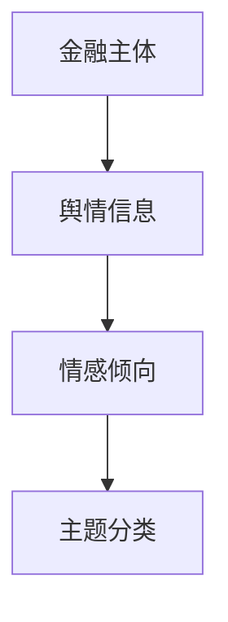
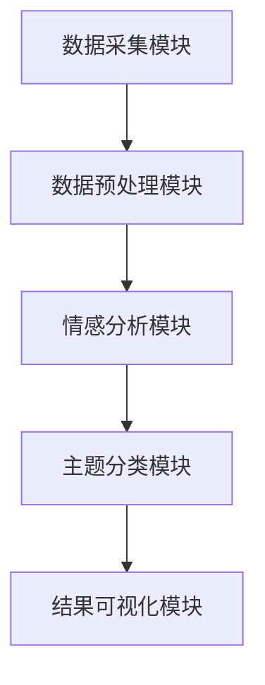

                 


# 《构建基于NLP的金融舆情监控平台》

> 关键词：自然语言处理（NLP）、金融舆情监控、情感分析、主题分类、文本挖掘、机器学习

> 摘要：本文将详细探讨如何利用自然语言处理技术构建一个高效的金融舆情监控平台。通过分析金融市场的信息需求，结合NLP的核心技术，提出一种基于深度学习的情感分析和主题分类方法，实现对金融市场信息的智能化监控与预警。本文从问题背景、技术原理、系统设计到项目实战，全面解析金融舆情监控平台的构建过程，并提供详细的实现方案与代码示例。

---

# 第一部分: 背景与核心概念

## 第1章: 金融舆情监控的背景与问题分析

### 1.1 问题背景

#### 1.1.1 金融市场的信息爆炸与数据洪流
金融市场每天产生海量的信息，包括新闻、社交媒体评论、公司公告、行业报告等。这些信息对投资者、机构和监管层的决策具有重要影响。然而，信息的多样性和复杂性使得手动分析变得极其困难。

#### 1.1.2 舆情监控的必要性与挑战
- **必要性**：及时捕捉市场情绪变化，识别潜在风险或机会。
- **挑战**：信息量大、来源分散、情感表达多样、数据清洗难度大。

#### 1.1.3 NLP技术在金融舆情监控中的作用
NLP技术能够自动化处理文本数据，提取关键词、主题和情感倾向，为金融决策提供数据支持。

---

### 1.2 问题描述

#### 1.2.1 金融舆情的定义与分类
- **定义**：金融市场中与特定主体（如公司、行业）相关的公开信息。
- **分类**：按来源分为新闻、社交媒体、公司公告；按内容分为正面、负面、中性。

#### 1.2.2 舆情监控的主要目标
- 提供实时市场情绪分析。
- 识别行业趋势和热点事件。
- 提供风险预警和投资建议。

#### 1.2.3 现有解决方案的局限性
- 传统舆情监控依赖人工分析，效率低。
- 基于规则的系统难以应对复杂的情感表达。

---

### 1.3 问题解决思路

#### 1.3.1 基于NLP的舆情分析方法
- 利用情感分析技术判断文本情感倾向。
- 使用主题分类技术识别文本主题。

#### 1.3.2 数据采集与处理流程
- 数据来源：新闻网站、社交媒体、公司公告。
- 数据清洗：去除噪声、补全缺失值。
- 数据预处理：分词、去停用词、词向量化。

#### 1.3.3 结果可视化与预警机制
- 情感趋势图：展示市场情绪变化。
- 风险预警：当负面情绪超过阈值时触发警报。

---

### 1.4 系统边界与外延

#### 1.4.1 系统功能边界
- 数据采集：从指定来源获取文本数据。
- 数据分析：情感分析、主题分类。
- 结果展示：可视化界面、预警通知。

#### 1.4.2 与相关系统的交互
- 与数据源（API）对接。
- 与用户界面（Dashboard）集成。

#### 1.4.3 系统的可扩展性与灵活性
- 支持多种数据源。
- 支持多种NLP模型切换。

---

### 1.5 核心概念与关系

#### 1.5.1 实体关系图（ER图）


#### 1.5.2 核心概念对比表
| 概念 | 定义 | 属性 |
|------|------|------|
| 舆情信息 | 金融市场中的公开信息 | 来源、时间、内容 |
| 情感倾向 | 文本的情感色彩 | 正向、负向、中性 |
| 主题分类 | 文本的主题归属 | 行业、公司、事件 |

---

### 1.6 本章小结

通过本章的分析，我们明确了金融舆情监控的核心目标和实现思路，并通过ER图和对比表展示了系统的核心概念及其关系。

---

## 第2章: NLP与金融舆情监控的核心概念

### 2.1 NLP技术简介

#### 2.1.1 NLP的基本概念
- **自然语言处理**：研究如何让计算机理解、生成人类语言的技术。
- **核心任务**：分词、词性标注、句法分析、情感分析、主题分类。

#### 2.1.2 常用NLP技术与工具
- **分词工具**：jieba、nltk。
- **情感分析工具**：vader、TextBlob。
- **主题分类工具**：LDA、BERT。

#### 2.1.3 NLP在金融领域的应用
- 股票价格预测。
- 风险评估。
- 市场情绪分析。

---

### 2.2 金融舆情监控的NLP模型

#### 2.2.1 基础NLP模型（如TF-IDF）
- **TF-IDF**：计算关键词的重要性。
- 实现步骤：
  1. 统计词频。
  2. 计算逆向文件频率（IDF）。
  3. 计算TF-IDF值。

#### 2.2.2 深度学习模型（如BERT）
- **BERT**：基于Transformer的预训练模型。
- 优势：上下文理解能力强。
- 实现步骤：
  1. 预训练BERT模型。
  2. 微调任务（情感分析、主题分类）。

#### 2.2.3 模型的优缺点对比
| 模型 | 优点 | 缺点 |
|------|------|------|
| TF-IDF | 实现简单 | 无法捕捉语义信息 |
| BERT | 上下文理解能力强 | 计算资源需求高 |

---

### 2.3 舆情分析的关键指标

#### 2.3.1 情感分析指标
- 正向情感占比。
- 负向情感占比。
- 中性情感占比。

#### 2.3.2 主题分类指标
- 主题相似度。
- 主题分布。

#### 2.3.3 实体识别指标
- 实体识别准确率。

---

### 2.4 本章小结

本章介绍了NLP技术在金融舆情监控中的应用，并对比了常用模型的优缺点，为后续实现奠定了基础。

---

# 第二部分: 算法原理与实现

---

## 第3章: NLP

### 3.1 情感分析算法原理

#### 3.1.1 情感分析的数学模型
- **公式**：$$ P(positive|text) = \frac{\sum_{i=1}^n w_i \cdot f_i}{\sum_{i=1}^n w_i} $$
  其中，$w_i$ 是词语的权重，$f_i$ 是词语的情感值。

#### 3.1.2 基于TF-IDF的情感分析实现
```python
from sklearn.feature_extraction.text import TfidfVectorizer

# 初始化模型
vectorizer = TfidfVectorizer()

# 训练模型
vectorizer.fit_transform(corpus)

# 预测情感
tfidf_scores = vectorizer.transform([text])
```

#### 3.1.3 基于BERT的情感分析实现
```python
from transformers import BertTokenizer, BertModel

# 初始化模型
tokenizer = BertTokenizer.from_pretrained('bert-base-uncased')
model = BertModel.from_pretrained('bert-base-uncased')

# 分词
inputs = tokenizer(text, return_tensors='np')

# 获取隐藏层输出
outputs = model(**inputs)
last_hidden_states = outputs.last_hidden_state

# 计算情感得分
score = last_hidden_states[:, 0, :].sum(axis=1)
```

---

### 3.2 主题分类算法原理

#### 3.2.1 主题分类的数学模型
- **公式**：$$ P(topic|text) = \prod_{i=1}^n P(word_i|topic) $$

#### 3.2.2 基于LDA的主题分类实现
```python
from sklearn.decomposition import LatentDirichletAllocation

# 初始化模型
lda = LatentDirichletAllocation(n_components=5, random_state=0)

# 训练模型
lda.fit(X)

# 获取主题分布
topic_dist = lda.transform(X)
```

---

## 第4章: 金融舆情监控的业务需求与技术实现

### 4.1 业务需求分析

#### 4.1.1 用户需求
- 投资者：实时监控市场情绪。
- 机构：识别行业趋势。

#### 4.1.2 功能需求
- 数据采集：接口调用、API爬取。
- 数据分析：情感分析、主题分类。
- 结果展示：可视化图表、预警通知。

---

### 4.2 技术实现方案

#### 4.2.1 数据采集模块
```python
import requests
from bs4 import BeautifulSoup

def fetch_news(url):
    response = requests.get(url)
    soup = BeautifulSoup(response.text, 'html.parser')
    articles = soup.find_all('article')
    texts = [article.text for article in articles]
    return texts
```

#### 4.2.2 数据预处理模块
```python
from nltk.tokenize import word_tokenize

def preprocess(texts):
    tokens = [word_tokenize(text) for text in texts]
    return tokens
```

#### 4.2.3 情感分析模块
```python
from transformers import pipeline

sentiment_analyzer = pipeline("sentiment-analysis")
scores = sentiment_analyzer(texts)
```

---

## 第5章: 系统架构设计

### 5.1 系统架构图


### 5.2 接口设计

#### 5.2.1 数据接口
- 数据输入格式：JSON格式的文本数据。
- API接口：RESTful API。

#### 5.2.2 模型接口
- 输入：预处理后的文本数据。
- 输出：情感倾向、主题分类结果。

---

## 第6章: 项目实战

### 6.1 环境搭建

#### 6.1.1 安装依赖
```bash
pip install numpy pandas scikit-learn transformers
```

### 6.2 核心实现

#### 6.2.1 数据采集
```python
import requests
from bs4 import BeautifulSoup

def fetch_stock_news():
    url = 'https://finance.yahoo.com'
    response = requests.get(url)
    soup = BeautifulSoup(response.text, 'html.parser')
    articles = soup.find_all('article')
    texts = [article.text for article in articles]
    return texts
```

#### 6.2.2 数据预处理
```python
from transformers import pipeline

def preprocess(texts):
    analyzer = pipeline("sentiment-analysis")
    results = analyzer(texts)
    return results
```

---

## 第7章: 总结与展望

### 7.1 总结
本文详细介绍了如何利用NLP技术构建金融舆情监控平台，从问题背景到技术实现，提供了完整的解决方案。

### 7.2 最佳实践
- 数据预处理是关键，确保数据质量。
- 选择合适的NLP模型，根据任务需求调整参数。
- 及时优化模型，提升准确率。

### 7.3 展望
未来，可以结合图神经网络，进一步提升舆情分析的准确性。

---

## 参考文献
（此处列出相关文献和工具文档）

---

作者：AI天才研究院/AI Genius Institute & 禅与计算机程序设计艺术 /Zen And The Art of Computer Programming

