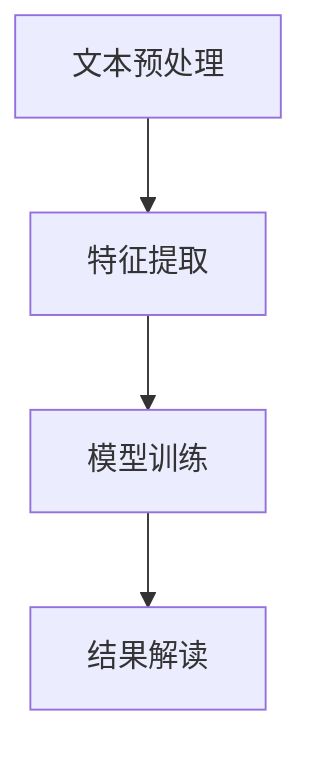
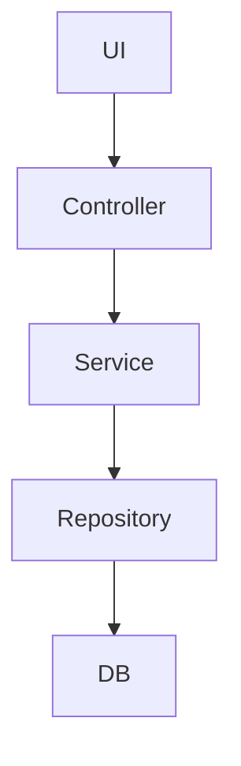

                 


# 《构建基于大模型的金融新闻分析引擎》

> 关键词：大模型、金融新闻分析、自然语言处理、系统架构、算法优化

> 摘要：本文将深入探讨如何利用大模型技术构建高效的金融新闻分析引擎。通过分析金融新闻的核心任务，结合大模型的算法原理与系统架构设计，提出了一种基于大模型的金融新闻分析解决方案。文章从背景介绍、核心概念、算法原理、系统架构到项目实战，全面阐述了构建基于大模型的金融新闻分析引擎的实现过程，并通过具体案例展示了系统的实际应用效果。

---

# 第1章: 金融新闻分析的背景与挑战

## 1.1 金融新闻分析的背景

### 1.1.1 金融市场的复杂性与信息需求
金融市场是一个高度复杂且动态变化的环境，投资者和机构需要实时获取、分析和解读大量金融新闻信息以做出决策。然而，金融新闻的海量性和专业性使得人工分析效率低下，且容易出错。

### 1.1.2 传统金融新闻分析的局限性
传统的金融新闻分析方法主要依赖于关键词匹配和简单的文本分类技术，难以捕捉文本中的语义信息和上下文关系，导致分析结果不够准确和全面。

### 1.1.3 大模型技术的引入与优势
大模型技术（如GPT、BERT等）在自然语言处理领域取得了突破性进展，具备强大的语义理解能力和上下文推理能力，为金融新闻分析提供了新的技术手段。

## 1.2 问题背景与目标

### 1.2.1 金融新闻分析的核心问题
金融新闻分析的核心问题是如何从大量非结构化文本中提取有价值的信息，包括情感分析、主题分类、实体识别等。

### 1.2.2 大模型在金融新闻分析中的应用目标
利用大模型技术实现金融新闻的自动化分析，提高分析效率和准确性，为投资者和机构提供及时、可靠的决策支持。

### 1.2.3 问题解决的边界与外延
金融新闻分析的边界包括新闻文本的结构化处理、关键词提取和语义分析；外延则涉及多语言支持、实时更新和模型的可解释性。

## 1.3 核心概念与联系

### 1.3.1 核心概念原理
金融新闻分析的核心概念包括文本预处理、特征提取、模型训练和结果解读。

### 1.3.2 核心概念属性特征对比表

| 概念         | 特征                  |
|--------------|-----------------------|
| 文本预处理    | 分词、去除停用词、词干提取 |
| 特征提取      | TF-IDF、Word2Vec、BERT嵌入 |
| 模型训练      | 监督学习、无监督学习    |
| 结果解读      | 情感极性、主题标签、实体识别 |

### 1.3.3 ER实体关系图（使用Mermaid）

```mermaid
# ER实体关系图
erd
    entity 股票 {
        key 股票代码
        attribute 名称, 行业, 市值
    }
    entity 新闻 {
        key 新闻ID
        attribute 标题, 内容, 时间
    }
    entity 事件 {
        key 事件ID
        attribute 类型, 描述
    }
    股票 -[1..n]-> 新闻
    新闻 -[1]-> 事件
```

## 1.4 本章小结

---

# 第2章: 大模型技术基础

## 2.1 大模型的定义与特点

### 2.1.1 大模型的定义
大模型是指基于深度学习的大型神经网络模型，具有 billions 级别的参数量，能够通过大量数据训练出强大的语义理解能力。

### 2.1.2 大模型的核心特点
- **大规模数据训练**：利用海量数据进行预训练，提升模型的泛化能力。
- **深度网络结构**：采用多层神经网络结构，提升模型的表达能力。
- **自监督学习**：通过预训练任务（如 masked language modeling）提升模型对上下文的理解能力。

### 2.1.3 大模型与传统模型的区别
| 特性         | 大模型                       | 传统模型                     |
|--------------|------------------------------|------------------------------|
| 参数量       | 大量（ billions级别）       | 较少（ thousands级别）       |
| 训练数据量    | 海量（ thousands of millions） | 较小（ hundreds of thousands） |
| 任务适应性   | 强大（支持多种任务）         | 较弱（适用于单一任务）        |

## 2.2 大模型的训练与优化

### 2.2.1 大模型的训练策略
- **分布式训练**：利用多GPU/多机器并行训练，加速模型收敛。
- **学习率调度**：采用学习率衰减策略（如AdamW优化器）。
- **数据增强**：通过文本数据增强技术（如随机删除词、打乱句子顺序）提升模型的鲁棒性。

### 2.2.2 大模型的优化方法
- **模型剪枝**：通过去除冗余参数降低模型复杂度。
- **知识蒸馏**：将大模型的知识迁移到小模型，提升小模型的性能。
- **量化技术**：通过量化技术（如8位整数量化）降低模型存储和计算成本。

### 2.2.3 大模型的评估指标
- **准确率**：分类任务中的正确预测比例。
- **F1分数**：综合考虑精确率和召回率。
- **困惑度（Perplexity）**：衡量模型对测试数据的拟合程度。

## 2.3 大模型的数学模型与公式

### 2.3.1 大模型的数学模型
大模型的数学模型通常基于转换器架构（Transformer），其核心公式包括注意力机制（Attention）和前馈网络（FFN）。

### 2.3.2 大模型的训练公式
$$ \text{Loss} = -\sum_{i=1}^{n} \log p(y_i | x_i, \theta) $$
其中，$x_i$ 是输入，$y_i$ 是标签，$\theta$ 是模型参数。

### 2.3.3 大模型的损失函数
$$ \text{损失函数} = \text{交叉熵损失} + \lambda \times \text{L2正则化} $$
其中，$\lambda$ 是正则化系数。

## 2.4 本章小结

---

# 第3章: 金融新闻分析的核心任务

## 3.1 金融新闻的情感分析

### 3.1.1 情感分析的定义与目标
情感分析旨在判断文本中表达的情感倾向（如正面、负面、中性）。

### 3.1.2 基于大模型的情感分析方法
- **预训练模型微调**：在金融领域数据上进行微调，提升模型的领域适应性。
- **情感词典结合**：结合情感词典和大模型进行情感分析，提升准确率。

### 3.1.3 情感分析的案例分析
以某公司财报新闻为例，分析新闻标题和内容的情感倾向。

## 3.2 金融新闻的主题分类

### 3.2.1 主题分类的定义与目标
主题分类旨在将新闻归类到特定的主题（如经济、科技、金融）。

### 3.2.2 基于大模型的主题分类方法
- **层次化主题分类**：先分类到大类，再细分到小类。
- **主题词提取**：利用主题模型（如LDA）提取主题关键词。

### 3.2.3 主题分类的案例分析
以某行业新闻为例，分析新闻的主题分类及其相关性。

## 3.3 金融新闻的实体识别

### 3.3.1 实体识别的定义与目标
实体识别旨在从文本中识别出重要的实体（如公司名称、人名、日期等）。

### 3.3.2 基于大模型的实体识别方法
- **预训练模型微调**：在金融领域数据上进行微调，提升实体识别的准确率。
- **规则结合**：结合金融领域的业务规则和大模型进行实体识别。

### 3.3.3 实体识别的案例分析
以某公司新闻为例，分析新闻中的实体识别及其关系。

## 3.4 本章小结

---

# 第4章: 金融新闻分析系统的架构设计

## 4.1 系统功能设计

### 4.1.1 系统功能模块划分
- **文本预处理模块**：负责文本分词、去停用词等预处理工作。
- **特征提取模块**：负责提取文本特征（如TF-IDF、BERT嵌入）。
- **模型训练模块**：负责大模型的训练和微调。
- **结果解读模块**：负责将模型输出转换为可理解的格式。

### 4.1.2 每个功能模块的实现目标
- **文本预处理模块**：提升文本的可处理性。
- **特征提取模块**：提取文本的语义特征。
- **模型训练模块**：优化模型的性能。
- **结果解读模块**：提升结果的可解释性。

### 4.1.3 功能模块之间的关系


## 4.2 系统架构设计

### 4.2.1 系统架构图（使用Mermaid）



## 4.3 系统接口设计

### 4.3.1 API接口设计
- **输入接口**：接收新闻文本和请求参数。
- **输出接口**：返回分析结果（如情感倾向、主题标签）。

### 4.3.2 接口交互流程
```mermaid
sequenceDiagram
    participant 用户
    participant 控制器
    participant 服务
    participant 数据库
    用户->控制器: 发送新闻文本
    控制器->服务: 提交请求
    服务->数据库: 查询预处理规则
    服务->数据库: 返回处理结果
    服务->控制器: 返回分析结果
    用户<-控制器: 收到结果
```

## 4.4 本章小结

---

# 第5章: 项目实战与案例分析

## 5.1 环境安装与配置

### 5.1.1 安装Python环境
使用Anaconda或virtualenv创建虚拟环境，并安装所需的Python包（如TensorFlow、PyTorch、Transformers）。

### 5.1.2 安装依赖库
```bash
pip install transformers numpy pandas scikit-learn
```

## 5.2 核心代码实现

### 5.2.1 文本预处理代码
```python
def preprocess_text(text):
    # 分词
    tokens = tokenizer.tokenize(text)
    # 去除停用词
    filtered_tokens = [token for token in tokens if token not in STOP_WORDS]
    return ' '.join(filtered_tokens)
```

### 5.2.2 模型训练代码
```python
from transformers import AutoModelForMaskedLM, AutoTokenizer

model = AutoModelForMaskedLM.from_pretrained('bert-base-cased')
tokenizer = AutoTokenizer.from_pretrained('bert-base-cased')
```

### 5.2.3 情感分析代码
```python
from transformers import pipeline

sentiment_analyzer = pipeline("sentiment-analysis")
result = sentiment_analyzer(text)[0]['label']
```

## 5.3 案例分析与解读

### 5.3.1 案例新闻文本
```python
news = "The company reported a significant increase in revenue, exceeding market expectations."
```

### 5.3.2 情感分析结果
$$ \text{Sentiment} = \text{positive} $$

## 5.4 本章小结

---

# 第6章: 最佳实践与总结

## 6.1 小结

### 6.1.1 核心知识点回顾
- 大模型在金融新闻分析中的应用。
- 系统架构设计与实现。

### 6.1.2 技术难点总结
- 大模型的训练与优化。
- 模型的可解释性问题。

## 6.2 注意事项

### 6.2.1 数据质量
确保训练数据的多样性和代表性，避免数据偏差。

### 6.2.2 模型调优
通过超参数优化和模型剪枝提升模型性能和效率。

### 6.2.3 结果验证
通过人工验证和自动化测试确保模型的准确性和稳定性。

## 6.3 拓展阅读

### 6.3.1 相关技术
- 大模型的推理优化。
- 金融领域的知识图谱构建。

### 6.3.2 实际应用
- 金融舆情监控系统。
- 智能投资组合管理。

## 6.4 本章小结

---

# 作者：AI天才研究院/AI Genius Institute & 禅与计算机程序设计艺术 /Zen And The Art of Computer Programming

