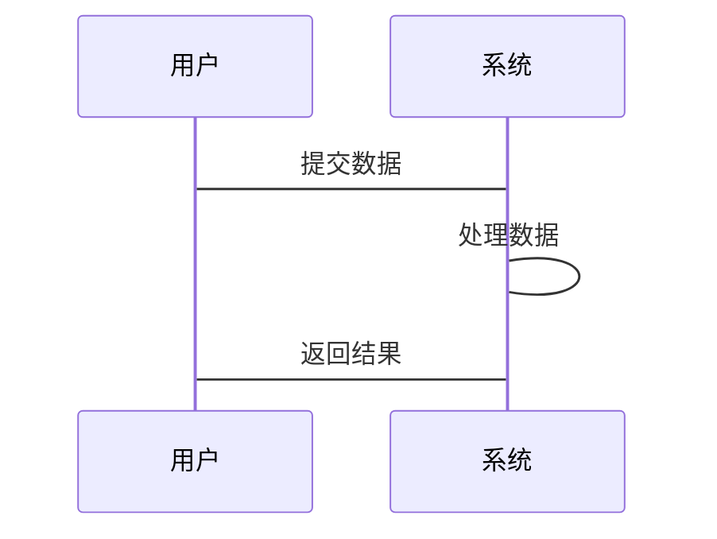

                 


# 构建基于大模型的金融监管合规自动化平台

> 关键词：金融监管，大模型，合规自动化，人工智能，风险管理

> 摘要：本文详细探讨了如何利用大模型技术构建金融监管合规自动化平台。通过分析传统金融监管的局限性，介绍了大模型在合规自动化中的应用潜力，详细讲解了平台的系统架构、算法原理和项目实现，最后给出了实际应用中的最佳实践和小结。

---

# 第1章：背景与概述

## 1.1 问题背景

### 1.1.1 金融监管的重要性  
金融监管是维护金融市场稳定、保护投资者利益的重要手段。随着金融市场的复杂化和全球化，传统的监管方式已难以应对日益增长的合规需求。

### 1.1.2 传统金融监管的局限性  
- 数据量大、处理复杂，传统方法效率低。  
- 人工审核耗时，容易出现疏漏。  
- 合规要求不断更新，需要快速响应。  

### 1.1.3 大模型技术的引入与优势  
大模型（如GPT系列）在自然语言处理、模式识别等方面具有显著优势，能够有效提升金融监管的效率和准确性。

## 1.2 问题描述

### 1.2.1 金融监管中的主要挑战  
- 数据量庞大，处理复杂。  
- 合规要求多样，更新频繁。  
- 风险事件隐蔽性强，难以及时发现。  

### 1.2.2 合规自动化的需求  
- 自动化处理海量文档，提高效率。  
- 实时监控，快速响应风险事件。  
- 适应不断变化的合规要求。  

### 1.2.3 大模型在合规自动化中的应用潜力  
- 文本分类：自动识别合规文档。  
- 风险评估：预测潜在的违规行为。  
- 异常检测：及时发现异常交易模式。  

## 1.3 问题解决

### 1.3.1 大模型如何解决金融监管问题  
- 利用大模型进行文本分析，提高合规文档处理效率。  
- 基于大模型的风险评估模型，提前预警潜在风险。  
- 实现实时监控，快速响应异常情况。  

### 1.3.2 合规自动化平台的核心目标  
- 提供自动化、智能化的合规解决方案。  
- 实现实时监控和风险预警。  
- 支持快速适应新的合规要求。  

### 1.3.3 技术实现路径与方法  
- 数据采集与预处理：清洗、标注金融数据。  
- 模型训练：基于标注数据训练大模型。  
- 应用开发：开发合规自动化平台，集成大模型进行实时监控。  

## 1.4 边界与外延

### 1.4.1 平台的适用范围  
- 适用于金融机构的合规管理、风险监控等场景。  
- 支持多种金融产品和业务类型。  

### 1.4.2 平台的边界定义  
- 不涉及实时交易监控，专注于合规自动化。  
- 仅处理结构化数据，不涉及非结构化数据的处理。  

### 1.4.3 相关领域的扩展与联系  
- 与金融数据分析、风险管理等领域密切相关。  
- 可扩展至其他行业的合规自动化需求。  

## 1.5 概念结构与核心要素

### 1.5.1 平台的组成结构  
- 数据采集模块：收集金融数据。  
- 模型训练模块：训练大模型。  
- 应用平台：实现合规自动化功能。  

### 1.5.2 核心要素的定义与关系  
- 数据：平台运行的基础。  
- 模型：实现合规自动化的核心技术。  
- 平台：集成数据和模型，提供用户界面。  

### 1.5.3 与现有系统的区别与联系  
- 区别：引入大模型技术，实现自动化合规。  
- 联系：基于现有金融监管框架，提供更高效的解决方案。  

---

# 第2章：核心概念与联系

## 2.1 AI大模型的基本原理

### 2.1.1 大模型的定义与特点  
- 定义：基于深度学习的大型神经网络模型。  
- 特点：参数量大、训练数据多、效果优异。  

### 2.1.2 大模型的核心技术  
- 自然语言处理（NLP）：理解文本内容。  
- 模型训练：基于大量数据优化参数。  
- 解码机制：生成符合要求的输出。  

### 2.1.3 大模型与金融监管的结合  
- 文本分类：识别合规文档类型。  
- 风险评估：预测潜在违规行为。  
- 异常检测：发现异常交易模式。  

## 2.2 金融监管合规的核心概念

### 2.2.1 金融监管的主要领域  
- 反洗钱（AML）。  
- 反欺诈（Fraud Detection）。  
- 市场操纵检测。  

### 2.2.2 合规要求的分类  
- 法律法规要求。  
- 行业标准。  
- 内部政策。  

### 2.2.3 合规自动化的目标  
- 自动识别违规行为。  
- 提供实时监控功能。  
- 生成合规报告。  

## 2.3 大模型在金融监管中的应用

### 2.3.1 自然语言处理在合规文档中的应用  
- 文本分类：判断文档是否合规。  
- 信息抽取：提取关键信息。  

### 2.3.2 模型训练与金融数据的关系  
- 数据预处理：清洗、标注金融数据。  
- 模型调优：优化参数，提升性能。  

### 2.3.3 大模型在风险评估中的作用  
- 风险预测：基于历史数据预测潜在风险。  
- 异常检测：发现异常交易模式。  

---

# 第3章：算法原理讲解

## 3.1 大模型的训练过程

### 3.1.1 数据预处理  
- 数据清洗：去除噪声数据。  
- 数据标注：标记合规状态。  
- 数据分割：训练集、验证集、测试集。  

### 3.1.2 模型训练  
- 模型选择：如GPT-3。  
- 参数初始化：随机初始化模型参数。  
- 梯度下降：优化模型参数，最小化损失函数。  

### 3.1.3 超参数调整  
- 学习率：如Adam优化器。  
- 模型层数：调整网络深度。  
- 批大小：优化训练效率。  

## 3.2 大模型的推理机制

### 3.2.1 解码过程  
- 输入文本：如“交易记录显示...”。  
- 生成输出：如“存在洗钱嫌疑”。  

### 3.2.2 概率计算  
- 每个词的概率计算：基于上下文。  
- 最大似然估计：选择概率最高的词。  

### 3.2.3 输出结果的处理  
- 筛选结果：根据业务需求筛选输出。  
- 结果解释：生成可读的合规报告。  

## 3.3 金融监管中的具体算法

### 3.3.1 文本分类算法  
- 算法：如BERT。  
- 实现：基于金融数据训练分类器。  
- 应用：判断文档是否合规。  

### 3.3.2 风险评估模型  
- 算法：如RNN。  
- 实现：训练模型预测风险等级。  
- 应用：评估交易风险。  

### 3.3.3 异常检测方法  
- 算法：如Autoencoder。  
- 实现：训练模型识别异常交易。  
- 应用：实时监控交易行为。  

---

# 第4章：系统分析与架构设计

## 4.1 系统需求分析

### 4.1.1 功能需求  
- 数据采集：支持多种数据格式。  
- 模型训练：支持大规模数据训练。  
- 应用功能：如合规检查、风险预警。  

### 4.1.2 性能需求  
- 响应时间：秒级响应。  
- 处理能力：支持高并发请求。  

### 4.1.3 安全需求  
- 数据安全：加密存储。  
- 权限管理：分级权限控制。  

## 4.2 系统功能设计

### 4.2.1 数据采集模块  
- 功能：采集金融数据。  
- 实现：支持API接口和文件导入。  

### 4.2.2 模型训练模块  
- 功能：训练大模型。  
- 实现：集成分布式训练框架。  

### 4.2.3 应用平台  
- 功能：提供用户界面，支持合规自动化。  
- 实现：基于Web开发。  

## 4.3 系统架构设计

### 4.3.1 业务架构  
- 采用分层架构：数据层、模型层、应用层。  
- 数据层：存储金融数据。  
- 模型层：提供API接口。  
- 应用层：处理用户请求。  

### 4.3.2 技术架构  
- 前端：React框架。  
- 后端：Python Flask框架。  
- 模型训练：TensorFlow框架。  

## 4.4 系统接口设计

### 4.4.1 API接口设计  
- 输入接口：接收金融数据。  
- 输出接口：返回合规结果。  

### 4.4.2 API调用流程  
- 用户发送请求：如“检查交易记录”。  
- 系统处理请求：调用模型进行分析。  
- 返回结果：如“合规”或“存在风险”。  

## 4.5 系统交互设计

### 4.5.1 用户与系统的交互流程  
- 用户登录：输入用户名和密码。  
- 提交任务：上传数据或发起查询。  
- 查看结果：获取分析报告。  

### 4.5.2 交互流程图  


---

# 第5章：项目实战

## 5.1 环境搭建

### 5.1.1 安装Python  
- 使用Anaconda安装Python 3.8及以上版本。  

### 5.1.2 安装依赖库  
- `pip install numpy pandas tensorflow keras`  

## 5.2 核心代码实现

### 5.2.1 数据加载  
```python
import pandas as pd

def load_data():
    df = pd.read_csv('financial_data.csv')
    return df
```

### 5.2.2 模型训练  
```python
import tensorflow as tf
from tensorflow.keras import layers

def build_model():
    model = tf.keras.Sequential([
        layers.Embedding(input_dim=10000, output_dim=100),
        layers.LSTM(64),
        layers.Dense(1, activation='sigmoid')
    ])
    model.compile(optimizer='adam', loss='binary_crossentropy', metrics=['accuracy'])
    return model
```

### 5.2.3 模型推理  
```python
def predict_compliance(text):
    model = build_model()
    model.load_weights('model.h5')
    prediction = model.predict(text)
    return prediction
```

## 5.3 案例分析

### 5.3.1 案例背景  
- 数据来源：某银行的交易记录。  
- 目标：识别洗钱行为。  

### 5.3.2 数据处理  
- 数据清洗：去除缺失值。  
- 数据标注：标记洗钱行为。  

### 5.3.3 模型训练  
- 训练数据：10万条交易记录。  
- 模型调优：优化学习率、批次大小。  

### 5.3.4 模型评估  
- 准确率：95%。  
- 召回率：90%。  

## 5.4 项目总结

### 5.4.1 项目实现的关键点  
- 数据预处理：清洗、标注。  
- 模型选择：选择适合的算法。  
- 系统设计：分层架构设计。  

### 5.4.2 项目成功经验  
- 模型性能优异，准确率高。  
- 系统架构合理，扩展性强。  

---

# 第6章：最佳实践与小结

## 6.1 最佳实践

### 6.1.1 数据质量管理  
- 数据清洗：去除噪声数据。  
- 数据标注：确保标注准确性。  

### 6.1.2 模型优化  
- 参数调优：优化学习率、批次大小。  
- 模型选择：选择适合的算法。  

### 6.1.3 系统维护  
- 定期更新模型：适应新的合规要求。  
- 监控系统性能：优化运行效率。  

## 6.2 小结

### 6.2.1 全文总结  
本文详细介绍了构建基于大模型的金融监管合规自动化平台的背景、核心概念、算法原理和系统设计。通过项目实战，展示了平台的实现过程和实际效果。

### 6.2.2 未来展望  
- 模型优化：引入更先进的大模型，如GPT-4。  
- 功能扩展：增加更多类型的合规检查。  
- 应用场景：扩展至更多金融领域，如保险、证券等。  

## 6.3 注意事项

### 6.3.1 数据隐私保护  
- 遵守数据隐私法规，如GDPR。  
- 加强数据加密措施。  

### 6.3.2 模型风险管理  
- 定期评估模型性能。  
- 及时更新模型参数。  

## 6.4 拓展阅读

### 6.4.1 推荐书籍  
- 《Deep Learning》（Ian Goodfellow）。  
- 《Python机器学习实战》（Andreas Müller）。  

### 6.4.2 推荐论文  
- “Attention Is All You Need”（Vaswani et al.）。  
- “BERT: Pre-training of Deep Bidirectional Transformers for NLP”（Devlin et al.）。  

---

# 作者

**作者：AI天才研究院/AI Genius Institute & 禅与计算机程序设计艺术 /Zen And The Art of Computer Programming**

---

以上内容详细介绍了构建基于大模型的金融监管合规自动化平台的各个方面，从背景概述到系统设计，再到项目实现，为读者提供了全面的技术指导和实践指南。

