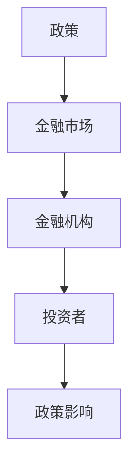
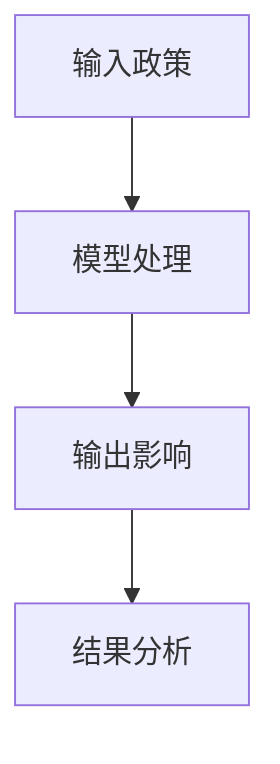
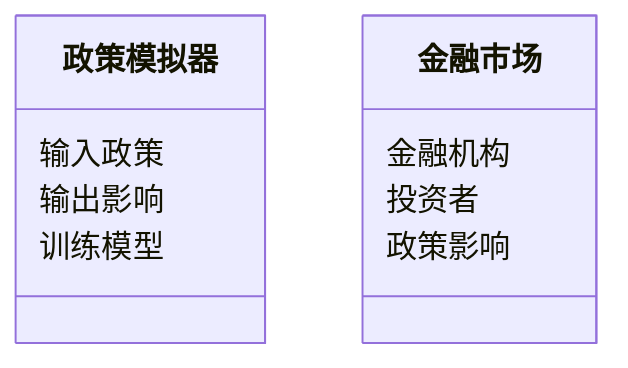
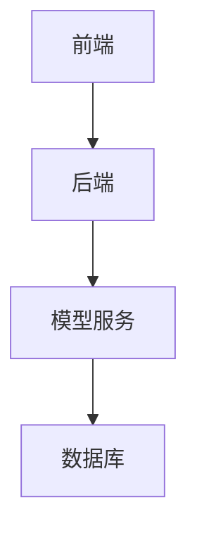
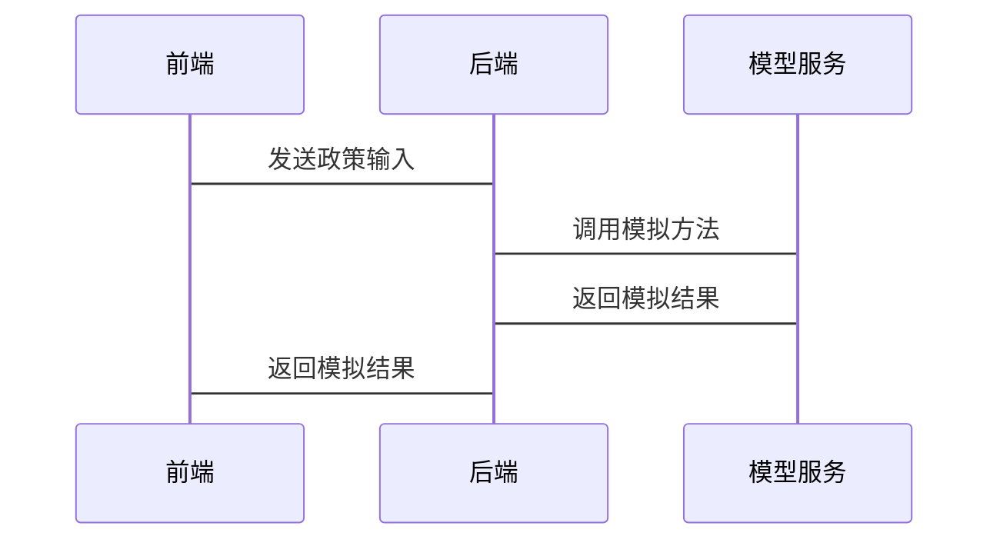

                 


# 构建基于大模型的金融监管政策影响模拟器

> 关键词：大模型，金融监管，政策模拟，风险管理，机器学习

> 摘要：本文详细探讨了如何构建基于大模型的金融监管政策影响模拟器。通过分析金融监管的重要性、政策变化的复杂性，以及传统模拟方法的局限性，本文提出了一种基于大模型的解决方案。文章详细阐述了模拟器的核心概念、算法原理、系统架构设计，并通过实际案例展示了如何实现和应用该模拟器。最后，本文提供了最佳实践和注意事项，帮助读者更好地理解和应用该技术。

---

## 第一部分: 金融监管政策影响模拟器的背景与核心概念

### 第1章: 问题背景与描述

#### 1.1 问题背景
##### 1.1.1 金融监管的重要性
金融监管是维护金融市场稳定和保护投资者利益的重要手段。随着金融市场的复杂化和全球化，金融监管的难度和复杂性也在不断增加。政策制定者需要及时了解新政策的潜在影响，以确保政策的实施不会引发系统性风险。

##### 1.1.2 政策变化对金融市场的复杂性
政策的变化往往会对金融市场产生深远的影响。例如，货币政策的调整可能会影响市场的流动性，而监管政策的收紧可能会影响金融机构的运营模式。然而，由于市场的复杂性和政策的多维度影响，传统的政策模拟方法难以准确捕捉这些影响。

##### 1.1.3 传统政策模拟的局限性
传统的政策模拟方法通常基于静态模型或简单的动态模型，难以处理金融市场的复杂性和不确定性。这些方法往往忽略了市场的互动性和反馈机制，导致模拟结果的准确性和可靠性较低。

#### 1.2 问题描述
##### 1.2.1 政策模拟的定义
政策模拟是指通过数学模型和计算机技术，模拟政策实施后的市场反应和经济影响。本文关注的是金融监管政策的模拟，即通过模拟政策实施后的市场反应，评估政策的效果。

##### 1.2.2 当前政策模拟的主要挑战
当前的政策模拟面临以下挑战：
1. 市场的复杂性和不确定性。
2. 数据的稀缺性和不完整性。
3. 模型的简化和假设与实际情况的偏差。

##### 1.2.3 基于大模型的政策模拟的优势
基于大模型的政策模拟具有以下优势：
1. 能够处理大规模、高维度的数据。
2. 可以捕捉市场中的复杂关系和非线性关系。
3. 能够实时更新模型以反映最新的市场动态。

#### 1.3 问题解决与边界
##### 1.3.1 基于大模型的政策模拟解决方案
本文提出了一种基于大模型的金融监管政策影响模拟器，该模拟器能够通过处理大量的金融市场数据，预测政策实施后的市场反应。

##### 1.3.2 模拟器的边界与外延
模拟器的边界包括：
1. 模拟的政策范围：限于金融监管政策。
2. 模拟的时间范围：限于短期市场反应。
3. 模拟的市场范围：限于特定的金融市场。

##### 1.3.3 核心概念与组成要素
模拟器的核心概念包括：
1. 政策输入：金融监管政策。
2. 市场反应：金融机构和投资者的行为变化。
3. 模拟结果：市场指标的变化，如股价波动、交易量变化等。

### 第2章: 基于大模型的金融监管政策影响模拟器的核心概念

#### 2.1 核心概念原理
##### 2.1.1 大模型在政策模拟中的作用
大模型通过深度学习技术，能够捕捉市场中的复杂关系和非线性关系，从而提供更准确的政策模拟结果。

##### 2.1.2 金融监管政策的多维度影响
金融监管政策可能会影响市场的多个方面，包括：
1. 市场参与者的行为。
2. 市场的流动性。
3. 市场的稳定性。

##### 2.1.3 模拟器的输入输出关系
模拟器的输入是金融监管政策，输出是政策实施后的市场反应。

#### 2.2 核心概念特征对比
##### 2.2.1 对比表格
| 对比维度 | 传统模拟方法 | 基于大模型的模拟器 |
|----------|---------------|---------------------|
| 数据需求 | 数据量小，需求简单 | 数据量大，需求多样 |
| 模型复杂度 | 模型简单，线性关系为主 | 模型复杂，非线性关系为主 |
| 模拟精度 | 精度低，误差较大 | 精度高，误差较小 |

#### 2.3 实体关系图
使用Mermaid流程图表示实体关系：



---

## 第二部分: 基于大模型的政策模拟器算法原理

### 第3章: 基于大模型的政策模拟器算法原理

#### 3.1 算法原理概述
##### 3.1.1 大模型的基本工作原理
大模型通过深度学习技术，从大量数据中学习市场规律，并生成预测结果。

##### 3.1.2 政策模拟器的训练流程
1. 数据准备：收集金融监管政策和市场反应数据。
2. 模型训练：使用大模型对数据进行训练，学习政策与市场反应之间的关系。
3. 模型验证：通过历史数据验证模型的准确性。
4. 模型部署：将模型部署到模拟器中，供政策制定者使用。

##### 3.1.3 模拟器的推理机制
1. 输入政策：将政策输入到模拟器中。
2. 模型处理：模型对政策进行分析，生成预测结果。
3. 输出结果：输出政策实施后的市场反应。

#### 3.2 算法流程图
使用Mermaid流程图表示算法流程：



#### 3.3 数学模型与公式
##### 3.3.1 模型输入表示
$$输入政策 = \{x_1, x_2, ..., x_n\}$$

##### 3.3.2 模型输出表示
$$输出影响 = f(x)$$

##### 3.3.3 模型训练目标
$$\min_{\theta} \sum_{i=1}^m (y_i - f_\theta(x_i))^2$$
其中，$y_i$是真实结果，$f_\theta(x_i)$是模型预测结果。

#### 3.4 举例说明
##### 3.4.1 示例政策输入
假设政策是“提高银行资本充足率”，输入到模型中。

##### 3.4.2 示例输出结果
模型预测的结果可能是“银行股股价下跌，市场流动性下降”。

##### 3.4.3 示例训练过程
使用历史数据训练模型，历史数据包括过去发布的政策及其市场反应。

---

## 第三部分: 金融监管政策模拟器的系统分析与架构设计

### 第4章: 金融监管政策模拟器的系统分析与架构设计

#### 4.1 问题场景介绍
##### 4.1.1 政策模拟的典型场景
政策模拟的典型场景包括：
1. 新政策发布前的模拟测试。
2. 现有政策调整后的模拟测试。

##### 4.1.2 模拟器的应用场景
模拟器可以应用于以下场景：
1. 政策制定前的风险评估。
2. 政策实施后的效果评估。
3. 不同政策组合的比较分析。

##### 4.1.3 系统的目标与范围
系统的目标是提供一个高效的政策模拟工具，帮助政策制定者更好地理解和预测政策的市场反应。系统的范围包括政策输入、模型处理和结果输出。

#### 4.2 系统功能设计
##### 4.2.1 领域模型
使用Mermaid类图表示领域模型：



#### 4.3 系统架构设计
##### 4.3.1 系统架构图
使用Mermaid架构图表示系统架构：



#### 4.4 系统接口设计
##### 4.4.1 接口描述
1. 前端接口：接收用户输入的政策，并返回模拟结果。
2. 后端接口：接收前端的政策输入，调用模型服务进行模拟，并将结果返回给前端。

##### 4.4.2 交互流程图
使用Mermaid序列图表示交互流程：



---

## 第四部分: 项目实战

### 第5章: 项目实战

#### 5.1 环境安装
##### 5.1.1 安装Python
```bash
python --version
```

##### 5.1.2 安装依赖库
```bash
pip install numpy pandas tensorflow
```

#### 5.2 核心代码实现
##### 5.2.1 数据准备
```python
import numpy as np
import pandas as pd

# 加载数据
data = pd.read_csv('policy_data.csv')
```

##### 5.2.2 模型训练
```python
import tensorflow as tf

# 定义模型
model = tf.keras.Sequential([
    tf.keras.layers.Dense(64, activation='relu'),
    tf.keras.layers.Dense(1, activation='linear')
])

# 编译模型
model.compile(optimizer='adam', loss='mse')
```

##### 5.2.3 模型预测
```python
# 预测结果
predictions = model.predict(data)
```

#### 5.3 案例分析
##### 5.3.1 案例描述
假设政策是“限制银行杠杆率”，模拟器预测的结果是“银行股股价下跌，市场流动性下降”。

##### 5.3.2 数据分析
分析预测结果与实际市场的差异，评估模型的准确性。

##### 5.3.3 模型优化
根据分析结果，优化模型的参数或结构，提高预测精度。

---

## 第五部分: 最佳实践与注意事项

### 第6章: 最佳实践

#### 6.1 最佳实践
##### 6.1.1 数据质量管理
确保数据的准确性和完整性，避免数据偏差。

##### 6.1.2 模型调优
根据实际需求，调整模型的结构和参数，提高预测精度。

##### 6.1.3 模型解释性
提供模型的解释性，帮助政策制定者更好地理解模拟结果。

### 6.2 小结

#### 6.3 注意事项
##### 6.3.1 数据隐私
注意数据隐私问题，确保数据的合法使用。

##### 6.3.2 模型局限性
认识到模型的局限性，避免过度依赖模型结果。

##### 6.3.3 模型更新
定期更新模型，确保模型的准确性和时效性。

### 6.4 拓展阅读
推荐阅读以下书籍和论文：
1. 《Deep Learning》
2. 《金融监管与风险管理》
3. 相关学术论文。

---

## 作者信息

作者：AI天才研究院/AI Genius Institute & 禅与计算机程序设计艺术 /Zen And The Art of Computer Programming

---

**本文详细讲解了如何构建基于大模型的金融监管政策影响模拟器，涵盖了背景介绍、核心概念、算法原理、系统架构设计和项目实战等内容。通过本文，读者可以全面了解如何利用大模型技术，提升金融监管政策模拟的准确性和效率。**

