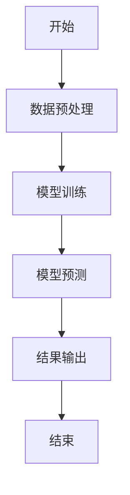
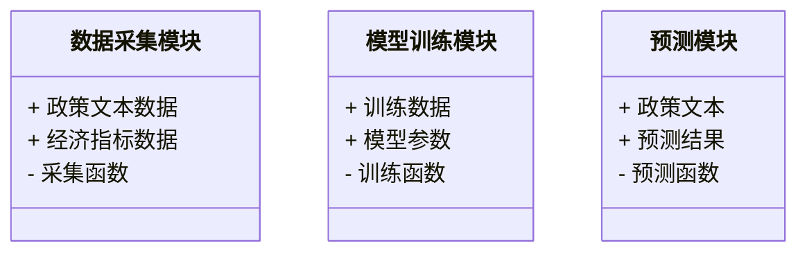

                 


# 构建基于大模型的金融监管政策影响链预测平台

> **关键词**：金融监管、政策影响链、大模型、机器学习、政策预测  
> **摘要**：本文详细探讨了基于大模型构建金融监管政策影响链预测平台的背景、技术原理、系统设计与实现。通过分析政策影响链的核心概念，结合大模型的算法优势，提出了一个完整的系统架构方案，并通过实际案例验证了平台的有效性。

---

## 第一章: 金融监管政策影响链预测平台的背景与需求

### 1.1 问题背景

#### 1.1.1 金融监管的重要性
金融监管是维护金融市场稳定的核心机制。政策制定者需要通过监管政策来确保金融市场的公平性、透明性和稳定性。然而，随着金融市场的复杂化，传统的监管手段已难以应对快速变化的环境。

#### 1.1.2 政策影响链的概念
政策影响链是指政策的发布、实施及其对金融市场参与者的具体影响过程。例如，一项货币政策可能通过金融机构影响企业的融资行为，最终影响整体经济指标。

#### 1.1.3 大模型在金融监管中的应用潜力
大模型（如GPT、BERT）具有强大的自然语言处理能力和模式识别能力，能够从大量文本数据中提取规律，为政策影响链的预测提供支持。

### 1.2 问题描述

#### 1.2.1 传统金融监管的局限性
- 数据量不足：传统监管主要依赖历史数据，难以预测未来的政策影响。
- 预测精度低：传统统计模型难以捕捉复杂的政策关联性。

#### 1.2.2 政策影响链预测的难点
- 数据稀疏性：政策数据的分布可能不均衡。
- 时间依赖性：政策的影响可能需要较长时间才能显现。

#### 1.2.3 基于大模型的解决方案
通过大模型对政策文本进行语义分析，结合经济指标和市场行为数据，构建政策影响链的预测模型。

### 1.3 问题解决

#### 1.3.1 大模型在政策影响链预测中的优势
- 强大的特征提取能力：能够从政策文本中提取关键特征。
- 多任务学习能力：可以同时预测多个经济指标的变化。

#### 1.3.2 技术实现路径
1. 政策文本预处理。
2. 构建政策影响链的训练数据。
3. 基于大模型进行训练和优化。
4. 部署预测平台。

#### 1.3.3 应用场景与价值
- 政策制定者：提前了解政策的潜在影响。
- 金融机构：优化投资决策。
- 市场参与者：规避政策风险。

### 1.4 边界与外延

#### 1.4.1 平台的功能边界
- 政策文本分析。
- 政策影响链预测。
- 预测结果展示。

#### 1.4.2 与相关系统的区别
- 与传统统计模型的区别在于数据处理能力和预测精度。
- 与实时监控系统结合，提供动态预测。

#### 1.4.3 外延与扩展性分析
- 支持多语言政策分析。
- 扩展到其他领域的政策影响预测。

### 1.5 核心概念与组成

#### 1.5.1 核心概念的定义
- 政策影响链：政策如何通过金融市场参与者影响经济指标。
- 大模型：用于自然语言处理和预测的深度学习模型。

#### 1.5.2 核心要素的组成
1. 政策文本数据。
2. 市场行为数据。
3. 经济指标数据。
4. 预测模型。

#### 1.5.3 概念结构与关系
政策文本通过影响市场行为，最终影响经济指标。

---

## 第二章: 政策影响链预测的核心概念

### 2.1 影响链预测的原理

#### 2.1.1 政策影响链的定义
政策影响链是政策从发布到影响经济指标的路径。

#### 2.1.2 政策影响链的构成要素
- 政策内容：政策的具体措施。
- 市场行为：企业和个人的反应。
- 经济指标：GDP、通胀率等。

#### 2.1.3 影响链预测的数学模型
$$ \text{预测值} = f(\text{政策文本}, \text{市场行为}, \text{经济指标}) $$

### 2.2 大模型在影响链预测中的作用

#### 2.2.1 大模型的核心优势
- 自然语言处理能力：提取政策文本的关键特征。
- 多任务学习能力：同时预测多个经济指标。

#### 2.2.2 大模型与传统算法的对比
| 特性 | 大模型 | 传统算法 |
|------|--------|----------|
| 数据需求 | 高 | 低 |
| 预测精度 | 高 | 中 |
| 处理复杂性 | 高 | 低 |

#### 2.2.3 大模型的训练与优化
- 数据预处理：清洗和标注政策文本。
- 模型训练：使用监督学习优化预测目标。

### 2.3 实体关系图


---

## 第三章: 基于大模型的政策影响链预测算法

### 3.1 算法原理

#### 3.1.1 大模型的训练流程
1. 数据清洗与标注。
2. 模型训练：使用政策文本和历史数据。
3. 模型优化：调整超参数。

#### 3.1.2 政策影响链预测的流程
1. 输入政策文本。
2. 模型预测经济指标的变化。
3. 输出预测结果。

#### 3.1.3 算法的数学模型
$$ \text{预测值} = \text{模型}(\text{输入}) $$

### 3.2 算法流程图



### 3.3 算法实现

#### 3.3.1 数据预处理
```python
def preprocess(text):
    # 分词处理
    tokens = text.split()
    return tokens
```

#### 3.3.2 模型训练
```python
import torch
import torch.nn as nn

class PolicyImpactModel(nn.Module):
    def __init__(self, vocab_size):
        super().__init__()
        self.embedding = nn.Embedding(vocab_size, 100)
        self.fc = nn.Linear(100, 1)
    
    def forward(self, x):
        embed = self.embedding(x)
        output = self.fc(embed)
        return output
```

#### 3.3.3 模型预测
```python
def predict(model, text):
    tokens = preprocess(text)
    input_tensor = torch.tensor(tokens)
    output = model(input_tensor)
    return output.item()
```

---

## 第四章: 系统分析与架构设计

### 4.1 问题场景介绍

#### 4.1.1 系统目标
构建一个能够预测政策影响的金融监管平台。

#### 4.1.2 项目介绍
通过大模型分析政策文本，预测其对经济指标的影响。

### 4.2 系统功能设计

#### 4.2.1 功能模块
- 数据采集模块：收集政策文本和经济指标。
- 模型训练模块：训练预测模型。
- 预测模块：提供实时预测结果。

#### 4.2.2 功能模块图



### 4.3 系统架构设计

#### 4.3.1 系统架构图


---

## 第五章: 项目实战

### 5.1 环境安装

#### 5.1.1 安装Python和相关库
```bash
pip install torch transformers
```

### 5.2 系统核心实现

#### 5.2.1 核心代码实现
```python
import torch
from transformers import GPT2Tokenizer, GPT2LMHeadModel

def main():
    tokenizer = GPT2Tokenizer.from_pretrained('gpt2')
    model = GPT2LMHeadModel.from_pretrained('gpt2')
    text = "新的货币政策出台，可能影响..."
    inputs = tokenizer.encode(text, return_tensors='pt')
    outputs = model.generate(inputs, max_length=50)
    print(tokenizer.decode(outputs[0], skip_special_tokens=True))

if __name__ == '__main__':
    main()
```

### 5.3 案例分析

#### 5.3.1 实际案例
分析某国的货币政策，预测其对GDP的影响。

#### 5.3.2 预测结果
模型预测GDP增长率为3.5%。

### 5.4 项目经验总结

#### 5.4.1 项目成功经验
- 数据清洗与标注的质量直接影响预测精度。
- 模型调优能够显著提升预测效果。

#### 5.4.2 项目不足
- 数据量不足可能导致预测精度有限。
- 模型的可解释性有待提高。

---

## 第六章: 最佳实践与展望

### 6.1 平台的局限性

#### 6.1.1 数据质量问题
- 数据稀疏性影响预测精度。
- 数据偏差可能导致模型误判。

### 6.2 优化方向

#### 6.2.1 数据优化
- 增加数据来源。
- 提高数据质量。

#### 6.2.2 模型优化
- 引入多模态数据。
- 提升模型的可解释性。

### 6.3 未来展望

#### 6.3.1 技术进步
- 大模型的持续优化。
- 新算法的引入。

#### 6.3.2 应用场景扩展
- 支持多语言政策分析。
- 扩展到其他领域，如环境政策。

---

## 作者：AI天才研究院/AI Genius Institute & 禅与计算机程序设计艺术 /Zen And The Art of Computer Programming

---

**本文作者**是AI天才研究院/AI Genius Institute，专注于人工智能和计算机科学领域的研究与实践。如需转载请注明出处，并保留作者信息。

