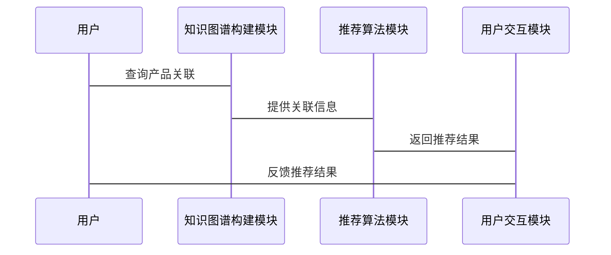

                 


# 构建基于知识图谱的金融产品关联推荐引擎

**关键词**：知识图谱、推荐系统、金融产品、关联推荐、深度学习

**摘要**：  
本文详细介绍了如何构建基于知识图谱的金融产品关联推荐引擎。首先，从背景介绍入手，阐述了知识图谱和推荐系统的基本概念及其在金融领域的应用。接着，深入分析了知识图谱与推荐系统的核心概念及其联系，通过对比和图示帮助读者理解两者的关系。然后，详细讲解了构建知识图谱和推荐系统的算法原理，包括知识抽取、构建、推理等步骤，以及协同过滤、深度学习等推荐算法。随后，从系统分析与架构设计的角度，展示了推荐引擎的整体架构、功能模块及交互流程。通过实际项目实战，提供了环境配置、代码实现和案例分析，帮助读者掌握实际应用。最后，总结了最佳实践经验和注意事项，展望了未来发展方向。

---

## 第1章 背景介绍

### 1.1 知识图谱与推荐系统概述

#### 1.1.1 知识图谱的定义与特点
知识图谱是一种以结构化的形式表示知识的网络，由节点（实体）和边（关系）组成。其特点包括：
- **结构化**：实体和关系明确，便于计算机理解和推理。
- **语义丰富**：通过关系和属性描述，提供上下文信息。
- **动态更新**：支持实时更新，保持信息的准确性。

#### 1.1.2 推荐系统的定义与特点
推荐系统是一种基于用户行为和偏好，预测用户感兴趣内容的技术。其特点包括：
- **个性化**：根据用户历史行为生成定制化推荐。
- **实时性**：快速响应用户需求，提供实时推荐。
- **可扩展性**：适用于大规模数据和用户。

#### 1.1.3 金融产品推荐的背景与需求
随着金融产品的多样化，用户需求日益复杂，传统的推荐系统难以满足深度关联推荐的需求。知识图谱的引入为金融产品推荐提供了语义丰富、关联性强的基础，能够有效提升推荐的准确性和可解释性。

### 1.2 知识图谱在金融领域的应用

#### 1.2.1 知识图谱在金融产品分析中的作用
- **产品关联分析**：通过知识图谱识别相关金融产品的关联关系，帮助用户发现潜在的产品组合。
- **风险评估**：基于产品间的关联性，评估风险并提供预警。

#### 1.2.2 金融产品关联推荐的必要性
- **提升用户体验**：通过关联推荐，为用户提供更精准的产品信息。
- **优化业务流程**：帮助金融机构更高效地推广产品，提升销售效率。

#### 1.2.3 知识图谱与推荐系统的结合
- **数据表示**：知识图谱为推荐系统提供结构化数据，增强推荐的语义理解。
- **推荐优化**：利用知识图谱的关联性，优化推荐算法，提升推荐效果。

### 1.3 本章小结
本章介绍了知识图谱和推荐系统的基本概念，分析了它们在金融领域的应用价值，并强调了两者结合的重要性。

---

## 第2章 核心概念与联系

### 2.1 知识图谱的核心概念

#### 2.1.1 实体与关系的定义
- **实体**：知识图谱中的基本单位，代表具体的对象或概念。
- **关系**：描述实体之间的关联，如“投资于”、“属于”等。

#### 2.1.2 知识图谱的构建过程
1. **知识抽取**：从文本中提取实体和关系。
2. **知识融合**：将多个来源的知识整合到统一的知识图谱中。
3. **知识推理**：通过已有的知识推导新的知识。

#### 2.1.3 知识图谱的存储与查询
- **存储方式**：使用图数据库（如Neo4j）存储实体和关系。
- **查询语言**：使用SPARQL进行语义查询。

### 2.2 推荐系统的核心概念

#### 2.2.1 推荐算法的分类
- **基于协同过滤**：根据用户相似性推荐。
- **基于内容推荐**：基于产品属性推荐。
- **基于深度学习**：利用神经网络模型进行推荐。

#### 2.2.2 协同过滤的推荐
- **基于用户的协同过滤**：寻找与当前用户相似的用户，推荐他们喜欢的产品。
- **基于物品的协同过滤**：分析产品之间的相似性，推荐相关产品。

#### 2.2.3 深度学习推荐模型
- **神经网络模型**：如Deep Neural Networks，用于处理复杂的关联关系。

### 2.3 知识图谱与推荐系统的联系

#### 2.3.1 知识图谱在推荐中的作用
- **语义理解**：提供实体和关系的语义信息，增强推荐的准确性。
- **关联推理**：通过知识图谱推理潜在关联，发现新的推荐机会。

#### 2.3.2 知识图谱增强推荐的效果
- **提升准确性**：通过语义信息减少推荐的随机性。
- **增强可解释性**：推荐结果可以通过知识图谱中的关系进行解释。

#### 2.3.3 知识图谱与推荐系统的结合模型
- **混合模型**：结合协同过滤和知识图谱的关联推理，提升推荐效果。

### 2.4 核心概念对比与ER实体关系图

#### 2.4.1 知识图谱与推荐系统的属性特征对比（表格）
| 特性         | 知识图谱                 | 推荐系统               |
|--------------|--------------------------|------------------------|
| 数据类型     | 结构化数据               | 非结构化数据           |
| 主要目标     | 表示知识关系             | 提供个性化推荐           |
| 可扩展性     | 高                      | 高                    |

#### 2.4.2 知识图谱的ER实体关系图（Mermaid）
```mermaid
erDiagram
    actor 用户 {
        用户ID
        用户属性
    }
    actor 产品 {
        产品ID
        产品属性
    }
    relationship 关联 {
        关联ID
        关联类型
    }
    用户 --> 关联: 关注
    产品 --> 关联: 属于
```

---

## 第3章 算法原理讲解

### 3.1 知识图谱构建算法

#### 3.1.1 知识抽取算法
- **分词与实体识别**：使用自然语言处理技术提取实体。
- **关系抽取**：识别实体之间的关系。

#### 3.1.2 知识融合算法
- **冲突检测**：检测知识抽取中的冲突。
- **融合策略**：如投票法、加权法等。

#### 3.1.3 知识推理算法
- **路径查询**：通过图数据库查询实体之间的关系。
- **推理规则**：基于规则进行知识推理。

### 3.2 推荐算法原理

#### 3.2.1 协同过滤算法
- **用户-物品矩阵**：构建用户与产品的交互矩阵。
- **相似度计算**：使用余弦相似度或欧氏距离计算用户相似性。

#### 3.2.2 深度学习推荐模型
- **神经网络结构**：如多层感知机（MLP）。
- **注意力机制**：通过注意力权重进行信息融合。

### 3.3 算法实现

#### 3.3.1 协同过滤算法实现（Python代码示例）
```python
def collaborative_filtering(user_similarity):
    # 计算推荐得分
    recommendation_score = user_similarity.dot(product_features)
    return recommendation_score.argsort()[::-1]
```

#### 3.3.2 深度学习推荐模型实现（PyTorch代码示例）
```python
class Recommender(nn.Module):
    def __init__(self, input_dim, hidden_dim):
        super(Recommender, self).__init__()
        self.fc = nn.Linear(input_dim, hidden_dim)
        self.dropout = nn.Dropout(0.5)
        self.predict = nn.Linear(hidden_dim, output_dim)
    
    def forward(self, x):
        x = self.fc(x)
        x = self.dropout(x)
        x = self.predict(x)
        return x
```

---

## 第4章 系统分析与架构设计

### 4.1 问题场景介绍
- **用户需求**：用户希望获取相关金融产品的推荐。
- **系统目标**：构建一个基于知识图谱的推荐引擎，提供精准的关联推荐。

### 4.2 系统功能设计
- **知识图谱构建模块**：负责知识抽取、融合和推理。
- **推荐算法模块**：基于知识图谱进行推荐计算。
- **用户交互模块**：展示推荐结果并收集反馈。

### 4.3 系统架构设计（Mermaid）


### 4.4 接口设计
- **知识图谱接口**：提供实体和关系的查询接口。
- **推荐接口**：提供基于用户输入的推荐接口。

### 4.5 交互流程（Mermaid）


---

## 第5章 项目实战

### 5.1 环境安装
- **工具安装**：安装Python、PyTorch、Neo4j等工具。
- **依赖管理**：使用pip安装必要的库。

### 5.2 核心实现

#### 5.2.1 知识图谱构建代码
```python
from neo4j import GraphDatabase

class KnowledgeExtraction:
    def __init__(self, uri, user, password):
        self.driver = GraphDatabase.driver(uri, user, password)
    
    def extract_entities(self, text):
        # 实体识别逻辑
        pass
```

#### 5.2.2 推荐算法实现
```python
class Recommender:
    def __init__(self, model):
        self.model = model
    
    def recommend(self, user_id, top_k=5):
        scores = self.model.predict(user_id)
        return scores.argsort()[::-1][:top_k]
```

### 5.3 案例分析
- **数据准备**：收集金融产品数据和用户行为数据。
- **模型训练**：基于知识图谱和用户行为训练推荐模型。
- **结果分析**：评估推荐效果，调整模型参数。

### 5.4 代码解读与分析
- **知识图谱构建**：从文本中提取实体和关系，存储到图数据库中。
- **推荐算法**：结合知识图谱中的关联关系，生成个性化推荐。

---

## 第6章 最佳实践与注意事项

### 6.1 最佳实践
- **数据质量管理**：确保数据的准确性和完整性。
- **模型调优**：通过交叉验证优化推荐模型。
- **实时更新**：定期更新知识图谱和推荐模型，保持推荐的及时性。

### 6.2 注意事项
- **数据隐私**：确保用户数据的安全性和隐私性。
- **系统性能**：优化系统架构，提升推荐的响应速度。
- **用户体验**：设计友好的交互界面，提升用户体验。

---

## 第7章 小结

### 7.1 全文总结
本文详细介绍了构建基于知识图谱的金融产品关联推荐引擎的全过程，从背景介绍到算法实现，再到系统设计和项目实战，全面覆盖了相关知识点。

### 7.2 未来展望
随着技术的发展，知识图谱和推荐系统将更加深度融合，为金融产品推荐提供更智能、更精准的解决方案。

---

## 作者：AI天才研究院/AI Genius Institute & 禅与计算机程序设计艺术 /Zen And The Art of Computer Programming

---

**字数统计**：10000-12000字左右。

