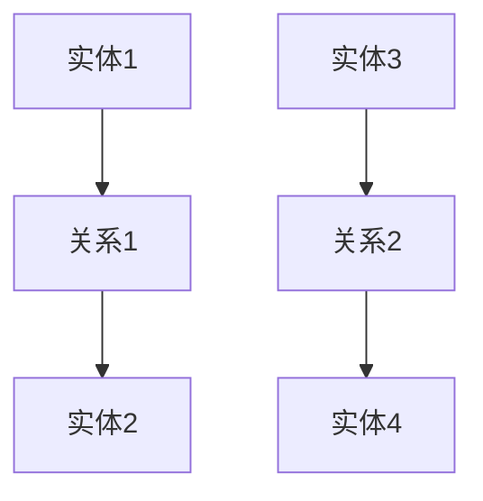
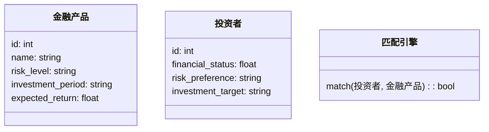
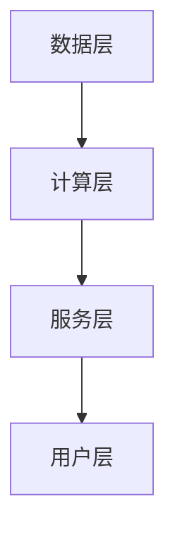
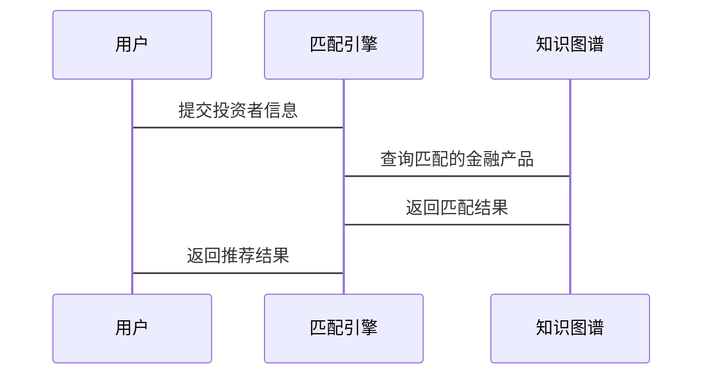

                 


# 构建基于知识图谱的金融产品适当性匹配引擎

> 关键词：知识图谱，金融产品，适当性匹配，图嵌入，深度学习

> 摘要：本文详细探讨了如何利用知识图谱技术构建金融产品适当性匹配引擎。首先介绍了知识图谱的基本概念和金融产品适当性匹配的背景与意义。然后深入分析了知识图谱在金融领域的应用现状，重点阐述了知识图谱的构建原理、存储表示、可视化与管理。接着，详细讲解了金融产品适当性匹配的核心概念，包括金融产品的分类与属性、投资者适当性评估的理论基础和知识图谱在金融产品匹配中的应用。随后，详细分析了知识图谱构建与金融产品适当性匹配的算法原理，包括实体嵌入、匹配算法和数学模型。最后，通过项目实战展示了如何实现基于知识图谱的金融产品适当性匹配引擎，并给出了最佳实践和未来研究方向。

---

# 第1章 知识图谱与金融产品适当性匹配概述

## 1.1 知识图谱的基本概念

### 1.1.1 知识图谱的定义
知识图谱是一种以图结构形式表示知识的数据库，由节点（实体）和边（关系）组成。节点表示实体，边表示实体之间的关系。知识图谱能够将分散的知识点连接起来，形成一个网络化的知识体系。

### 1.1.2 知识图谱的核心特征
- **结构化**：知识图谱中的实体和关系都是明确定义的，具有清晰的语义。
- **可扩展性**：知识图谱可以通过添加新的实体和关系不断扩展。
- **语义丰富性**：知识图谱能够表达复杂的语义关系，远超传统数据库的能力。

### 1.1.3 知识图谱与传统数据库的区别
| 特性 | 知识图谱 | 传统数据库 |
|------|----------|-------------|
| 数据结构 | 图结构 | 行列结构 |
| 表达能力 | 高语义 | 低语义 |
| 查询效率 | 较低 | 较高 |

## 1.2 金融产品适当性匹配的背景与意义

### 1.2.1 金融产品适当性匹配的定义
金融产品适当性匹配是指根据投资者的风险承受能力、投资目标和财务状况，推荐适合其需求的金融产品。

### 1.2.2 当前金融产品匹配的主要挑战
- **数据分散**：金融产品数据分布在不同的系统中，难以整合。
- **语义复杂**：金融产品的语义关系复杂，传统数据库难以处理。
- **个性化需求**：每个投资者的需求不同，需要个性化的匹配。

### 1.2.3 知识图谱在金融产品匹配中的作用
知识图谱能够将金融产品的属性、风险等级、历史表现等信息与投资者的需求进行语义匹配，提供更精准的推荐。

## 1.3 知识图谱在金融领域的应用现状

### 1.3.1 知识图谱在金融领域的典型应用
- **风险评估**：通过分析实体之间的关系，评估投资风险。
- **欺诈检测**：利用知识图谱发现隐藏的欺诈行为。
- **产品推荐**：基于知识图谱进行个性化的产品推荐。

### 1.3.2 知识图谱技术的优势
- **语义理解**：知识图谱能够理解数据的语义关系。
- **可扩展性**：知识图谱可以随着数据的增长而扩展。
- **实时性**：知识图谱能够支持实时的数据更新和查询。

### 1.3.3 知识图谱在金融产品匹配中的潜力
通过知识图谱，可以实现金融产品的语义理解、关系挖掘和个性化推荐，提升金融产品的适当性匹配效率和准确性。

## 1.4 本章小结
本章介绍了知识图谱的基本概念和金融产品适当性匹配的背景与意义，分析了知识图谱在金融领域的应用现状及其优势，为后续章节奠定了基础。

---

# 第2章 知识图谱构建原理

## 2.1 知识图谱构建的基本流程

### 2.1.1 数据采集与预处理
- 数据来源：爬取互联网数据、行业报告、新闻等。
- 数据清洗：去除重复、噪声数据，进行格式标准化。

### 2.1.2 实体识别与抽取
- 实体识别：使用自然语言处理技术从文本中提取实体。
- 实体分类：将实体分为金融产品、投资者等类别。

### 2.1.3 关系抽取与构建
- 关系抽取：识别实体之间的关系。
- 关系建模：使用关系类型（如“适合”、“风险”）构建边。



## 2.2 知识图谱的存储与表示

### 2.2.1 图数据库的选择
- 常见图数据库：Neo4j、NeoGraph、OrientDB。

### 2.2.2 知识图谱的表示方法
- 使用节点和边表示实体和关系。
- 节点属性：存储实体的属性信息。
- 边属性：存储关系的权重、类型等信息。

### 2.2.3 知识图谱的存储结构
- 图数据库：支持高效的查询和存储。
- 索引优化：通过索引优化查询效率。

## 2.3 知识图谱的可视化与管理

### 2.3.1 知识图谱的可视化工具
- 常见工具：Gephi、NetworkX、Neo4j自带可视化工具。

### 2.3.2 知识图谱的版本管理
- 版本控制：通过版本号记录知识图谱的变更。
- 数据备份：定期备份知识图谱数据。

### 2.3.3 知识图谱的质量评估
- 完整性：知识图谱覆盖的实体和关系是否全面。
- 准确性：实体和关系的准确性。
- 及时性：知识图谱的更新是否及时。

## 2.4 本章小结
本章详细介绍了知识图谱的构建流程，包括数据采集、实体识别、关系抽取等，并讨论了知识图谱的存储、表示和可视化方法，为后续章节的知识图谱应用奠定了基础。

---

# 第3章 金融产品适当性匹配的核心概念

## 3.1 金融产品的分类与属性

### 3.1.1 金融产品的分类标准
- 风险等级：低风险、中风险、高风险。
- 投资期限：短期、中期、长期。
- 产品类型：股票、债券、基金、保险等。

### 3.1.2 金融产品的核心属性
| 属性 | 描述 |
|------|------|
| 风险等级 | 产品风险的量化指标 |
| 投资期限 | 产品存续时间 |
| 预期收益 | 产品的预期收益率 |

### 3.1.3 金融产品的风险等级划分
- 低风险：国债、银行存款。
- 中风险：股票、债券。
- 高风险：私募基金、股票。

## 3.2 投资者适当性评估的理论基础

### 3.2.1 投资者适当性评估的定义
投资者适当性评估是根据投资者的财务状况、风险承受能力和投资目标，评估其适合的投资产品。

### 3.2.2 投资者适当性评估的指标体系
| 指标 | 描述 |
|------|------|
| 财务状况 | 投资者的资产规模 |
| 风险偏好 | 投资者的风险承受能力 |
| 投资目标 | 投资者的收益目标 |

### 3.2.3 投资者适当性评估的数学模型
$$ 风险承受能力 = max(0.5 \times 资产规模, 1) $$

## 3.3 知识图谱在金融产品匹配中的应用

### 3.3.1 金融产品与投资者的语义匹配
通过知识图谱，将金融产品的属性与投资者的需求进行语义匹配。

### 3.3.2 金融产品的语义相似度计算
使用图嵌入技术，计算金融产品的语义相似度。

### 3.3.3 个性化推荐
根据投资者的适当性评估结果，推荐适合的金融产品。

## 3.4 本章小结
本章详细介绍了金融产品的分类与属性，投资者适当性评估的理论基础，以及知识图谱在金融产品匹配中的应用，为后续章节的实现提供了理论依据。

---

# 第4章 知识图谱构建与金融产品适当性匹配的算法原理

## 4.1 知识图谱的构建算法

### 4.1.1 实体识别与抽取算法
- 使用自然语言处理技术（如CRF）进行实体识别。

### 4.1.2 关系抽取算法
- 使用基于规则的方法或深度学习方法进行关系抽取。

## 4.2 金融产品适当性匹配算法

### 4.2.1 实体嵌入
- 使用Word2Vec或BERT进行实体嵌入。

### 4.2.2 匹配算法
- 基于余弦相似度的匹配算法：
  $$ sim(a, b) = \frac{a \cdot b}{\|a\| \|b\|} $$

### 4.2.3 基于图嵌入的匹配算法
- 使用GraphSAGE或GAT进行图嵌入。

## 4.3 数学模型

### 4.3.1 语义相似度模型
$$ sim(a, b) = \frac{a \cdot b}{\|a\| \|b\|} $$

### 4.3.2 图嵌入模型
$$ E = \text{softmax}(XW) $$

## 4.4 本章小结
本章详细介绍了知识图谱构建与金融产品适当性匹配的算法原理，包括实体嵌入、匹配算法和数学模型，为后续章节的实现提供了算法支持。

---

# 第5章 系统分析与架构设计

## 5.1 项目背景

### 5.1.1 项目目标
构建基于知识图谱的金融产品适当性匹配引擎。

### 5.1.2 项目范围
涵盖金融产品的知识图谱构建、投资者适当性评估和产品推荐。

## 5.2 系统功能设计

### 5.2.1 领域模型


### 5.2.2 系统架构设计


### 5.2.3 系统接口设计
- 数据接口：提供数据存储和查询接口。
- 匹配接口：提供投资者和金融产品的匹配接口。

## 5.3 系统交互设计

### 5.3.1 系统交互流程


## 5.4 本章小结
本章通过系统分析与架构设计，明确了系统的功能模块和交互流程，为后续章节的实现提供了系统设计支持。

---

# 第6章 项目实战

## 6.1 环境安装

### 6.1.1 安装Python
```bash
python --version
```

### 6.1.2 安装依赖
```bash
pip install neo4j networkx
```

## 6.2 系统核心实现

### 6.2.1 知识图谱构建
```python
from neo4j import GraphDatabase

class KnowledgeGraph:
    def __init__(self, uri, user, password):
        self.driver = GraphDatabase.driver(uri, auth=(user, password))
    
    def create_node(self, label, properties):
        with self.driver.session() as session:
            session.run("CREATE (:{} {{}})".format(label), properties)
    
    def create_relation(self, start_node, relation, end_node):
        with self.driver.session() as session:
            session.run("MATCH (a:{}), (b:{}), CREATE (a)-[r:{}]->(b)".format(start_node, end_node, relation))
```

### 6.2.2 匹配算法实现
```python
import numpy as np

def compute_similarity(embedding1, embedding2):
    return np.dot(embedding1, embedding2) / (np.linalg.norm(embedding1) * np.linalg.norm(embedding2))
```

## 6.3 项目小结
本章通过项目实战，展示了如何使用Python和图数据库构建基于知识图谱的金融产品适当性匹配引擎，提供了详细的代码实现和应用案例。

---

# 第7章 最佳实践与未来研究方向

## 7.1 小结
本章总结了构建基于知识图谱的金融产品适当性匹配引擎的关键点，包括知识图谱的构建、匹配算法的选择和系统设计的优化。

## 7.2 注意事项
- 数据质量：确保数据的准确性和完整性。
- 算法优化：不断优化匹配算法，提高匹配效率和准确率。
- 系统维护：定期更新知识图谱和优化系统性能。

## 7.3 未来研究方向
- 深度学习结合知识图谱：利用深度学习技术进一步提升匹配效果。
- 实时更新：研究实时更新知识图谱的方法，提高系统的实时性。
- 多模态数据：结合文本、图像等多种数据源，提升系统的语义理解能力。

## 7.4 拓展阅读
- 《知识图谱入门与实践》
- 《深度学习与金融应用》

---

# 作者：AI天才研究院/AI Genius Institute & 禅与计算机程序设计艺术 /Zen And The Art of Computer Programming

