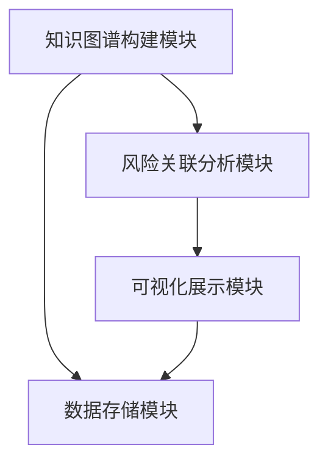
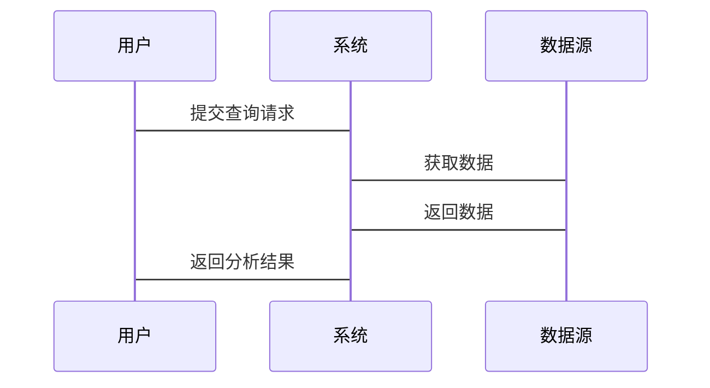

                 


```markdown
# 构建基于知识图谱的金融产品风险关联评估系统

> 关键词：知识图谱、金融产品、风险关联、图嵌入、关联规则挖掘、系统架构设计

> 摘要：本文将详细探讨如何基于知识图谱构建金融产品风险关联评估系统。从知识图谱的基本概念到系统架构设计，从算法原理到实际项目实现，全面解析该系统的核心技术与实现方案。

---

# 第一部分: 知识图谱与金融产品风险关联评估系统概述

# 第1章: 知识图谱与金融风险评估概述

## 1.1 知识图谱的基本概念
### 1.1.1 知识图谱的定义与特点
### 1.1.2 知识图谱在金融领域的应用
### 1.1.3 金融产品风险关联评估的背景与意义

## 1.2 金融产品风险关联评估的核心概念
### 1.2.1 金融产品风险的定义与分类
### 1.2.2 风险关联性与知识图谱的关系
### 1.2.3 系统构建的目标与价值

## 1.3 知识图谱在金融风险评估中的优势
### 1.3.1 知识图谱的语义表达能力
### 1.3.2 知识图谱的关联分析能力
### 1.3.3 知识图谱的动态更新能力

## 1.4 本章小结
---

# 第二部分: 知识图谱构建与关联分析原理

# 第2章: 知识图谱的核心概念与原理

## 2.1 知识图谱的核心概念
### 2.1.1 实体与关系的定义
### 2.1.2 知识图谱的构建流程
### 2.1.3 知识图谱的存储与表示

## 2.2 知识图谱的属性特征对比
### 2.2.1 实体属性对比表
### 2.2.2 关系属性对比表
### 2.2.3 知识图谱的ER实体关系图
```mermaid
er
    entity(金融产品)
    entity(风险事件)
    entity(关联关系)
    entity(金融机构)
    entity(市场数据)
    entity(监管政策)
    relation(拥有)
    relation(触发)
    relation(影响)
    relation(涉及)
    relation(关联)
```

## 2.3 知识图谱的构建流程
### 2.3.1 数据收集与预处理
### 2.3.2 实体识别与抽取
### 2.3.3 关系抽取与构建
### 2.3.4 知识图谱存储与管理

## 2.4 本章小结
---

# 第三部分: 金融产品风险关联评估的算法原理

# 第3章: 知识图谱的图嵌入算法

## 3.1 图嵌入算法概述
### 3.1.1 图嵌入的基本概念
### 3.1.2 常见图嵌入算法对比
### 3.1.3 图嵌入算法的数学模型
```latex
图嵌入的目标是将图结构中的节点或边映射到低维向量空间，表示为：
$$
X = f(G)
$$
其中，X是低维向量，G是原始图结构。
```

## 3.2 基于知识图谱的风险关联分析
### 3.2.1 关联规则挖掘算法
### 3.2.2 基于图嵌入的风险评分模型
### 3.2.3 风险传播与扩散算法
```latex
风险传播模型：
$$
R_i = \sum_{j} w_{ij} \cdot R_j
$$
其中，R_i表示节点i的风险值，w_{ij}表示节点i和j之间的关联权重。
```

## 3.3 算法实现与优化
### 3.3.1 算法实现流程
### 3.3.2 算法优化策略
### 3.3.3 算法复杂度分析

## 3.4 本章小结
---

# 第四部分: 系统架构与设计方案

# 第4章: 系统架构设计

## 4.1 系统功能设计
### 4.1.1 知识图谱构建模块
### 4.1.2 风险关联分析模块
### 4.1.3 可视化展示模块

## 4.2 系统架构图


## 4.3 系统接口设计
### 4.3.1 API接口定义
### 4.3.2 接口调用流程
### 4.3.3 接口交互协议

## 4.4 系统交互流程


## 4.5 本章小结
---

# 第五部分: 项目实战与实现

# 第5章: 项目实战

## 5.1 环境安装与配置
### 5.1.1 开发环境要求
### 5.1.2 依赖库安装
### 5.1.3 环境配置步骤

## 5.2 核心代码实现
### 5.2.1 知识图谱构建代码
```python
from kgtool import kg_builder
builder = kg_builder.KGBuilder()
builder.add_entity('金融产品', 'Product_001')
builder.add_relation('拥有', 'Own_001')
builder.save('knowledge_graph.db')
```

### 5.2.2 风险关联分析代码
```python
from kgtool import risk_analyzer
analyzer = risk_analyzer.RiskAnalyzer('knowledge_graph.db')
result = analyzer.run_analysis()
print(result)
```

## 5.3 实际案例分析
### 5.3.1 案例背景介绍
### 5.3.2 数据处理流程
### 5.3.3 分析结果解读

## 5.4 本章小结
---

# 第六部分: 总结与展望

# 第6章: 总结与展望

## 6.1 系统总结
### 6.1.1 系统核心功能回顾
### 6.1.2 系统实现的关键技术
### 6.1.3 系统性能与效果评估

## 6.2 最佳实践与小结
### 6.2.1 系统设计中的注意事项
### 6.2.2 实际应用中的问题与解决方案
### 6.2.3 知识图谱技术的未来发展

## 6.3 未来展望
### 6.3.1 技术发展与创新
### 6.3.2 系统应用领域的拓展
### 6.3.3 更多潜在研究方向

## 6.4 本章小结
---

# 作者

作者：AI天才研究院/AI Genius Institute & 禅与计算机程序设计艺术 /Zen And The Art of Computer Programming
```

