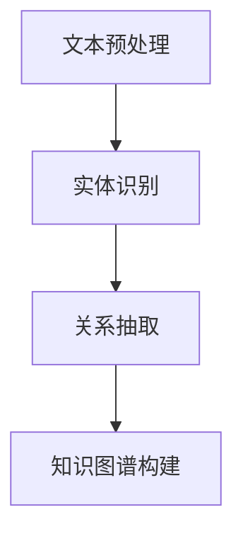

                 


# 构建基于知识图谱的金融监管政策影响评估平台

## 关键词：
- 知识图谱
- 金融监管
- 政策影响评估
- 人工智能
- 深度学习

## 摘要：
本文详细探讨了如何利用知识图谱技术构建金融监管政策影响评估平台。通过分析金融监管的核心需求，结合知识图谱的结构化表示能力，提出了一种基于知识图谱的解决方案。文章从知识图谱的基本概念、构建算法、系统架构到实际案例进行了全面阐述，展示了如何通过技术手段提升政策评估的效率和准确性。

---

## 第1章: 知识图谱与金融监管政策背景

### 1.1 知识图谱的定义与特点
知识图谱是一种以图结构形式表示知识的数据库，由实体（节点）和关系（边）组成。其特点包括：
- **语义丰富**：通过实体和关系的组合，能够准确描述复杂的现实世界。
- **可扩展性**：支持大规模数据的存储和分析。
- **动态更新**：能够实时更新知识，适应变化的环境。

### 1.2 金融监管政策的背景与挑战
金融监管的核心目标是维护市场秩序，保护投资者利益。然而，传统监管手段存在以下挑战：
- **政策复杂性**：金融政策涉及多个领域，解读难度大。
- **数据分散**：监管数据来源多样，难以统一分析。
- **评估滞后**：政策效果的评估往往滞后于政策实施。

---

## 第2章: 知识图谱在金融监管中的应用

### 2.1 知识图谱在金融监管中的作用
知识图谱在金融监管中的应用主要体现在以下几个方面：
- **政策解读**：通过提取政策文本中的关键实体和关系，帮助监管机构快速理解政策内容。
- **风险评估**：基于知识图谱分析金融机构之间的关联性，识别潜在风险。
- **政策执行**：利用知识图谱推理能力，预测政策实施后的市场反应。

### 2.2 金融监管政策影响评估的核心问题
- **多维度分析**：政策对不同市场参与者的影晌需全面评估。
- **互动关系**：政策与市场行为者之间的复杂关系需清晰建模。
- **实时更新**：政策变化需及时反映到评估系统中。

---

## 第3章: 知识图谱构建的核心概念与联系

### 3.1 知识图谱的核心概念
- **实体**：金融监管中的实体包括政策、金融机构、市场参与者等。
- **关系**：描述实体之间的联系，如“政策影响市场”。
- **属性**：实体的附加信息，如政策的生效日期。

### 3.2 知识图谱的实体关系图


---

## 第4章: 知识图谱构建算法原理

### 4.1 知识抽取算法
- **基于规则的方法**：通过预设规则提取文本中的实体和关系。
- **基于深度学习的方法**：利用神经网络模型（如LDA、RNN）进行自动抽取。

### 4.2 知识图谱构建流程


---

## 第5章: 知识图谱推理算法

### 5.1 知识图谱推理的数学模型
- **表示学习**：通过向量表示实体和关系，如Word2Vec。
- **推理公式**：$$ P(h,r,t) = f(h,r) \cdot g(t,r) $$

### 5.2 基于深度学习的推理算法
- **RNN模型**：用于处理序列数据，提取上下文信息。
- **注意力机制**：提高模型对关键信息的关注度。

---

## 第6章: 系统架构设计

### 6.1 系统功能设计
- **模块划分**：用户界面、业务逻辑层、知识图谱层、数据存储层。
- **功能流程**：用户输入查询，系统通过知识图谱推理返回结果。

### 6.2 系统架构图


---

## 第7章: 项目实战

### 7.1 环境安装
- 安装Python、TensorFlow、Neo4j等工具。

### 7.2 核心实现代码
```python
import tensorflow as tf
from tensorflow.keras import layers

# 知识抽取模型
class PolicyExtractor:
    def __init__(self):
        self.model = self.build_model()

    def build_model(self):
        model = tf.keras.Sequential()
        model.add(layers.Embedding(input_dim=10000, output_dim=100))
        model.add(layers.LSTM(64))
        model.add(layers.Dense(1, activation='sigmoid'))
        return model
```

### 7.3 实际案例分析
通过分析某项新政策，利用知识图谱推理其对金融机构的影响，帮助监管机构制定应对措施。

---

## 第8章: 小结与展望

### 8.1 小结
知识图谱为金融监管政策评估提供了高效、智能的解决方案，能够显著提升监管效率。

### 8.2 注意事项
- 数据质量和完整性直接影响模型效果。
- 知识图谱的动态更新需定期维护。

### 8.3 未来展望
随着AI技术进步，知识图谱在金融监管中的应用将更加广泛，如实时风险预警、智能政策生成等。

---

## 作者：
作者：AI天才研究院/AI Genius Institute  
联系邮箱：contact@aiguru.org

