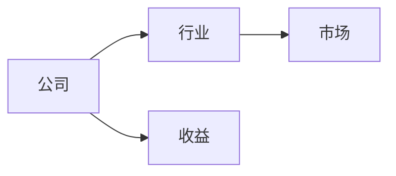
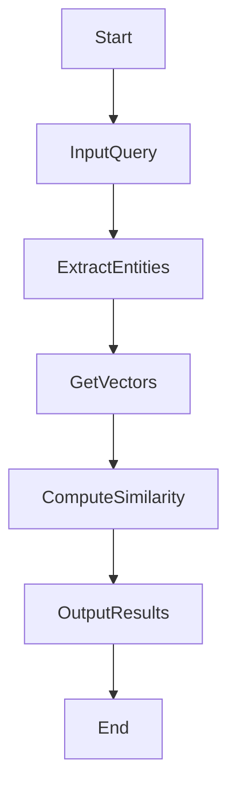
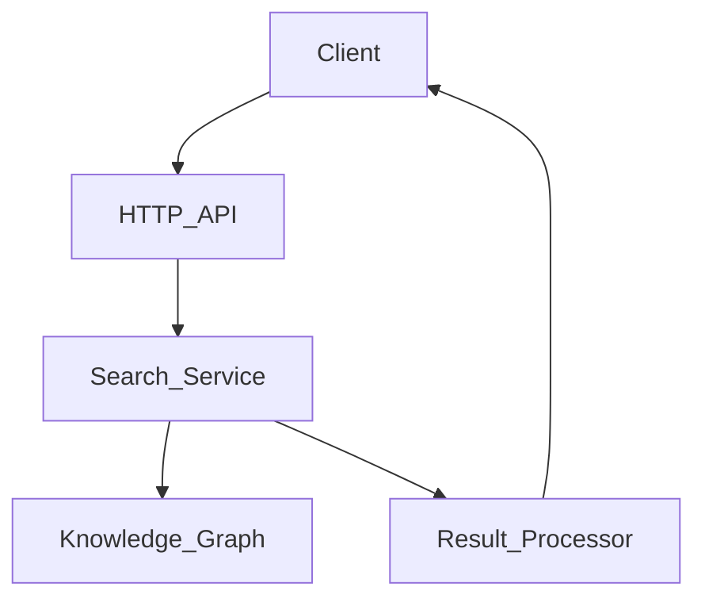

                 


# 构建基于知识图谱的金融研报智能检索系统

## 关键词：知识图谱、金融研报、智能检索系统、实体识别、关系抽取、深度学习

## 摘要：  
本文详细探讨了如何构建基于知识图谱的金融研报智能检索系统。首先介绍了知识图谱的基本概念和金融研报的特点，分析了传统检索系统的局限性。接着，阐述了知识图谱在金融研报智能检索中的应用价值，并详细讲解了系统的核心概念与联系。然后，从算法原理、数学模型、系统架构设计等多个方面展开分析。最后，通过项目实战展示了系统的实现过程，并总结了最佳实践和未来发展方向。

---

# 第一部分: 知识图谱与金融研报智能检索系统背景

## 第1章: 知识图谱与金融研报智能检索系统概述

### 1.1 知识图谱的基本概念与特点  
知识图谱是一种以图结构形式表示知识的语义网络，由实体（概念）和关系（属性）组成。其特点包括：  
1. **语义性**：通过关系描述实体之间的联系，能够表达复杂的语义信息。  
2. **可扩展性**：支持动态更新和扩展，适应金融领域的高频变化。  
3. **结构化**：将非结构化数据转化为结构化知识，便于计算机理解和处理。  

### 1.2 金融研报的特点与需求  
金融研报是金融机构分析市场、行业和公司动态的重要工具，具有以下特点：  
1. **多样性**：包括行业分析、公司分析、市场分析等多种类型。  
2. **专业性**：内容涉及复杂的金融术语和行业知识。  
3. **时效性**：需要快速检索最新研报以应对市场变化。  

### 1.3 系统目标与价值  
构建基于知识图谱的金融研报智能检索系统的目标是：  
1. 提高研报检索效率，支持语义检索和关联分析。  
2. 通过知识图谱的语义理解，提供更精准的检索结果。  
3. 实现研报数据的深度挖掘，支持智能决策。  

---

## 第2章: 问题背景与需求分析

### 2.1 问题背景  
随着金融市场的快速发展，研报数量激增，传统基于关键词的检索系统难以满足以下需求：  
1. **语义理解**：无法理解用户查询的深层含义。  
2. **关联分析**：无法展示研报之间的关联关系。  
3. **动态更新**：难以应对金融市场的高频变化。  

### 2.2 问题描述  
传统检索系统主要基于关键词匹配，存在以下局限性：  
1. **精准度低**：无法准确理解用户的查询意图。  
2. **缺乏语境**：无法根据上下文提供相关结果。  
3. **数据孤岛**：研报数据分散，难以形成知识网络。  

### 2.3 问题解决与边界定义  
引入知识图谱技术，构建金融研报的知识网络，能够有效解决上述问题。系统边界包括：  
1. 研报数据的采集与预处理。  
2. 知识图谱的构建与存储。  
3. 基于知识图谱的智能检索与展示。  

---

## 第3章: 核心概念与联系

### 3.1 知识图谱的核心原理  
知识图谱的核心原理包括：  
1. **实体识别**：从文本中提取关键实体（如公司、行业、金融指标）。  
2. **关系抽取**：识别实体之间的关系（如“属于”、“影响”）。  
3. **知识存储**：将实体和关系存储为结构化的数据。  

### 3.2 金融研报中的实体识别  
在金融研报中，常见的实体包括：  
1. **公司实体**：如“苹果”、“腾讯”。  
2. **行业实体**：如“科技行业”、“金融行业”。  
3. **金融指标**：如“股价”、“收益”。  

### 3.3 实体关系图的构建与展示  
通过知识图谱构建工具，可以将研报中的实体和关系可视化。例如：  



---

# 第二部分: 算法原理与数学模型

## 第4章: 算法原理讲解

### 4.1 知识图谱检索算法  
知识图谱检索算法包括：  
1. **基于向量的检索**：将实体表示为向量，通过向量相似度进行检索。  
2. **基于路径的检索**：通过实体之间的路径关系进行检索。  
3. **增量式更新**：动态更新知识图谱以适应数据变化。  

### 4.2 算法流程图  
以下是基于向量的检索算法流程图：  



### 4.3 算法实现代码  
以下是基于向量的检索算法示例代码：  

```python
def get_similarityEngine(query_vector, knowledge_graph):
    similarity_scores = {}
    for entity in knowledge_graph.nodes:
        entity_vector = knowledge_graph.get_entity_vector(entity)
        similarity = cosine_similarity(query_vector, entity_vector)
        similarity_scores[entity] = similarity
    return sorted(similarity_scores.items(), key=lambda x: x[1], reverse=True)
```

---

## 第5章: 数学模型与公式

### 5.1 知识图谱构建的数学模型  
知识图谱构建的数学模型包括：  
1. **实体表示**：使用向量空间模型，将实体表示为高维向量。  
2. **关系表示**：通过关系矩阵表示实体之间的关系。  

### 5.2 余弦相似度公式  
余弦相似度公式为：  

$$ \text{similarity} = \frac{\vec{a} \cdot \vec{b}}{|\vec{a}| \cdot |\vec{b}|} $$  

其中，$\vec{a}$和$\vec{b}$分别为两个向量的表示。

---

# 第三部分: 系统分析与架构设计

## 第6章: 系统分析与架构设计

### 6.1 系统应用场景  
金融研报智能检索系统主要应用于：  
1. **金融机构**：支持投资决策和市场分析。  
2. **研究人员**：辅助撰写报告和获取行业动态。  
3. **普通投资者**：提供个性化的投资建议。  

### 6.2 系统功能设计  
系统功能包括：  
1. **数据采集**：从多种来源采集研报数据。  
2. **知识图谱构建**：对研报数据进行实体识别和关系抽取。  
3. **智能检索**：支持语义检索和关联分析。  
4. **结果展示**：以可视化形式展示检索结果。  

### 6.3 系统架构设计  
以下是系统的架构图：  



---

## 第7章: 项目实战

### 7.1 环境安装  
需要安装以下工具：  
1. **Python**：用于代码开发。  
2. **Knowledge Graph Construction Tool**：用于构建知识图谱。  
3. **Jupyter Notebook**：用于数据可视化和分析。  

### 7.2 系统核心实现  
以下是系统核心代码示例：  

```python
import numpy as np
from sklearn.metrics.pairwise import cosine_similarity

def build_knowledge_graph(reports):
    entities = set()
    relations = []
    for report in reports:
        entities.update(report['entities'])
        relations.extend(report['relations'])
    return {'entities': entities, 'relations': relations}

def semantic_search(query, knowledge_graph):
    query_vector = get_entity_vector(query)
    entity_vectors = {entity: get_entity_vector(entity) for entity in knowledge_graph['entities']}
    similarities = {}
    for entity in entity_vectors:
        similarity = cosine_similarity(query_vector, entity_vectors[entity])
        similarities[entity] = similarity
    return sorted(similarities.items(), key=lambda x: x[1], reverse=True)
```

---

## 第8章: 总结与展望

### 8.1 最佳实践  
1. **数据质量**：确保研报数据的准确性和完整性。  
2. **性能优化**：优化知识图谱的构建和检索效率。  
3. **可扩展性**：设计灵活的架构以适应未来需求。  

### 8.2 小结  
本文详细探讨了构建基于知识图谱的金融研报智能检索系统的核心概念、算法原理和系统架构。通过理论与实践相结合的方式，展示了系统的实现过程和应用价值。  

### 8.3 注意事项  
1. 在数据采集和处理过程中，需注意数据隐私和合规性。  
2. 系统的性能优化需要结合实际应用场景进行。  
3. 知识图谱的动态更新需要考虑数据源的多样性和实时性。  

### 8.4 拓展阅读  
1. 知识图谱的构建与应用。  
2. 深度学习在自然语言处理中的应用。  
3. 金融领域的智能分析与决策支持。  

---

# 作者：AI天才研究院/AI Genius Institute & 禅与计算机程序设计艺术 /Zen And The Art of Computer Programming

