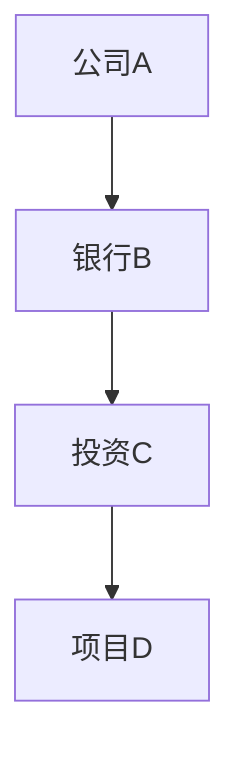
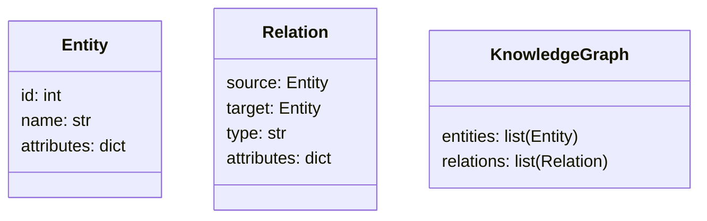
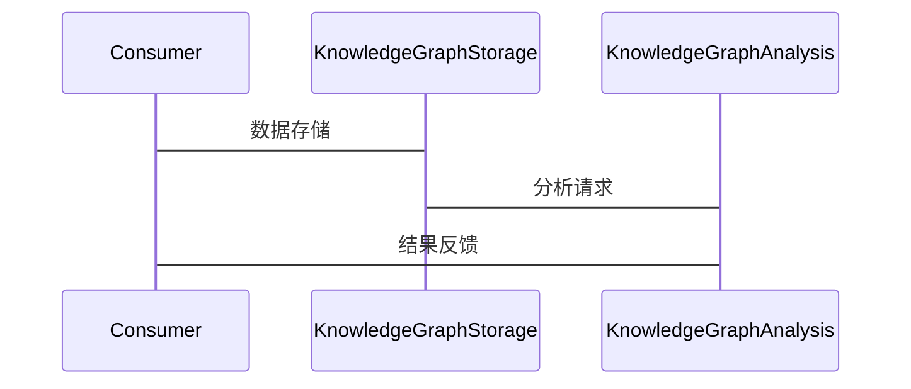

                 


# 构建基于知识图谱的金融风险关联分析系统

> 关键词：知识图谱、金融风险、关联分析、图嵌入、系统架构

> 摘要：本文详细探讨了构建基于知识图谱的金融风险关联分析系统的背景、核心概念、算法原理、系统架构及其实现。通过分析金融风险的关联性，结合知识图谱的构建与关联分析技术，提出了一种高效的风险评估方法，并通过具体案例展示了系统的实际应用价值。

---

# 第一部分：背景介绍

# 第1章：金融风险关联分析的背景与挑战

## 1.1 问题背景

### 1.1.1 金融风险分析的重要性
金融市场的波动性和不确定性使得风险分析成为保障投资者利益和维护金融市场稳定的核心任务。传统的基于单点数据的分析方法难以捕捉复杂的关联关系，而知识图谱作为一种新兴的技术，能够通过结构化数据揭示实体间的隐含关系，为金融风险分析提供了新的视角。

### 1.1.2 当前金融风险分析的痛点
- 数据孤岛：金融机构之间信息分散，难以形成全局性的风险视图。
- 关联性不足：传统方法难以捕捉跨机构、跨市场的复杂关联。
- 高维度低效：面对海量数据，传统统计方法在效率和准确性上存在瓶颈。

### 1.1.3 知识图谱在金融风险分析中的作用
知识图谱通过构建实体间的关系网络，能够直观地展示风险的传播路径和影响范围，为风险预警和应对提供决策支持。

## 1.2 问题描述

### 1.2.1 金融风险的多维度关联性
金融风险不仅涉及单一实体，还包括其上下游产业链、关联企业和市场波动等多个维度。

### 1.2.2 数据孤岛与信息割裂的现状
金融机构之间信息分散，难以形成统一的风险视图，导致风险预警滞后。

### 1.2.3 知识图谱的构建需求
通过知识图谱整合分散数据，构建统一的风险关联网络，为风险分析提供基础。

## 1.3 问题解决

### 1.3.1 知识图谱的核心思想
将金融领域的实体、关系和属性结构化，构建可计算的知识网络。

### 1.3.2 关联分析的基本原理
通过分析实体间的关系，识别潜在的风险传播路径和影响范围。

### 1.3.3 知识图谱在金融领域的具体应用
- 风险预警：通过识别高风险实体，提前采取防范措施。
- 关联分析：揭示风险的传导机制，优化风险控制策略。

## 1.4 系统的边界与外延

### 1.4.1 系统的功能边界
- 数据采集：从多种数据源获取金融实体信息。
- 图谱构建：构建实体关系网络。
- 关联分析：识别风险关联路径。
- 风险评估：生成风险报告。

### 1.4.2 系统的适用范围
适用于银行、证券、保险等金融机构的风险管理场景。

### 1.4.3 系统与其他系统的区别与联系
与其他风险管理系统相比，本系统通过知识图谱技术实现了更高效的关联分析和风险预警。

## 1.5 核心概念与组成

### 1.5.1 知识图谱的基本概念
知识图谱由实体（Entity）、关系（Relation）和属性（Attribute）组成，形成一个网络化的知识结构。

### 1.5.2 金融风险关联分析的核心要素
- 实体：如公司、个人、交易等。
- 关系：如投资、贷款、交易等。
- 属性：如金额、时间、地点等。

### 1.5.3 系统的逻辑架构
系统由数据层、图谱层、分析层和应用层组成，各层协同工作以实现风险关联分析。

---

# 第二部分：核心概念与联系

# 第2章：知识图谱与关联分析的核心概念

## 2.1 知识图谱的定义与属性

### 2.1.1 知识图谱的定义
知识图谱是一种以图结构形式表示知识的 Semantic Network，由实体和关系构成。

### 2.1.2 实体与关系的定义
- 实体：代表现实中的具体对象，如公司、事件等。
- 关系：描述实体之间的关联，如“投资”、“购买”等。

### 2.1.3 知识图谱的构建流程
1. 数据采集与清洗。
2. 实体识别与关系抽取。
3. 图谱构建与存储。

## 2.2 金融风险关联分析的原理

### 2.2.1 风险关联的基本原理
通过分析实体间的关系，识别潜在的风险传播路径。

### 2.2.2 关联分析的数学模型
基于图论和概率论，构建风险传播的数学模型。

### 2.2.3 知识图谱在关联分析中的作用
帮助识别隐藏的风险关联，提高风险预警的准确性。

## 2.3 核心概念对比表

| 概念       | 定义                                                                 |
|------------|----------------------------------------------------------------------|
| 实体       | 知识图谱中的基本单元，代表人、组织、事件等。                       |
| 关系       | 实体之间的关联，如“购买”、“投资”等。                             |
| 属性       | 实体的特征，如“金额”、“时间”等。                                   |

## 2.4 实体关系图架构



---

# 第三部分：算法原理讲解

# 第3章：基于知识图谱的关联分析算法

## 3.1 算法原理概述

### 3.1.1 图嵌入的基本思想
将图结构中的节点表示为低维向量，便于后续的计算和分析。

### 3.1.2 知识图谱中的节点表示
通过图嵌入算法，将节点映射到低维空间，保留其语义信息。

### 3.1.3 关联分析的数学模型
基于图嵌入的向量表示，计算节点之间的相似度，识别潜在的关联关系。

## 3.2 图嵌入算法

### 3.2.1 Node2Vec算法
Node2Vec是一种经典的图嵌入算法，通过随机游走生成节点表示。

#### 算法流程
1. 通过随机游走生成节点序列。
2. 使用Skip-Gram模型训练节点表示。

#### 代码示例
```python
import numpy as np
from sklearn.linear_model import LogisticRegression

# 示例数据：边列表
edges = [(A, B), (B, C), (C, D)]

# 构建邻接矩阵
adj_matrix = np.zeros((n, n))
for u, v in edges:
    adj_matrix[u][v] = 1
    adj_matrix[v][u] = 1

# 使用Node2Vec训练节点表示
model = Node2Vec(adj_matrix, ...)
model.train()

# 风险关联分析
lr = LogisticRegression()
lr.fit(model.vectors, labels)
```

#### 算法公式
- 随机游走概率：$$P(w_i = v | w_{i-1} = u) = \frac{1}{d_u}$$
- Skip-Gram损失函数：$$\mathcal{L} = -\sum_{i=1}^n \log p(o_i | v_i)$$

---

# 第四部分：系统分析与架构设计方案

# 第4章：系统架构设计

## 4.1 系统功能设计

### 4.1.1 领域模型


### 4.1.2 系统架构


## 4.2 系统架构设计

### 4.2.1 系统架构图
```mermaid
graph LR
    Consumer -> KnowledgeGraphStorage
    KnowledgeGraphStorage -> KnowledgeGraphAnalysis
```

### 4.2.2 系统接口设计
- 数据接口：提供数据导入和导出功能。
- 分析接口：提供关联分析和风险评估功能。

### 4.2.3 系统交互流程


---

# 第五部分：项目实战

# 第5章：项目实战与实现

## 5.1 环境安装

### 5.1.1 环境要求
- Python 3.8+
- 知识图谱构建工具：NetworkX
- 机器学习库：Scikit-learn

## 5.2 核心实现

### 5.2.1 数据处理
```python
import networkx as nx

# 创建知识图谱
G = nx.DiGraph()
G.add_edge('公司A', '银行B')
G.add_edge('银行B', '投资C')
G.add_edge('投资C', '项目D')
```

### 5.2.2 关联分析
```python
from sklearn.metrics.pairwise import cosine_similarity

# 计算节点相似度
vectors = model.vectors
similarity_matrix = cosine_similarity(vectors)
```

## 5.3 案例分析

### 5.3.1 案例背景
分析某公司投资链，识别潜在风险。

### 5.3.2 数据处理与分析
- 数据清洗：去除无关数据。
- 关系抽取：识别投资关系。
- 风险评估：计算风险传播路径。

### 5.3.3 实施结果
- 识别出高风险投资路径。
- 提供风险预警和应对建议。

---

# 第六部分：总结与展望

# 第6章：总结与展望

## 6.1 总结
本文详细探讨了基于知识图谱的金融风险关联分析系统的构建过程，从背景到实现，系统地介绍了核心概念、算法原理和系统架构。通过实际案例展示了系统的应用价值。

## 6.2 未来展望
- 知识图谱的动态更新与维护。
- 更高效的关联分析算法。
- 多模态数据的融合与应用。

---

作者：AI天才研究院/AI Genius Institute & 禅与计算机程序设计艺术 /Zen And The Art of Computer Programming

