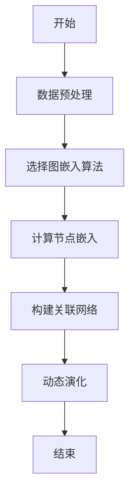
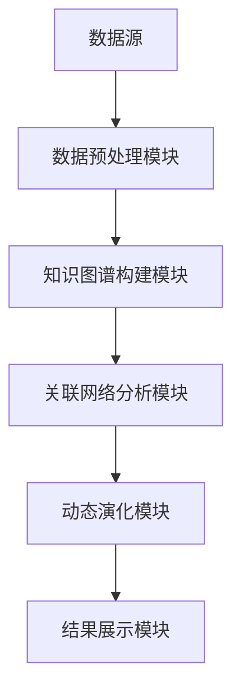
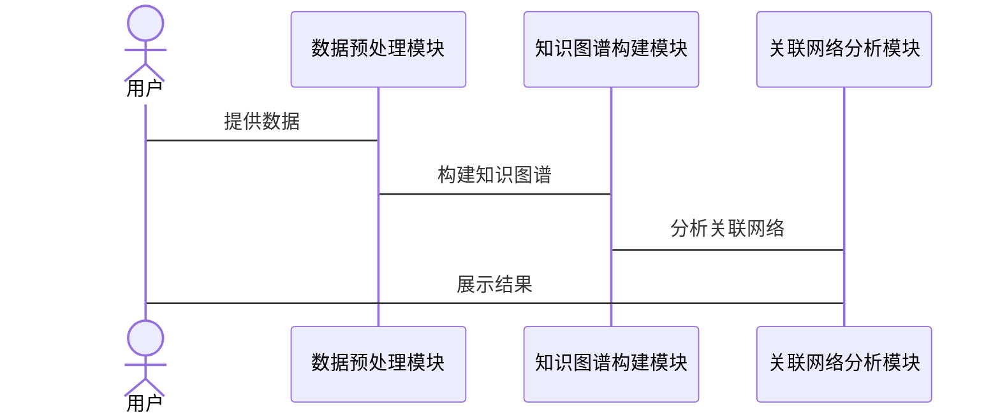

                 


# 构建基于知识图谱的金融风险关联网络动态演化系统

> 关键词：知识图谱，金融风险，关联网络，动态演化，图嵌入，系统架构

> 摘要：本文详细探讨了如何利用知识图谱构建金融风险关联网络，并设计了一个动态演化系统。通过分析金融风险的复杂性，结合知识图谱的语义表示能力，提出了一种基于图嵌入的动态网络演化方法，并通过系统架构设计和实际案例验证了该方法的有效性。

---

# 目录大纲结构

## 第1章: 背景介绍

### 1.1 问题背景
- 1.1.1 金融风险关联网络的重要性
- 1.1.2 知识图谱在金融领域的应用
- 1.1.3 传统金融风险分析的局限性

### 1.2 问题描述
- 1.2.1 金融风险关联网络的定义
- 1.2.2 知识图谱构建的必要性
- 1.2.3 动态演化系统的核心目标

### 1.3 问题解决
- 1.3.1 知识图谱构建解决的核心问题
- 1.3.2 动态演化系统的设计思路
- 1.3.3 关联网络分析的实际应用

### 1.4 边界与外延
- 1.4.1 系统的边界定义
- 1.4.2 相关领域的外延分析
- 1.4.3 核心要素与非核心要素的区分

### 1.5 核心概念与组成
- 1.5.1 知识图谱的核心概念
- 1.5.2 风险关联网络的结构特征
- 1.5.3 动态演化系统的主要组成部分

## 第2章: 核心概念与联系

### 2.1 知识图谱的原理
- 2.1.1 知识图谱的基本构成
- 2.1.2 实体与关系的定义
- 2.1.3 知识图谱的构建流程

### 2.2 风险关联网络的构建
- 2.2.1 风险节点的定义与选择
- 2.2.2 关联关系的建模方法
- 2.2.3 网络动态演化的驱动因素

### 2.3 核心概念的联系
- 2.3.1 知识图谱与风险关联网络的关系
- 2.3.2 动态演化系统的整体架构
- 2.3.3 核心概念的属性特征对比表

### 2.4 ER实体关系图
```mermaid
er
actor: User
action: Define_Entity_Relationship
object: Entity_Relationship_Diagram
```

## 第3章: 算法原理讲解

### 3.1 图嵌入算法
- 3.1.1 Node2Vec算法原理
- 3.1.2 TransE算法的实现
- 3.1.3 图嵌入的数学模型

### 3.2 动态网络演化算法
- 3.2.1 时间序列分析方法
- 3.2.2 基于扩散模型的网络演化
- 3.2.3 动态网络的更新机制

### 3.3 算法流程图


### 3.4 Python实现示例
```python
import networkx as nx
from node2vec import Node2Vec

# 示例图构建
G = nx.Graph()
G.add_nodes_from(["A", "B", "C"])
G.add_edges_from([("A", "B"), ("B", "C")])
```

## 第4章: 系统分析与架构设计

### 4.1 问题场景介绍
- 4.1.1 金融风险分析的复杂性
- 4.1.2 知识图谱在金融风险中的应用场景

### 4.2 系统功能设计
- 4.2.1 数据采集模块
- 4.2.2 知识图谱构建模块
- 4.2.3 关联网络分析模块
- 4.2.4 动态演化模块

### 4.3 系统架构设计


### 4.4 系统接口设计
- 4.4.1 数据接口
- 4.4.2 API接口
- 4.4.3 用户界面

### 4.5 系统交互流程图


## 第5章: 项目实战

### 5.1 环境安装
- 5.1.1 安装必要的Python库
- 5.1.2 配置开发环境

### 5.2 核心代码实现
- 5.2.1 数据预处理代码
- 5.2.2 知识图谱构建代码
- 5.2.3 动态演化算法实现

### 5.3 案例分析
- 5.3.1 数据来源
- 5.3.2 数据处理过程
- 5.3.3 网络分析结果

### 5.4 项目小结
- 5.4.1 实践总结
- 5.4.2 遇到的问题及解决方案
- 5.4.3 未来改进方向

## 第6章: 最佳实践与总结

### 6.1 最佳实践
- 6.1.1 数据质量的重要性
- 6.1.2 算法选择的注意事项
- 6.1.3 系统维护的建议

### 6.2 小结
- 6.2.1 知识图谱在金融风险中的应用价值
- 6.2.2 动态演化系统的创新点
- 6.2.3 未来研究方向

### 6.3 注意事项
- 6.3.1 数据隐私保护
- 6.3.2 系统性能优化
- 6.3.3 技术选型的合理性

### 6.4 拓展阅读
- 6.4.1 推荐的相关书籍
- 6.4.2 其他相关技术资源

---

# 作者：AI天才研究院/AI Genius Institute & 禅与计算机程序设计艺术 /Zen And The Art of Computer Programming

