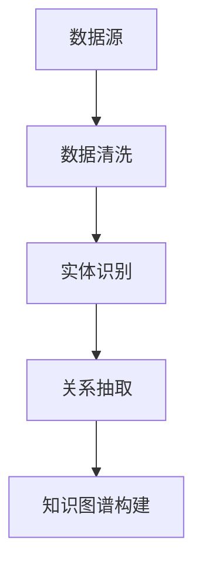
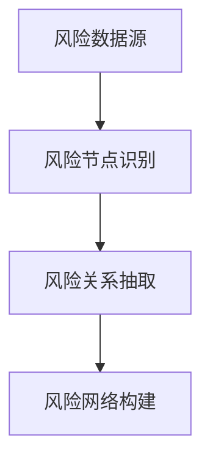
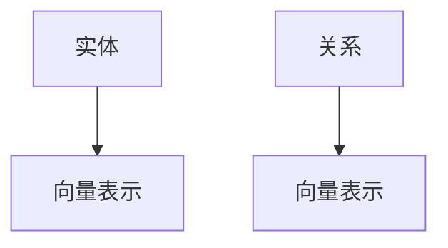
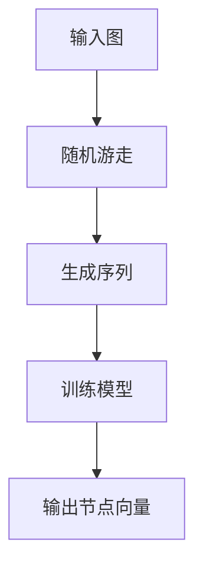
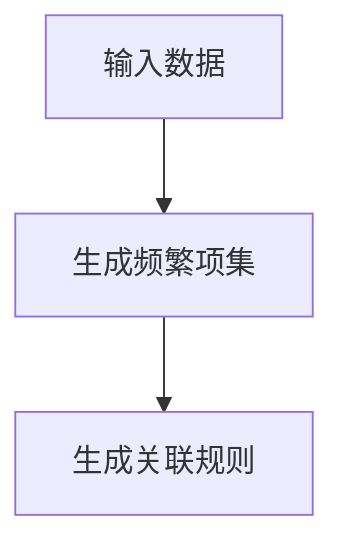
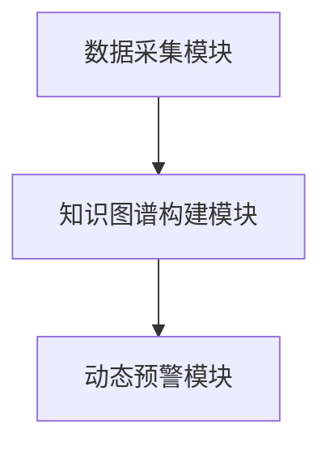
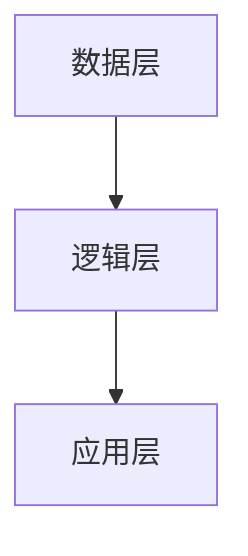

                 


# 构建基于知识图谱的金融风险关联网络动态预警系统

> 关键词：知识图谱，金融风险，关联网络，动态预警，图嵌入，风险评估，系统架构

> 摘要：本文详细探讨了如何基于知识图谱构建金融风险关联网络动态预警系统。文章从知识图谱和金融风险关联网络的基本概念出发，分析了它们的结合方式与核心优势。接着，深入讲解了知识图谱构建算法、风险关联网络分析算法以及动态预警的数学模型。通过系统架构设计与项目实战，展示了如何将理论应用于实际场景。最后，本文总结了系统构建的关键点，并提出了实际应用中的注意事项与优化建议。

---

## 第一章: 知识图谱与金融风险关联网络的背景与概念

### 1.1 什么是知识图谱
知识图谱是一种以图结构形式表示知识的语义网络，由实体（概念、事件、人物等）及其关系构成。其特点包括：
- **语义性**：通过关系描述实体间的关联。
- **层次性**：支持复杂的多层嵌套结构。
- **动态性**：能够实时更新以反映最新信息。

知识图谱的核心要素包括：
- **实体**：代表具体的对象或概念。
- **属性**：描述实体的特征或属性值。
- **关系**：表示实体之间的关联。

在金融领域，知识图谱可以用于分析公司、资产、交易等实体之间的复杂关系，为风险预警提供语义支持。

---

### 1.2 金融风险关联网络的定义与特点
金融风险关联网络是一种通过图结构描述金融实体之间风险传播关系的网络。其特点包括：
- **动态性**：网络结构会随时间变化。
- **复杂性**：涉及多种类型的风险传播路径。
- **关联性**：实体之间的风险传导关系需要通过网络分析来识别。

金融风险关联网络的核心目标是通过分析网络结构，发现潜在的风险传导路径，并提前预警系统性风险。

---

### 1.3 知识图谱与金融风险关联网络的结合
知识图谱与金融风险关联网络的结合，旨在利用知识图谱的语义信息丰富风险网络的表达能力。具体优势包括：
- **语义增强**：通过知识图谱的实体关系，为风险网络提供更丰富的语义信息。
- **动态更新**：知识图谱的动态更新能力，使得风险网络能够实时反映金融市场的最新变化。
- **多维度分析**：结合知识图谱的多维度信息，提升风险网络的分析精度。

---

## 第二章: 知识图谱与金融风险关联网络的核心概念与联系

### 2.1 知识图谱的核心概念
知识图谱的核心概念包括：
- **实体与关系**：实体是知识图谱的基本组成单元，关系描述实体之间的关联。
- **知识表示**：通过图结构表示知识的语义网络。
- **构建流程**：包括数据抽取、实体识别、关系抽取等步骤。

知识图谱的构建流程如下图所示：



---

### 2.2 风险关联网络的核心概念
风险关联网络的核心概念包括：
- **风险节点**：代表可能引发风险的实体（如公司、资产等）。
- **风险关系**：描述节点之间的风险传导路径。
- **网络动态性**：网络结构随时间变化，反映金融市场环境的变化。

风险关联网络的构建流程如下图所示：



---

### 2.3 知识图谱与风险关联网络的联系
知识图谱与风险关联网络的联系体现在以下几个方面：
- **语义支持**：知识图谱提供实体关系的语义信息，丰富风险网络的表达。
- **动态更新**：知识图谱的动态更新能力，使得风险网络能够实时反映市场变化。
- **联合分析**：通过知识图谱的语义信息，提升风险网络的分析精度。

---

## 第三章: 知识图谱构建算法

### 3.1 知识抽取与表示
知识抽取是知识图谱构建的基础，主要包括实体识别和关系抽取。常用算法包括：
- **实体识别**：基于规则或机器学习模型提取实体。
- **关系抽取**：通过句法分析或基于语义的相似度计算提取关系。

知识图谱的表示可以通过向量空间模型实现，如下图所示：



---

### 3.2 图嵌入算法
图嵌入算法通过将图结构映射到低维向量空间，提升计算效率。常用算法包括：
- **Node2Vec**：基于随机游走的图嵌入算法。
- **GraphSAGE**：基于归纳推理的图嵌入算法。

Node2Vec算法的实现流程如下图所示：



---

## 第四章: 风险关联网络的构建与分析

### 4.1 关联规则挖掘
关联规则挖掘用于发现数据中的关联关系。常用算法包括：
- **Apriori算法**：用于发现频繁项集。
- **FP-Growth算法**：基于树状结构的高效关联规则挖掘。

Apriori算法的实现流程如下图所示：



---

### 4.2 网络动态分析算法
网络动态分析算法用于检测网络的动态变化。常用算法包括：
- **流网络分析**：用于分析网络中的流量分布。
- **社区发现**：用于识别网络中的社群结构。

---

## 第五章: 网络动态预警的数学模型与算法

### 5.1 网络风险评估模型
网络风险评估模型通过数学公式量化风险传播的概率。常用模型包括：
- **风险传播模型**：基于图论的传播模型。

风险传播模型的数学公式如下：

$$ P(i \rightarrow j) = \frac{1}{d_i} \sum_{k=1}^{d_i} A_{ik} \cdot w_{kj} $$

其中，$P(i \rightarrow j)$ 表示节点 $i$ 向节点 $j$ 传播风险的概率，$d_i$ 表示节点 $i$ 的度数，$A_{ik}$ 表示节点 $i$ 和节点 $k$ 之间的邻接矩阵元素，$w_{kj}$ 表示节点 $k$ 和节点 $j$ 之间的权重。

---

### 5.2 动态预警算法
动态预警算法通过实时监测网络变化，触发预警机制。常用算法包括：
- **基于时间序列的异常检测**：用于识别网络中的异常波动。
- **基于聚类分析的异常识别**：用于识别网络中的异常社群。

---

## 第六章: 系统分析与架构设计

### 6.1 系统功能设计
系统功能设计包括以下几个模块：
- **数据采集模块**：负责采集金融市场的实时数据。
- **知识图谱构建模块**：负责构建金融风险关联网络。
- **动态预警模块**：负责实时监测网络变化并触发预警。

系统功能模块的关系如下图所示：



---

### 6.2 系统架构设计
系统架构设计采用分层架构，包括数据层、逻辑层和应用层。系统架构如下图所示：



---

### 6.3 系统接口设计
系统接口设计包括以下几个接口：
- **数据接口**：用于与金融数据源对接。
- **预警接口**：用于向用户发送预警信息。

---

## 第七章: 项目实战

### 7.1 环境安装
项目实战需要以下环境：
- **Python**：编程语言。
- **TensorFlow**：深度学习框架。
- **NetworkX**：图论分析库。

---

### 7.2 核心实现代码
以下是系统的核心实现代码：

```python
import networkx as nx
from sklearn.manifold import TSNE

def build_knowledge_graph(data):
    G = nx.Graph()
    for entity in data['entities']:
        G.add_node(entity)
    for relation in data['relations']:
        G.add_edge(relation['source'], relation['target'])
    return G

def graph_embedding(G):
    embedding = TSNE(n_components=2)
    embedding.fit_transform(nx.adjacency_matrix(G))
    return embedding

if __name__ == '__main__':
    data = {
        'entities': ['Company A', 'Company B', 'Market'],
        'relations': [
            {'source': 'Company A', 'target': 'Market'},
            {'source': 'Company B', 'target': 'Market'}
        ]
    }
    G = build_knowledge_graph(data)
    embedding = graph_embedding(G)
    print(embedding)
```

---

## 第八章: 总结与展望

### 8.1 总结
本文详细探讨了如何基于知识图谱构建金融风险关联网络动态预警系统。通过理论分析与实际案例，展示了系统的构建过程与应用价值。

### 8.2 展望
未来研究方向包括：
- **模型优化**：进一步提升模型的预测精度。
- **实时性提升**：优化系统的实时响应能力。

---

## 作者：AI天才研究院/AI Genius Institute & 禅与计算机程序设计艺术 /Zen And The Art of Computer Programming

