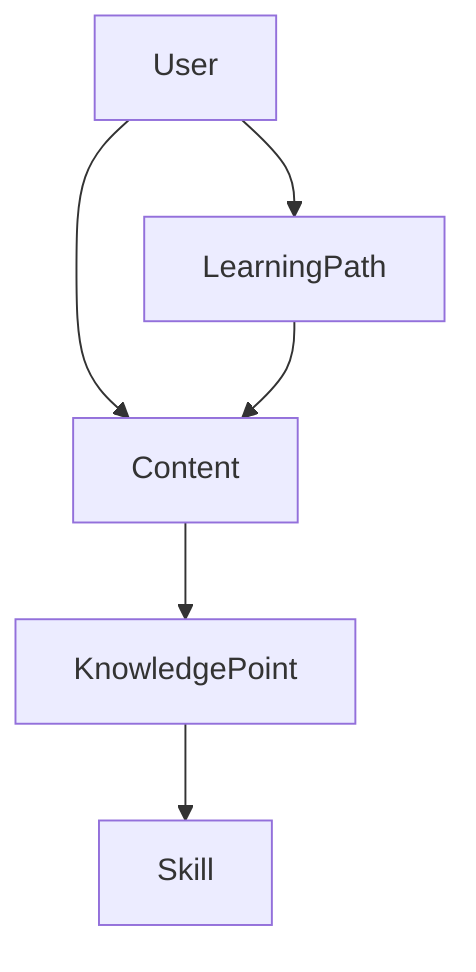
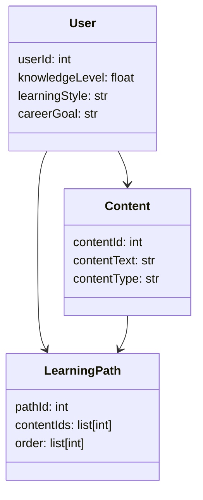

                 


# {{构建智能企业培训系统：自适应学习路径与内容动态生成}}

> 关键词：智能企业培训系统，自适应学习路径，内容动态生成，AI技术，机器学习，个性化推荐

> 摘要：本文探讨如何利用人工智能技术构建智能企业培训系统，重点分析自适应学习路径与内容动态生成的核心原理、算法实现、系统架构及实际应用。通过系统化的分析与实践，展示如何利用技术手段优化企业培训流程，提升学习效果。

---

# 第1章: 背景介绍

## 1.1 问题背景

### 1.1.1 传统企业培训的局限性

传统的企业培训系统往往采用固定的学习路径和静态的内容设置，难以满足员工个性化学习需求。例如，不同员工可能有不同的知识水平、学习风格和职业发展目标，但传统系统无法根据这些差异进行调整。

### 1.1.2 当前企业培训的核心问题

- **学习效果不佳**：固定的学习路径可能导致部分员工学习内容过多或不足，影响整体学习效果。
- **内容更新缓慢**：静态内容难以及时更新，无法适应快速变化的市场需求和技术发展。
- **资源浪费**：由于缺乏个性化推荐，员工可能需要学习大量无关内容，浪费时间和精力。

### 1.1.3 AI技术对企业培训的潜在影响

人工智能技术（如机器学习、自然语言处理）的应用，可以实现学习路径的个性化推荐和内容的动态生成，显著提升企业培训的效率和效果。

## 1.2 问题描述

### 1.2.1 自适应学习路径的需求

员工需要根据自身知识水平、学习目标和时间安排，动态调整学习路径。例如，系统可以根据员工的测试成绩，自动推荐适合的学习内容和顺序。

### 1.2.2 内容动态生成的必要性

企业培训内容需要根据市场需求、员工反馈和知识更新进行实时调整。例如，当市场需求发生变化时，系统可以自动生成相关的培训内容。

### 1.2.3 系统化解决方案

通过构建智能企业培训系统，利用AI技术实现学习路径的自适应调整和内容的动态生成，为员工提供个性化的学习体验。

## 1.3 问题解决

### 1.3.1 自适应学习路径的核心思路

- **用户建模**：根据员工的知识水平、学习风格和职业目标，建立用户模型。
- **内容推荐**：基于用户模型和学习目标，推荐适合的学习内容和路径。
- **动态调整**：根据学习反馈，实时调整学习路径和内容。

### 1.3.2 内容动态生成的关键技术

- **自然语言处理**：用于内容的理解和生成。
- **机器学习模型**：用于生成符合需求的培训内容。
- **知识图谱**：用于组织和管理培训内容。

### 1.3.3 系统整体架构的设计理念

系统采用模块化设计，包括用户建模、内容生成、推荐引擎和学习反馈等模块，各模块协同工作，实现自适应学习路径和内容动态生成。

## 1.4 边界与外延

### 1.4.1 系统功能的边界

系统主要关注学习路径的自适应调整和内容的动态生成，不涉及企业的日常管理或其他业务系统。

### 1.4.2 与现有系统的区别

传统企业培训系统提供固定的学习路径和静态内容，而智能企业培训系统则通过AI技术实现个性化推荐和动态生成。

### 1.4.3 系统的可扩展性与可维护性

系统设计注重模块化和标准化接口，便于后续功能扩展和系统维护。

## 1.5 核心概念结构与组成

### 1.5.1 核心概念的层次结构

- **自适应学习路径**：基于用户模型和学习目标，动态调整学习内容和顺序。
- **内容动态生成**：根据需求变化，实时生成相关培训内容。
- **系统架构**：包括用户建模、内容生成、推荐引擎和学习反馈等模块。

### 1.5.2 核心要素的组成分析

- **用户模型**：包含用户的知识水平、学习风格和职业目标等信息。
- **学习目标**：用户希望通过培训实现的具体目标。
- **内容生成规则**：基于学习目标和用户模型，生成适合的内容。

### 1.5.3 系统整体架构的逻辑关系

用户模型和学习目标输入推荐引擎，生成自适应学习路径和动态内容，同时根据学习反馈实时调整推荐策略。

---

# 第2章: 核心概念与联系

## 2.1 核心概念原理

### 2.1.1 自适应学习路径的算法原理

- **协同过滤**：基于用户相似性推荐学习路径。
- **深度学习模型**：通过神经网络学习用户特征和内容特征，生成推荐路径。

### 2.1.2 内容动态生成的模型原理

- **生成式AI**：利用GPT等模型生成培训内容。
- **知识图谱**：基于领域知识构建内容结构。

### 2.1.3 系统整体架构的设计原则

- **模块化设计**：各模块独立，便于维护和扩展。
- **数据驱动**：利用用户数据和反馈优化推荐策略。

## 2.2 概念属性特征对比

### 表2-1: 自适应学习路径与传统学习路径的对比

| 特性                | 自适应学习路径       | 传统学习路径       |
|---------------------|----------------------|----------------------|
| 是否个性化          | 是                   | 否                   |
| 是否动态调整        | 是                   | 否                   |
| 是否基于用户数据    | 是                   | 否                   |

### 表2-2: 内容动态生成与静态内容生成的对比

| 特性                | 内容动态生成          | 静态内容生成          |
|---------------------|-----------------------|-----------------------|
| 是否实时生成        | 是                   | 否                   |
| 是否根据需求变化    | 是                   | 否                   |

## 2.3 ER实体关系图



---

# 第3章: 算法原理讲解

## 3.1 算法原理

### 3.1.1 推荐算法

#### 3.1.1.1 协同过滤算法

- **基于用户的协同过滤**：找到与当前用户相似的用户，推荐他们学习过的内容。
- **基于内容的协同过滤**：根据内容特征推荐相似内容。

#### 3.1.1.2 深度学习模型

- **神经网络模型**：如Deep Neural Networks（DNN）用于特征学习。
- **嵌入层**：将用户和内容映射到低维空间，计算相似性。

### 3.1.2 内容生成算法

#### 3.1.2.1 基于规则的生成

- **模板生成**：根据预定义模板生成内容。
- **关键词触发**：基于关键词生成相关内容。

#### 3.1.2.2 基于AI的生成

- **生成式模型**：如GPT系列模型，用于生成高质量内容。
- **预训练模型**：如BERT，用于理解上下文并生成相关文本。

## 3.2 算法实现

### 3.2.1 推荐算法实现

#### 3.2.1.1 协同过滤实现

```python
def collaborative_filtering(user_id, user_similarity_matrix):
    similar_users = user_similarity_matrix[user_id]
    recommended_items = []
    for user in similar_users:
        recommended_items.extend(train[user])
    return recommended_items
```

#### 3.2.1.2 深度学习模型实现

```python
import tensorflow as tf
model = tf.keras.Sequential([
    tf.keras.layers.Embedding(input_dim=num_users, output_dim=embedding_dim),
    tf.keras.layers.Dense(64, activation='relu'),
    tf.keras.layers.Dense(num_items, activation='sigmoid')
])
```

### 3.2.2 内容生成算法实现

#### 3.2.2.1 基于规则的生成

```python
def generate_content(rule_base, input_keywords):
    content = ""
    for keyword in input_keywords:
        content += rule_base[rule_base['keyword'] == keyword]['content'].iloc[0]
    return content
```

#### 3.2.2.2 基于AI的生成

```python
import transformers
model = transformers.GPT2LMHeadModel.from_pretrained('gpt2')
tokenizer = transformers.GPT2Tokenizer.from_pretrained('gpt2')
```

---

# 第4章: 系统分析与架构设计

## 4.1 问题场景介绍

系统需要支持大规模企业用户，提供实时的自适应学习路径和内容动态生成，同时具备良好的可扩展性和稳定性。

## 4.2 系统功能设计

### 4.2.1 领域模型



### 4.2.2 系统架构设计


---

# 第5章: 项目实战

## 5.1 环境安装

安装所需的依赖库，如TensorFlow、Keras、GPT-2等。

## 5.2 核心代码实现

### 5.2.1 用户建模

```python
import pandas as pd

def build_user_model(users_data):
    user_model = pd.DataFrame(users_data)
    return user_model
```

### 5.2.2 内容生成

```python
def generate_dynamic_content(user_model, knowledge_base):
    # 基于用户模型和知识库生成内容
    pass
```

## 5.3 代码解读与分析

详细解读各模块的实现代码，分析其工作原理和优化点。

## 5.4 实际案例分析

以一个具体的企业为例，展示系统如何为其员工提供自适应学习路径和动态生成内容。

---

# 第6章: 最佳实践与小结

## 6.1 注意事项

- 数据隐私保护
- 系统性能优化
- 用户体验设计

## 6.2 未来的发展方向

- 更加个性化的推荐算法
- 更智能的内容生成模型
- 多模态的学习体验

## 6.3 拓展阅读

推荐相关的书籍和论文，供读者深入学习。

---

# 作者：AI天才研究院/AI Genius Institute & 禅与计算机程序设计艺术 /Zen And The Art of Computer Programming

