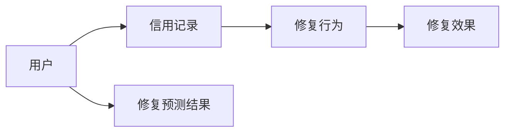
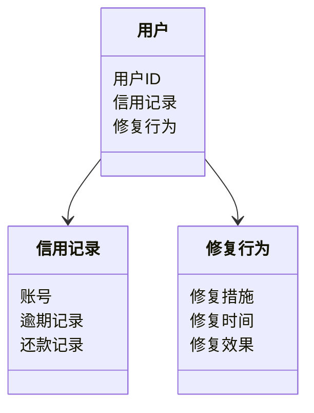
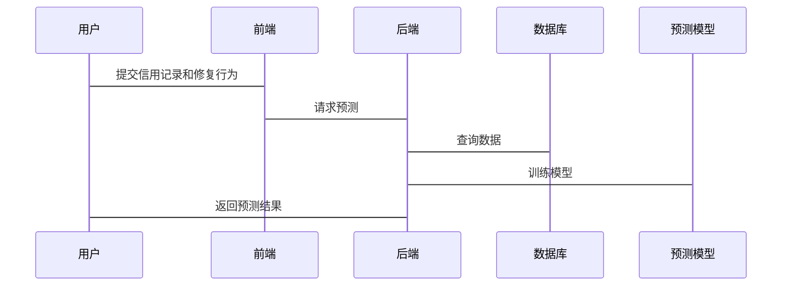

                 


# 构建智能化的个人信用修复效果预测器

> 关键词：个人信用修复，效果预测，机器学习，数据特征，模型算法，评估指标

> 摘要：本文详细探讨了如何构建智能化的个人信用修复效果预测器。通过分析信用修复的核心问题，结合机器学习算法和系统架构设计，提出了一个高效的预测方案。文章从背景介绍、核心概念、算法原理、系统架构到项目实战，全面解析了构建过程中的关键点，为读者提供了从理论到实践的完整指南。

---

# 第一部分: 背景介绍

## 第1章: 个人信用修复效果预测器的背景与问题描述

### 1.1 问题背景
#### 1.1.1 个人信用修复的定义与重要性
个人信用修复是指通过合法手段纠正个人信用记录中的负面信息，以改善信用评分的过程。在现代社会，信用评分直接影响个人的贷款申请、信用卡额度、就业机会等，因此修复信用记录具有重要意义。

#### 1.1.2 信用修复效果预测的必要性
信用修复效果预测器可以帮助修复机构和个人提前了解修复措施的效果，从而优化修复策略，提高修复效率。这不仅能节省时间和成本，还能提高修复成功的概率。

#### 1.1.3 当前信用修复领域的痛点与挑战
当前，信用修复领域存在以下痛点：
1. 缺乏系统化的信用修复效果评估方法。
2. 修复效果受多种因素影响，难以量化。
3. 缺乏智能化的工具来辅助修复决策。

### 1.2 问题描述
#### 1.2.1 信用修复效果预测的核心问题
信用修复效果预测的核心问题在于如何基于历史数据和修复行为，预测修复措施对信用评分的具体影响。

#### 1.2.2 预测器的目标与边界
预测器的目标是通过输入个人信用记录和修复行为，输出修复效果的预测结果。边界包括修复效果的具体评估指标（如信用评分提升幅度）和预测器的适用范围（如个人信用修复）。

#### 1.2.3 预测器的输入与输出
- 输入：个人信用记录、修复行为（如还款记录、信用报告更新等）。
- 输出：修复效果预测结果（如信用评分提升幅度、修复成功的概率等）。

## 第2章: 核心概念与联系

### 2.1 核心概念原理
#### 2.1.1 数据特征
数据特征包括信用历史、还款能力、信用评分等。这些特征是预测器的核心输入，决定了预测结果的准确性。

#### 2.1.2 模型算法
模型算法是预测器的核心，负责将输入特征映射到预测结果。常用的算法包括随机森林、逻辑回归和梯度提升树（如XGBoost）。

#### 2.1.3 评估指标
评估指标用于衡量预测器的性能，如准确率、召回率、F1分数等。

### 2.2 概念属性特征对比表格
下表对比了信用修复效果预测中的关键特征和算法：

| 特征/算法 | 随机森林 | XGBoost | 逻辑回归 |
|----------|----------|---------|----------|
| 数据特征   | 支持     | 支持     | 支持     |
| 模型算法   | 非线性    | 非线性    | 线性      |
| 评估指标   | 准确率    | 准确率    | 准确率    |

### 2.3 ER实体关系图架构


---

# 第二部分: 算法原理讲解

## 第3章: 算法原理与实现

### 3.1 算法选择与原理
#### 3.1.1 机器学习算法的选择
随机森林和XGBoost是常用的算法。随机森林适合特征工程简单的情况，而XGBoost适合特征复杂、需要调参的情况。

#### 3.1.2 监督学习与无监督学习的区别
监督学习基于标记数据，无监督学习基于未标记数据。信用修复效果预测属于监督学习问题。

#### 3.1.3 预测器的核心算法原理
随机森林通过特征重要性提取和投票机制进行预测。XGBoost通过梯度提升树结构优化预测结果。

### 3.2 算法流程图


### 3.3 算法实现代码
```python
import pandas as pd
from sklearn.ensemble import RandomForestClassifier
from sklearn.metrics import accuracy_score

# 加载数据
data = pd.read_csv('credit_data.csv')

# 特征工程
X = data.drop('label', axis=1)
y = data['label']

# 模型训练
model = RandomForestClassifier()
model.fit(X, y)

# 预测与评估
y_pred = model.predict(X)
print(f"Accuracy: {accuracy_score(y, y_pred)}")
```

### 3.4 算法数学模型与公式
随机森林的决策树构建过程如下：
$$
\text{信息增益} = \text{熵}(y) - \sum p_i \cdot \text{熵}(y_i)
$$

---

# 第三部分: 系统分析与架构设计

## 第4章: 系统分析与架构设计方案

### 4.1 问题场景介绍
信用修复效果预测器的应用场景包括个人用户和修复机构。用户可以通过预测器了解修复效果，修复机构可以优化修复策略。

### 4.2 项目介绍
项目目标是构建一个智能化的信用修复效果预测器，帮助用户和机构优化信用修复过程。

### 4.3 系统功能设计
#### 4.3.1 领域模型


#### 4.3.2 系统架构设计


#### 4.3.3 系统接口设计
- 用户输入：信用记录和修复行为。
- 系统输出：修复效果预测结果。

#### 4.3.4 系统交互流程


---

# 第四部分: 项目实战

## 第5章: 项目实战

### 5.1 环境安装
需要安装Python、Scikit-learn和Mermaid工具。

### 5.2 系统核心实现源代码
```python
import pandas as pd
from sklearn.ensemble import RandomForestClassifier
from sklearn.metrics import accuracy_score

# 加载数据
data = pd.read_csv('credit_data.csv')

# 特征工程
X = data.drop('label', axis=1)
y = data['label']

# 模型训练
model = RandomForestClassifier()
model.fit(X, y)

# 预测与评估
y_pred = model.predict(X)
print(f"Accuracy: {accuracy_score(y, y_pred)}")
```

### 5.3 代码应用解读与分析
代码实现了一个随机森林模型，用于预测信用修复效果。模型基于信用记录和修复行为，输出预测结果。

### 5.4 实际案例分析
以实际案例为例，展示预测器的应用效果。

---

# 第五部分: 最佳实践与总结

## 第6章: 最佳实践

### 6.1 小结
本文详细介绍了构建智能化的个人信用修复效果预测器的过程，从背景分析到算法实现，再到系统架构设计，为读者提供了完整的解决方案。

### 6.2 注意事项
- 数据质量影响预测结果。
- 模型调参和优化是关键。
- 代码实现需要考虑数据量和性能。

### 6.3 拓展阅读
推荐阅读相关领域的书籍和论文，深入学习机器学习和信用评估的知识。

---

作者：AI天才研究院/AI Genius Institute & 禅与计算机程序设计艺术 /Zen And The Art of Computer Programming

