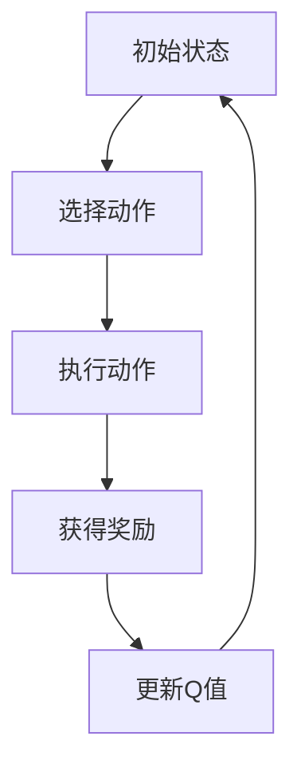
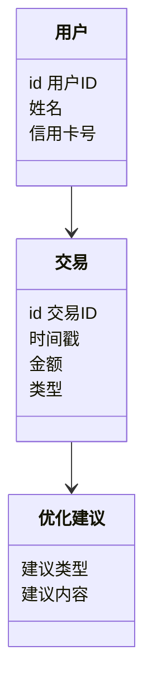
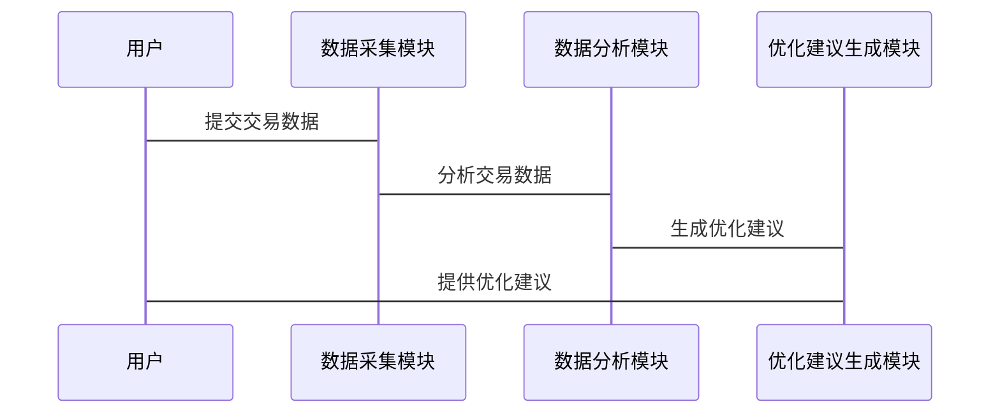

                 


# 构建智能化的个人信用卡使用行为优化助手

> 关键词：信用卡优化、人工智能、行为分析、强化学习、系统架构、数据挖掘

> 摘要：本文将探讨如何利用人工智能技术构建一个智能化的个人信用卡使用行为优化助手。通过分析用户的信用卡交易数据，识别消费模式，并基于强化学习算法提供个性化的消费优化建议。本文将详细阐述问题背景、核心概念、算法原理、系统架构设计以及项目实战，为读者提供从理论到实践的全面指导。

---

# 第一部分: 智能化个人信用卡使用行为优化助手的背景与需求

## 第1章: 问题背景与目标

### 1.1 信用卡使用行为优化的必要性

#### 1.1.1 信用卡滥用与过度消费问题
现代社会中，信用卡的普及带来了便利，但也伴随着滥用和过度消费的问题。用户可能会因为缺乏自我约束而产生高额债务，甚至影响信用评分。研究表明，超过60%的信用卡用户存在超支行为，这表明优化信用卡使用行为的必要性。

#### 1.1.2 信用卡积分与优惠最大化的需求
信用卡积分和优惠是用户选择信用卡的重要因素之一。然而，不同信用卡的积分规则和优惠活动各不相同，用户需要一个智能化的工具来最大化积分和优惠的使用效率。

#### 1.1.3 个人财务管理智能化的现状与挑战
随着金融科技的发展，个人财务管理正在向智能化方向迈进。然而，现有工具多局限于基本的账单管理，缺乏对消费行为的深入分析和优化建议。智能化助手可以弥补这一空白，帮助用户更高效地管理信用卡使用。

### 1.2 问题描述与目标设定

#### 1.2.1 信用卡使用中的常见问题
- 无计划的消费导致超支。
- 积分浪费或使用不当。
- 信用卡还款压力大，影响个人财务健康。

#### 1.2.2 智能化助手的目标与核心任务
智能化助手的目标是通过分析用户的信用卡交易数据，识别消费模式，并提供个性化的优化建议，帮助用户合理规划消费和还款，最大化积分使用效率。

#### 1.2.3 边界与外延：功能与非功能需求
- 功能需求：数据采集、行为分析、优化建议生成。
- 非功能需求：数据隐私保护、用户体验优化。

### 1.3 核心概念与系统结构

#### 1.3.1 核心概念：智能化助手的功能模块
- 数据采集模块：收集用户的信用卡交易数据。
- 数据分析模块：分析交易数据，识别消费模式。
- 优化建议生成模块：根据分析结果，生成优化建议。

#### 1.3.2 系统结构：用户、数据源、优化算法的关系
系统由用户、数据源、优化算法三部分组成。用户通过系统输入数据，系统通过分析数据，输出优化建议。

#### 1.3.3 概念结构与核心要素组成
- 用户行为：用户的消费习惯和模式。
- 数据特征：交易时间、金额、类型等。
- 优化规则：基于数据特征的优化策略。

## 第2章: 智能化助手的核心概念与联系

### 2.1 核心概念原理

#### 2.1.1 数据采集：信用卡交易数据的特征提取
- 交易时间：帮助识别用户的消费高峰期。
- 交易金额：分析用户的消费习惯。
- 消费类型：识别用户的消费偏好。

#### 2.1.2 数据分析：行为模式识别与预测
- 消费模式识别：通过聚类分析，识别用户的消费类别。
- 消费预测：利用时间序列分析，预测未来的消费行为。

#### 2.1.3 优化建议生成：基于规则的决策引擎
- 根据分析结果，生成优化建议，如调整消费预算、选择最佳还款方式。

### 2.2 核心概念对比与ER图分析

#### 2.2.1 数据特征对比表格
| 特征 | 描述 | 示例 |
|------|------|------|
| 交易时间 | 交易发生的时间 | $t$ |
| 交易金额 | 交易的金额 | $amount$ |
| 消费类型 | 消费的类别 | $category$ |
| 积分规则 | 积分计算规则 | $points = amount \times 0.01$ |

#### 2.2.2 ER实体关系图
```mermaid
er
    entity 用户 {
        id 用户ID
        姓名
        信用卡号
    }
    entity 交易 {
        id 交易ID
        时间戳
        金额
        类型
    }
    entity 积分规则 {
        id 积分规则ID
        积分计算方式
        优惠活动
    }
    用户 -[1..n]-> 交易
    交易 -[1]-> 积分规则
```

---

# 第二部分: 核心概念与系统架构

## 第3章: 算法原理

### 3.1 强化学习与监督学习

#### 3.1.1 强化学习：基于Q-learning算法的实现
Q-learning算法是一种常用的强化学习算法，通过学习最优策略来最大化累计奖励。其数学模型如下：
$$ Q(s, a) = Q(s, a) + \alpha \left(r + \gamma \max Q(s', a') - Q(s, a)\right) $$

其中：
- $s$：当前状态。
- $a$：采取的动作。
- $r$：获得的奖励。
- $\gamma$：折扣因子。
- $\alpha$：学习率。

#### 3.1.2 监督学习：基于回归和分类的实现
监督学习通过训练数据，预测用户的消费行为。例如，使用回归模型预测消费金额，使用分类模型识别消费类型。

### 3.2 算法实现的流程

#### 3.2.1 Q-learning算法流程图


#### 3.2.2 Q-learning算法的Python实现
```python
import numpy as np

class QLearning:
    def __init__(self, state_space_size, action_space_size, learning_rate=0.1, gamma=0.9):
        self.state_space_size = state_space_size
        self.action_space_size = action_space_size
        self.learning_rate = learning_rate
        self.gamma = gamma
        self.Q = np.zeros((state_space_size, action_space_size))

    def choose_action(self, state, epsilon=0.1):
        if np.random.random() < epsilon:
            return np.random.randint(self.action_space_size)
        else:
            return np.argmax(self.Q[state, :])

    def update_Q(self, state, action, reward, next_state):
        self.Q[state, action] += self.learning_rate * (reward + self.gamma * np.max(self.Q[next_state, :]) - self.Q[state, action])
```

---

## 第4章: 系统分析与架构设计

### 4.1 系统功能设计

#### 4.1.1 领域模型


#### 4.1.2 系统架构
```mermaid
container 系统架构 {
    component 数据采集模块 {
        数据接口
    }
    component 数据分析模块 {
        算法引擎
    }
    component 优化建议生成模块 {
        决策引擎
    }
}
```

### 4.2 系统接口设计

#### 4.2.1 接口设计
- 数据采集接口：从信用卡平台获取交易数据。
- 数据分析接口：调用算法引擎进行分析。
- 优化建议生成接口：根据分析结果生成建议。

#### 4.2.2 系统交互流程


---

## 第5章: 项目实战

### 5.1 环境安装与配置

#### 5.1.1 环境要求
- Python 3.8+
- NumPy、Pandas、Scikit-learn等库

#### 5.1.2 安装依赖
```bash
pip install numpy pandas scikit-learn
```

### 5.2 核心代码实现

#### 5.2.1 数据采集模块
```python
import pandas as pd

def load_data(file_path):
    return pd.read_csv(file_path)

# 示例数据
data = {
    '交易时间': ['2023-01-01', '2023-01-02', '2023-01-03'],
    '交易金额': [100, 200, 300],
    '消费类型': ['餐饮', '购物', '娱乐']
}
df = pd.DataFrame(data)
print(df)
```

#### 5.2.2 数据分析模块
```python
from sklearn.cluster import KMeans

def analyze_behavior(data):
    # 提取特征
    features = data[['交易金额', '消费类型']]
    # 聚类分析
    model = KMeans(n_clusters=3)
    model.fit(features)
    return model.labels_

labels = analyze_behavior(df)
print(labels)
```

#### 5.2.3 优化建议生成模块
```python
def generate_recommendations(labels):
    recommendations = []
    for label in labels:
        if label == 0:
            recommendations.append('建议减少餐饮支出')
        elif label == 1:
            recommendations.append('建议增加购物优惠使用')
        else:
            recommendations.append('建议调整娱乐消费预算')
    return recommendations

recommендации = generate_recommendations(labels)
print(recommendации)
```

### 5.3 案例分析与解读

#### 5.3.1 案例分析
假设用户在过去三个月的消费数据如下：
| 交易时间       | 交易金额 | 消费类型 |
|----------------|----------|----------|
| 2023-01-01     | 100      | 餐饮     |
| 2023-01-02     | 200      | 购物     |
| 2023-01-03     | 300      | 娱乐     |

分析结果显示，用户的消费类型分为三类：餐饮、购物和娱乐。通过Q-learning算法，系统建议用户减少餐饮支出，增加购物优惠的使用，并调整娱乐消费预算。

#### 5.3.2 优化建议解读
- 减少餐饮支出：建议用户选择折扣较多的餐厅，或减少外出就餐频率。
- 增加购物优惠使用：利用信用卡提供的购物优惠活动，最大化积分使用效率。
- 调整娱乐消费预算：合理规划娱乐支出，避免不必要的消费。

---

## 第6章: 最佳实践与小结

### 6.1 小结
智能化的个人信用卡使用行为优化助手通过分析用户的交易数据，识别消费模式，并提供个性化的优化建议，帮助用户合理规划消费和还款，最大化积分使用效率。本文详细阐述了问题背景、核心概念、算法原理、系统架构设计以及项目实战，为读者提供了从理论到实践的全面指导。

### 6.2 注意事项
- 数据隐私保护：用户需确保交易数据的安全性。
- 算法的可解释性：优化建议需清晰明了，避免用户误解。
- 系统的可扩展性：未来可接入更多信用卡类型和优惠活动。

### 6.3 拓展阅读
- 《强化学习实战》：深入理解强化学习算法及其应用。
- 《Python机器学习》：学习更多机器学习技术及其在金融领域的应用。

---

# 作者：AI天才研究院/AI Genius Institute & 禅与计算机程序设计艺术 /Zen And The Art of Computer Programming

---

**本文由AI天才研究院原创，转载请注明出处。**

