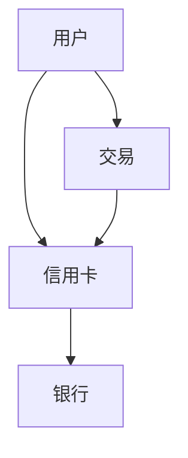
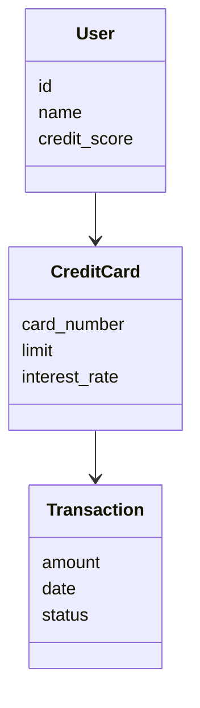
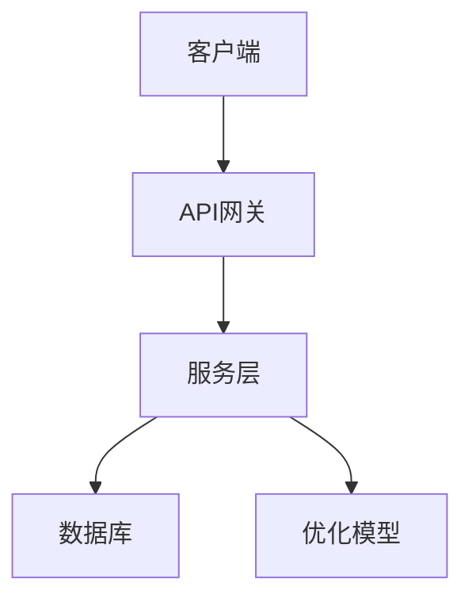

                 


# 构建智能化的个人信用卡额度与利率优化管理助手

> **关键词**：人工智能、机器学习、信用卡优化、利率管理、系统架构
> 
> **摘要**：本文详细探讨了如何利用人工智能技术构建智能化的个人信用卡额度与利率优化管理助手。通过分析信用卡数据特征，设计优化模型，并基于机器学习和遗传算法实现优化目标。文章从背景介绍、核心概念、算法原理、系统架构设计到项目实战，全面解析了构建这一系统的各个关键环节，为读者提供了一套完整的解决方案。

---

## 第1章 问题背景与目标

### 1.1 问题背景

在现代金融体系中，信用卡已成为个人财务管理的重要工具。然而，传统信用卡管理存在以下问题：

- **额度不合理**：信用卡额度通常由银行根据用户的信用记录和收入水平手动设定，难以实时调整。
- **利率固定**：信用卡利率通常固定，无法根据用户的消费行为和信用状况动态调整。
- **用户体验差**：用户难以实时了解自己的信用状况和优化建议，导致信用卡使用效率低下。

### 1.2 核心目标

本系统的目标是通过智能化手段，实时优化信用卡额度和利率，提升用户体验和信用管理效率。具体目标包括：

1. **动态调整额度**：根据用户的消费行为和信用记录，实时调整信用卡额度。
2. **动态调整利率**：根据用户的信用评分和消费行为，动态调整信用卡利率。
3. **个性化建议**：为用户提供个性化的信用管理建议，帮助用户更好地管理信用卡。

### 1.3 边界与外延

本系统的边界包括以下几点：

- **数据来源**：仅限于用户的信用卡数据和消费记录。
- **优化范围**：仅针对信用卡额度和利率的优化。
- **用户范围**：仅限于信用卡用户。

---

## 第2章 核心概念与系统架构

### 2.1 核心概念

#### 2.1.1 数据来源与特征

以下表格展示了信用卡数据的关键特征：

| 数据特征 | 描述 |
|----------|------|
| 消费金额 | 用户的消费金额 |
| 消费频率 | 用户的消费频率 |
| 还款记录 | 用户的还款记录 |
| 信用评分 | 用户的信用评分 |
| 账单余额 | 用户的账单余额 |

#### 2.1.2 模型类型

以下表格展示了常见的优化模型类型：

| 模型类型 | 描述 |
|----------|------|
| 线性回归模型 | 基于线性关系预测信用卡额度 |
| 随机森林模型 | 基于树状结构预测信用卡利率 |
| LSTM模型 | 基于时间序列预测信用卡额度和利率 |

#### 2.1.3 实体关系图

以下是系统的核心实体关系图：



### 2.2 系统架构设计

#### 2.2.1 领域模型设计

以下是系统领域模型的类图：



#### 2.2.2 系统架构图

以下是系统架构图：



---

## 第3章 算法原理与实现

### 3.1 算法原理

#### 3.1.1 梯度下降算法

以下是梯度下降算法的流程图：

```mermaid
graph TD
    Start --> Initialize Parameters
    Initialize Parameters --> Compute Cost
    Compute Cost --> Compute Gradient
    Compute Gradient --> Update Parameters
    Update Parameters --> Check Convergence
    Check Convergence --> Repeat or Stop
    Stop --> End
```

以下是梯度下降算法的Python实现代码：

```python
def gradient_descent(X, y, theta, alpha, num_iterations):
    m = len(y)
    for _ in range(num_iterations):
        h = np.dot(X, theta)
        loss = h - y
        gradient = (1/m) * np.dot(X.T, loss)
        theta = theta - alpha * gradient
    return theta
```

---

## 第4章 系统分析与设计

### 4.1 系统功能模块设计

以下是系统功能模块的类图：


---

## 第5章 项目实战

### 5.1 环境安装

以下是安装环境的命令：

```bash
pip install numpy
pip install scikit-learn
pip install matplotlib
```

### 5.2 核心功能实现

以下是核心功能的Python代码：

```python
import numpy as np
from sklearn.linear_model import LinearRegression

# 数据准备
X = np.array([[1], [2], [3], [4]])
y = np.array([2, 4, 6, 8])

# 模型训练
model = LinearRegression()
model.fit(X, y)

# 预测
print(model.predict(np.array([[5]])))
```

---

## 第6章 最佳实践

### 6.1 小结

本文详细介绍了如何构建智能化的个人信用卡额度与利率优化管理助手。通过背景分析、核心概念、算法原理、系统架构设计到项目实战，全面解析了这一系统的构建过程。

### 6.2 注意事项

在实际应用中，需要注意以下几点：

1. 数据隐私保护。
2. 算法的实时性和效率。
3. 系统的可扩展性和维护性。

### 6.3 未来趋势

未来，随着人工智能技术的不断发展，信用卡优化管理系统将更加智能化和个性化。可能的方向包括：

- 基于深度学习的信用卡额度和利率优化。
- 基于区块链的信用评分系统。

### 6.4 拓展阅读

推荐以下书籍和资源：

1. 《Python机器学习实战》。
2. 《深度学习入门：基于Python的CNN、RNN、GAN等算法原理与实现》。
3. [Kaggle信用卡数据分析](https://www.kaggle.com/creditcard)

---

## 作者

**作者：AI天才研究院 & 禅与计算机程序设计艺术**

