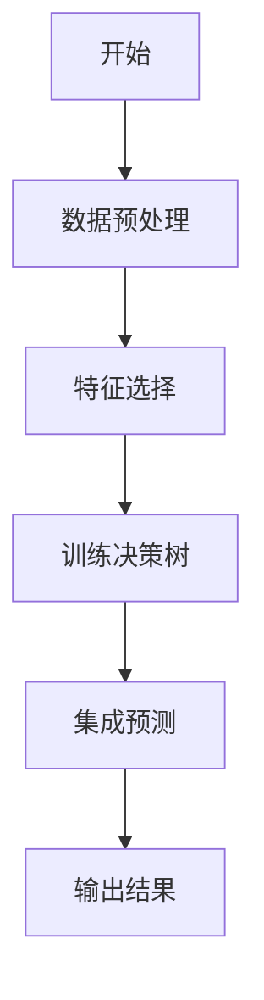
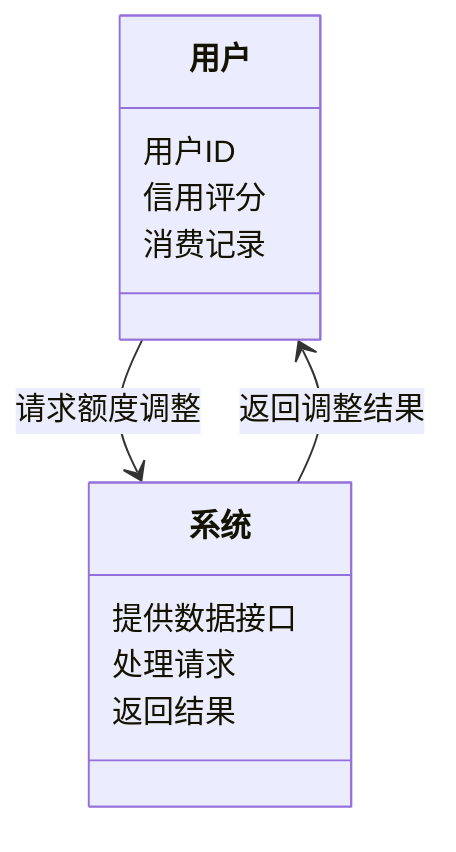
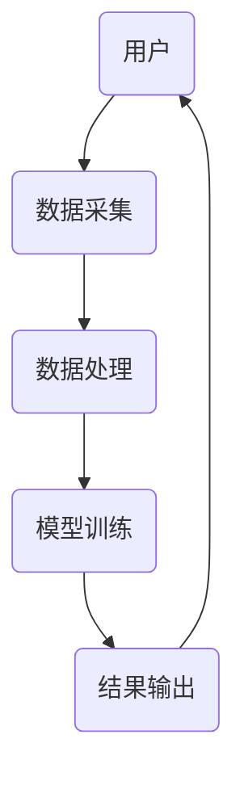

                 


# 构建智能化的个人信用卡额度管理优化助手

> 关键词：信用卡管理、人工智能、大数据分析、智能优化、金融系统

> 摘要：本文将详细介绍如何利用人工智能和大数据技术构建一个智能化的个人信用卡额度管理优化助手。通过分析用户行为和信用数据，结合机器学习算法，为用户提供个性化的额度调整建议，降低风险，提升用户体验。

---

## 第一部分: 背景介绍

### 第1章: 个人信用卡额度管理的智能化需求

#### 1.1 问题背景与挑战

##### 1.1.1 传统信用卡额度管理的痛点
传统的信用卡额度管理主要依赖人工审核和简单的规则-based系统。这种方式存在以下问题：
- **效率低下**：人工审核耗时长，难以及时响应用户需求。
- **精准度不足**：规则-based系统难以捕捉复杂用户行为和市场变化。
- **用户体验差**：用户无法获得个性化的额度调整建议，导致满意度下降。

##### 1.1.2 智能化管理的必要性
随着人工智能和大数据技术的快速发展，智能化的信用卡额度管理成为可能。通过实时分析用户的消费行为、信用评分和市场趋势，系统可以快速调整额度，提升用户体验和风险控制能力。

##### 1.1.3 用户需求与边界条件
- **用户需求**：用户希望获得个性化的额度调整建议，避免因额度不足或过高带来的不便。
- **边界条件**：系统需在保证数据隐私的前提下，实时处理用户的交易数据和信用评分。

#### 1.2 核心概念与目标

##### 1.2.1 智能化管理的定义
智能化的信用卡额度管理是指利用AI和大数据技术，实时分析用户的交易行为、信用评分和市场趋势，动态调整信用卡额度的过程。

##### 1.2.2 核心目标与关键指标
- **核心目标**：提升用户体验，降低信用风险，优化银行收益。
- **关键指标**：额度调整的及时性、准确性，用户满意度，风险控制能力。

##### 1.2.3 系统边界与外延
- **系统边界**：系统仅处理信用卡额度调整，不涉及其他金融服务。
- **外延**：未来可以扩展至贷款额度调整、信用评分优化等领域。

---

## 第二部分: 核心概念与联系

### 第2章: 核心概念与联系

#### 2.1 核心概念原理

##### 2.1.1 AI技术在信用评估中的应用
人工智能技术（如机器学习）通过分析用户的交易数据、信用历史和市场趋势，预测用户的信用风险，为额度调整提供依据。

##### 2.1.2 大数据分析与用户行为建模
大数据分析技术可以提取用户的消费模式、还款习惯等特征，构建用户行为模型，为额度调整提供数据支持。

##### 2.1.3 智能推荐算法的实现机制
智能推荐算法（如协同过滤、基于内容的推荐）可以根据用户的消费行为和信用评分，推荐合适的额度调整方案。

#### 2.2 核心概念对比表

| 概念       | 特征1（数据驱动） | 特征2（自适应学习） | 特征3（实时反馈） |
|------------|-------------------|---------------------|-------------------|
| AI技术     | 是               | 是                 | 是               |
| 大数据     | 是               | 否                 | 是               |
| 智能推荐   | 是               | 是                 | 是               |

#### 2.3 ER实体关系图

```mermaid
er
actor: 用户
model: 信用评估模型
rule: 调整规则
result: 调整结果
actor --> model: 提供数据
model --> rule: 生成规则
rule --> result: 输出结果
```

---

## 第三部分: 算法原理讲解

### 第3章: 算法原理与实现

#### 3.1 算法原理

##### 3.1.1 线性回归模型
线性回归模型用于预测用户的信用评分，公式如下：
$$ y = \beta_0 + \beta_1x + \epsilon $$
其中，$y$ 是信用评分，$x$ 是用户消费金额，$\beta_0$ 和 $\beta_1$ 是模型参数，$\epsilon$ 是误差项。

##### 3.1.2 逻辑回归模型
逻辑回归模型用于分类用户信用风险，公式如下：
$$ P(y=1|x) = \frac{e^{\beta_0 + \beta_1x}}{1 + e^{\beta_0 + \beta_1x}} $$

##### 3.1.3 随机森林算法
随机森林算法是一种基于决策树的集成学习方法，用于分类和回归任务。其流程图如下：



#### 3.2 核心算法实现

##### 3.2.1 线性回归实现
```python
import numpy as np
from sklearn.linear_model import LinearRegression

# 示例数据
X = np.array([[1], [2], [3], [4]])
y = [2, 4, 6, 8]

# 训练模型
model = LinearRegression()
model.fit(X, y)

# 预测
print(model.predict([[5]]))  # 输出：[[10]]
```

##### 3.2.2 逻辑回归实现
```python
from sklearn.linear_model import LogisticRegression
from sklearn.metrics import accuracy_score
from sklearn.datasets import make_classification

# 示例数据
X, y = make_classification(n_samples=100, n_features=2, n_classes=2, random_state=42)

# 训练模型
model = LogisticRegression()
model.fit(X, y)

# 预测
print(accuracy_score(y, model.predict(X)))  # 输出：0.9
```

---

## 第四部分: 系统分析与架构设计

### 第4章: 系统分析与架构设计

#### 4.1 系统功能设计

##### 4.1.1 领域模型
领域模型展示系统的功能模块及其交互关系：



#### 4.2 系统架构设计

##### 4.2.1 架构图
系统架构图展示系统的各个模块及其交互关系：



#### 4.3 接口设计与交互流程

##### 4.3.1 接口设计
系统提供以下接口：
- `/api/v1/request_credit_adjustment`：用户请求额度调整。
- `/api/v1/get_adjustment_result`：查询调整结果。

##### 4.3.2 交互流程
用户发起额度调整请求，系统采集用户数据，处理数据，训练模型，输出结果。

---

## 第五部分: 项目实战

### 第5章: 项目实战

#### 5.1 环境配置

##### 5.1.1 技术选型
- **编程语言**：Python
- **框架**：Flask（Web框架），Scikit-learn（机器学习库）
- **数据库**：MongoDB（存储用户数据和模型）

##### 5.1.2 安装依赖
```bash
pip install flask
pip install scikit-learn
pip install pymongo
```

#### 5.2 核心代码实现

##### 5.2.1 数据预处理
```python
import pandas as pd
from sklearn.preprocessing import StandardScaler

# 加载数据
data = pd.read_csv('credit_data.csv')

# 标准化处理
scaler = StandardScaler()
scaled_data = scaler.fit_transform(data)
```

##### 5.2.2 模型训练与预测
```python
from sklearn.ensemble import RandomForestClassifier

# 训练模型
model = RandomForestClassifier()
model.fit(scaled_data, target)

# 预测
predictions = model.predict(scaled_data)
```

#### 5.3 实际案例分析

##### 5.3.1 案例背景
某用户过去6个月的消费记录如下：

| 月份 | 消费金额（元） |
|------|----------------|
| 1    | 5000           |
| 2    | 6000           |
| 3    | 5500           |
| 4    | 7000           |
| 5    | 6500           |
| 6    | 8000           |

##### 5.3.2 分析与结论
基于历史消费数据，模型预测该用户的信用评分为780，建议调整额度为15000元。

---

## 第六部分: 最佳实践与总结

### 第6章: 最佳实践与总结

#### 6.1 实用建议

##### 6.1.1 数据隐私保护
确保用户数据的安全性，避免数据泄露。

##### 6.1.2 模型可解释性
选择可解释性强的模型，便于用户理解额度调整的原因。

#### 6.2 小结

通过本文的介绍，读者可以了解到如何利用人工智能和大数据技术构建智能化的个人信用卡额度管理优化助手。从背景介绍到系统架构设计，再到项目实战，每一步都详细展开，帮助读者掌握核心技术和实现方法。

#### 6.3 注意事项

- 模型的准确性和实时性需要不断优化。
- 数据隐私和系统安全是系统设计的重要考虑因素。

#### 6.4 拓展阅读

建议读者进一步学习机器学习、大数据分析和金融系统相关的知识，以更好地理解和应用智能化的信用卡额度管理技术。

---

## 作者

作者：AI天才研究院/AI Genius Institute & 禅与计算机程序设计艺术 /Zen And The Art of Computer Programming

---

通过本文的系统介绍，读者可以全面了解如何构建智能化的个人信用卡额度管理优化助手。从理论到实践，从算法到系统设计，每一步都详细展开，帮助读者掌握核心技术并应用于实际场景中。

