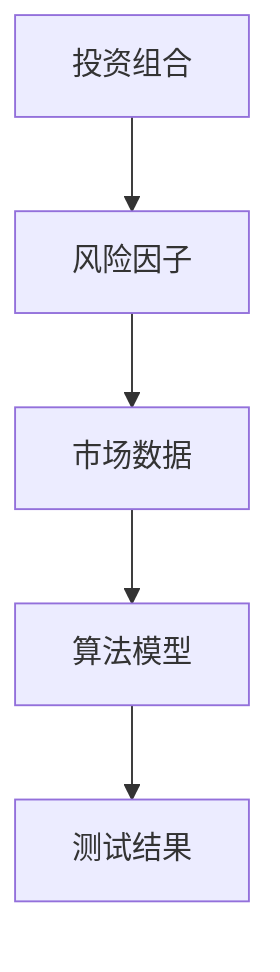
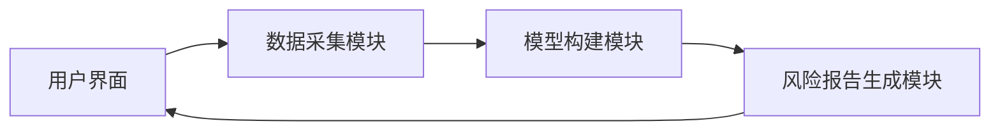
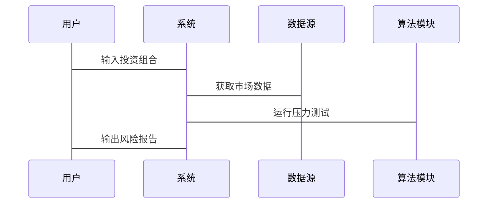

                 


# 构建智能化的个人投资组合压力测试工具

> 关键词：压力测试工具，智能化，投资组合，风险管理，人工智能，大数据分析

> 摘要：随着金融市场日益复杂化和波动性的增加，个人投资者需要一种更加智能化、高效的压力测试工具来评估其投资组合在极端市场条件下的表现。本文将详细介绍如何从零开始构建一个智能化的个人投资组合压力测试工具，涵盖核心概念、算法原理、系统架构设计以及项目实战等内容。通过本文的学习，读者将能够掌握从数据采集、模型构建到系统实现的全过程，从而在实际投资中更好地管理和控制风险。

---

# 第一部分: 智能化个人投资组合压力测试工具概述

# 第1章: 投资组合压力测试的背景与意义

## 1.1 投资组合压力测试的基本概念
### 1.1.1 投资组合压力测试的定义
投资组合压力测试是一种评估投资组合在极端市场条件下可能表现的方法。它通过模拟各种不利的市场情景，帮助投资者了解其投资组合在这些情景下的潜在损失和风险敞口。

### 1.1.2 压力测试在投资组合管理中的作用
压力测试在投资组合管理中具有以下重要作用：
1. 识别潜在风险：通过模拟极端市场条件，发现投资组合中的薄弱环节。
2. 优化资产配置：根据压力测试结果，调整资产配置以降低风险。
3. 制定应急计划：为可能的市场崩盘或剧烈波动做好准备。

### 1.1.3 压力测试的分类与应用场景
压力测试可以分为以下几类：
1. **历史情景测试**：基于历史市场数据进行测试。
2. **情景测试**：假设某些极端市场情景进行测试。
3. **蒙特卡洛模拟测试**：通过随机模拟市场波动进行测试。
4. **机器学习驱动的测试**：利用AI算法预测潜在风险情景。

压力测试的应用场景包括：
1. 个人投资者的风险管理。
2. 机构投资者的资产配置决策。
3. 投资组合经理的风险监控。

## 1.2 传统压力测试方法的局限性
### 1.2.1 基于历史数据分析的局限性
传统压力测试方法依赖于历史数据，但市场环境的变化可能导致历史数据的适用性降低。

### 1.2.2 简单情景分析法的不足
简单的情景分析法缺乏数据驱动的支持，可能导致测试结果不够准确。

### 1.2.3 参数假设法的缺陷
参数假设法依赖于人工设定的参数，可能无法捕捉到市场中的复杂动态。

## 1.3 智能化压力测试工具的优势
### 1.3.1 数据驱动的优势
智能化压力测试工具利用大数据分析和机器学习算法，能够从海量数据中发现潜在的风险模式。

### 1.3.2 AI算法的高效性
通过AI算法，压力测试工具可以快速模拟多种极端市场情景，并预测投资组合在这些情景下的表现。

### 1.3.3 实时监控与自适应调整能力
智能化工具能够实时监控市场动态，并根据最新的市场数据自适应调整压力测试模型。

## 1.4 本章小结
本章介绍了投资组合压力测试的基本概念、传统方法的局限性以及智能化压力测试工具的优势。智能化压力测试工具通过大数据分析和AI算法，能够更准确、更高效地评估投资组合的风险。

---

# 第2章: 压力测试工具的核心概念与联系

## 2.1 压力测试的核心原理
### 2.1.1 投资组合风险的量化
投资组合的风险可以通过波动率、VaR（Value at Risk）和CVaR（Conditional Value at Risk）等指标来量化。

### 2.1.2 压力测试的数学模型
压力测试的核心是通过数学模型模拟极端市场情景，评估投资组合在这些情景下的表现。

### 2.1.3 数据驱动的压力测试方法
数据驱动的方法依赖于历史市场数据和机器学习算法，能够更准确地预测潜在风险。

## 2.2 核心概念对比表
以下是传统压力测试方法与智能化压力测试工具的对比表：

| 概念       | 传统压力测试 | 智能化压力测试 |
|------------|--------------|----------------|
| 数据来源   | 历史数据     | 实时数据+AI生成 |
| 方法论     | 简单情景分析 | 复杂算法驱动   |
| 精度       | 较低         | 高             |
| 适用场景   | 稳定市场     | 波动市场       |

## 2.3 实体关系图
以下是一个简单的实体关系图，展示了压力测试工具的核心要素：



## 2.4 本章小结
本章通过对比分析，展示了智能化压力测试工具相较于传统方法的优势，并通过实体关系图直观地呈现了压力测试工具的核心要素。

---

# 第3章: 压力测试的算法原理

## 3.1 蒙特卡洛模拟算法
### 3.1.1 算法流程
蒙特卡洛模拟是一种通过随机抽样来估计概率分布的方法。以下是其基本流程：
1. 确定输入参数（如资产回报率、相关性等）。
2. 生成大量随机市场情景。
3. 计算投资组合在每种情景下的表现。
4. 统计结果并生成风险报告。

### 3.1.2 算法实现
以下是蒙特卡洛模拟的Python代码示例：

```python
import numpy as np

def monte_carlo_simulation(assets, num_simulations=1000):
    returns = np.random.multivariate_normal([0]*len(assets), np.cov(assets), num_simulations)
    portfolio_returns = np.mean(returns, axis=1)
    return portfolio_returns
```

### 3.1.3 算法优缺点
**优点**：能够模拟复杂的市场情景，提供高精度的风险评估。  
**缺点**：计算量较大，需要大量的计算资源。

## 3.2 VaR模型
### 3.2.1 VaR的定义
VaR（Value at Risk）是指在给定置信水平下，投资组合可能遭受的最大损失。

### 3.2.2 VaR的计算公式
$$ VaR = \mu + z \cdot \sigma $$
其中，$\mu$是平均回报率，$z$是标准正态分布的分位数，$\sigma$是标准差。

### 3.2.3 VaR模型的实现
以下是VaR模型的Python代码示例：

```python
import numpy as np

def calculate VaR(returns, confidence_level=0.95):
    sorted_returns = np.sort(returns)
    VaR = np.quantile(sorted_returns, confidence_level)
    return VaR
```

## 3.3 本章小结
本章详细介绍了蒙特卡洛模拟和VaR模型的算法原理，并通过Python代码示例展示了其实现过程。这些算法是构建智能化压力测试工具的核心基础。

---

# 第4章: 系统分析与架构设计

## 4.1 项目介绍
本项目旨在构建一个智能化的个人投资组合压力测试工具，帮助投资者评估其投资组合在极端市场条件下的表现。

## 4.2 系统功能设计
### 4.2.1 需求分析
1. 数据采集与处理：从多个数据源获取市场数据。
2. 模型构建：基于历史数据和机器学习算法构建压力测试模型。
3. 系统实现：开发一个用户友好的界面，供用户输入投资组合并进行压力测试。

### 4.2.2 系统功能模块
1. 数据采集模块：从Yahoo Finance等数据源获取市场数据。
2. 模型构建模块：基于机器学习算法构建压力测试模型。
3. 用户界面模块：提供友好的用户界面，方便用户操作。

## 4.3 系统架构设计
以下是系统架构的Mermaid图：



## 4.4 系统接口设计
系统接口主要分为数据接口和用户接口。数据接口用于与数据源交互，用户接口用于与用户交互。

## 4.5 系统交互设计
以下是系统交互的Mermaid序列图：



## 4.6 本章小结
本章详细描述了智能化压力测试工具的系统架构设计，包括功能模块、系统架构图、接口设计和交互设计。

---

# 第5章: 项目实战

## 5.1 环境安装
### 5.1.1 安装Python
安装Python 3.8或更高版本。

### 5.1.2 安装依赖库
安装以下依赖库：
- `pandas`
- `numpy`
- `scikit-learn`
- `matplotlib`

## 5.2 系统核心实现
### 5.2.1 数据采集模块
以下是数据采集模块的代码示例：

```python
import pandas as pd
import requests
from bs4 import BeautifulSoup

def get_market_data(ticker):
    url = f"https://finance.yahoo.com/quote/{ticker}"
    response = requests.get(url)
    soup = BeautifulSoup(response.text, 'html.parser')
    data = {
        'ticker': ticker,
        'price': float(soup.find('div', {'class': 'price'}).text)
    }
    return data
```

### 5.2.2 模型构建模块
以下是模型构建模块的代码示例：

```python
from sklearn.ensemble import RandomForestRegressor
import numpy as np

def build_model(features, target):
    model = RandomForestRegressor()
    model.fit(features, target)
    return model
```

### 5.2.3 系统实现模块
以下是系统实现模块的代码示例：

```python
def main():
    data = get_market_data('AAPL')
    model = build_model(features, target)
    result = model.predict(data)
    print(result)

if __name__ == '__main__':
    main()
```

## 5.3 实际案例分析
### 5.3.1 数据来源
从Yahoo Finance获取苹果公司（AAPL）的市场数据。

### 5.3.2 模型训练
使用历史数据训练随机森林回归模型。

### 5.3.3 模型预测
通过模型预测投资组合在极端市场条件下的表现。

## 5.4 本章小结
本章通过实际案例展示了如何构建智能化压力测试工具，并详细讲解了每个模块的实现过程。

---

# 第6章: 总结与展望

## 6.1 总结
本篇文章详细介绍了如何构建智能化的个人投资组合压力测试工具，包括核心概念、算法原理、系统架构设计和项目实战等内容。

## 6.2 最佳实践 tips
1. 数据质量是压力测试结果准确性的重要保障。
2. 机器学习模型需要不断更新和优化。
3. 在实际应用中，应结合市场动态调整压力测试模型。

## 6.3 未来展望
随着AI技术的不断发展，智能化压力测试工具将更加智能化和高效化。未来的研究方向包括：
1. 更加复杂的市场情景模拟。
2. 集成更多的机器学习算法。
3. 实时监控与自适应调整能力的进一步提升。

## 6.4 本章小结
本章总结了全文的主要内容，并展望了未来的发展方向。

---

# 作者：AI天才研究院/AI Genius Institute & 禅与计算机程序设计艺术 /Zen And The Art of Computer Programming

---

通过本文的学习，读者将能够掌握从数据采集、模型构建到系统实现的全过程，从而在实际投资中更好地管理和控制风险。

