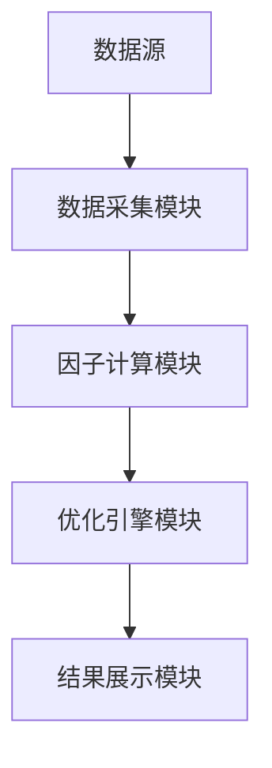

                 


# 构建智能化的个人投资组合因子暴露优化系统

> **关键词**：投资组合优化，因子暴露，智能化系统，机器学习，金融工程，系统架构

> **摘要**：本文详细探讨了如何构建一个智能化的个人投资组合因子暴露优化系统。通过分析因子模型、优化算法和系统架构，本文为读者提供了从理论到实践的全面指导。结合现代优化算法和机器学习技术，本文提出了一种高效、智能的投资组合优化方法，帮助投资者在复杂的金融市场中实现收益与风险的平衡。

---

# 第一部分: 智能化投资组合因子暴露优化系统背景与概念

## 第1章: 投资组合优化的背景与目标

### 1.1 投资组合优化的背景介绍

#### 1.1.1 传统投资组合优化的局限性

传统的投资组合优化方法（如均值-方差模型）虽然经典，但在实际应用中面临诸多挑战。例如，历史数据的局限性、市场环境的变化以及非线性风险因素的复杂性使得传统方法难以适应动态市场环境。

#### 1.1.2 智能化投资的兴起

随着人工智能和大数据技术的快速发展，智能化投资逐渐成为主流。通过机器学习和优化算法，投资者可以更高效地处理海量数据，捕捉市场机会，并实时调整投资策略。

#### 1.1.3 因子暴露优化的必要性

因子暴露优化是投资组合管理中的关键环节。通过优化因子暴露，投资者可以更好地控制风险，提高收益，同时适应市场变化。智能化方法的引入使得因子暴露优化更加精准和高效。

### 1.2 投资组合优化的核心目标

#### 1.2.1 最大化收益

投资的核心目标之一是实现收益最大化。通过优化因子暴露，投资者可以在不同市场条件下找到收益与风险的最佳平衡点。

#### 1.2.2 最小化风险

在投资过程中，风险控制至关重要。因子暴露优化可以帮助投资者降低组合的整体风险，避免因个别因子波动导致的损失。

#### 1.2.3 平衡收益与风险

投资组合优化的目标并非单纯追求收益或风险最小化，而是在两者之间找到最优平衡。通过智能化优化方法，投资者可以实现这一目标。

### 1.3 因子暴露优化的定义与特点

#### 1.3.1 因子模型的定义

因子模型是将资产收益分解为多个因子（如市场因子、价值因子、动量因子等）线性组合的模型。因子模型帮助投资者更好地理解和预测资产收益。

#### 1.3.2 因子暴露的含义

因子暴露是指投资组合中各因子的权重或敏感度。优化因子暴露的目标是通过调整各因子的权重，实现投资组合收益与风险的优化。

#### 1.3.3 智能化优化的优势

智能化优化方法（如机器学习和现代优化算法）能够处理复杂的非线性问题，提高优化效率，并适应动态变化的市场环境。

### 1.4 本章小结

本章介绍了投资组合优化的背景、目标以及因子暴露优化的必要性和特点。通过智能化方法，投资者可以更高效地优化投资组合，实现收益与风险的平衡。

---

## 第2章: 因子模型与投资组合优化的核心概念

### 2.1 因子模型的构建与选择

#### 2.1.1 常见因子模型介绍

- **CAPM模型**：资本资产定价模型，基于市场因子构建投资组合。
- **APT模型**：套利定价模型，考虑多个因子对资产收益的影响。
- **Fama-French三因子模型**：包括市场因子、价值因子和动量因子。

#### 2.1.2 因子选择的标准

- 相关性：因子之间应尽量低相关，避免冗余。
- 解释力：因子应能够解释资产收益的大部分波动。
- 稳定性：因子在不同市场环境下的表现应相对稳定。

#### 2.1.3 因子权重的确定

因子权重的确定可以通过历史数据回归或机器学习方法实现。权重反映了各因子对投资组合收益的贡献程度。

### 2.2 因子暴露优化的核心要素

#### 2.2.1 因子暴露的计算方法

因子暴露可以通过回归系数或优化模型中的变量权重来计算。常见的计算方法包括回归分析和线性规划。

#### 2.2.2 优化目标的数学表达

优化目标可以表示为：
$$
\min_w \left( w^T \Sigma w \right) \quad \text{subject to} \quad w^T \mu = \text{target return}
$$
其中，\( w \) 是因子权重向量，\( \Sigma \) 是风险矩阵，\( \mu \) 是收益向量。

#### 2.2.3 约束条件的设定

常见的约束条件包括权重非负、权重和为1、最大权重限制等。

### 2.3 因子模型与投资组合优化的关系

#### 2.3.1 因子模型在投资组合优化中的作用

因子模型帮助投资者将复杂的资产收益分解为可管理的因子，从而简化优化过程。

#### 2.3.2 优化结果对因子模型的影响

优化结果可以反向验证因子模型的有效性，并指导因子权重的调整。

#### 2.3.3 两者结合的实际应用

通过结合因子模型和优化算法，投资者可以构建适应性强、风险可控的投资组合。

### 2.4 本章小结

本章详细探讨了因子模型与投资组合优化的核心概念，包括因子选择、权重确定以及优化目标的数学表达。通过合理构建因子模型，投资者可以更有效地优化投资组合。

---

## 第3章: 智能化因子暴露优化系统的核心概念

### 3.1 系统目标与功能

#### 3.1.1 系统的目标设定

系统的总体目标是通过智能化方法优化投资组合的因子暴露，实现收益与风险的平衡。

#### 3.1.2 系统的核心功能

- 数据采集与处理：收集市场数据并进行预处理。
- 因子计算：基于历史数据计算各因子的暴露。
- 优化引擎：通过算法优化因子权重。
- 结果展示：可视化优化结果并提供决策支持。

#### 3.1.3 系统的边界与外延

系统专注于因子暴露优化，不涉及资产选择和交易执行。

### 3.2 系统架构与模块划分

#### 3.2.1 数据采集模块

数据采集模块负责从数据源获取市场数据，包括股票价格、指数数据等。

#### 3.2.2 因子计算模块

因子计算模块基于历史数据计算各因子的暴露，例如动量因子、价值因子等。

#### 3.2.3 优化引擎模块

优化引擎模块通过现代优化算法（如遗传算法、模拟退火）优化因子权重，实现投资组合的最优配置。

#### 3.2.4 结果展示模块

结果展示模块以可视化形式呈现优化结果，帮助投资者理解和决策。

### 3.3 系统的核心要素与组成

#### 3.3.1 数据源的类型

- 历史价格数据
- 财务报表数据
- 市场情绪数据

#### 3.3.2 因子库的构建

因子库包括多个因子，例如市场因子、价值因子、动量因子等。

#### 3.3.3 优化算法的选择

选择合适的优化算法是系统设计的关键。常见的优化算法包括遗传算法、模拟退火和粒子群优化。

#### 3.3.4 系统接口的设计

系统接口设计应考虑模块间的交互和数据流，确保各模块高效协同。

### 3.4 本章小结

本章详细描述了智能化因子暴露优化系统的核心概念，包括系统目标、架构模块以及核心要素。通过合理设计系统架构，投资者可以实现高效的因子暴露优化。

---

## 第4章: 系统架构设计与实现

### 4.1 系统架构设计

#### 4.1.1 数据流设计

数据流从数据源开始，经过数据采集、因子计算、优化引擎，最终在结果展示模块呈现。

#### 4.1.2 系统架构图



#### 4.1.3 模块交互流程

1. 数据采集模块从数据源获取数据。
2. 因子计算模块计算各因子的暴露。
3. 优化引擎模块优化因子权重。
4. 结果展示模块展示优化结果。

### 4.2 系统功能模块设计

#### 4.2.1 数据采集模块

```python
import pandas as pd

def collect_data(start_date, end_date):
    # 数据获取逻辑
    pass
```

#### 4.2.2 因子计算模块

```python
def calculate_factor(dataframe):
    # 因子计算逻辑
    pass
```

#### 4.2.3 优化引擎模块

```python
import numpy as np

def optimize_weights(factor_exposures, target_return):
    # 优化逻辑
    pass
```

### 4.3 系统接口设计

系统接口设计应考虑模块间的交互和数据流，确保各模块高效协同。

### 4.4 本章小结

本章详细描述了系统架构设计与实现，包括模块划分、数据流设计以及系统接口设计。通过合理设计系统架构，投资者可以实现高效的因子暴露优化。

---

## 第5章: 项目实战与案例分析

### 5.1 项目环境安装

#### 5.1.1 安装Python环境

```bash
pip install numpy pandas matplotlib
```

#### 5.1.2 安装优化算法库

```bash
pip install scikit-learn
```

### 5.2 系统核心代码实现

#### 5.2.1 数据预处理代码

```python
import pandas as pd

def preprocess_data(dataframe):
    # 数据预处理逻辑
    pass
```

#### 5.2.2 因子计算代码

```python
def calculate_factor(dataframe):
    # 因子计算逻辑
    pass
```

#### 5.2.3 优化引擎代码

```python
def optimize_weights(factor_exposures, target_return):
    # 优化逻辑
    pass
```

### 5.3 实际案例分析

通过具体案例分析，展示系统在实际投资中的应用效果。

### 5.4 项目小结

本章通过具体实战，展示了系统的核心代码实现和实际应用效果，为读者提供了从理论到实践的完整指导。

---

## 第6章: 最佳实践与小结

### 6.1 最佳实践

- 定期更新数据和因子模型。
- 根据市场变化调整优化策略。
- 多因子模型结合使用，提高优化效果。

### 6.2 小结

本文详细探讨了智能化个人投资组合因子暴露优化系统的构建与实现。通过结合现代优化算法和机器学习技术，投资者可以实现高效的投资组合优化，实现收益与风险的平衡。

---

## 作者信息

**作者：AI天才研究院/AI Genius Institute & 禅与计算机程序设计艺术 /Zen And The Art of Computer Programming**

---

以上是《构建智能化的个人投资组合因子暴露优化系统》的技术博客文章目录大纲及部分内容。

