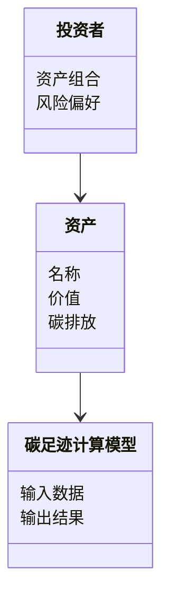
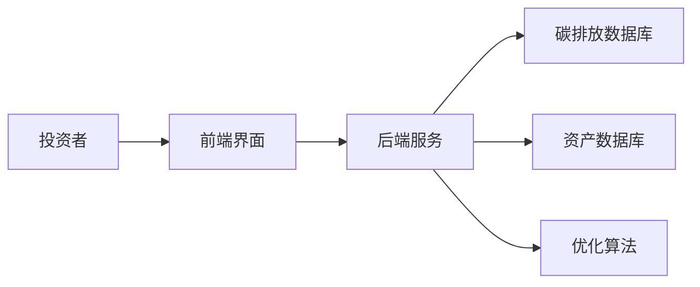

                 


# 构建智能化的个人投资组合碳足迹动态评估与优化工具

> 关键词：碳足迹，投资组合，动态评估，智能化，优化工具，机器学习

> 摘要：随着全球对可持续发展的关注日益增加，个人投资组合的碳足迹评估与优化变得至关重要。本文详细探讨了构建智能化工具的方法，从背景介绍到算法实现，再到系统设计和项目实战，为读者提供了全面的技术指导。

---

## 第一部分: 背景介绍

### 第1章: 个人投资组合碳足迹评估的背景与意义

#### 1.1 碳足迹的基本概念
- **碳足迹的定义**：碳足迹是指一个组织或个人在一定时期内，所有活动产生的温室气体排放的总和。对于投资组合而言，其碳足迹取决于所投资资产的碳排放情况。
- **投资组合的特殊性**：投资组合由多种资产组成，如股票、债券、房地产等，每种资产的碳排放强度不同，因此投资组合的碳足迹需要综合考虑各资产的碳排放。
- **碳中和目标**：全球目标是到2050年实现碳中和，这促使投资者更加关注投资组合的碳足迹，以确保投资行为符合可持续发展目标。

#### 1.2 个人投资组合的动态评估需求
- **动态调整的必要性**：市场环境和资产价格不断变化，投资组合的碳足迹也会随之波动。因此，需要动态评估和优化。
- **实时性要求**：投资者需要及时了解投资组合的碳足迹变化，以便做出快速调整。
- **差异化需求**：不同投资者的风险承受能力和环保目标不同，投资组合的碳足迹评估和优化需要个性化定制。

#### 1.3 智能化工具的必要性
- **传统方法的局限性**：传统方法依赖手工计算和静态模型，无法实时跟踪和优化投资组合的碳足迹。
- **智能化工具的优势**：通过机器学习和大数据分析，智能化工具可以实时更新碳足迹数据，并提供优化建议。
- **技术驱动投资策略**：智能化工具利用技术手段，帮助投资者制定更科学、更环保的投资策略。

---

### 第2章: 碳足迹评估的核心概念与联系

#### 2.1 碳足迹评估的核心原理
- **碳排放的计算模型**：基于投资资产的碳排放强度和投资金额，计算出每种资产的碳排放，再汇总得到整个投资组合的碳足迹。
- **影响因素**：包括资产类型、地理位置、行业特性、市场价格波动等。
- **与投资回报的关系**：低碳投资不一定意味着低回报，需要在碳足迹和投资收益之间找到平衡点。

#### 2.2 核心概念对比表
以下表格对比了不同碳足迹评估方法的特征：

| 方法                | 数据来源       | 计算复杂度 | 实时性 | 适用场景 |
|---------------------|----------------|------------|--------|----------|
| 静态评估            | 固定数据       | 低          | 否      | 初步评估 |
| 动态评估            | 实时数据       | 中          | 是      | 持续优化 |
| 机器学习评估        | 历史与实时数据 | 高          | 是      | 精准优化 |

#### 2.3 实体关系图
以下为实体关系图，展示了投资者、投资组合、资产、碳排放数据和计算模型之间的关系：


---

## 第二部分: 算法原理讲解

### 第3章: 碳足迹动态评估算法

#### 3.1 算法选择与优化
- **动态规划算法**：适用于在给定时间段内，选择最优的投资组合以最小化碳足迹。
- **机器学习模型**：利用回归分析预测碳排放，结合投资组合的收益和风险进行优化。
- **算法优化**：通过参数调整和模型训练，提高算法的准确性和计算效率。

#### 3.2 算法流程图
以下是碳足迹动态评估算法的流程图：


#### 3.3 算法实现
以下是Python代码实现：

```python
import numpy as np
import pandas as pd

def calculate_carbon_footprint/assets_values):
    # 计算每种资产的碳排放
    emissions = assets_values * carbon_intensity
    return emissions.sum()

def optimize_portfolio/assets_values, target_emission):
    # 使用动态规划优化投资组合
    n = len(assets_values)
    dp = np.zeros(n+1)
    dp[0] = 1
    for i in range(n):
        for j in range(i, n):
            if dp[i] + assets_values[j] <= target_emission:
                dp[i+1] = max(dp[i+1], dp[i] + assets_values[j])
    return dp
```

#### 3.4 数学模型
以下是碳足迹优化的数学模型：

$$ \text{目标：} \min \sum_{i=1}^{n} w_i \cdot e_i $$

$$ \text{约束：} \sum_{i=1}^{n} w_i = 1, \quad w_i \geq 0 $$

其中，\( w_i \) 是资产 \( i \) 的权重，\( e_i \) 是资产 \( i \) 的碳排放强度。

---

### 第4章: 优化工具的构建

#### 4.1 优化模型设计
- **多目标优化**：同时考虑碳足迹和投资回报，构建多目标优化模型。
- **约束条件**：如资产配置比例、风险承受能力等。

#### 4.2 工具实现
以下是优化工具的实现步骤：

1. 收集投资组合数据，包括资产价值、碳排放强度等。
2. 使用机器学习模型预测未来碳排放。
3. 应用优化算法计算最优投资组合。
4. 输出优化结果，包括碳足迹和投资收益。

---

## 第三部分: 系统分析与架构设计

### 第5章: 系统功能设计

#### 5.1 功能模块
- **数据采集**：实时采集资产数据和碳排放数据。
- **评估计算**：计算投资组合的碳足迹。
- **优化推荐**：提供优化建议。

#### 5.2 领域模型
以下是领域模型的类图：



### 第6章: 系统架构设计

#### 6.1 系统架构图
以下是系统架构图：



#### 6.2 接口设计
- **API接口**：提供REST API，供投资者调用碳足迹评估和优化服务。
- **数据接口**：与数据源（如股票交易所）对接，获取实时数据。

---

## 第四部分: 项目实战

### 第7章: 项目实战

#### 7.1 环境安装
- **Python**：安装Python 3.8及以上版本。
- **库的安装**：安装numpy、pandas、scikit-learn等库。

#### 7.2 核心代码实现
以下是核心代码：

```python
import pandas as pd
from sklearn.linear_model import LinearRegression

def main():
    # 数据加载
    data = pd.read_csv('assets.csv')
    # 模型训练
    model = LinearRegression()
    model.fit(data[['资产价值', '行业因素']], data['碳排放'])
    # 预测碳排放
    predicted_emissions = model.predict(data[['资产价值', '行业因素']])
    # 优化投资组合
    optimized_portfolio = optimize_portfolio(data['资产价值'], target_emission=0.5)
    print("优化后的投资组合：", optimized_portfolio)

if __name__ == "__main__":
    main()
```

#### 7.3 实际案例分析
以某投资组合为例，分析其碳足迹并进行优化，展示优化前后的结果对比。

---

## 第五部分: 最佳实践

### 第8章: 最佳实践

#### 8.1 小结
- **工具优势**：智能化工具能够实时评估和优化投资组合的碳足迹，帮助投资者实现可持续投资。
- **经验教训**：数据质量和模型准确性是工具成功的关键。

#### 8.2 注意事项
- **数据隐私**：确保投资者数据的安全和隐私。
- **模型更新**：定期更新模型和数据源，保持工具的准确性。

#### 8.3 拓展阅读
推荐一些关于碳足迹和投资组合优化的书籍和论文，供读者深入学习。

---

## 结语

构建智能化的个人投资组合碳足迹动态评估与优化工具是一项具有重要意义的任务。通过本文的详细指导，读者可以掌握从理论到实践的整个过程，为实现可持续投资目标提供有力支持。

---

**作者：AI天才研究院 & 禅与计算机程序设计艺术**

