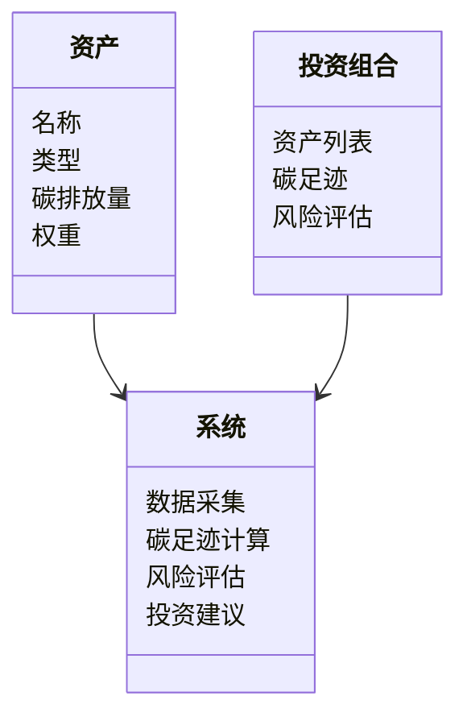
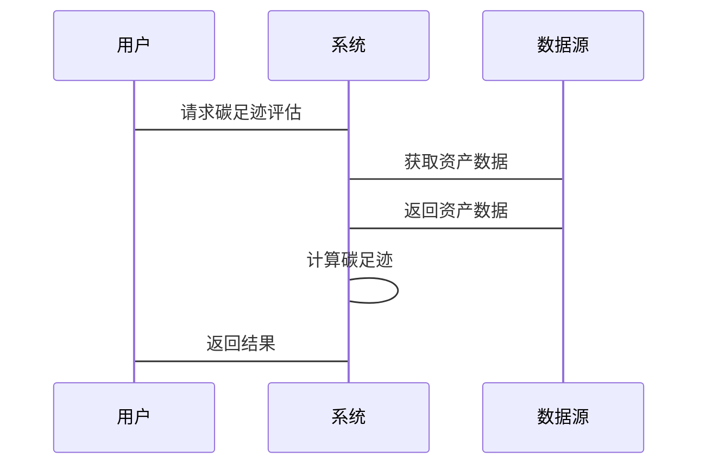

                 


# 构建智能化的个人投资组合碳足迹评估工具

> 关键词：投资组合，碳足迹，智能化评估，算法原理，系统架构

> 摘要：本文将介绍如何构建一个智能化的个人投资组合碳足迹评估工具。首先，我们将介绍碳足迹的基本概念、投资组合的定义及其智能化评估的必要性。接着，我们将详细讲解碳足迹评估的核心原理、算法实现以及系统的架构设计。最后，通过项目实战和最佳实践，帮助读者更好地理解和应用这一工具。

---

# 第一部分: 背景介绍

# 第1章: 碳足迹与投资组合概述

## 1.1 碳足迹的基本概念

### 1.1.1 碳足迹的定义
碳足迹是指一个人或一个组织在一定时间内，所有活动所产生的温室气体排放的总和。它衡量了我们在生产和消费过程中对环境的影响。

### 1.1.2 碳足迹的计算方法
碳足迹的计算通常包括直接排放和间接排放。直接排放是指企业或个人自身产生的排放，而间接排放则是指产品或服务在其生命周期中所消耗的能源所产生的排放。

### 1.1.3 碳足迹的重要性
随着全球气候变化问题的加剧，碳足迹的计算和管理变得越来越重要。它不仅是企业实现碳中和目标的重要手段，也是个人在投资决策中需要考虑的关键因素。

## 1.2 投资组合的定义与特点

### 1.2.1 投资组合的定义
投资组合是指将资金分配到不同资产（如股票、债券、房地产等）上的策略，以实现风险分散和收益最大化。

### 1.2.2 投资组合的核心要素
投资组合的核心要素包括资产配置、风险承受能力和投资目标。合理的资产配置可以帮助投资者在不同市场环境下保持稳定的收益。

### 1.2.3 投资组合的风险与收益
投资组合的风险通常与收益成正比。高风险的投资组合可能带来更高的收益，但也可能面临更大的亏损风险。

## 1.3 智能化投资组合碳足迹评估的必要性

### 1.3.1 碳中和目标与投资的关系
为了实现碳中和目标，投资者需要关注其投资组合的碳排放情况，从而做出更符合可持续发展目标的投资决策。

### 1.3.2 碳足迹评估在投资决策中的作用
碳足迹评估可以帮助投资者识别高排放资产，优化投资组合的碳效率，降低投资风险。

### 1.3.3 智能化评估的优势
智能化评估工具可以通过大数据分析和机器学习算法，快速、准确地计算投资组合的碳足迹，为投资者提供实时的决策支持。

## 1.4 本章小结
本章介绍了碳足迹的基本概念、投资组合的定义及其智能化评估的必要性。通过理解这些内容，我们可以更好地认识到构建智能化投资组合碳足迹评估工具的重要性。

---

# 第二部分: 核心概念与联系

# 第2章: 碳足迹评估的核心原理

## 2.1 碳足迹评估的原理

### 2.1.1 碳足迹的生命周期分析
碳足迹的生命周期分析包括原材料获取、生产、使用和废弃处理等阶段的碳排放计算。

### 2.1.2 碳足迹的计算模型
碳足迹的计算模型通常包括排放因子法和生命周期评估法。排放因子法通过单位产品或服务的排放因子来计算碳足迹，而生命周期评估法则更全面地考虑了产品或服务的整个生命周期。

### 2.1.3 碳足迹评估的关键因素
碳足迹评估的关键因素包括能源消耗、运输方式、生产过程和废弃物处理等。

## 2.2 投资组合碳足迹的核心要素

### 2.2.1 投资组合的碳排放来源
投资组合的碳排放来源包括投资的资产类型（如化石能源、可再生能源）、地理位置和行业等因素。

### 2.2.2 投资组合的碳足迹计算公式
投资组合的碳足迹可以通过以下公式计算：
$$
\text{碳足迹} = \sum_{i=1}^{n} w_i \times e_i
$$
其中，\( w_i \) 是第 \( i \) 个资产的权重，\( e_i \) 是第 \( i \) 个资产的单位碳排放量。

### 2.2.3 投资组合的碳风险评估
碳风险评估是指评估投资组合在不同情景下的碳排放风险，包括政策风险、市场风险和声誉风险等。

## 2.3 碳足迹与投资组合的关系

### 2.3.1 碳足迹对投资组合的影响
碳足迹直接影响投资组合的碳风险和收益。高碳排放的投资组合可能面临更高的政策风险和市场风险。

### 2.3.2 投资组合碳足迹的动态变化
投资组合的碳足迹会随着市场环境和政策的变化而动态变化。投资者需要实时监控和调整其投资组合的碳足迹。

### 2.3.3 碳足迹评估对投资决策的指导作用
碳足迹评估可以帮助投资者识别高碳排放资产，优化资产配置，降低碳风险，实现可持续投资目标。

## 2.4 本章小结
本章详细讲解了碳足迹评估的核心原理、投资组合碳足迹的核心要素以及碳足迹与投资组合的关系。通过这些内容，我们可以更好地理解智能化投资组合碳足迹评估工具的理论基础。

---

# 第三部分: 算法原理讲解

# 第3章: 碳足迹评估算法原理

## 3.1 碳足迹评估的算法概述

### 3.1.1 碳足迹评估的主要算法
常用的碳足迹评估算法包括排放因子法、生命周期评估法和机器学习算法（如随机森林和XGBoost）。

### 3.1.2 算法的优缺点对比
- 排放因子法：简单易行，但不够全面。
- 生命周期评估法：全面准确，但计算复杂。
- 机器学习算法：能够处理复杂数据，但需要大量数据支持。

### 3.1.3 算法选择的依据
算法的选择取决于数据的可用性、计算复杂性和应用场景。对于个人投资组合碳足迹评估，机器学习算法可以提供更高的准确性和实时性。

## 3.2 碳足迹评估的数学模型

### 3.2.1 碳足迹计算的数学公式
碳足迹的计算公式可以表示为：
$$
\text{碳足迹} = \sum_{i=1}^{n} w_i \times e_i
$$
其中，\( w_i \) 是第 \( i \) 个资产的权重，\( e_i \) 是第 \( i \) 个资产的单位碳排放量。

### 3.2.2 投资组合碳足迹的数学模型
投资组合碳足迹的数学模型可以表示为：
$$
\text{碳足迹} = \sum_{i=1}^{n} w_i \times e_i
$$
其中，\( w_i \) 是第 \( i \) 个资产的权重，\( e_i \) 是第 \( i \) 个资产的单位碳排放量。

### 3.2.3 算法的数学推导
通过数学推导，我们可以得出最优投资组合的碳足迹最小化模型：
$$
\min_{w} \sum_{i=1}^{n} w_i \times e_i
$$
约束条件：
$$
\sum_{i=1}^{n} w_i = 1
$$
$$
w_i \geq 0 \quad \forall i
$$

## 3.3 算法实现的步骤

### 3.3.1 数据收集与预处理
数据收集包括资产的碳排放数据、资产权重和市场数据等。预处理包括数据清洗、标准化和特征提取。

### 3.3.2 算法实现流程
1. 数据预处理：清洗和标准化数据。
2. 模型训练：使用机器学习算法训练碳足迹评估模型。
3. 模型预测：对投资组合进行碳足迹预测。
4. 结果分析：评估模型的准确性和优化模型。

### 3.3.3 结果验证与优化
通过交叉验证和回测分析，验证模型的准确性和稳定性，并根据实际情况进行优化。

## 3.4 本章小结
本章详细讲解了碳足迹评估的算法原理，包括算法选择、数学模型和实现步骤。通过这些内容，我们可以更好地理解智能化投资组合碳足迹评估工具的技术基础。

---

# 第四部分: 系统分析

# 第4章: 系统分析与架构设计

## 4.1 问题场景介绍
本章将介绍构建智能化投资组合碳足迹评估工具的系统分析与架构设计。

## 4.2 系统功能设计

### 4.2.1 功能需求分析
系统需要实现的功能包括数据采集、碳足迹计算、风险评估和投资建议等。

### 4.2.2 领域模型设计
以下是领域模型的类图：


## 4.3 系统架构设计

### 4.3.1 系统架构图
以下是系统架构设计图：
```mermaid
container 系统架构 {
    前端
    后端
    数据库
}
```

### 4.3.2 接口设计
系统主要接口包括数据接口、计算接口和用户接口。

### 4.3.3 交互流程
以下是交互流程图：


## 4.4 本章小结
本章详细介绍了构建智能化投资组合碳足迹评估工具的系统分析与架构设计，包括功能需求、系统架构和交互流程。

---

# 第五部分: 项目实战

# 第5章: 项目实战

## 5.1 环境安装

### 5.1.1 工具安装
需要安装Python、Pandas、NumPy、Scikit-learn等工具。

### 5.1.2 数据源获取
从公开数据源获取资产的碳排放数据和市场数据。

## 5.2 系统核心实现

### 5.2.1 核心代码实现
以下是Python实现的代码示例：
```python
import pandas as pd
import numpy as np
from sklearn.ensemble import RandomForestRegressor

# 数据预处理
data = pd.read_csv('asset_data.csv')
features = data[['资产类型', '地理位置', '行业']]
target = data['碳排放量']

# 模型训练
model = RandomForestRegressor()
model.fit(features, target)

# 预测碳足迹
new_asset = pd.DataFrame({
    '资产类型': ['股票'],
    '地理位置': ['欧美'],
    '行业': ['能源']
})
predicted_emissions = model.predict(new_asset)
print(predicted_emissions)
```

### 5.2.2 代码应用解读与分析
以上代码展示了如何使用随机森林算法进行碳足迹预测。模型通过训练数据学习资产的碳排放规律，然后对新资产进行预测。

## 5.3 案例分析与详细讲解

### 5.3.1 案例分析
假设我们有一个包含股票、债券和房地产的投资组合，我们需要计算其碳足迹。

### 5.3.2 结果分析
通过模型计算，我们可以得到每个资产的碳排放量，并综合计算出整个投资组合的碳足迹。

## 5.4 本章小结
本章通过项目实战，展示了如何使用Python和机器学习算法实现智能化投资组合碳足迹评估工具的核心功能。

---

# 第六部分: 总结与展望

# 第6章: 总结与展望

## 6.1 总结

### 6.1.1 工具的优势
智能化投资组合碳足迹评估工具的优势包括高效性、准确性和实时性。

### 6.1.2 工具的不足
当前工具的不足之处包括数据获取的难度和模型的局限性。

## 6.2 未来展望

### 6.2.1 技术进步
随着技术的进步，我们可以期待更精确的碳足迹计算方法和更智能的投资决策支持系统。

### 6.2.2 应用场景拓展
未来，智能化投资组合碳足迹评估工具可以应用于更广泛的领域，如企业风险管理和社会责任投资。

## 6.3 本章小结
本章总结了智能化投资组合碳足迹评估工具的优势和不足，并展望了未来的发展方向。

---

# 第七部分: 最佳实践

# 第7章: 最佳实践

## 7.1 最佳实践 tips

### 7.1.1 数据收集
数据收集是碳足迹评估的关键，建议优先选择权威数据源。

### 7.1.2 模型选择
根据具体需求选择合适的算法，如随机森林和XGBoost。

### 7.1.3 模型优化
通过交叉验证和参数调优，提高模型的准确性和稳定性。

## 7.2 本章小结
本章总结了一些在构建智能化投资组合碳足迹评估工具过程中的最佳实践，包括数据收集、模型选择和优化建议。

---

# 作者

作者：AI天才研究院/AI Genius Institute & 禅与计算机程序设计艺术 /Zen And The Art of Computer Programming

---

通过以上详细的大纲，我们可以看到构建智能化的个人投资组合碳足迹评估工具需要综合运用碳足迹评估的核心原理、算法实现、系统架构设计和项目实战等多方面的知识。希望这篇文章能够为读者提供清晰的思路和实用的指导。

