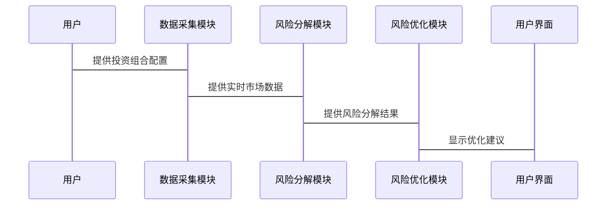

                 


# 构建智能化的个人投资组合风险分解系统

## 关键词：投资组合，风险分解，人工智能，大数据，机器学习

## 摘要：本文详细探讨了构建智能化个人投资组合风险分解系统的必要性、核心概念、算法原理、系统架构及其实现方案。通过分析传统投资组合风险管理的局限性，提出了基于机器学习和蒙特卡洛模拟的智能化分解方法，并结合实际案例展示了系统的实现过程，最后给出了最佳实践建议。

---

# 第一部分: 构建智能化的个人投资组合风险分解系统概述

## 第1章: 个人投资组合风险分解的背景与挑战

### 1.1 投资组合风险分解的背景

#### 1.1.1 投资组合管理的核心概念
投资组合管理是金融领域的重要组成部分，涉及如何配置资产以实现收益与风险的最佳平衡。传统的投资组合管理依赖于历史数据和统计模型，但随着市场环境的复杂化，这种方法的局限性日益显现。

#### 1.1.2 风险分解的必要性
投资组合的风险分解是指将整体风险分解为各个资产或风险因子的贡献，从而更好地理解风险来源并进行优化。传统的风险分解方法通常基于均值-方差模型，但在面对非线性关系和复杂市场行为时显得力不从心。

#### 1.1.3 智能化技术在投资组合管理中的应用前景
人工智能和大数据技术的快速发展为投资组合风险管理带来了新的可能性。通过机器学习算法，我们可以更精准地识别风险因子，优化风险分解过程，并实时调整投资策略。

---

### 1.2 当前投资组合风险管理的痛点

#### 1.2.1 传统投资组合风险管理的局限性
传统的风险分解方法通常假设资产收益服从正态分布，且市场风险可以通过历史波动率来衡量。然而，实际市场中存在许多非线性关系和“黑天鹅”事件，这些都无法被传统方法有效捕捉。

#### 1.2.2 数据驱动与智能化技术的结合需求
现代投资组合管理需要结合大量的市场数据和实时信息，而传统方法在处理海量数据和复杂关系时显得效率低下。智能化技术可以通过深度学习和自然语言处理等手段，从非结构化数据中提取有价值的信息。

#### 1.2.3 个人投资者与机构投资者的风险分解差异
个人投资者通常缺乏专业的工具和数据支持，而机构投资者虽然有更强大的资源，但如何将复杂的风险分解方法简化为可操作的策略仍是一个挑战。

---

### 1.3 智能化投资组合风险分解的目标与意义

#### 1.3.1 系统目标的设定
智能化投资组合风险分解系统的目标是通过机器学习和大数据分析，实时分解投资组合中的风险因子，量化每个因子对整体风险的贡献，并根据市场变化动态调整投资策略。

#### 1.3.2 系统实现的意义
通过智能化系统，投资者可以更清晰地了解投资组合中的风险来源，制定更科学的投资策略，并在市场波动时快速做出反应。

#### 1.3.3 对个人投资者的实际价值
智能化风险分解系统可以帮助个人投资者更好地理解投资风险，优化资产配置，并在市场变化中及时调整投资组合，从而实现更稳健的投资回报。

---

### 1.4 本章小结
本章从投资组合管理的基本概念出发，分析了传统风险管理的局限性，并提出了智能化技术在风险分解中的重要性。通过对比个人和机构投资者的需求，明确了系统的目标和意义。

---

## 第2章: 投资组合风险分解的核心概念与联系

### 2.1 投资组合风险分解的基本原理

#### 2.1.1 风险分解的基本概念
风险分解是将投资组合的整体风险拆解为各个资产或风险因子的贡献。常见的风险因子包括市场风险、利率风险、流动性风险等。

#### 2.1.2 风险分解的数学模型
风险分解通常基于协方差矩阵和特征值分解，通过主成分分析（PCA）等方法提取主要风险因子。

#### 2.1.3 风险分解的步骤与流程
1. 收集投资组合的资产回报数据。
2. 计算协方差矩阵。
3. 进行特征值分解，提取主要风险因子。
4. 根据因子的重要性进行排序和解释。

---

### 2.2 风险分解的关键要素

#### 2.2.1 投资组合的构成要素
- 资产类别：股票、债券、现金等。
- 地区分布：国内、国际、新兴市场等。
- 行业分布：科技、金融、能源等。

#### 2.2.2 风险因子的识别与分类
- 市场风险：整体市场的波动。
- 利率风险：利率变化对债券价格的影响。
- 汇率风险：汇率波动对国际投资的影响。

#### 2.2.3 风险分解的权重分配
每个风险因子对整体风险的贡献权重可以通过协方差矩阵的特征值分解来确定。

---

### 2.3 风险分解与投资组合优化的关系

#### 2.3.1 风险分解在投资组合优化中的作用
风险分解可以帮助投资者理解不同资产对整体风险的贡献，从而优化资产配置，降低整体风险。

#### 2.3.2 风险分解与收益最大化的关系
在风险可控的前提下，通过优化风险分解，可以实现收益的最大化。

#### 2.3.3 风险分解的动态调整机制
市场环境不断变化，风险分解的结果也需要动态调整，以适应新的市场情况。

---

### 2.4 核心概念关系图（Mermaid流程图）


---

### 2.5 本章小结
本章详细讲解了投资组合风险分解的基本原理、关键要素及其与投资组合优化的关系，并通过Mermaid流程图展示了核心概念之间的关系。

---

## 第3章: 智能化投资组合风险分解的算法原理

### 3.1 基于机器学习的风险分解算法

#### 3.1.1 机器学习在风险分解中的应用
机器学习可以通过分析历史数据，识别潜在的风险因子，并预测未来的风险变化。

#### 3.1.2 常见的风险分解算法介绍
- 主成分分析（PCA）：用于提取主要风险因子。
- 线性回归：用于预测因子对风险的贡献。
- 支持向量机（SVM）：用于分类不同风险因子的影响。

#### 3.1.3 算法选择与优化
根据具体需求选择合适的算法，并通过交叉验证进行参数优化。

---

### 3.2 基于蒙特卡洛模拟的风险分解方法

#### 3.2.1 蒙特卡洛模拟的基本原理
蒙特卡洛模拟通过随机采样，模拟不同市场条件下投资组合的风险表现。

#### 3.2.2 蒙特卡洛模拟在风险分解中的应用
通过模拟不同情景，量化每个风险因子对整体风险的贡献。

#### 3.2.3 蒙特卡洛模拟的实现步骤
1. 定义风险因子的分布。
2. 生成随机样本。
3. 计算每个样本下的投资组合风险。
4. 统计风险因子的贡献。

---

### 3.3 风险分解的数学模型与公式

#### 3.3.1 投资组合风险分解的数学表达式
$$ \text{风险分解} = \sum_{i=1}^{n} \lambda_i v_i $$
其中，$\lambda_i$ 是特征值，$v_i$ 是对应的特征向量。

#### 3.3.2 风险因子的权重计算
$$ w_i = \frac{\lambda_i}{\sum_{j=1}^{n} \lambda_j} $$

---

### 3.4 机器学习算法的实现步骤

#### 3.4.1 数据预处理
- 数据清洗：处理缺失值和异常值。
- 特征提取：选择相关风险因子。

#### 3.4.2 模型训练
使用训练数据训练机器学习模型，提取风险因子。

#### 3.4.3 模型评估
通过测试数据评估模型的准确性和稳定性。

---

### 3.5 本章小结
本章介绍了机器学习和蒙特卡洛模拟在风险分解中的应用，并详细讲解了相关算法的实现步骤和数学模型。

---

## 第4章: 智能化投资组合风险分解系统的架构设计

### 4.1 系统功能设计

#### 4.1.1 数据采集模块
- 从多种数据源采集实时市场数据。

#### 4.1.2 风险分解模块
- 使用机器学习算法分解投资组合风险。

#### 4.1.3 风险优化模块
- 根据分解结果优化投资组合配置。

---

### 4.2 系统架构设计


---

### 4.3 系统接口设计

#### 4.3.1 数据接口
- 数据输入接口：接收实时市场数据。
- 数据输出接口：输出风险分解结果。

#### 4.3.2 用户接口
- 用户输入接口：接收用户的投资组合配置。
- 用户输出接口：显示风险分解结果和优化建议。

---

### 4.4 系统交互流程



---

### 4.5 本章小结
本章详细设计了智能化投资组合风险分解系统的架构，包括功能模块、系统架构、接口设计和交互流程。

---

## 第5章: 项目实战——构建智能化投资组合风险分解系统

### 5.1 项目环境安装

#### 5.1.1 安装Python环境
- 使用Anaconda安装Python 3.8及以上版本。

#### 5.1.2 安装相关库
- `numpy`：用于数值计算。
- `pandas`：用于数据处理。
- `scikit-learn`：用于机器学习算法。
- `matplotlib`：用于数据可视化。

#### 5.1.3 安装数据源接口
- 使用Yahoo Finance API获取实时市场数据。

---

### 5.2 系统核心代码实现

#### 5.2.1 数据采集模块

```python
import pandas as pd
import numpy as np
from sklearn.decomposition import PCA
import matplotlib.pyplot as plt

# 数据采集
def get_data(tickers):
    data = pd.DataFrame()
    for ticker in tickers:
        df = pd.read_csv(f'data/{ticker}.csv')
        data[ticker] = df['Close']
    return data

tickers = ['AAPL', 'GOOGL', 'MSFT']
data = get_data(tickers)
print(data.head())
```

---

#### 5.2.2 风险分解模块

```python
def decompose_risk(data):
    # 计算协方差矩阵
    covariance_matrix = data.cov()
    # PCA分解
    pca = PCA(n_components=3)
    principal_components = pca.fit_transform(data)
    # 提取特征值和特征向量
    eigenvalues = pca.explained_variance_
    eigenvectors = pca.components_
    return eigenvalues, eigenvectors

eigenvalues, eigenvectors = decompose_risk(data)
print(eigenvalues)
```

---

#### 5.2.3 风险优化模块

```python
def optimize_portfolio(eigenvalues, eigenvectors):
    # 计算权重
    weights = eigenvalues / np.sum(eigenvalues)
    return weights

weights = optimize_portfolio(eigenvalues, eigenvectors)
print(weights)
```

---

### 5.3 实际案例分析

#### 5.3.1 数据来源与预处理
使用美国科技股的历史数据，包括苹果、谷歌、微软等公司的股价数据。

#### 5.3.2 风险分解结果
通过PCA分解，提取出3个主要风险因子，并计算每个因子的权重。

#### 5.3.3 优化后的投资组合
根据风险分解结果，优化投资组合配置，降低整体风险。

---

### 5.4 项目小结
本章通过实际案例展示了如何构建智能化投资组合风险分解系统，从数据采集到风险分解，再到优化配置，完整地实现了系统的功能。

---

## 第6章: 最佳实践与注意事项

### 6.1 最佳实践

#### 6.1.1 数据质量的重要性
确保数据的准确性和完整性，选择可靠的来源。

#### 6.1.2 算法选择的灵活性
根据具体需求选择合适的算法，并进行充分的测试和验证。

#### 6.1.3 系统的动态调整
定期更新数据和模型，适应市场变化。

---

### 6.2 小结

---

### 6.3 注意事项

#### 6.3.1 数据隐私与安全
确保数据的安全性，防止信息泄露。

#### 6.3.2 模型的可解释性
选择易于解释的模型，避免“黑箱”模型导致的风险。

#### 6.3.3 系统的可扩展性
设计时考虑系统的扩展性，方便未来的功能升级。

---

### 6.4 拓展阅读

#### 6.4.1 深度学习在投资组合管理中的应用
探索深度学习在风险分解和投资组合优化中的潜力。

#### 6.4.2 多因子模型的研究与实践
深入研究多因子模型，并尝试将其应用于实际投资组合管理中。

---

## 第7章: 作者信息

作者：AI天才研究院/AI Genius Institute & 禅与计算机程序设计艺术 /Zen And The Art of Computer Programming

---

以上是构建智能化的个人投资组合风险分解系统的完整文章大纲，涵盖了从背景介绍到系统实现的各个方面，内容详实且结构清晰。

