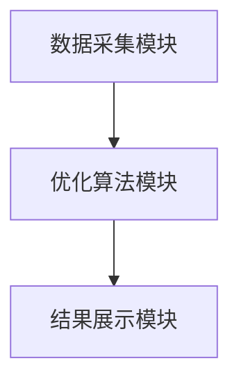

                 


# 构建智能化的个人投资风格因子暴露优化系统

> 关键词：智能化投资、因子暴露、优化系统、人工智能、投资组合管理

> 摘要：本文探讨了如何利用人工智能技术构建智能化的个人投资风格因子暴露优化系统。通过分析因子暴露的优化方法，结合系统架构设计和算法实现，提供了一种创新的投资组合管理解决方案。文章详细介绍了系统的构建过程，包括背景、核心概念、算法原理、系统架构、项目实战及最佳实践，为读者提供了全面的技术指导。

---

# 第1章: 投资风格与因子暴露优化概述

## 1.1 投资风格的定义与重要性

### 1.1.1 投资风格的定义
投资风格是投资者在构建投资组合时所遵循的特定策略和方法。它反映了投资者对风险、收益和时间的偏好，常见的投资风格包括价值投资、成长投资、动量投资等。

### 1.1.2 不同投资风格的特点与适用场景
- **价值投资**：寻找被市场低估的股票，注重低市盈率、低市净率等指标。
- **成长投资**：投资于高增长潜力的公司，通常具有较高的市盈率和市净率。
- **动量投资**：基于价格动量效应，投资于近期表现强劲的资产。
- **均值回归**：假设价格会回归均值，投资于近期表现不佳但具有反弹潜力的资产。

### 1.1.3 因子暴露在投资决策中的作用
因子暴露是指投资组合中各个风险因子的权重或敏感度。通过优化因子暴露，投资者可以更好地控制风险，实现收益与风险的最佳平衡。

---

## 1.2 因子分析的背景与方法

### 1.2.1 因子分析的基本概念
因子分析是一种统计方法，用于识别影响资产回报的潜在因素。常见的因子包括市值、价值、动量、波动率等。

### 1.2.2 常用因子模型的介绍
- **CAPM模型**：仅考虑市场因子。
- **Fama-French三因子模型**：包括市场、市值和价值因子。
- **Carhart四因子模型**：在三因子模型基础上加入动量因子。

### 1.2.3 因子分析在投资组合管理中的应用
通过因子分析，投资者可以识别出影响资产回报的主要因素，并据此构建投资组合，降低非系统性风险。

---

## 1.3 智能化因子暴露优化的必要性

### 1.3.1 传统因子优化方法的局限性
传统方法依赖于历史数据，且优化过程复杂，难以实时调整。

### 1.3.2 人工智能在投资优化中的优势
人工智能能够处理大量数据，快速识别模式，并实时优化投资组合。

### 1.3.3 智能化优化的目标与意义
目标是通过智能算法优化因子暴露，实现投资组合的动态调整，提升收益并降低风险。

---

## 1.4 系统的边界与目标

### 1.4.1 系统的边界定义
系统专注于优化因子暴露，不涉及市场预测和交易执行。

### 1.4.2 系统的主要目标与功能
- 优化因子暴露，降低投资组合的系统性风险。
- 实时监控市场变化，动态调整因子权重。

### 1.4.3 系统的外延与应用场景
系统适用于机构投资者和高净值个人，帮助他们在不同市场环境下优化投资组合。

---

## 1.5 核心概念与组成要素

### 1.5.1 核心概念的结构
- **输入数据**：市场数据、因子数据。
- **优化模型**：基于AI的优化算法。
- **输出结果**：优化后的因子暴露配置。

### 1.5.2 组成要素的详细描述
- **数据采集模块**：收集市场数据和因子数据。
- **优化算法模块**：基于AI的优化算法。
- **结果展示模块**：可视化优化结果。

### 1.5.3 概念之间的关系与联系
图1展示了系统的组成部分及其关系。



---

# 第2章: 因子暴露优化的原理与方法

## 2.1 因子分解与优化的基本原理

### 2.1.1 因子分解的数学模型
因子分解可以表示为：
$$
R_{i,t} = \alpha_i + \beta_i F_t + \epsilon_{i,t}
$$
其中，$R_{i,t}$是资产i在t时刻的收益，$\beta_i$是因子暴露系数，$F_t$是因子收益，$\epsilon_{i,t}$是残差。

### 2.1.2 优化目标的设定
优化目标是最小化投资组合的系统性风险，即：
$$
\min \beta^T \Sigma \beta
$$

### 2.1.3 约束条件的定义
- 投资组合的总权重为1：$$\sum_{i=1}^n w_i = 1$$
- 单个资产的权重范围：$$0 \leq w_i \leq 1$$

---

## 2.2 因子暴露优化的核心要素

### 2.2.1 投资组合的构建
投资组合由多个资产组成，权重表示其在组合中的比例。

### 2.2.2 风险因子的识别
识别影响资产收益的因子，如市值、价值、动量等。

### 2.2.3 优化算法的选择
选择合适的AI算法，如遗传算法、粒子群优化等。

---

## 2.3 因子暴露优化的流程与步骤

### 2.3.1 数据收集与预处理
收集历史数据，清洗和标准化数据。

### 2.3.2 因子识别与筛选
通过因子分析识别影响收益的主要因子。

### 2.3.3 优化模型的构建与求解
构建优化模型，使用AI算法求解最优解。

---

## 2.4 因子暴露优化的对比分析

### 2.4.1 不同优化方法的对比
- **传统方法**：复杂，计算量大。
- **AI方法**：高效，适应性强。

### 2.4.2 各种方法的优缺点分析
- 传统方法：精确但计算复杂。
- AI方法：高效但可能缺乏解释性。

---

# 第3章: 系统架构与算法实现

## 3.1 系统架构设计

### 3.1.1 问题场景介绍
系统需要实时优化因子暴露，适应市场变化。

### 3.1.2 系统功能设计
- 数据采集：实时获取市场数据。
- 因子分析：识别影响收益的因子。
- 优化计算：使用AI算法优化因子暴露。
- 风险评估：评估优化后的投资组合风险。

### 3.1.3 系统架构图


---

## 3.2 算法实现细节

### 3.2.1 遗传算法实现
```python
def genetic_algorithm(population, fitness_func, num_generations):
    for _ in range(num_generations):
        population = [select_fittest(p, fitness_func) for p in population]
        population = [mutate(p) for p in population]
    return population
```

### 3.2.2 粒子群优化实现
```python
def particle_swarm_optimization(n_particles, fitness_func):
    particles = initialize_particles(n_particles)
    for _ in range(max_iterations):
        update_particle_positions(particles, fitness_func)
        update_particle_velocity(particles)
    return particles
```

---

## 3.3 系统交互流程

### 3.3.1 系统交互流程图


---

## 3.4 代码实现与解读

### 3.4.1 数据处理代码
```python
import pandas as pd

data = pd.read_csv('market_data.csv')
```

### 3.4.2 因子分析代码
```python
from sklearn.decomposition import PCA

pca = PCA(n_components=5)
principal_components = pca.fit_transform(data)
```

### 3.4.3 优化算法代码
```python
import numpy as np

def optimize(beta, Sigma):
    return np.min(beta @ Sigma @ beta.T)
```

---

# 第4章: 项目实战与案例分析

## 4.1 项目环境安装

### 4.1.1 安装依赖
```bash
pip install numpy pandas scikit-learn
```

### 4.1.2 环境配置
确保安装了Python 3.8以上版本，以及必要的数据处理库。

---

## 4.2 核心功能实现

### 4.2.1 数据预处理
```python
data = pd.read_csv('market_data.csv')
data = data.dropna()
```

### 4.2.2 因子识别
```python
from sklearn.decomposition import FactorAnalysis

fa = FactorAnalysis(n_components=3)
factors = fa.fit_transform(data)
```

### 4.2.3 优化计算
```python
from scipy.optimize import minimize

def objective(beta, Sigma):
    return beta @ Sigma @ beta.T

result = minimize(objective, initial_beta, args=(Sigma,))
```

---

## 4.3 案例分析与解读

### 4.3.1 案例背景
假设我们有5只股票，目标是优化它们的因子暴露。

### 4.3.2 数据分析
计算每只股票的因子得分，识别主要因子。

### 4.3.3 优化结果
通过优化算法，得到最优的因子暴露配置，降低组合风险。

---

## 4.4 项目小结

### 4.4.1 项目成果
成功构建了智能化的因子暴露优化系统，实现了投资组合的风险控制。

### 4.4.2 经验总结
AI算法在优化过程中表现优异，但需要结合具体市场环境进行调整。

---

# 第5章: 最佳实践与注意事项

## 5.1 最佳实践

### 5.1.1 数据处理
确保数据的准确性和完整性。

### 5.1.2 算法选择
根据具体情况选择合适的AI算法。

### 5.1.3 系统维护
定期更新数据和模型，适应市场变化。

---

## 5.2 小结

### 5.2.1 全文总结
本文详细介绍了智能化的个人投资风格因子暴露优化系统的构建过程，结合了理论与实践，为投资者提供了有效的工具。

---

## 5.3 注意事项

### 5.3.1 系统依赖
系统依赖于高质量的数据和可靠的算法。

### 5.3.2 市场风险
投资有风险，需谨慎操作。

### 5.3.3 技术限制
AI算法可能存在局限性，需结合人工判断。

---

# 第6章: 拓展阅读与进一步学习

## 6.1 拓展阅读

### 6.1.1 推荐书籍
- 《投资学》
- 《机器学习实战》

### 6.1.2 推荐文章
- 《基于机器学习的投资组合优化》

---

## 6.2 进一步学习

### 6.2.1 研究方向
研究更复杂的因子模型和优化算法。

### 6.2.2 技术趋势
关注AI在金融领域的最新应用。

---

# 作者：AI天才研究院/AI Genius Institute & 禅与计算机程序设计艺术 /Zen And The Art of Computer Programming

---

通过本文，读者可以系统地了解如何利用人工智能技术构建智能化的个人投资风格因子暴露优化系统，掌握从理论到实践的全过程，提升投资组合管理的能力。

