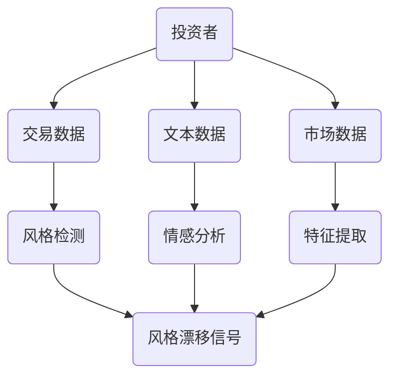
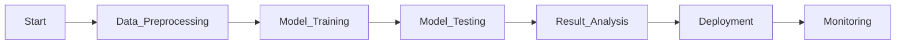
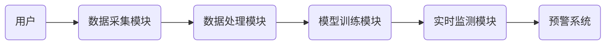
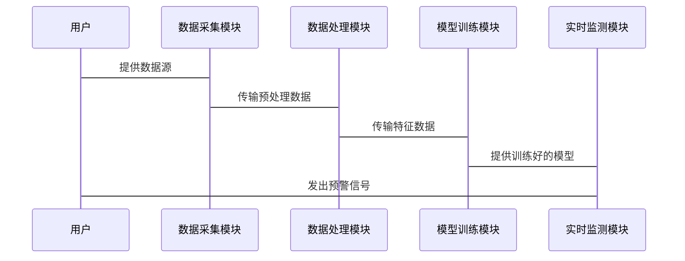

                 


# 构建智能化的个人投资风格漂移检测系统

> **关键词**：智能化，投资风格，漂移检测，机器学习，自然语言处理，时间序列分析

> **摘要**：本文详细探讨了如何利用机器学习和自然语言处理技术构建智能化的个人投资风格漂移检测系统。通过分析投资行为数据和文本信息，结合多模态数据融合技术，实现对投资风格变化的实时监测和预警。文章从背景介绍、核心概念、算法原理到系统架构，全面阐述了系统的构建过程，并通过实际案例展示了系统的应用场景和效果。

---

## 第一部分: 背景介绍

### 第1章: 个人投资风格漂移检测的背景与问题

#### 1.1 问题背景

##### 1.1.1 投资风格漂移的定义
投资风格漂移指的是投资者的投资策略、偏好或风险承受能力随时间发生变化的现象。这种变化可能导致投资组合偏离最初的设定目标，影响投资收益。

##### 1.1.2 漂移检测的必要性
- 投资者的行为受市场环境和个人情绪影响，容易发生风格漂移。
- 及时发现风格漂移有助于调整投资策略，优化投资组合。
- 传统方法依赖人工判断，效率低且主观性强。

##### 1.1.3 智能化检测的核心价值
- 利用AI技术实现自动化、实时化的风格漂移检测。
- 提供数据驱动的客观分析，帮助投资者做出科学决策。

#### 1.2 问题描述

##### 1.2.1 投资风格漂移的多维度表现
- 风险偏好变化：从保守转为激进，或反之。
- 投资品种偏好变化：从股票转向债券，或从成长股转向价值股。
- 投资时间窗口变化：短线交易转向长线持有。

##### 1.2.2 数据驱动的检测需求
- 需要整合多源数据：交易记录、市场数据、投资者行为数据。
- 要求实时或近实时的检测能力。

##### 1.2.3 现有方法的局限性
- 传统方法依赖专家经验，难以量化。
- 数据分析方法单一，无法捕捉复杂的投资行为变化。

#### 1.3 问题解决思路

##### 1.3.1 数据驱动与AI技术的结合
- 利用机器学习模型分析历史数据，识别潜在的风格变化。
- 使用自然语言处理技术分析投资者的行为数据（如社交媒体评论、报告）。

##### 1.3.2 多模态数据的融合分析
- 结合文本、交易数据和市场数据，构建全面的投资者画像。
- 通过数据融合提升模型的准确性和鲁棒性。

##### 1.3.3 智能化检测系统的构建框架
- 数据采集与预处理：整合多源数据，清洗和特征提取。
- 模型训练与优化：选择合适的算法，训练检测模型。
- 实时监测与预警：部署系统，实时检测并发出预警。

#### 1.4 边界与外延

##### 1.4.1 漂移检测的适用范围
- 适用于个人投资者和机构投资者。
- 适用于多种投资品种和市场环境。

##### 1.4.2 系统的边界条件
- 数据隐私保护：确保投资者数据的安全性。
- 系统可扩展性：支持不同规模和复杂度的投资行为分析。

##### 1.4.3 相关概念的区分与联系
- 区分投资风格漂移与市场波动。
- 联系投资风格漂移与投资绩效。

#### 1.5 核心概念组成

##### 1.5.1 投资风格的定义与特征
- 投资风格是投资者在不同市场环境下的行为模式。
- 风格特征包括风险偏好、资产配置偏好和交易频率。

##### 1.5.2 漂移检测的关键要素
- 时间序列数据：记录投资者的交易行为和市场数据。
- 文本数据：投资者的评论、报告和社交媒体信息。
- 模型特征：用于风格分类的特征工程和模型选择。

##### 1.5.3 系统构建的核心模块
- 数据采集模块：收集多源数据。
- 数据处理模块：清洗和特征提取。
- 模型训练模块：训练和优化检测模型。
- 实时监测模块：部署系统，实时检测。

---

## 第二部分: 核心概念与联系

### 第2章: 核心概念的原理与关联

#### 2.1 漂移检测的核心原理

##### 2.1.1 时间序列分析的基本原理
- 时间序列分析用于识别数据中的趋势、周期性变化和异常值。
- 常用的模型包括ARIMA、LSTM等。

##### 2.1.2 文本分析与情感计算的结合
- 文本分析用于提取投资者的情绪和意图。
- 情感计算量化文本中的情感倾向，辅助判断投资风格的变化。

##### 2.1.3 多模态数据融合的机制
- 综合分析文本、交易和市场数据，提升检测精度。

#### 2.2 核心概念属性特征对比

| **核心概念** | **定义** | **特征** |
|--------------|----------|----------|
| 投资风格漂移 | 风格变化 | 时间依赖性、多模态性 |
| 时间序列分析 | 数据分析方法 | 连续性、周期性 |
| 文本分析 | 数据处理方法 | 情感倾向、主题提取 |

#### 2.3 实体关系图



---

### 第3章: 算法原理讲解

#### 3.1 算法选择与原理

##### 3.1.1 基于LSTM的时间序列分析
- LSTM（长短期记忆网络）擅长处理时间序列数据中的长期依赖关系。
- 用于捕捉投资风格变化的时间依赖性。

##### 3.1.2 基于BERT的文本分析
- BERT（双向Transformer）用于文本的深度语义分析。
- 用于分析投资者的评论和报告，提取情感和意图。

#### 3.2 算法流程图



#### 3.3 核心代码实现

##### 3.3.1 LSTM模型实现

```python
import tensorflow as tf
from tensorflow.keras.layers import LSTM, Dense, Dropout

model = tf.keras.Sequential([
    LSTM(64, input_shape=(timesteps, features)),
    Dropout(0.2),
    Dense(1, activation='sigmoid')
])
model.compile(optimizer='adam', loss='binary_crossentropy', metrics=['accuracy'])
```

##### 3.3.2 BERT模型实现

```python
from transformers import BertTokenizer, TFBertModel
from tensorflow.keras.layers import Input, Dense

tokenizer = BertTokenizer.from_pretrained('bert-base-uncased')
model_bert = TFBertModel.from_pretrained('bert-base-uncased')

inputs = Input(shape=(max_length,), dtype='int32')
embedding = model_bert(inputs)[0]
dense = Dense(256, activation='relu')(embedding)
output = Dense(1, activation='sigmoid')(dense)
model = Model(inputs=inputs, outputs=output)
model.compile(optimizer='adam', loss='binary_crossentropy', metrics=['accuracy'])
```

#### 3.4 数学模型与公式

##### 3.4.1 LSTM的结构

```latex
$$
f_t = \sigma(W_f \cdot [h_{t-1}, x_t] + b_f)
$$

$$
i_t = \sigma(W_i \cdot [h_{t-1}, x_t] + b_i)
$$

$$
o_t = \sigma(W_o \cdot [h_{t-1}, x_t] + b_o)
$$

$$
h_t = f_t \cdot c_{t-1} + i_t \cdot x_t
$$
```

##### 3.4.2 损失函数

```latex
$$
L = -\frac{1}{N} \sum_{i=1}^{N} [y_i \log(p_i) + (1 - y_i) \log(1 - p_i)]
$$

---

## 第四部分: 系统分析与架构设计

### 第4章: 系统架构设计与实现

#### 4.1 系统功能设计

##### 4.1.1 数据采集模块
- 从交易系统、社交媒体等多渠道采集数据。
- 数据格式转换和预处理。

##### 4.1.2 数据处理模块
- 文本清洗、分词和情感分析。
- 时间序列数据的特征提取。

##### 4.1.3 模型训练模块
- 数据分割：训练集、验证集、测试集。
- 模型训练与调优。

##### 4.1.4 实时监测模块
- 数据流处理：实时分析新数据。
- 风格漂移预警：触发警报并生成报告。

#### 4.2 系统架构图



#### 4.3 接口设计

##### 4.3.1 数据接口
- API用于数据采集模块与其他模块的数据交互。

##### 4.3.2 模型接口
- API用于实时监测模块调用训练好的模型进行预测。

#### 4.4 交互流程



---

## 第五部分: 项目实战

### 第5章: 项目实现与案例分析

#### 5.1 环境安装

##### 5.1.1 安装Python环境
- 使用Anaconda或虚拟环境。

##### 5.1.2 安装依赖库
```bash
pip install numpy pandas scikit-learn tensorflow transformers
```

#### 5.2 核心代码实现

##### 5.2.1 数据预处理代码

```python
import pandas as pd
import numpy as np

def preprocess_data(data):
    # 假设data是包含交易记录和文本数据的DataFrame
    # 这里进行清洗和特征提取
    pass
```

##### 5.2.2 模型训练代码

```python
def train_model(train_data):
    # 使用训练数据训练模型
    pass
```

##### 5.2.3 实时监测代码

```python
def monitor_stream(data_stream):
    # 实时分析数据流，检测风格漂移
    pass
```

#### 5.3 代码解读与分析

##### 5.3.1 数据预处理模块
- 清洗数据：处理缺失值、异常值。
- 特征提取：从文本中提取关键词，从交易数据中提取特征。

##### 5.3.2 模型训练模块
- 选择合适的模型架构。
- 调整超参数，优化模型性能。

#### 5.4 实际案例分析

##### 5.4.1 数据来源
- 使用真实投资行为数据和模拟数据。

##### 5.4.2 实验结果
- 漂移检测的准确率、召回率和F1分数。

##### 5.4.3 结果分析
- 检测系统的灵敏度和特异性。

#### 5.5 项目小结
- 项目的成功之处。
- 可能的改进方向。

---

## 第六部分: 最佳实践

### 第6章: 实践总结与注意事项

#### 6.1 小结
- 本文构建了一个智能化的投资风格漂移检测系统。
- 系统结合了多模态数据和先进的人工智能技术。

#### 6.2 注意事项
- 数据隐私保护的重要性。
- 模型的可解释性与透明度。
- 系统的实时性和可扩展性。

#### 6.3 拓展阅读
- 推荐相关书籍和论文。
- 提供进一步学习的资源。

---

## 作者

作者：AI天才研究院/AI Genius Institute & 禅与计算机程序设计艺术/Zen And The Art of Computer Programming

