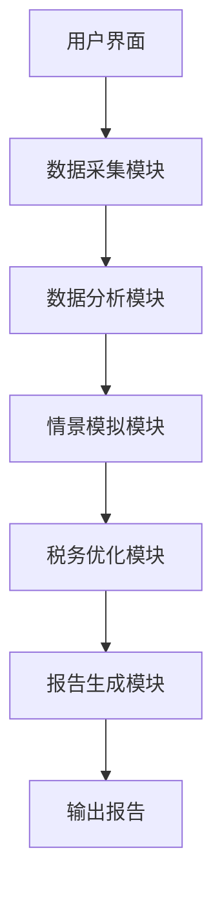

                 


# 构建智能化的个人税务筹划情景模拟助手

> 关键词：智能化税务筹划、人工智能、情景模拟、机器学习、自然语言处理、知识图谱

> 摘要：本文详细探讨了如何利用人工智能技术构建智能化的个人税务筹划情景模拟助手。通过分析智能化税务筹划的背景与重要性，结合人工智能、机器学习、自然语言处理等技术，设计并实现了一套智能化的税务筹划系统。本文涵盖了系统需求分析、架构设计、核心算法实现、系统优化以及实际案例分析等内容，为读者提供了从理论到实践的全面指导。

---

## 第一部分：智能化个人税务筹划情景模拟助手概述

### 第1章：智能化个人税务筹划情景模拟助手概述

#### 1.1 个人税务筹划的背景与重要性

- **1.1.1 税务筹划的基本概念**
  - 税务筹划是指通过合法手段，优化个人或企业的税务负担，最大化经济利益。
  - 税务筹划的核心目标是降低税负，同时避免税务风险。

- **1.1.2 智能化税务筹划的必要性**
  - 随着税收政策的复杂化，传统的人工税务筹划方式效率低下，容易出错。
  - 人工智能技术的应用可以提高税务筹划的效率和准确性。

- **1.1.3 个人税务筹划的核心目标**
  - 合法合规：确保税务筹划符合国家法律法规。
  - 最优化：在合法范围内，最大限度地降低税负。
  - 灵活性：能够根据个人收入、资产变化动态调整税务方案。

#### 1.2 情景模拟助手的概念与特点

- **1.2.1 情景模拟的基本定义**
  - 情景模拟是指通过构建不同的假设场景，分析其对税务筹划结果的影响。
  - 在税务筹划中，情景模拟可以帮助个人了解不同选择下的税务负担。

- **1.2.2 智能化助手的核心特点**
  - 智能化：利用人工智能技术，自动分析和优化税务方案。
  - 高效性：快速处理大量税务数据，提供实时反馈。
  - 个性化：根据个人的收入、资产和家庭情况，提供定制化建议。

- **1.2.3 与传统税务筹划工具的区别**
  - 传统工具：依赖人工输入和计算，效率低，覆盖面有限。
  - 智能化助手：结合AI技术，能够处理复杂场景，提供更全面的解决方案。

#### 1.3 智能化税务筹划的技术基础

- **1.3.1 人工智能在税务筹划中的应用**
  - 自然语言处理（NLP）：用于解析税务政策和文档。
  - 机器学习：用于预测税务风险和优化方案。
  - 数据挖掘：用于分析历史税务数据，发现潜在的优化机会。

- **1.3.2 大数据技术对税务筹划的支持**
  - 大数据技术可以帮助收集和分析海量税务相关数据。
  - 通过数据挖掘，可以发现隐藏的税务优化机会。

- **1.3.3 自然语言处理在税务文档中的应用**
  - 自然语言处理技术可以自动解析税务政策文档。
  - 通过关键词提取和语义分析，帮助用户快速理解政策变化。

---

## 第二部分：智能化税务筹划的核心技术

### 第2章：人工智能与机器学习在税务筹划中的应用

#### 2.1 人工智能技术概述

- **2.1.1 人工智能的基本概念**
  - 人工智能（AI）是指计算机系统模拟人类智能的技术。
  - 包括学习、推理、自我改进等多种能力。

- **2.1.2 机器学习的基本原理**
  - 机器学习是一种通过数据训练模型的技术。
  - 常用算法包括决策树、随机森林、支持向量机（SVM）等。

- **2.1.3 深度学习在税务筹划中的应用**
  - 深度学习是一种基于人工神经网络的机器学习技术。
  - 在税务风险预测和优化方案生成中具有重要作用。

#### 2.2 自然语言处理技术

- **2.2.1 自然语言处理的基本概念**
  - 自然语言处理（NLP）是指让计算机理解和生成人类语言的技术。
  - 包括分词、句法分析、语义理解等任务。

- **2.2.2 税务文档的自然语言处理流程**
  - 数据预处理：清洗和标注税务文档。
  - 文本解析：提取关键词和句法结构。
  - 语义分析：理解文本的含义和上下文。

- **2.2.3 常用的自然语言处理工具**
  - Python的`nltk`库：用于文本处理和分析。
  - spaCy：支持高效的文本处理和实体识别。
  - Gensim：用于主题模型的构建和分析。

#### 2.3 知识图谱与税务规则库

- **2.3.1 知识图谱的基本概念**
  - 知识图谱是一种结构化的知识表示方式。
  - 包括实体、属性和关系三部分。

- **2.3.2 税务规则库的构建方法**
  - 数据收集：整理税务政策和法规。
  - 实体识别：提取税务相关实体（如税率、扣除项等）。
  - 关系构建：描述实体之间的关系。

- **2.3.3 知识图谱在税务筹划中的应用**
  - 知识图谱可以用于税务政策的快速查询和理解。
  - 支持智能助手的语义理解能力。

#### 2.4 本章小结

---

## 第三部分：系统设计与实现

### 第3章：系统需求分析与功能设计

#### 3.1 系统需求分析

- **3.1.1 用户需求分析**
  - 用户包括个人用户和财务顾问。
  - 个人用户需要个性化的税务筹划建议。
  - 财务顾问需要高效的工具辅助工作。

- **3.1.2 功能需求分析**
  - 数据采集：获取用户的收入、资产等信息。
  - 数据分析：分析数据，生成税务筹划方案。
  - 情景模拟：提供多种假设场景的税务影响分析。
  - 税务优化：自动优化税务方案，降低税负。
  - 报告生成：生成定制化的税务报告。

- **3.1.3 性能需求分析**
  - 响应速度：快速处理用户请求。
  - 数据安全性：确保用户数据的安全。
  - 可扩展性：支持未来的功能扩展。

#### 3.2 系统功能设计

- **3.2.1 数据采集模块**
  - 功能：通过界面或API采集用户数据。
  - 技术：使用表单或API接口实现数据输入。

- **3.2.2 数据分析模块**
  - 功能：对采集的数据进行清洗和分析。
  - 技术：结合机器学习算法，生成初步的税务筹划方案。

- **3.2.3 情景模拟模块**
  - 功能：用户可以设置不同的假设场景，模拟税务结果。
  - 技术：通过动态数据处理和可视化展示，帮助用户理解不同场景的影响。

- **3.2.4 税务优化模块**
  - 功能：根据分析结果，优化税务方案。
  - 技术：使用遗传算法或模拟退火算法，寻找最优解。

- **3.2.5 报告生成模块**
  - 功能：生成定制化的税务报告。
  - 技术：结合自然语言处理技术，生成简洁易懂的报告。

#### 3.3 系统功能模块图



---

### 第4章：系统架构设计

#### 4.1 系统架构设计

- **4.1.1 整体架构**
  - 前端架构：采用React框架，实现用户界面。
  - 后端架构：采用微服务架构，包括数据采集、数据分析、情景模拟等服务。

- **4.1.2 模块划分**
  - 数据采集模块：负责数据的输入和存储。
  - 数据分析模块：负责数据的处理和分析。
  - 情景模拟模块：负责不同场景的模拟计算。
  - 税务优化模块：负责优化方案的生成。
  - 报告生成模块：负责报告的输出和展示。

- **4.1.3 数据流设计**
  - 用户输入数据 --> 数据采集模块 --> 数据分析模块 --> 数据处理 --> 情景模拟 --> 优化方案 --> 报告生成 --> 输出报告。

- **4.1.4 接口设计**
  - RESTful API：用于前后端的数据交互。
  - 接口文档：采用OpenAPI规范，便于开发和测试。

#### 4.2 本章小结

---

## 第四部分：核心算法实现

### 第5章：核心算法实现

#### 5.1 机器学习算法实现

- **5.1.1 决策树算法**
  - 算法原理：通过特征分裂，构建决策树。
  - 应用场景：用于分类和回归问题。
  - 代码实现：

  ```python
  from sklearn.tree import DecisionTreeRegressor
  import pandas as pd

  # 假设df是数据集，y是目标变量
  model = DecisionTreeRegressor()
  model.fit(df.drop('y', axis=1), df['y'])
  ```

- **5.1.2 遗传算法**
  - 算法原理：模拟自然选择，通过迭代优化解。
  - 应用场景：用于优化问题，如税负最小化。

  ```python
  import numpy as np

  def fitness(individual):
      # 计算适应度，即税负
      return sum(individual)

  def evolve_population(population, fitness_func, mutate_rate=0.1):
      # 交叉、变异等操作
      pass
  ```

- **5.1.3 算法流程图**

  ```mermaid
  graph TD
      A[开始] --> B[初始化种群]
      B --> C[计算适应度]
      C --> D[选择]
      D --> E[交叉]
      E --> F[变异]
      F --> G[新一代种群]
      G --> H[是否满足终止条件]
      H -->|否| C
      H -->|是| 结束
  ```

#### 5.2 本章小结

---

## 第五部分：系统实现与优化

### 第6章：系统实现与优化

#### 6.1 系统实现

- **6.1.1 环境搭建**
  - 安装必要的库：如Python的`scikit-learn`、`pandas`、`numpy`等。
  - 安装开发工具：如Jupyter Notebook、PyCharm等。

- **6.1.2 前端开发**
  - 使用React框架，构建用户友好的界面。
  - 集成数据可视化库，如D3.js或Plotly。

- **6.1.3 后端开发**
  - 使用Django框架，构建RESTful API。
  - 集成机器学习模型，提供预测和优化服务。

#### 6.2 系统优化

- **6.2.1 性能优化**
  - 使用缓存技术，减少重复计算。
  - 优化数据库查询，提高数据访问效率。

- **6.2.2 可扩展性优化**
  - 采用微服务架构，便于功能扩展。
  - 使用容器化技术（如Docker），提高系统的可移植性。

#### 6.3 本章小结

---

## 第六部分：案例分析与实际应用

### 第7章：案例分析与实际应用

#### 7.1 案例分析

- **7.1.1 案例背景**
  - 假设一个高收入者，希望通过税务筹划降低所得税负担。
  - 可用的扣除项包括子女教育、房贷利息等。

- **7.1.2 情景模拟**
  - 情景1：无扣除项。
  - 情景2：有扣除项，计算税后收入。
  - 情景3：考虑投资收益的税务影响。

- **7.1.3 优化方案**
  - 根据模拟结果，调整扣除项的使用，最大化税后收入。

#### 7.2 实际应用

- **7.2.1 系统功能展示**
  - 展示用户界面，包括数据输入、情景选择和结果展示。
  - 展示机器学习模型的预测结果。

- **7.2.2 优缺点分析**
  - 优点：高效、准确、个性化。
  - 缺点：依赖数据质量，模型可能需要不断优化。

#### 7.3 本章小结

---

## 第七部分：总结与展望

### 第8章：总结与展望

#### 8.1 总结

- 本文详细介绍了智能化个人税务筹划情景模拟助手的构建过程。
- 结合人工智能、机器学习和自然语言处理等技术，设计并实现了一套高效的税务筹划系统。
- 通过案例分析和实际应用，验证了系统的有效性和实用性。

#### 8.2 未来展望

- **技术优化**：进一步优化机器学习算法，提高系统的准确性和效率。
- **功能扩展**：增加更多的税务政策和扣除项，提高系统的适用性。
- **用户体验**：优化用户界面，提供更个性化的服务。
- **数据安全**：加强数据加密和访问控制，确保用户隐私。

---

## 作者

作者：AI天才研究院/AI Genius Institute & 禅与计算机程序设计艺术/Zen And The Art of Computer Programming

